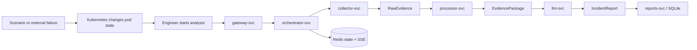
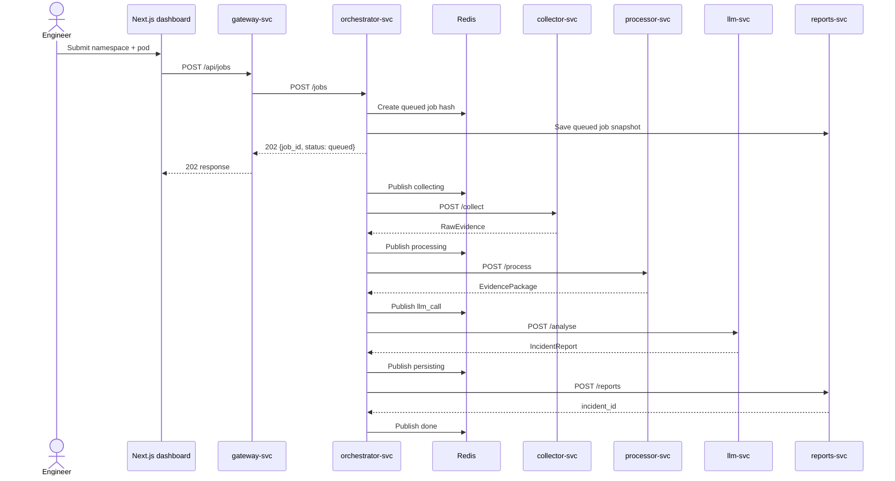
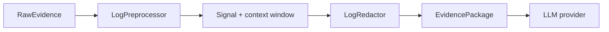

# Errors and Log Collection

> This document explains how the current v2 microservices implementation creates
> test failures, collects Kubernetes evidence, processes logs, and reports both
> workload errors and analyser-service errors.
>
> For the broader system tour, see [`DEEP-DIVE.md`](./DEEP-DIVE.md). When this
> document and an older walkthrough disagree, the current code is authoritative.

## 1. The Short Version

There are two separate activities:

1. **Create or observe a failure.** The scenario service changes the demo
   workload with a Kubernetes patch. Kubernetes and the demo application then
   produce the resulting symptoms.
2. **Investigate the failure.** A user starts an analysis job. The collector
   asks Kubernetes for a snapshot of the selected pod, the processor filters
   and redacts the evidence, and the LLM produces an incident report.

The analyser is an investigation assistant. It is not the component that
detects the first alert or automatically starts a job.



The central pipeline is implemented in
[`services/orchestrator/app/pipeline.py`](../services/orchestrator/app/pipeline.py):

```text
queued -> collecting -> processing -> llm_call -> persisting -> done
                                                               \
                                                                -> failed
```

## 2. How Errors Are Triggered

### 2.1 The scenario service

The controlled failures live under [`k8s/scenarios/`](../k8s/scenarios/). Each
scenario directory contains a `fault.yaml` strategic-merge patch.

The scenario API is exposed through the gateway:

```text
Browser or curl
    -> POST /api/scenarios/{scenario_id}/apply
    -> gateway-svc:8000
    -> scenario-svc:8006 /scenarios/{scenario_id}/apply
    -> kubectl patch
    -> Kubernetes demo workload
```

The public gateway route is in
[`services/gateway/app/main.py`](../services/gateway/app/main.py#L140-L156).
The scenario endpoint is in
[`services/scenario/app/main.py`](../services/scenario/app/main.py#L82-L112).

The actual patch operation is in
[`ScenarioManager.apply`](../services/scenario/app/scenarios.py#L106-L125):

1. Refuse the request if another scenario is already active.
2. Find `k8s/scenarios/{scenario_id}/fault.yaml`.
3. Read the patch text.
4. Extract the Kubernetes `kind` and `metadata.name`.
5. Run `kubectl patch ... --type strategic -p <patch>`.
6. Record the active scenario in the manager's in-memory state.

The equivalent command-line path is
[`scripts/run_scenario.sh`](../scripts/run_scenario.sh). It checks cluster
connectivity, applies the healthy base manifests, and then applies the selected
fault patch.

### 2.2 The ten current scenarios

| Scenario | What the patch changes | What happens in the cluster | Main evidence source |
|---|---|---|---|
| `01-missing-env` | Sets `DATABASE_URL` to an empty value | The app raises `RuntimeError` during startup and enters a restart loop | Previous container logs and `BackOff` |
| `02-db-unavailable` | Sets `DATABASE_URL` to `postgresql://unavailable:5432/db` | `/ready` raises a connection-refused error; the pod stays running but is not ready | App error and readiness event |
| `03-crashloop` | Sets the command to `/bin/nonexistent` | The container runtime cannot start the process; Kubernetes reports `CrashLoopBackOff` | Pod status and events |
| `04-imagepull` | Sets the image to `demo-app:nonexistent-tag` and pulls always | Kubernetes cannot find or pull the image; the pod reports `ImagePullBackOff` | Pod status and image-pull events |
| `05-oom` | Reduces the memory limit to `32Mi` | Calling `/fault/oom` tries to allocate 600 MB; the container is killed by the kernel | `OOMKilled`, exit code, events and restart count |
| `06-readiness` | Changes the readiness path to `/does-not-exist` | The probe receives HTTP 404; the pod is `Ready=False` but does not necessarily restart | Pod status and `Unhealthy` event |
| `07-liveness` | Changes the liveness path to `/fault/slow` | The endpoint sleeps for 30 seconds; the liveness probe times out and Kubernetes restarts the pod | Liveness event and restart count |
| `08-bad-configmap` | Sets `LOG_LEVEL=INVALID` in `demo-config` | The current demo app does not validate `LOG_LEVEL`, so it remains healthy | Pod description, if the value is shown |
| `09-app-exception` | Sets `STARTUP_FAULT=crash` | The app deliberately raises `RuntimeError` during startup and restarts | Previous logs, traceback and `BackOff` |
| `10-wrong-port` | Changes Service `targetPort` from `8000` to `9999` | The pod remains healthy, but the Service cannot reach the application | Requires Service/network inspection |

The patch files are the source of truth for the changes:

```text
k8s/scenarios/01-missing-env/fault.yaml
k8s/scenarios/02-db-unavailable/fault.yaml
k8s/scenarios/03-crashloop/fault.yaml
k8s/scenarios/04-imagepull/fault.yaml
k8s/scenarios/05-oom/fault.yaml
k8s/scenarios/06-readiness/fault.yaml
k8s/scenarios/07-liveness/fault.yaml
k8s/scenarios/08-bad-configmap/fault.yaml
k8s/scenarios/09-app-exception/fault.yaml
k8s/scenarios/10-wrong-port/fault.yaml
```

### 2.3 Application-side faults

The demo application is deliberately small. Its startup behavior and fault
endpoints are in
[`demo-app/app/main.py`](../demo-app/app/main.py).

#### Startup configuration failure

During the FastAPI lifespan startup hook, the application reads
`STARTUP_FAULT` and `DATABASE_URL`:

```python
startup_fault = os.environ.get("STARTUP_FAULT", "").lower()
if startup_fault == "crash":
    logger.error("FATAL: STARTUP_FAULT=crash -- raising exception on startup")
    raise RuntimeError("Deliberate startup crash for scenario testing")

db_url = os.environ.get("DATABASE_URL")
if not db_url:
    logger.error("FATAL: DATABASE_URL environment variable is not set")
    raise RuntimeError("Missing required configuration: DATABASE_URL")
```

This code creates scenarios `09-app-exception` and `01-missing-env`:

```text
container starts
    -> lifespan() runs
    -> logger writes FATAL message
    -> RuntimeError escapes startup
    -> process exits
    -> kubelet restarts the container
    -> restart count increases
```

The application never reaches its normal `yield`, so it does not become a
healthy running server.

#### Readiness dependency failure

The `/ready` endpoint checks the configured URL for the marker `unavailable`:

```python
@app.get("/ready")
def ready():
    db_url = os.environ.get("DATABASE_URL", "")
    if "unavailable" in db_url:
        raise RuntimeError("Database connection failed: connection refused")
    return {"ready": True}
```

The readiness probe calls this endpoint. A failure makes the pod unavailable
for Service traffic, but readiness failure alone does not mean the container
has crashed.

#### Request-time crash and memory faults

The application has two endpoints that are used by scenarios or manual tests:

```python
@app.get("/fault/crash")
def fault_crash():
    logger.error("Unhandled exception in /fault/crash: division by zero")
    raise ZeroDivisionError("Deliberate crash for testing")

@app.get("/fault/oom")
def fault_oom():
    logger.warning("Memory allocation stress test starting...")
    data = [bytearray(1024 * 1024) for _ in range(600)]
    return {"allocated": len(data)}
```

`/fault/oom` is important: applying `05-oom` changes the resource limit, but
the allocation is triggered only when the endpoint is called. A typical test
sequence is:

```bash
./scripts/run_scenario.sh 05-oom
kubectl port-forward -n demo svc/demo-app-svc 8001:80 &
curl http://localhost:8001/fault/oom
kubectl get pods -n demo -w
```

The kernel may terminate the process before it can flush a final application
log line. This is why the collector also reads pod state and Kubernetes events.

### 2.4 Kubernetes-managed faults

Some failures happen before the application has a chance to log anything:

- `03-crashloop`: the command is invalid, so the process cannot start.
- `04-imagepull`: the image cannot be downloaded, so no container is created.
- `06-readiness`: the application may be running normally, but the probe path
  returns 404.
- `07-liveness`: the application endpoint sleeps too long for the probe.
- `10-wrong-port`: the pod is healthy; the Service points at the wrong port.

For these cases, `kubectl describe pod` and `kubectl get events` are at least as
important as `kubectl logs`.

### 2.5 Resetting the fault

Reset is not just an in-memory flag change. The scenario manager deletes the
demo deployment, reapplies the base namespace, ConfigMap, Deployment and
Service manifests, waits for rollout completion, and clears its active state.

The implementation is
[`ScenarioManager.reset`](../services/scenario/app/scenarios.py#L127-L142).

```text
POST /api/scenarios/reset
    -> delete deployment/demo-app
    -> apply k8s/base/namespace.yaml
    -> apply k8s/base/configmap.yaml
    -> apply k8s/base/deployment.yaml
    -> apply k8s/base/service.yaml
    -> rollout status deployment/demo-app
```

Always reset after a scenario before applying a different one. The scenario
service returns HTTP `409` when its in-memory `_active` value is not `None`.

## 3. How an Analysis Starts

The user can submit the analysis form in the frontend or call the public API:

```bash
curl -X POST http://localhost:8000/api/jobs \
  -H 'Content-Type: application/json' \
  -d '{"namespace":"demo","pod_name":"demo-app"}'
```

The frontend sends the same shape from
[`frontend/src/app/analyse/page.tsx`](../frontend/src/app/analyse/page.tsx).

The request path is:



The orchestrator returns quickly with `202 Accepted`. The actual pipeline runs
as an `asyncio` background task in
[`services/orchestrator/app/main.py`](../services/orchestrator/app/main.py#L82-L116).

The current v2 implementation pushes the job ID into the Redis `job:queue`, but
also starts the pipeline directly with `asyncio.create_task`. There is no
separate worker consuming the list yet; the list is preparation for future
worker scaling.

## 4. How Log Collection Works

### 4.1 The collector's responsibility

The collector is a stateless FastAPI service and a wrapper around the `kubectl`
executable. Its entrypoint is
[`services/collector/app/main.py`](../services/collector/app/main.py).
Its Kubernetes logic is in
[`services/collector/app/collector.py`](../services/collector/app/collector.py).

The collector does not use Redis, SQLite, an LLM, Fluent Bit, Loki,
Elasticsearch, or another centralized log backend. It asks Kubernetes for a
point-in-time evidence snapshot when `/collect` is called.

### 4.2 Resolving the real pod name

The analysis request contains a namespace and a user-provided `pod_name`:

```json
{
  "namespace": "demo",
  "pod_name": "demo-app"
}
```

In a Deployment, the actual pod usually has a generated suffix. The collector's
`collect` method in
[`collector.py`](../services/collector/app/collector.py#L120-L137) does this:

1. Check whether a pod with the exact supplied name exists.
2. If not, search for the first pod matching `app=<pod_name>`.
3. Use the resolved pod name for every later command.

```text
requested name: demo-app
        |
        | exact pod exists?
        +---- yes -> use demo-app
        |
        +---- no -> kubectl get pods -l app=demo-app
                         |
                         +-> use demo-app-7d8f9c-abcde
```

This is why the dashboard can target `demo-app` without requiring the engineer
to look up a generated pod name first.

### 4.3 The six collection reads

`KubernetesCollector.collect` constructs a `RawEvidence` object from six types
of Kubernetes reads:

| Evidence | Actual command shape | Why it is collected |
|---|---|---|
| Current logs | `kubectl logs -n <namespace> <pod> --tail=500 --timestamps=true` | Reads output from the current container instance |
| Previous logs | Same command with `--previous` | Reads output from the last container instance after a crash or restart |
| Pod description | `kubectl describe pod -n <namespace> <pod>` | Reads state, image, probes, resources, last termination and embedded events |
| Namespace events | `kubectl get events -n <namespace> --sort-by=.metadata.creationTimestamp` | Reads Kubernetes lifecycle warnings and messages |
| Restart count | `kubectl get pod ... -o jsonpath={.status.containerStatuses[0].restartCount}` | Reads how many times the first container restarted |
| Container states | `kubectl get pod ... -o jsonpath={.status.containerStatuses}` | Reads structured current and previous state details |

The command implementations are in
[`collector.py`](../services/collector/app/collector.py#L51-L95).

The current log tail is 500 lines because `get_pod_logs` defaults to
`tail=500`. The `KUBECTL_LOG_TAIL` Compose variable exists in the deployment
configuration, but the current collector code does not read that variable.

### 4.4 The `RawEvidence` object

The collector returns the shared Pydantic model

```python
RawEvidence(
    namespace="demo",
    pod_name="demo-app-7d8f9c-abcde",
    current_logs="...",
    previous_logs="...",
    pod_status="...",
    k8s_events="...",
    restart_count=3,
    container_states=[...],
)
```

The fields have different origins:

| Field | Meaning |
|---|---|
| `namespace` | Kubernetes namespace that was requested |
| `pod_name` | Resolved actual pod name |
| `current_logs` | Current container stdout/stderr returned by Kubernetes |
| `previous_logs` | Previous container stdout/stderr, if a previous instance exists |
| `pod_status` | Text output from `kubectl describe pod` |
| `k8s_events` | Text output from namespace events |
| `restart_count` | Parsed integer restart count, or `0` if parsing fails |
| `container_states` | Parsed JSONPath value, normally a list of container state objects |

`RawEvidence` is an internal service-to-service model. It is not exposed as a
public gateway response.

### 4.5 What the collector does not currently inspect

The collector reads the target pod and namespace events, but it does not run
commands such as:

```text
kubectl get service
kubectl get endpoints
kubectl get configmap
kubectl get deployment
```

Some information may appear indirectly in `kubectl describe pod`, such as
environment references or container configuration. However, the collector does
not independently inspect Service routing or ConfigMap contents.

This matters for:

- `08-bad-configmap`: the invalid value may be visible in a pod description,
  but the application does not validate it.
- `10-wrong-port`: the pod can look healthy because the faulty object is the
  Service, which is outside the current collector read set.

Events are also collected at namespace scope rather than filtered to exactly
one pod. The processor performs the first level of event filtering later.

## 5. Why Previous Logs Matter

### 5.1 Current versus previous container

Kubernetes treats a restarted container as a new container instance inside the
same pod. The current instance may still be running, waiting, or may not have
written anything. The previous instance may contain the startup error that
explains the restart.

That is why the collector always makes two log requests:

```bash
# Current instance
kubectl logs -n demo demo-app-abc123 \
  --tail=500 --timestamps=true

# Previous instance
kubectl logs -n demo demo-app-abc123 \
  --tail=500 --timestamps=true --previous
```

The `--previous` call is especially useful for:

- Startup exceptions.
- Missing configuration failures.
- Processes that exit immediately.
- CrashLoopBackOff after several restart attempts.

### 5.2 Example: `09-app-exception`

After the `STARTUP_FAULT=crash` patch, the application writes something like
this before exiting:

```text
FATAL: STARTUP_FAULT=crash -- raising exception on startup
RuntimeError: Deliberate startup crash for scenario testing
Traceback (most recent call last):
  File app/main.py, line 19, in lifespan
    raise RuntimeError('Deliberate startup crash')
```

Depending on the exact collection moment, the fields may look like this:

```python
RawEvidence(
    current_logs="",
    previous_logs=(
        "FATAL: STARTUP_FAULT=crash -- raising exception on startup\n"
        "RuntimeError: Deliberate startup crash for scenario testing\n"
        "Traceback (most recent call last):\n"
        "..."
    ),
    pod_status="...Reason: CrashLoopBackOff...",
    k8s_events="...Warning BackOff...",
    restart_count=6,
)
```

The application log and Kubernetes state support each other:

```text
previous_logs: RuntimeError + traceback
pod_status:    CrashLoopBackOff + last state Error
events:        BackOff restarting failed container
restarts:      6
```

The LLM does not need to guess whether the process actually restarted. It can
correlate the application exception with the Kubernetes restart evidence.

### 5.3 Cases where previous logs are empty

`--previous` can return no useful output when:

- The container has never successfully started.
- The image could not be pulled.
- The command could not be executed.
- The previous log buffer has already been rotated or removed.
- The pod was replaced rather than restarted in place.

For `03-crashloop` and `04-imagepull`, pod status and events usually contain
more information than application logs because the application did not reach a
point where it could write normal output.

### 5.4 Logs are stdout/stderr, not application files

The demo application configures Python logging and runs under Uvicorn:

```python
logging.basicConfig(
    level=logging.INFO, format="%(asctime)s %(levelname)s %(message)s"
)
```

The Dockerfile starts Uvicorn in the foreground. The container runtime captures
the process's standard output and standard error, and Kubernetes exposes those
streams through `kubectl logs`.

There is no `app.log` file that the collector opens. The collection path is:

```text
logger.warning/error/info(...)
    -> stdout or stderr
    -> container runtime log stream
    -> Kubernetes pod log API
    -> kubectl logs
    -> collector RawEvidence
```

## 6. How Logs Are Cleaned

The processor service combines two stages:

1. `LogPreprocessor`: removes noise and keeps relevant signal.
2. `LogRedactor`: masks secrets and personal data.

The endpoint is in
[`services/processor/app/main.py`](../services/processor/app/main.py#L41-L61).



### 6.1 Noise patterns

The preprocessor treats these as noise:

```python
NOISE_PATTERNS = [
    r"GET /health",
    r"GET /ready",
    r"GET /metrics",
    r"^\s*$",
]
```

Health probes can produce a large amount of ordinary traffic. Removing them
prevents the LLM from spending its context window on successful liveness and
readiness checks.

### 6.2 Signal patterns

The current signal patterns in
[`preprocessor.py`](../services/processor/app/preprocessor.py#L18-L30) include:

```text
error, exception, traceback, fatal, critical,
failed, refused, timeout,
OOMKilled, CrashLoopBackOff, ImagePullBackOff, BackOff, Unhealthy,
missing, not found, permission denied, address already in use
```

The matching is deliberately keyword-based. A custom message such as
`DB_POOL_EXHAUSTED` is not automatically considered a signal unless one of the
listed terms also appears in the line.

### 6.3 Context windows, deduplication and limits

The filtering algorithm in
[`LogPreprocessor._filter_with_context`](../services/processor/app/preprocessor.py#L44-L63)
works in this order:

1. Split the raw text into lines.
2. Find every line that matches a signal and is not noise.
3. Keep the matching line plus three lines before and three lines after it.
4. Sort the retained line indexes.
5. Remove blank lines and duplicate stripped content.
6. Keep at most 100 lines.
7. Join the result back into a string.

The settings come from the processor environment:

```text
MAX_LOG_LINES=100
CONTEXT_WINDOW=3
```

The limit applies separately to `current_logs` and `previous_logs` because the
processor calls `_filter_with_context` on each field independently.

### 6.4 Kubernetes event filtering

Events use a different rule from application logs:

```python
    return "\n".join(
        line for line in events_raw.splitlines()
        if "Warning" in line or self._is_signal(line)
    )
```

Warning events are retained even if their wording does not match the normal log
signal patterns. This is important for messages such as `Warning Killing` or
`Warning Unhealthy`.

### 6.5 Pod status truncation

Pod status is not passed through the log-line filter. Instead, the current code
keeps the first 2,000 characters:

```python
pod_status_summary=evidence.pod_status[:2000]
```

This preserves terms such as `OOMKilled`, `CrashLoopBackOff`, `ImagePullBackOff`,
probe state, exit code and restart count when they occur near the beginning of
the `kubectl describe` output.

This distinction matters for `05-oom`: the application logs can be empty after
the kernel kills the process, but the word `OOMKilled` is still available in pod
status and events.

### 6.6 Redaction

The redactor runs after filtering and applies its patterns to four text fields:

```text
current_logs
previous_logs
pod_status_summary
k8s_events_filtered
```

The implementation is in
[`services/processor/app/redactor.py`](../services/processor/app/redactor.py).

| Pattern | Replacement |
|---|---|
| `password=...`, `passwd=...`, `pwd=...` | `[PASSWORD=REDACTED]` |
| labelled API keys, tokens and secrets | `[API_KEY=REDACTED]` |
| Anthropic keys beginning with `sk-ant-` | `[ANTHROPIC_KEY=REDACTED]` |
| OpenAI-style keys beginning with `sk-` | `[OPENAI_KEY=REDACTED]` |
| `postgres://`, `mysql://`, `mongodb://` or `redis://` URLs | `[DB_URL=REDACTED]` |
| Authorization or bearer values | `[AUTH_HEADER=REDACTED]` |
| Email addresses | `[EMAIL=REDACTED]` |

Example:

```text
Before: connecting to postgresql://admin:s3cr3t@db:5432/prod
After:  connecting to [DB_URL=REDACTED]
```

The output is the shared
[`EvidencePackage`](../services/shared/src/k8s_llm_shared/models.py#L84-L94):

```python
EvidencePackage(
    namespace="demo",
    pod_name="demo-app-abc123",
    current_logs="safe filtered current logs",
    previous_logs="safe filtered previous logs",
    pod_status_summary="truncated pod status",
    k8s_events_filtered="warning and signal events",
    restart_count=3,
)
```

Only after this transformation does the orchestrator call
`llm-svc /analyse`.

## 7. What the LLM Receives

The LLM service builds a prompt from the safe `EvidencePackage` in
[`services/llm/app/prompts.py`](../services/llm/app/prompts.py).

The prompt contains:

```text
Kubernetes namespace
Resolved pod name
Collection timestamp
Pod status summary
Filtered current logs
Filtered previous logs
Filtered Kubernetes events
Restart count
IncidentReport JSON schema
```

The system prompt instructs the provider to:

- Use only evidence that is present.
- Not invent log lines or events.
- Lower confidence when evidence is incomplete.
- Recommend human-verifiable steps rather than automated remediation.
- Return only JSON matching the schema.

The provider is selected by `LLM_PROVIDER` in
[`services/llm/app/llm/__init__.py`](../services/llm/app/llm/__init__.py):

| Value | Behavior |
|---|---|
| `mock` | Deterministic local heuristics; default for Compose |
| `openai` | OpenAI structured output provider |
| `anthropic` | Anthropic structured output provider |
| `deepseek` | JSON mode plus Pydantic validation |

The LLM endpoint returns an `IncidentReport`, which is validated through the
shared Pydantic model. The report contains the likely root cause, category,
severity, confidence, supporting evidence, suggested fix, commands and human
verification steps.

## 8. What Happens When Collection Fails

There are several layers of failure handling. A target workload failure is
normally evidence for the analyser. A collector, processor, provider or
database failure is an error in the investigation pipeline itself.

### 8.1 Collector-level behavior

The low-level collector wrapper is intentionally tolerant. Its `_run` method is
in [`collector.py`](../services/collector/app/collector.py#L33-L49):

```python
result = subprocess.run(
    cmd,
    capture_output=True,
    text=True,
    timeout=self.timeout,
    check=False,
)

if result.returncode != 0:
    logger.warning("kubectl returned %d: %s", result.returncode, result.stderr[:200])

return result.stdout.strip()
```

The behavior is therefore:

| Situation | Low-level behavior | Result in `RawEvidence` or API |
|---|---|---|
| `kubectl` returns non-zero | Log a warning and return stdout, often empty | The corresponding evidence field may be empty |
| `kubectl` times out | Log an error and return `""` | The corresponding evidence field is empty |
| Restart count is not an integer | Catch `ValueError` or `TypeError` | `restart_count=0` |
| Container-state JSON is invalid | Catch JSON parsing errors | `container_states=[]` |
| `kubectl` executable is missing | `FileNotFoundError` reaches the API handler | HTTP 500: kubectl binary not found |
| Unexpected collection exception | API handler logs it | HTTP 500: collection failed |

This graceful degradation means a job can sometimes reach the LLM with
incomplete evidence rather than failing immediately. That is useful when one
optional Kubernetes read fails, but it also means an empty evidence package
should be treated as a collection warning, not proof that the pod had no error.

### 8.2 Processor-level behavior

The processor endpoint wraps preprocessing and redaction in a `try` block. An
unexpected transformation error produces HTTP 500:

```text
process_started
    -> preprocessor.process(raw)
    -> redactor.redact(filtered)
    -> process_complete
```

If either transformation raises, the service logs `process_failed` and returns
`Processing failed: ...`.

### 8.3 Downstream HTTP behavior in the orchestrator

The pipeline's `_post` helper turns downstream problems into contextual
`RuntimeError` messages in

| Downstream problem | Example pipeline error |
|---|---|
| Request timeout | `collector-svc timed out after 60s` |
| Network/HTTP client error | `processor-svc unreachable: ...` |
| Non-200/201 response | `llm-svc returned 500: ...` |
| Invalid response body | JSON/Pydantic error is caught by the pipeline |

The main `Pipeline.run` method catches the error, measures elapsed time, logs
`pipeline_failed`, marks the Redis job as failed, and archives a failed job
snapshot through reports-svc:

```python
except Exception as e:
    latency = elapsed_ms()
    error = str(e) or type(e).__name__
    log.error("pipeline_failed", job_id=job_id, error=error)
    await self._store.fail(job_id, error, latency)
    await self._archive_job(
        SaveJobRequest(
            job_id=job_id,
            status="failed",
            error=error[:500],
            latency_ms=latency,
            ...,
        )
    )
```

The relevant implementation is
[`pipeline.py`](../services/orchestrator/app/pipeline.py#L123-L137).

### 8.4 Redis and SSE failure reporting

`JobStore.fail` writes these values to `job:{job_id}`:

```text
status=failed
error=<up to 500 characters>
latency_ms=<elapsed time>
updated_at=<timestamp>
```

It then publishes an `SseFailedEvent` to
`job:{job_id}:events`; the orchestrator stream forwards it to the gateway, and
the frontend's `streamJob` handler closes the stream and renders the error.

The browser receives an event shaped like:

```text
event: failed
data: {
  "event": "failed",
  "job_id": "...",
  "status": "failed",
  "error": "collector-svc timed out after 60s",
  "latency_ms": 60042
}
```

### 8.5 Public HTTP errors

All platform FastAPI services register the shared handlers from
[`services/shared/src/k8s_llm_shared/web.py`](../services/shared/src/k8s_llm_shared/web.py).
They convert HTTP exceptions, request validation errors and unhandled exceptions
to RFC 7807 Problem Details:

```json
{
  "type": "https://errors.k8s-llm.io/internal",
  "title": "Internal server error",
  "status": 500,
  "detail": "Collection failed: ...",
  "instance": "/collect"
}
```

The gateway proxy also converts an unreachable or timed-out internal service
into a `502 Upstream service error`. This is different from a pipeline `failed`
job: a gateway error may happen before a job is created, while a pipeline error
is attached to an existing `job_id`.

## 9. Where Logs and Evidence Are Stored

### 9.1 Incident evidence is transient

The current flow is:

```text
kubectl output
    -> collector memory
    -> HTTP RawEvidence
    -> processor memory
    -> HTTP EvidencePackage
    -> LLM prompt
    -> report fields / supporting evidence
```

The complete raw log payload is not stored in a dedicated log database or
written to a report file. It exists in memory while the job moves through the
pipeline.

The final `IncidentReport` can contain excerpts in `supporting_evidence`,
depending on the provider's response. That is not the same as archiving all
raw current logs, previous logs, pod description and namespace events.

### 9.2 Redis stores temporary progress

Redis is owned by the orchestrator. The key patterns are implemented in
[`services/orchestrator/app/store.py`](../services/orchestrator/app/store.py).

| Redis key | Type | Purpose | Lifetime |
|---|---|---|---|
| `job:{job_id}` | Hash | Current status, stage, error, latency and IDs | 24-hour TTL |
| `job:queue` | List | Job IDs prepared for future worker consumption | No per-job TTL |
| `job:{job_id}:events` | Pub/sub channel | Live stage, done and failed events | While subscribers/jobs use it |

Redis is a progress whiteboard. It is not the permanent raw-log archive.

### 9.3 SQLite stores durable reports and job snapshots

Only reports-svc writes the SQLite database. The database layer is in
[`services/reports/app/db.py`](../services/reports/app/db.py).

It stores:

- Searchable incident fields such as namespace, pod, category, severity and
  confidence.
- The complete nested `IncidentReport` as `report_json`.
- `analysis_jobs` rows containing durable job status, stage, latency, error and
  optional incident link.

It does not store a separate `raw_evidence` table in the current schema.

### 9.4 Service operational logs

Operational logs are different from incident evidence. They are emitted by the
platform services themselves while handling requests:

```text
collector:     collect_started, collect_complete, kubectl timeout
processor:     process_started, process_complete, process_failed
orchestrator:  job_created, pipeline_complete, pipeline_failed
llm:           analyse_started, analyse_complete, analyse_failed
reports:       save_report, save_report_failed
scenario:      scenario_apply_requested, scenario_applied, reset complete
```

In Docker Compose, these are process logs and can be inspected with:

```bash
docker compose logs collector
docker compose logs orchestrator
docker compose logs --follow processor
```

In Kubernetes, inspect the platform service pods with `kubectl logs`, just as
the collector inspects the demo workload. These operational logs are not
automatically included in the target pod's `RawEvidence`.

The frontend has a small console logger in
[`frontend/src/lib/logger.ts`](../frontend/src/lib/logger.ts). It records API
fetch failures, non-2xx responses and SSE errors in the browser console. The
frontend also reports uncaught exceptions and unhandled rejections through
[`frontend/src/instrumentation.ts`](../frontend/src/instrumentation.ts).

## 10. Complete Trace: `09-app-exception`

This trace shows the difference between triggering a failure and investigating
it.

### Step 1: Apply the scenario

The scenario patch adds:

```yaml
env:
- name: STARTUP_FAULT
  value: "crash"
```

The scenario service runs a strategic patch against Deployment `demo-app`.
Kubernetes creates a replacement pod with the new environment value.

### Step 2: The application exits

The new process starts Uvicorn. The FastAPI lifespan hook sees

Kubernetes records:

```text
State:          Waiting
Reason:         CrashLoopBackOff
Last State:     Terminated
Reason:         Error
Exit Code:      1
Restart Count:  6
```

It also creates a warning event such as:

```text
Warning BackOff: Back-off restarting failed container demo-app
```

### Step 3: Start the investigation

The engineer submits:

```bash
curl -X POST http://localhost:8000/api/jobs \
  -H 'Content-Type: application/json' \
  -d '{"namespace":"demo","pod_name":"demo-app"}'
```

The API responds with a job ID. It does not wait for the full investigation.

### Step 4: Resolve and collect

The collector cannot find an exact pod called `demo-app`, so it searches for
`app=demo-app` and resolves a generated name such as `demo-app-abc123`.

It then obtains:

```text
current_logs:     often empty or incomplete
previous_logs:    FATAL + RuntimeError + traceback
pod_status:       CrashLoopBackOff + exit code + restart count
k8s_events:       Warning BackOff
restart_count:    6
container_states: lastState.reason=Error
```

### Step 5: Filter and redact

The preprocessor keeps the lines containing `FATAL`, `RuntimeError` and
`Traceback`, along with nearby context. It removes blank and routine health
traffic. The redactor checks every text field for secrets.

The safe package is then sent to `llm-svc`.

### Step 6: Analyse and persist

The selected provider returns a structured report with a crash category and
supporting evidence. The orchestrator posts that report to reports-svc. SQLite
stores the report and links it to the analysis job.

The frontend receives this event sequence through SSE:

```text
stage: collecting
stage: processing
stage: llm_call
stage: persisting
done:  incident_id=...
```

## 11. Troubleshooting by Stage

Follow the job state from left to right. The stage usually identifies which
service to inspect.

### Job never starts

Check the gateway and orchestrator:

```bash
curl http://localhost:8000/health
docker compose ps gateway orchestrator redis
docker compose logs gateway
docker compose logs orchestrator
```

Common causes include invalid request JSON, rate limiting, an unreachable
orchestrator, or Redis not being available.

### Job fails during collecting

Check cluster access and collector permissions:

```bash
curl http://localhost:8000/health
docker compose logs collector
kubectl cluster-info
kubectl get pods -n demo
kubectl logs -n demo <pod> --previous
kubectl describe pod -n demo <pod>
```

In Kubernetes deployment, collector-svc needs read access to pods, pod logs,
events and namespaces. In Compose, the collector needs a usable kubeconfig and
the mounted Kubernetes credentials.

### Job reaches processing with empty logs

Empty application logs do not necessarily mean there was no failure. Check:

- Whether the container ever started.
- Whether the previous log instance exists.
- Whether the image pull failed.
- Whether the command could run.
- Whether the useful signal is in `pod_status` or `k8s_events`.
- Whether the custom error wording matches `SIGNAL_PATTERNS`.

For an OOM scenario, inspect `OOMKilled`, exit code `137`, events and restart
count rather than expecting a complete application traceback.

### Job fails during processing

```bash
docker compose logs processor
```

The processor is pure Python transformation code. It does not need the cluster,
Redis, SQLite or an LLM API key. A 500 response means preprocessing or redaction
raised an unexpected exception, or the incoming `RawEvidence` did not validate.

### Job fails during the LLM stage

Check the provider configuration and service logs:

```bash
curl http://localhost:8000/health
docker compose logs llm
```

Verify:

- `LLM_PROVIDER` is `mock`, `openai`, `anthropic` or `deepseek`.
- The required provider key exists for a real external provider.
- The provider response is valid JSON or structured output.
- The response satisfies the `IncidentReport` schema.

Use `LLM_PROVIDER=mock` first when debugging collector or processor behavior.

### Report is not saved

Inspect reports-svc and its SQLite volume:

```bash
docker compose logs reports
ls -l data/
```

The analysis may have produced a report before persistence failed. The job's
`error` field identifies the database or reports-service failure, while the
frontend receives a failed pipeline event.

### Timeline stops or shows an SSE error

Check all parts of the streaming path:

```text
Redis pub/sub
    -> orchestrator /jobs/{job_id}/stream
    -> gateway /api/jobs/{job_id}/stream
    -> browser EventSource
```

Inspect Redis, orchestrator and gateway logs. The frontend logs
`sse_pipeline_failed` for a terminal failed event and
`sse_connection_error` for a transport-level stream error.

## 12. Important Design Boundaries

### The scenario is not the analysis

Applying `05-oom` changes Kubernetes. It does not call the collector or LLM.
The separate `POST /api/jobs` request starts the investigation.

### Application logs are not the whole evidence set

The platform deliberately collects:

```text
application stdout/stderr
    + previous container stdout/stderr
    + pod status
    + Kubernetes events
    + restart count
    + container states
```

This is necessary because Kubernetes can know that a container was killed or
could not pull an image even when the application emitted no log line.

### Filtering is not complete root-cause detection

The preprocessor is a noise reducer. It keeps known signal words and nearby
context, but it does not understand every application-specific error code. The
LLM receives pod status and events separately so it can still reason about
signals that are absent from stdout.

### Current evidence is not a historical archive

The collector takes a snapshot when the job runs. It does not search old jobs'
raw logs, query a log lake, or reconstruct a complete timeline from a central
observability store.

## 13. Code Map

| Question | Start here |
|---|---|
| How is a scenario applied? | [`services/scenario/app/scenarios.py`](../services/scenario/app/scenarios.py#L106-L173) |
| What endpoint receives an apply request? | [`services/scenario/app/main.py`](../services/scenario/app/main.py#L82-L112) |
| How does the demo app create faults? | [`demo-app/app/main.py`](../demo-app/app/main.py) |
| How does a job start? | [`services/orchestrator/app/main.py`](../services/orchestrator/app/main.py#L82-L116) |
| How are pipeline stages ordered? | [`services/orchestrator/app/pipeline.py`](../services/orchestrator/app/pipeline.py#L74-L137) |
| How is a pod resolved and collected? | [`services/collector/app/collector.py`](../services/collector/app/collector.py#L97-L137) |
| How are kubectl failures handled? | [`services/collector/app/collector.py`](../services/collector/app/collector.py#L33-L49) |
| What is the raw evidence schema? | [`services/shared/src/k8s_llm_shared/models.py`](../services/shared/src/k8s_llm_shared/models.py#L70-L94) |
| How are logs filtered? | [`services/processor/app/preprocessor.py`](../services/processor/app/preprocessor.py) |
| How are secrets redacted? | [`services/processor/app/redactor.py`](../services/processor/app/redactor.py) |
| How is the LLM prompt built? | [`services/llm/app/prompts.py`](../services/llm/app/prompts.py) |
| How are job failures published? | [`services/orchestrator/app/store.py`](../services/orchestrator/app/store.py#L106-L121) |
| Where are reports saved? | [`services/reports/app/db.py`](../services/reports/app/db.py#L80-L119) |
| How are public errors formatted? | [`services/shared/src/k8s_llm_shared/web.py`](../services/shared/src/k8s_llm_shared/web.py#L34-L75) |

## 14. Final Mental Model

```text
1. A scenario patch changes Kubernetes or the demo app configuration.
2. Kubernetes and the application produce symptoms.
3. An engineer starts an asynchronous analysis job.
4. The collector resolves the real pod and runs kubectl reads.
5. Current and previous logs are combined with pod status and events.
6. The processor keeps signal, context and warning events.
7. The redactor masks secrets before the evidence leaves the cluster.
8. The LLM converts the safe package into a validated IncidentReport.
9. Redis streams progress; SQLite stores the final report and job snapshot.
10. The browser shows either a report or a stage-specific failure.
```

The most important practical rule is:

> If the application logs are empty, inspect pod status, Kubernetes events,
> previous logs and restart state. In Kubernetes, the failure may be recorded by
> the platform even when the process never got a chance to log it.
