# Future Scope — K8s LLM Incident Analyser on Production Kubernetes

> Diagrams use **Mermaid** syntax. Renders natively on GitHub, GitLab, Azure DevOps, and in any VS Code Markdown preview with the Mermaid extension.

---

## 1. Where This Fits Inside Your Existing K8s Cluster

This tool deploys as **one extra namespace** (`analyser`) with RBAC-scoped access to read pod logs and optionally inject faults in a test namespace. It does not replace your monitoring — it sits **downstream of alerts** and provides automated root-cause diagnosis via an LLM.

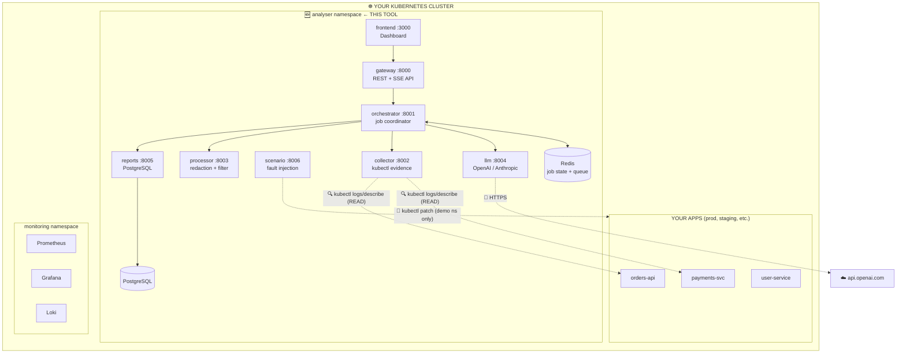

**RBAC boundary:**

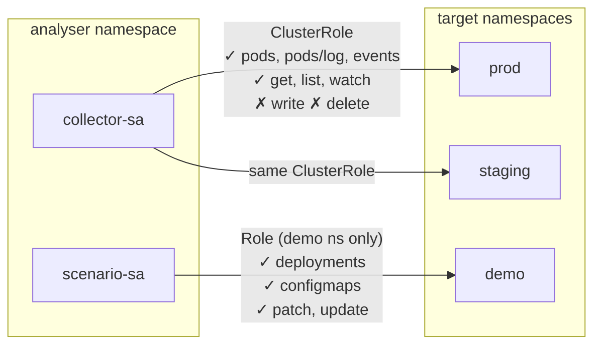

---

## 2. End-to-End Incident Lifecycle

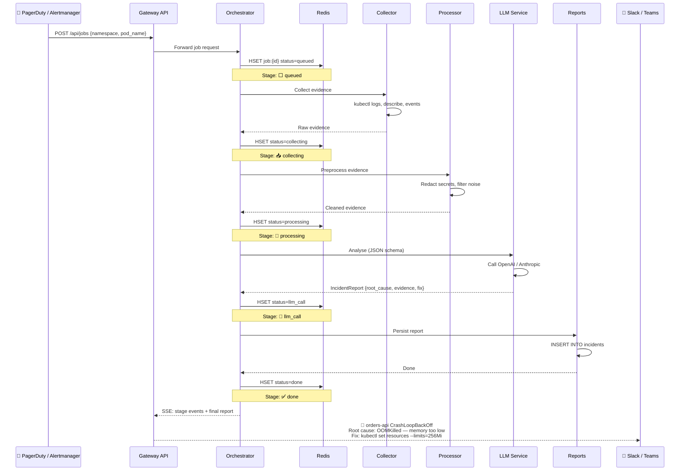

---

## 3. Platform Architecture Diagrams

### 3.1 AWS EKS

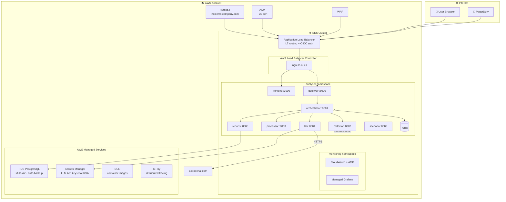

**EKS: What lives WHERE**

| Component | AWS Service |
|---|---|
| Dashboard | EKS pod → ALB target |
| Gateway API | EKS pod → ALB target |
| Orchestrator, Collector, Processor, LLM, Reports, Scenario | EKS pods, ClusterIP only |
| PostgreSQL | RDS (managed) or CNPG operator in-cluster |
| Redis | ElastiCache (managed) or StatefulSet in-cluster |
| LLM API keys | Secrets Manager → IRSA → pod env |
| TLS | ACM → ALB |
| Auth | ALB + Cognito/Okta OIDC |
| Images | ECR |
| Metrics/Logs/Traces | CloudWatch + AMP + X-Ray |

---

### 3.2 Azure AKS

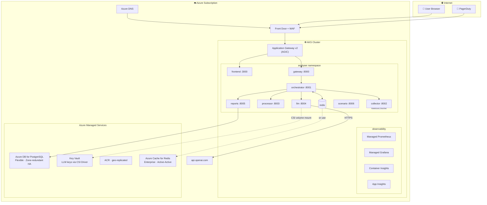

**AKS: What lives WHERE**

| Component | Azure Service |
|---|---|
| Dashboard | AKS pod → App Gateway |
| Gateway API | AKS pod → App Gateway |
| Orchestrator, Collector, Processor, LLM, Reports, Scenario | AKS pods, ClusterIP only |
| PostgreSQL | Azure DB for PostgreSQL Flexible Server |
| Redis | Azure Cache for Redis Enterprise OR in-cluster |
| LLM API keys | Key Vault → Secrets Store CSI Driver → pod volume |
| TLS | Key Vault cert → App Gateway |
| Auth | Entra ID (Azure AD) via OAuth2 Proxy |
| Images | ACR (geo-replicated) |
| Metrics/Logs/Traces | Managed Prometheus + Log Analytics + App Insights |
| Security | Defender for Containers + Azure Policy for K8s |

---

### 3.3 Custom / Self-Managed Kubernetes

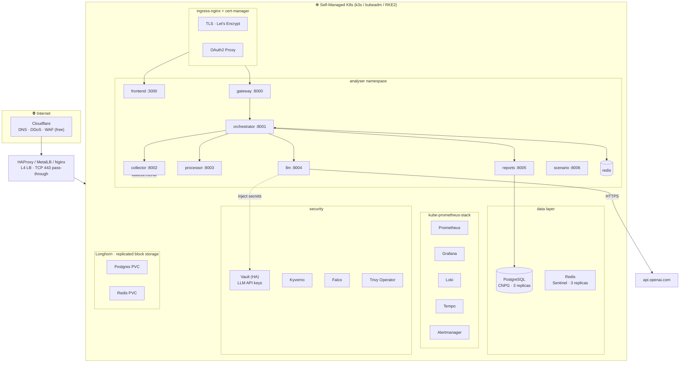

**Custom K8s: What lives WHERE**

| Component | Self-Managed Solution |
|---|---|
| Cluster | k3s / kubeadm / RKE2 |
| DNS | Cloudflare (free) |
| Ingress | ingress-nginx + cert-manager + Let's Encrypt |
| Auth (dashboard) | Dex + OAuth2 Proxy (Google/GitHub/LDAP) |
| PostgreSQL | CloudNativePG operator (3-replica in-cluster) |
| Redis | Bitnami Redis Sentinel chart (3 replicas) |
| LLM API keys | HashiCorp Vault (HA) or Sealed Secrets |
| Storage | Longhorn (replicated block storage) |
| Monitoring | kube-prometheus-stack (Prometheus + Grafana + Alertmanager) |
| Logs | Loki + Promtail |
| Traces | Tempo + OpenTelemetry Collector |
| Security | Kyverno (policy), Falco (runtime), Trivy Operator (image scan) |
| GitOps | ArgoCD or Flux |
| Images | Harbor / GitLab Container Registry / GHCR |

---

## 4. Cross-Platform Component Mapping

| Component | AWS EKS | Azure AKS | Custom K8s |
|---|---|---|---|
| Kubernetes cluster | EKS (managed) | AKS (managed) | k3s / kubeadm |
| DNS | Route53 | Azure DNS | Cloudflare |
| Load Balancer | ALB | App Gateway | MetalLB / HAProxy |
| TLS certificates | ACM | Key Vault | cert-manager + LE |
| Ingress controller | AWS LB Controller | AGIC | ingress-nginx |
| Auth (OIDC/OAuth2) | ALB + Cognito | Entra ID + AGIC | Dex + OAuth2 Proxy |
| PostgreSQL | RDS | Azure DB Flex | CNPG operator |
| Redis | ElastiCache | Azure Cache | Sentinel chart |
| LLM API key storage | Secrets Mgr + IRSA | Key Vault + CSI | Vault / Sealed Secrets |
| Container registry | ECR | ACR | Harbor / GHCR |
| Metrics | CloudWatch + AMP | Managed Prometheus | kube-prometheus |
| Logs | CW Logs | Log Analytics | Loki + Promtail |
| Traces | X-Ray (ADOT) | App Insights | Tempo + OTel |
| Runtime security | GuardDuty | Defender for Containers | Falco |
| Policy enforcement | OPA / Gatekeeper | Azure Policy | Kyverno |
| Storage (PV) | EBS CSI | Azure Disk CSI | Longhorn |
| GitOps | ArgoCD / Flux | ArgoCD / Flux | ArgoCD / Flux |
| **Approx. monthly platform cost (excl. LLM)** | **~$580** | **~$1,250** | **~€55 (Hetzner)** |

---

## 5. Network Traffic Flow

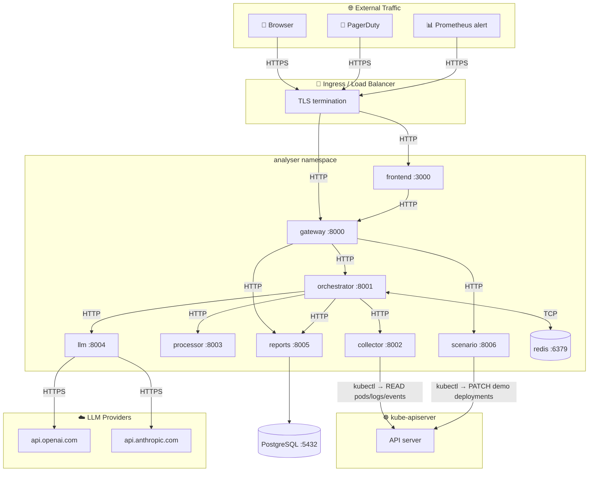

---

## 6. Integration with Existing Incident Stack

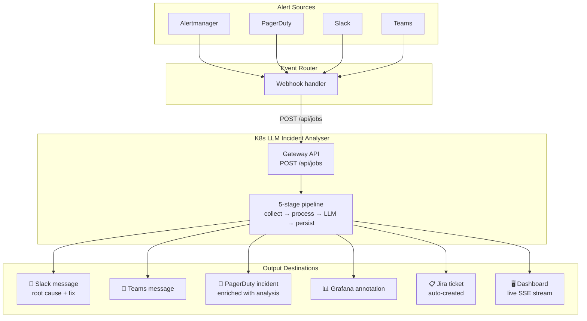

---

## 7. Daily Operational Workflows

### Workflow A: Alert-Triggered Analysis

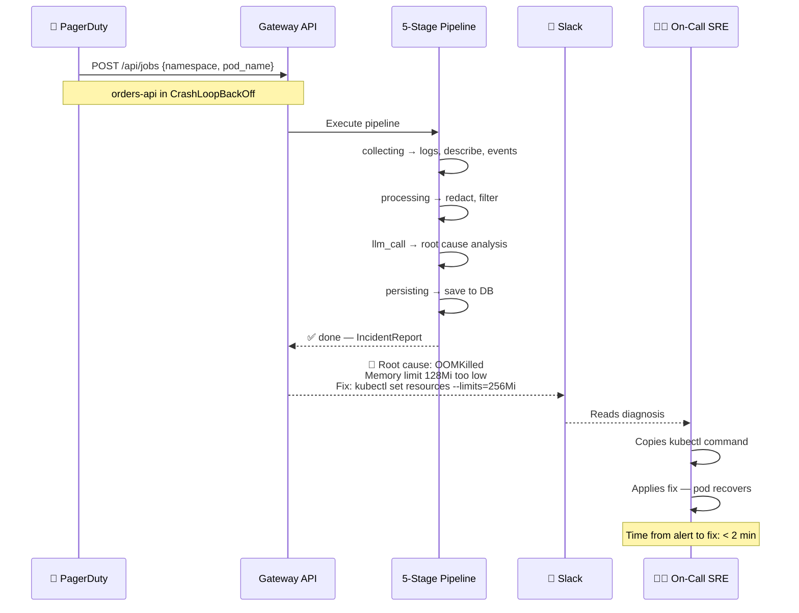

### Workflow B: Proactive Scanning

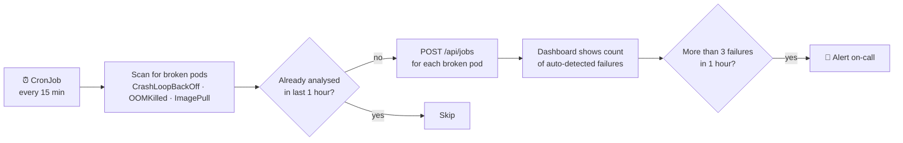

### Workflow C: Chaos Engineering / Fault Injection

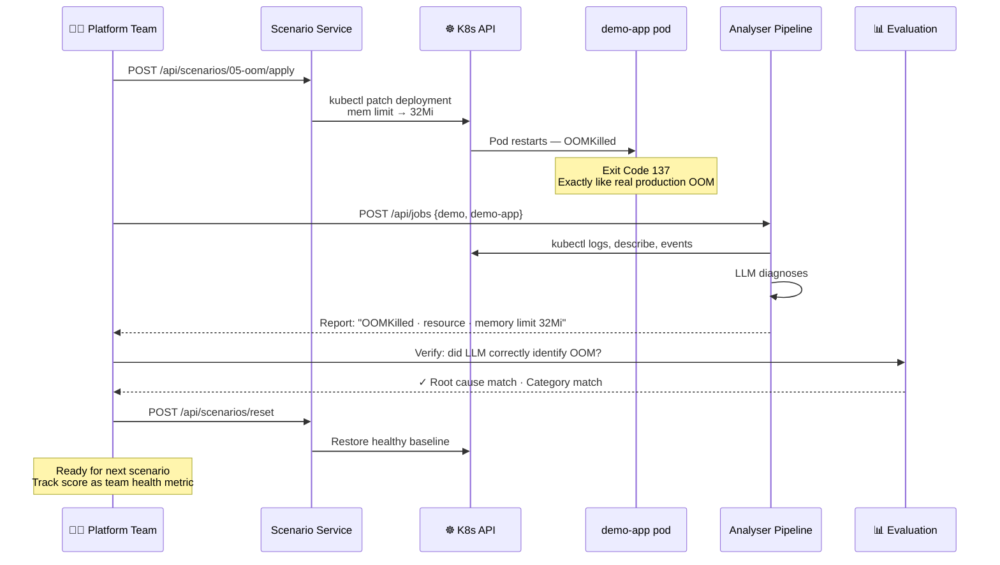

---

## 8. Quick-Start Deployment by Platform

### Common First Step (all platforms)

```bash
git clone https://github.com/1hirak/k8s-llm-incident-analyser.git
cd k8s-llm-incident-analyser
cp .env.example .env
# Edit .env: set LLM_PROVIDER=openai (or mock for testing), add API key

# Test locally with Docker Compose first
docker compose up -d
curl http://localhost:8000/health
open http://localhost:3000
```

### AWS EKS

```bash
eksctl create cluster -f cluster.yaml
kubectl create namespace analyser
kubectl apply -k k8s/overlays/production-aws/
# Access via ALB address (kubectl -n analyser get ingress)
```

### Azure AKS

```bash
az aks create -g analyser-prod -n analyser --node-count 3
az aks get-credentials -g analyser-prod -n analyser
kubectl create namespace analyser
kubectl apply -k k8s/overlays/production-azure/
# Access via App Gateway public IP
```

### Custom K8s

```bash
# Prerequisites on any K8s cluster
helm install ingress-nginx ingress-nginx/ingress-nginx -n ingress-nginx --create-namespace
helm install cert-manager jetstack/cert-manager -n cert-manager --create-namespace --set installCRDs=true

# Deploy analyser
kubectl create namespace analyser
kubectl apply -k k8s/overlays/production/
# Point Cloudflare DNS to your load balancer IP
# cert-manager will auto-provision Let's Encrypt TLS
```

---

## 9. Production Readiness Requirements

### Must-have before production use

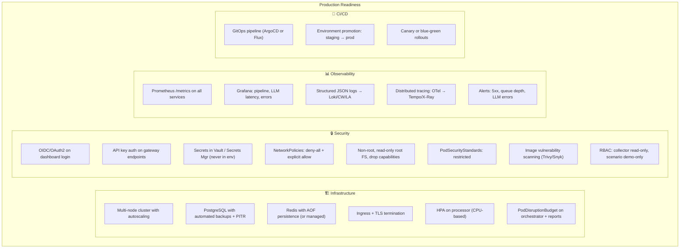

---

## 10. Estimated Monthly Cost Comparison

| Component | AWS EKS | Azure AKS | Custom (Hetzner) |
|---|---|---|---|
| K8s cluster management | $73 | $0 | $0 |
| Compute (4 worker nodes) | ~$370 | ~$720 | ~€55 |
| PostgreSQL | ~$80 | ~$145 | $0 (in K8s) |
| Redis | ~$17 | ~$190 | $0 (in K8s) |
| LB + TLS + WAF | ~$28 | ~$145 | $0 (CF free) |
| Container registry | ~$5 | ~$20 | $0 (GHCR) |
| Observability | ~$8 | ~$35 | $0 (OSS) |
| Secrets management | ~$3 | ~$1 | $0 (Vault) |
| **Platform subtotal** | **~$580** | **~$1,255** | **~€55** |
| LLM API usage (variable) | per job | per job | per job |

LLM cost: gpt-4o-mini averages ~$0.15 per analysis.
100 analyses/day ≈ $450/month in LLM costs (same across all platforms).

### Cost Breakdown (EKS example)

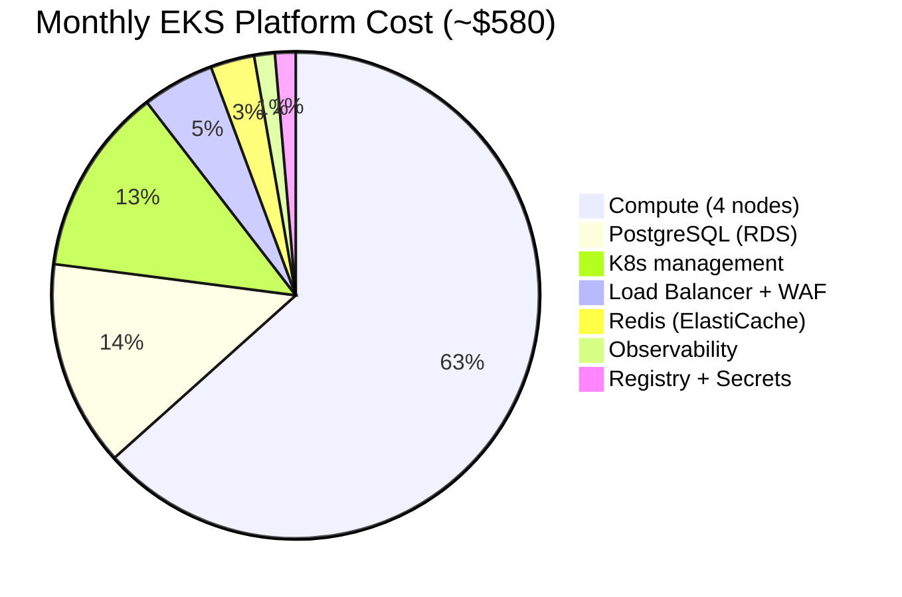

---

## 11. FAQ

**Does this replace Prometheus/Datadog?**
No. Monitoring detects problems. This tool diagnoses root causes.

**Does the LLM see my secrets?**
No. The processor service redacts API keys, passwords, tokens, and connection strings before sending evidence to the LLM provider.

**Can it modify my production workloads?**
No. The collector is read-only. The scenario service only patches a designated test namespace (default: `demo`).

**What if my cluster has no outbound internet?**
Only the LLM service calls external APIs. For air-gapped clusters, run a local LLM (Ollama/vLLM) instead.

**Can I add custom failure categories?**
Yes. Extend the `FailureCategory` enum in the shared contract models.

**Which LLM provider should I use?**
gpt-4o-mini (OpenAI) offers the best cost-quality ratio for incident analysis. Anthropic Claude and DeepSeek are also supported.
