# Learn the K8s LLM Incident Analyser

> A beginner-friendly guide to understanding this repository.
>
> This guide explains the current microservices implementation. It uses plain
> language first, then points to the code that makes each part work.

## 1. The One-Sentence Explanation

This project investigates a broken Kubernetes application.

It collects information from a Kubernetes pod, removes noise and secrets,
asks an LLM what is probably wrong, and saves the answer as an incident report.

The project is both:

- A small incident-investigation product for on-call engineers.
- A research project for comparing an LLM with simpler classifiers.

An alert or an engineer can start the analysis. In an external deployment, the
optional, read-only watcher can also detect unhealthy pods in configured
namespaces and submit deduplicated analysis jobs. The analyser then
investigates the selected pod.

## 2. The Mental Model

Imagine a team investigating a broken machine:

| Project part | Simple analogy |
|---|---|
| Frontend | Reception desk where the engineer starts an investigation |
| Gateway | Front door that receives and routes requests |
| Orchestrator | Team leader that assigns each step |
| Collector | Investigator who gathers clues from Kubernetes |
| Processor | Person who cleans and hides private information |
| LLM service | Specialist who explains the clues |
| Reports service | Filing cabinet that stores the final answer |
| Scenario service | Test operator that deliberately breaks the demo app |
| Watcher service | Read-only scanner that starts jobs for unhealthy pods |
| Remediation service | Guarded change operator that dry-runs and awaits approval |
| Redis | Temporary whiteboard for job progress |
| SQLite | Permanent filing cabinet for reports |

The most important idea is this pipeline:

```text
Kubernetes pod
    |
    v
raw evidence -> cleaned evidence -> LLM analysis -> incident report
```

## 3. The Whole Architecture

The browser talks to the gateway. The browser does not normally call the
internal services directly.

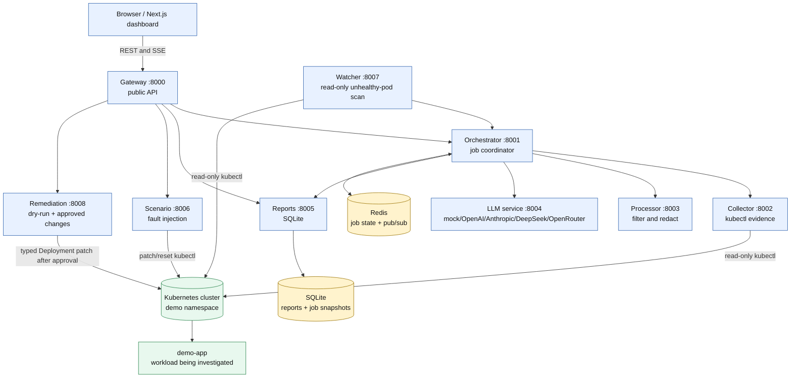

### Important separation: platform versus target workload

The analyser platform is the group of services that investigates failures.

The `demo-app` is the application that is intentionally investigated. Its
PostgreSQL database is also a target dependency, not part of the analyser's
core logic.

In Docker Compose, both groups run together for convenience. In Kubernetes,
the analyser is deployed in the `analyser` namespace and the demo workload is
deployed in the `demo` namespace.

## 4. Start With the Repository Map

```text
k8s-llm-incident-analyser/
|
|-- contracts/       The agreed language between components
|-- services/        Backend microservices
|   |-- shared/      Shared Python models and web helpers
|   |-- gateway/     Public API
|   |-- orchestrator/ Job lifecycle and pipeline
|   |-- collector/   Kubernetes evidence collection
|   |-- processor/   Filtering and redaction
|   |-- llm/         LLM providers and prompts
|   |-- reports/     SQLite persistence
|   `-- scenario/    Kubernetes fault injection
|-- frontend/        Next.js dashboard
|-- demo-app/        Fault-injectable application
|-- k8s/             Kubernetes manifests and fault patches
|-- evaluation/      Ground truth, baselines, and scoring
|-- tests/           Root tests and integration tests
|-- docs/            Design and teaching documentation
|-- docker-compose.yml
`-- Makefile
```

### The best reading order

Read the repository in this order. Do not start by opening every file.

1. This guide.
2. [`README.md`](../README.md) for commands and the public API.
3. [`contracts/README.md`](../contracts/README.md) for the contract-first idea.
4. [`services/shared/src/k8s_llm_shared/models.py`](../services/shared/src/k8s_llm_shared/models.py) for the objects passed around.
5. [`services/orchestrator/app/main.py`](../services/orchestrator/app/main.py) for job creation and SSE.
6. [`services/orchestrator/app/pipeline.py`](../services/orchestrator/app/pipeline.py) for the four processing stages.
7. The collector, processor, LLM, and reports services.
8. The frontend page [`frontend/src/app/analyse/page.tsx`](../frontend/src/app/analyse/page.tsx).
9. The scenarios and evaluation code.

## 5. The Contract-First Design

`contracts/` is the project's agreed specification. It describes what the
services promise to each other before the service code uses those promises.

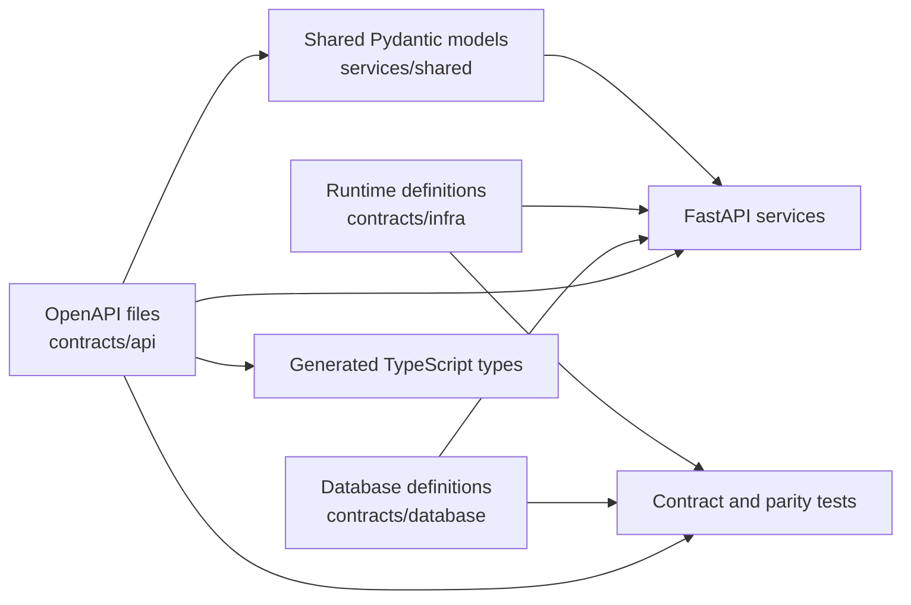

The important contract files are:

| File or directory | What it defines |
|---|---|
| [`contracts/api/gateway.yaml`](../contracts/api/gateway.yaml) | Public endpoints, request shapes, response shapes, and SSE events |
| [`contracts/api/orchestrator.yaml`](../contracts/api/orchestrator.yaml) | Job creation, job state, and internal orchestration endpoints |
| [`contracts/api/collector.yaml`](../contracts/api/collector.yaml) | Evidence collection request and response |
| [`contracts/api/processor.yaml`](../contracts/api/processor.yaml) | Raw evidence to cleaned evidence |
| [`contracts/api/llm.yaml`](../contracts/api/llm.yaml) | LLM provider and analysis endpoints |
| [`contracts/api/reports.yaml`](../contracts/api/reports.yaml) | Report and job persistence endpoints |
| [`contracts/api/scenario.yaml`](../contracts/api/scenario.yaml) | Fault scenario endpoints |
| [`contracts/database/schema.sql`](../contracts/database/schema.sql) | SQLite tables and constraints |
| [`contracts/database/redis_schema.md`](../contracts/database/redis_schema.md) | Redis keys, TTLs, and event channels |
| [`contracts/infra/docker-compose.yml`](../contracts/infra/docker-compose.yml) | Container topology and environment variables |

The shared Python package is the code version of many of these contracts. It
prevents one service from calling a field `podName` while another expects
`pod_name`. Its source is [`services/shared/src/k8s_llm_shared/`](../services/shared/src/k8s_llm_shared/).

The project deliberately uses REST between services in the current version.
The RPC and event contract folders describe possible future migrations to gRPC
and Kafka/RabbitMQ, but those are not used by the current runtime.

## 6. One Analysis From Beginning to End

Assume an engineer enters:

```json
{
  "namespace": "demo",
  "pod_name": "demo-app"
}
```

The request can also be started with curl:

```bash
curl -X POST http://localhost:8000/api/jobs \
  -H 'Content-Type: application/json' \
  -d '{"namespace":"demo","pod_name":"demo-app"}'
```

The gateway returns quickly:

```json
{
  "job_id": "01938a7b-...",
  "status": "queued"
}
```

The job continues in the background. The request does not wait for the LLM.

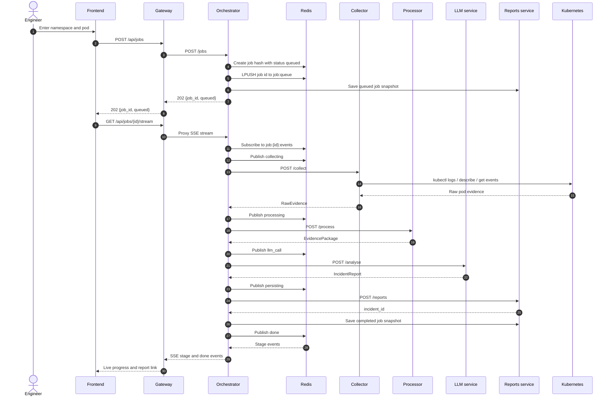

### What the orchestrator actually does

The central workflow is in [`services/orchestrator/app/pipeline.py`](../services/orchestrator/app/pipeline.py).

It performs these four stages:

1. Call collector and receive `RawEvidence`.
2. Call processor and receive `EvidencePackage`.
3. Call LLM service and receive `IncidentReport`.
4. Call reports service and receive an `incident_id`.

The HTTP endpoint and background task are in [`services/orchestrator/app/main.py`](../services/orchestrator/app/main.py).

## 7. The Job State Machine

The frontend needs to show progress while the LLM is working. The orchestrator
stores the current state in Redis and publishes an event for every transition.

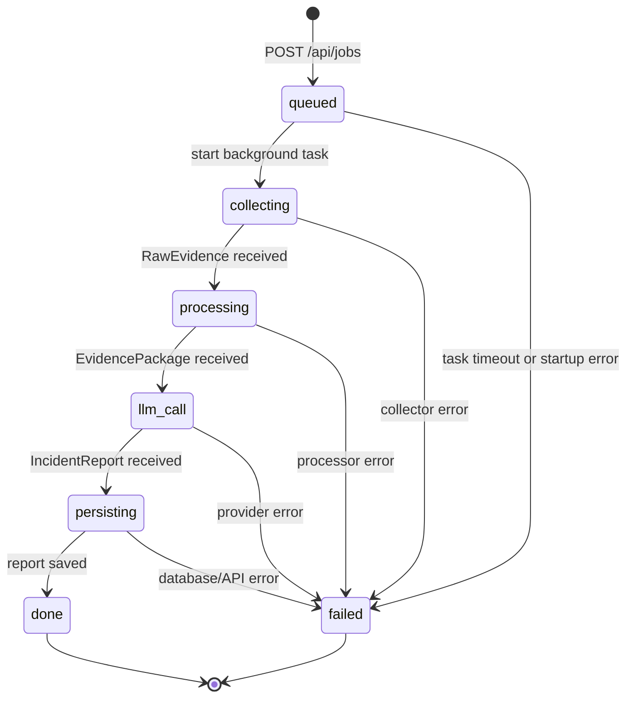

The states are defined in [`services/shared/src/k8s_llm_shared/enums.py`](../services/shared/src/k8s_llm_shared/enums.py).

The Redis implementation is in [`services/orchestrator/app/store.py`](../services/orchestrator/app/store.py):

| Redis key | Meaning |
|---|---|
| `job:{job_id}` | Hash containing the current job state |
| `job:queue` | List where new job IDs are pushed |
| `job:{job_id}:events` | Temporary pub/sub channel for SSE events |

Job hashes expire after 24 hours. The completed report is kept separately in
SQLite.

## 8. The Evidence Pipeline

The most important data transformation in the project is this one:

```mermaid
flowchart LR
    K[ Kubernetes pod ]
    Raw[RawEvidence<br/>logs, status, events, counts]
    Filter[Preprocessor<br/>remove noise, keep signal]
    Safe[Redactor<br/>hide secrets and PII]
    Package[EvidencePackage<br/>safe LLM input]
    Prompt[LLM prompt<br/>evidence + JSON rules]
    Report[IncidentReport<br/>root cause + fix]
    Save[SQLite report]

    K -->|kubectl| Raw
    Raw --> Filter
    Filter --> Safe
    Safe --> Package
    Package --> Prompt
    Prompt --> Report
    Report --> Save
```

### 8.1 Collector: gathering clues

The collector is a small FastAPI wrapper around the `kubectl` executable.

Entry point: [`services/collector/app/main.py`](../services/collector/app/main.py)

Implementation: [`services/collector/app/collector.py`](../services/collector/app/collector.py)

For a pod called `demo-app` in namespace `demo`, it runs commands equivalent to:

```bash
# Current container logs, at most 500 lines
kubectl logs -n demo demo-app --tail=500 --timestamps=true

# Logs from the previous container instance after a crash/restart
kubectl logs -n demo demo-app --tail=500 --timestamps=true --previous

# Pod status, containers, image, probes, resources, and events in the description
kubectl describe pod -n demo demo-app

# Namespace events sorted oldest to newest
kubectl get events -n demo --sort-by=.metadata.creationTimestamp

# Restart count of the first container
kubectl get pod -n demo demo-app \
  -o jsonpath='{.status.containerStatuses[0].restartCount}'

# Container state data
kubectl get pod -n demo demo-app \
  -o jsonpath='{.status.containerStatuses}'
```

If the exact pod name does not exist, the collector tries the label selector
`app=demo-app`. This is useful because Kubernetes usually gives a Deployment's
pod a generated suffix, such as `demo-app-7d8f9c6c7f-abcde`.

The collector returns this object:

```python
RawEvidence(
    namespace="demo",
    pod_name="demo-app-...",
    current_logs="...",
    previous_logs="...",
    pod_status="...",
    k8s_events="...",
    restart_count=3,
    container_states=[...],
)
```

The model is in [`services/shared/src/k8s_llm_shared/models.py`](../services/shared/src/k8s_llm_shared/models.py).

### 8.2 Processor: reducing noise and protecting secrets

The processor has two jobs:

1. Keep useful failure information.
2. Make sure private information does not go to an external LLM.

Entry point: [`services/processor/app/main.py`](../services/processor/app/main.py)

Log filtering: [`services/processor/app/preprocessor.py`](../services/processor/app/preprocessor.py)

Redaction: [`services/processor/app/redactor.py`](../services/processor/app/redactor.py)

The preprocessor generally:

- Looks for error and failure signals such as `error`, `exception`, `OOMKilled`, and `CrashLoopBackOff`.
- Keeps nearby lines as context, normally three lines before and after.
- Removes repeated lines.
- Keeps no more than 100 log lines.
- Truncates the pod description to keep the payload manageable.
- Keeps useful Kubernetes events and removes ordinary noise.

The redactor replaces values such as passwords, database URLs, API keys,
authorization headers, and email addresses with tags such as:

```text
[PASSWORD=REDACTED]
[OPENAI_KEY=REDACTED]
[DB_URL=REDACTED]
```

After processing, the object is an `EvidencePackage`:

```python
EvidencePackage(
    namespace="demo",
    pod_name="demo-app-...",
    current_logs="safe filtered logs",
    previous_logs="safe previous logs",
    pod_status_summary="short pod status",
    k8s_events_filtered="useful events",
    restart_count=3,
)
```

### 8.3 LLM service: turning evidence into an explanation

Entry point: [`services/llm/app/main.py`](../services/llm/app/main.py)

The service chooses one provider using `LLM_PROVIDER`:

| Provider | Purpose |
|---|---|
| `mock` | Local deterministic provider; useful without an API key |
| `openai` | OpenAI structured output provider |
| `anthropic` | Anthropic provider |
| `deepseek` | DeepSeek JSON-mode provider |

The prompt builder is in [`services/llm/app/prompts.py`](../services/llm/app/prompts.py).

The provider returns a JSON-shaped object. Pydantic checks that it matches the
`IncidentReport` model.

The report contains:

```python
IncidentReport(
    incident_id="01938a7c-...",
    incident_summary="The container is being killed by its memory limit.",
    likely_root_cause="The configured memory limit is too low for the app.",
    affected_component="demo-app",
    failure_category="resource",
    severity="high",
    confidence=0.92,
    supporting_evidence=[...],
    suggested_fix="Increase the memory limit.",
    recommended_commands=[...],
    human_verification_steps=[...],
    created_at="2026-07-21T10:05:39Z",
)
```

The allowed categories are `crash`, `config`, `dependency`, `network`,
`image`, `resource`, `probe`, and `unknown`.

The allowed severities are `low`, `medium`, `high`, and `critical`.

### 8.4 Reports service: saving the answer

Entry point: [`services/reports/app/main.py`](../services/reports/app/main.py)

Database implementation: [`services/reports/app/db.py`](../services/reports/app/db.py)

The reports service is the only service that writes to SQLite. It stores:

- Searchable report summary fields.
- The complete nested report as JSON.
- A durable snapshot of the analysis job.

The frontend later asks the gateway for reports. It does not open the SQLite
file directly.

## 9. The Shared Data Models

The shared package is the vocabulary used by the services. Its source is in
[`services/shared/src/k8s_llm_shared/`](../services/shared/src/k8s_llm_shared/).

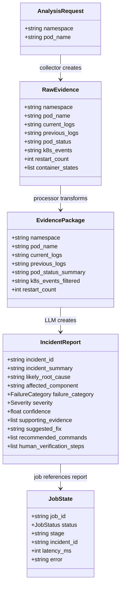

The models are implemented with Pydantic. Pydantic means that incoming JSON is
parsed and checked before the service uses it.

For example, confidence must be between `0.0` and `1.0`, and the report must
contain at least one supporting evidence item.

## 10. Redis and SQLite

The project uses two different stores because they solve different problems.

### Redis: temporary progress

Redis is fast and useful for live job state and pub/sub events:

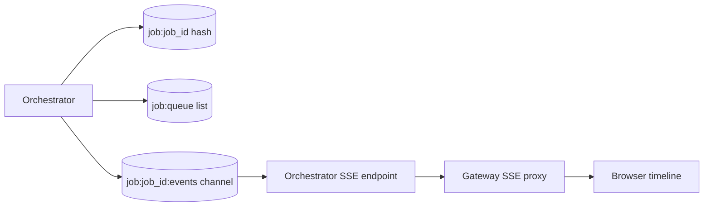

### SQLite: durable history

SQLite stores completed and failed job records so the dashboard can list them
later.

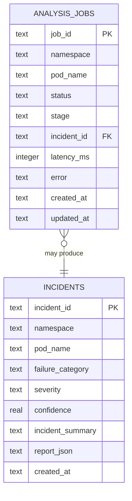

The database schema is [`contracts/database/schema.sql`](../contracts/database/schema.sql).

## 11. The Gateway

The gateway is the public front door. Its source is in
[`services/gateway/app/`](../services/gateway/app/).

The gateway:

- Receives browser requests on port `8000`.
- Adds CORS behavior.
- Applies a simple per-IP rate limit.
- Proxies requests to the appropriate internal service.
- Proxies the long-lived SSE connection.
- Converts errors into RFC 7807 Problem Details.

The browser should not need to know that the reports service is on port `8005`
or that the orchestrator is on port `8001`.

Important public endpoints:

| Endpoint | Meaning |
|---|---|
| `GET /health` | Check gateway and provider information |
| `POST /api/jobs` | Start an analysis |
| `GET /api/jobs` | List jobs |
| `GET /api/jobs/{job_id}` | Read one job |
| `GET /api/jobs/{job_id}/stream` | Watch live job events using SSE |
| `GET /api/reports` | List saved reports |
| `GET /api/reports/{incident_id}` | Read one full report |
| `GET /api/stats` | Read dashboard statistics |
| `GET /api/scenarios` | List test faults |
| `POST /api/scenarios/{id}/apply` | Apply a test fault |
| `POST /api/scenarios/reset` | Restore the healthy baseline |

## 12. The Frontend

The frontend is a Next.js application in [`frontend/src/`](../frontend/src/).

The main pages are:

| Route | What the user sees |
|---|---|
| `/` | Dashboard statistics, charts, and recent reports |
| `/analyse` | Form to start a job and live pipeline timeline |
| `/jobs` | Job list, statuses, filters, and report links |
| `/reports` | Searchable report list |
| `/reports/{id}` | Full root cause, evidence, fix, commands, and confidence |
| `/scenarios` | Fault scenario controls |

The analysis page is [`frontend/src/app/analyse/page.tsx`](../frontend/src/app/analyse/page.tsx).

Its behavior is simple:

1. Store the namespace and pod name in React state.
2. Call `createJob()` when the form is submitted.
3. Receive a `job_id`.
4. Call `streamJob(job_id)` to open an SSE connection.
5. Update the screen whenever a stage event arrives.
6. Link to the report when a `done` event arrives.

The API functions are in [`frontend/src/lib/api.ts`](../frontend/src/lib/api.ts).

The SSE client is in [`frontend/src/lib/sse.ts`](../frontend/src/lib/sse.ts).

The pipeline timeline component is in
[`frontend/src/components/pipeline-timeline.tsx`](../frontend/src/components/pipeline-timeline.tsx).

The TypeScript API types are generated from the gateway OpenAPI contract. The
generated file is [`frontend/src/types/api.d.ts`](../frontend/src/types/api.d.ts).

## 13. The Scenario System

The scenario system makes controlled failures so the project can be tested.

The scenario service reads patches from [`k8s/scenarios/`](../k8s/scenarios/)
and applies them to the demo workload with `kubectl`.

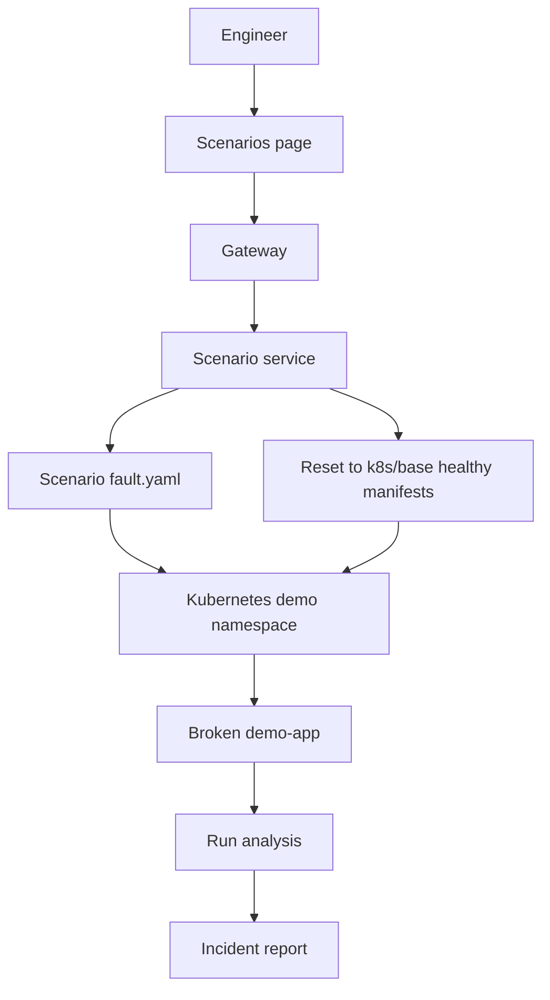

The ten scenarios are:

| Scenario | Failure it creates |
|---|---|
| `01-missing-env` | Removes `DATABASE_URL` |
| `02-db-unavailable` | Points the database URL at a dead host |
| `03-crashloop` | Runs a nonexistent command |
| `04-imagepull` | Uses a nonexistent image tag |
| `05-oom` | Gives the container a very small memory limit |
| `06-readiness` | Uses a bad readiness probe path |
| `07-liveness` | Makes the liveness probe time out |
| `08-bad-configmap` | Sets an invalid log level |
| `09-app-exception` | Makes the app crash during startup |
| `10-wrong-port` | Makes the Service target the wrong port |

The scenario implementation is in [`services/scenario/app/scenarios.py`](../services/scenario/app/scenarios.py).

The target application is in [`demo-app/app/main.py`](../demo-app/app/main.py).

The healthy Kubernetes baseline is in [`k8s/base/`](../k8s/base/).

## 14. Docker Compose Versus Kubernetes

### Docker Compose

`docker-compose.yml` starts eleven containers:

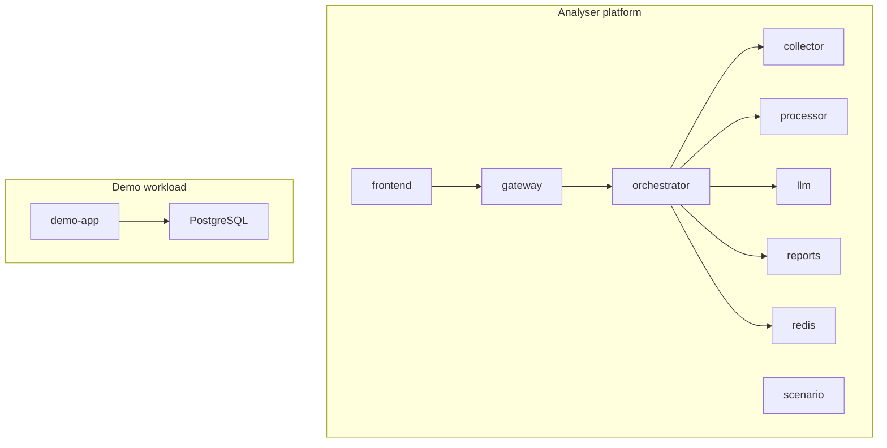

Run it locally with:

```bash
docker compose up --build -d
open http://localhost:3000
```

The default LLM provider is `mock`, so an external API key is not required.

However, the collector still expects a reachable Kubernetes cluster. The
Compose demo container is not automatically a Kubernetes pod. For a real
end-to-end Kubernetes analysis, start Minikube, kind, or another cluster and
deploy the manifests in [`k8s/`](../k8s/).

### Kubernetes

The Kubernetes manifests separate the two namespaces:

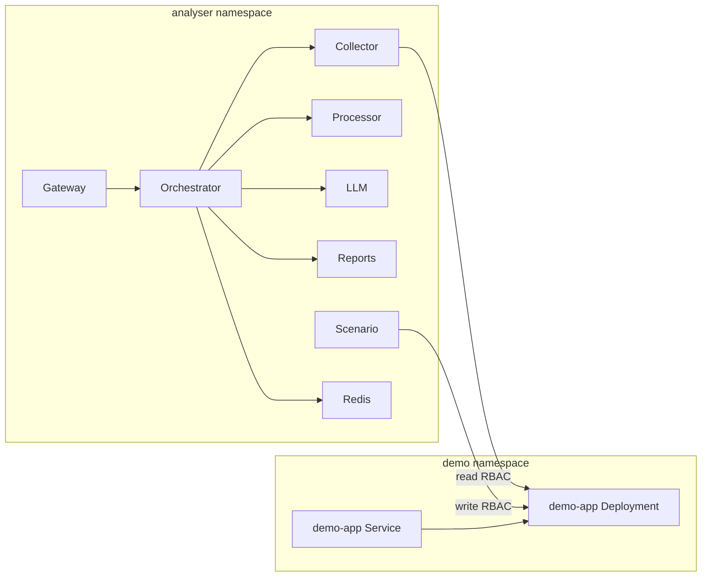

The collector has read-only permissions for pods, logs, and events. The
scenario service has write permissions for the demo namespace so it can apply
fault patches.

## 15. The Demo Application

The demo app is intentionally small. It provides endpoints used by the
Kubernetes probes and by fault scenarios.

Read [`demo-app/app/main.py`](../demo-app/app/main.py) to see how environment
variables and startup faults affect it.

The Kubernetes deployment gives it:

- A readiness probe.
- A liveness probe.
- A memory limit.
- A database URL.
- A Service that routes traffic to port `8000`.

Each fault scenario changes one of these settings. The analyser then tries to
identify the changed setting from the collected evidence.

## 16. The Evaluation System

The repository is also an experiment. It asks whether an LLM can classify
Kubernetes failures better than simple approaches.

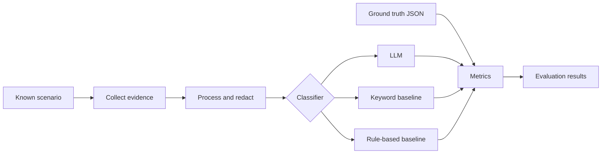

The main evaluation code is [`evaluation/harness.py`](../evaluation/harness.py).

Ground-truth answers are in [`evaluation/ground_truth/`](../evaluation/ground_truth/).

The simple comparison classifiers are:

- [`evaluation/baselines/keyword.py`](../evaluation/baselines/keyword.py)
- [`evaluation/baselines/rulebased.py`](../evaluation/baselines/rulebased.py)

The scoring code is [`evaluation/metrics.py`](../evaluation/metrics.py).

The evaluation process is slightly different from the normal dashboard flow.
It calls collector, processor, and LLM services directly instead of running
through the gateway and orchestrator for every scenario.

## 17. Testing

There are several layers of tests:

| Test location | What it tests |
|---|---|
| `services/*/tests/` | Individual service endpoints and functions |
| `services/shared/tests/` | Shared model and contract behavior |
| `tests/unit/` | Evaluation, manifests, baselines, and utility behavior |
| `tests/integration/` | A complete in-process pipeline without Docker or a real cluster |
| `frontend/src/__tests__/` | Next.js components, pages, API helpers, and SSE behavior |
| `.github/workflows/ci.yml` | Automated CI checks |

Common commands are:

```bash
make test            # all tests
make test-services   # service test suites
make test-root       # root test suite
make lint            # Python linting
```

The integration tests use fake Redis and canned `kubectl` responses. This is
why they can test the pipeline without requiring a running Kubernetes cluster.

## 18. How to Debug One Analysis

When an analysis does not work, follow the pipeline from left to right.

### The dashboard does not open

Check the frontend container and visit:

```text
http://localhost:3000
```

### The API is not responding

Check:

```bash
curl http://localhost:8000/health
docker compose ps
```

### The job fails while collecting

Check:

- Is the Kubernetes cluster running?
- Is the kubeconfig available to the collector container?
- Does the namespace exist?
- Does the pod exist?
- Does the collector have read RBAC permissions?

The collector health endpoint reports whether the cluster is reachable.

### The job fails while processing

Check the processor logs:

```bash
docker compose logs processor
```

The processor is pure CPU code. It does not need Redis, a database, or an LLM
API key.

### The job fails during the LLM stage

Check:

- `LLM_PROVIDER`.
- The provider API key, if using a real provider.
- The LLM container logs.
- Whether the provider response matches `IncidentReport`.

For local work, use `LLM_PROVIDER=mock` first.

### The report is not saved

Check the reports service and the mounted `data/` directory:

```bash
docker compose logs reports
```

### The live timeline stops

The timeline uses SSE. Check the gateway, orchestrator, Redis, and the
`/api/jobs/{job_id}/stream` endpoint.

## 19. If You Want to Change Something

| Goal | Start here |
|---|---|
| Add a public endpoint | `contracts/api/gateway.yaml`, then `services/gateway/app/main.py` |
| Change job stages | `services/shared/src/k8s_llm_shared/enums.py`, `orchestrator/app/store.py`, and `orchestrator/app/pipeline.py` |
| Change Kubernetes evidence | `services/collector/app/collector.py` |
| Change log filtering | `services/processor/app/preprocessor.py` |
| Change secret masking | `services/processor/app/redactor.py` |
| Change the LLM prompt | `services/llm/app/prompts.py` |
| Add an LLM provider | `services/llm/app/llm/`, `services/llm/app/main.py`, and configuration |
| Change report fields | `contracts/api/`, `services/shared/`, and `contracts/database/schema.sql` |
| Change report queries | `services/reports/app/db.py` |
| Change the dashboard | `frontend/src/app/` and `frontend/src/components/` |
| Add a fault scenario | `k8s/scenarios/`, `evaluation/ground_truth/`, and scenario tests |
| Change local services | `docker-compose.yml` |
| Change Kubernetes deployment | `k8s/base/` or `k8s/services/` |
| Change comparison metrics | `evaluation/metrics.py` |

When a change affects an object exchanged between services, update the contract
and shared model as well as the implementation.

## 20. Current Behavior That Can Be Confusing

These details are worth knowing because the documentation describes the
intended architecture while the code is the final authority.

### The Redis queue is prepared for future workers

Creating a job pushes its ID to `job:queue`, but the current v1 orchestrator
starts the pipeline directly with `asyncio.create_task()`.

There is no separate worker consuming the list yet. The list is preparation for
future worker scaling.

### Jobs run inside the orchestrator process

If the orchestrator restarts while a job is running, Redis may still contain
the last state, but the in-process task is gone. The current version does not
resume that task automatically.

### `container_states` is collected but not in the processed package

The collector includes raw container states in `RawEvidence`. The
processed `EvidencePackage` does not have a separate `container_states` field,
so the text from `kubectl describe pod` carries much of that information
forward.

### Namespace events are collected broadly

The collector asks for events in the whole namespace rather than filtering to
one exact pod. The processor then keeps useful event lines.

### Docker Compose health and Kubernetes health are different

The Compose stack can be fully healthy while the Kubernetes cluster is
unreachable. The backend services are running, but the collector cannot analyse
a Kubernetes pod until `kubectl` can reach a cluster.

### Use current v2 code when an old document disagrees

Some documents describe the historical monolith. The current path is:

```text
POST /api/jobs -> asynchronous orchestrator pipeline -> SQLite report
```

Do not assume old `/analyse/pod` examples still describe the running system.

## 21. Glossary

| Term | Meaning |
|---|---|
| Kubernetes | System that runs and manages containers |
| Cluster | A group of machines running Kubernetes |
| Namespace | A named area inside a Kubernetes cluster |
| Pod | The smallest Kubernetes unit that runs one or more containers |
| Container | A running package containing an application and its dependencies |
| Deployment | Kubernetes object that keeps the desired number of pods running |
| Service | Kubernetes network address that sends traffic to pods |
| Probe | Kubernetes health check for readiness or liveness |
| `CrashLoopBackOff` | Kubernetes repeatedly starts a container and it repeatedly crashes |
| `OOMKilled` | The operating system killed a container because it used too much memory |
| `kubectl` | Command-line client for Kubernetes |
| RBAC | Kubernetes permission system based on roles |
| FastAPI | Python web framework used by the backend services |
| REST | HTTP request/response communication between services |
| SSE | Server-Sent Events; a one-way live stream from server to browser |
| Redis pub/sub | Redis mechanism for publishing temporary messages to subscribers |
| SQLite | Small file-based relational database |
| LLM | Large language model used to interpret the evidence |
| Pydantic | Python library used to validate structured data |
| OpenAPI | Machine-readable description of HTTP APIs |

## 22. The Shortest Possible Summary

If you remember only one diagram, remember this:

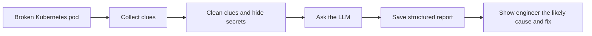

If you remember only one file path, start with:

```text
services/orchestrator/app/pipeline.py
```

That file shows the central journey from collected evidence to saved incident
report.
