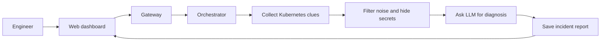

# K8s LLM Incident Analyser: One-Page Overview

## What It Does

This project helps an engineer understand why a Kubernetes application is
broken.

For example, a Kubernetes pod may be restarting, unable to pull its image,
running out of memory, failing a health check, or unable to connect to a
database. The engineer selects the namespace and pod, and the system produces
a report containing:

- The likely root cause.
- Evidence supporting that conclusion.
- Severity and confidence.
- A suggested fix.
- Useful `kubectl` commands and verification steps.

It is an investigation assistant, not the alerting system. An engineer or an
existing monitoring system starts the investigation.

## How It Does It



### 1. Start an analysis

The engineer enters a namespace and pod name in the dashboard. The frontend
sends a request like:

```json
{
  "namespace": "demo",
  "pod_name": "demo-app"
}
```

The system immediately returns a `job_id`, because an LLM call can take several
seconds.

### 2. Collect Kubernetes evidence

The collector service uses `kubectl` to gather:

- Current pod logs.
- Logs from the previous container after a crash.
- Pod details from `kubectl describe pod`.
- Kubernetes events.
- Restart counts and container states.

This produces a `RawEvidence` object.

### 3. Clean the evidence

The processor removes unhelpful log noise, keeps error lines with nearby
context, limits the amount of text, and removes duplicate lines.

It also hides passwords, API keys, database URLs, authorization headers, and
other private information before the evidence leaves the cluster.

This produces a safe `EvidencePackage`.

### 4. Ask the LLM

The LLM service sends the safe evidence to the configured provider:

- `mock` for local testing.
- OpenAI.
- Anthropic.
- DeepSeek.

The response must match the project's `IncidentReport` structure. This prevents
the result from being only free-form text.

### 5. Save and show the result

The reports service saves the completed report in SQLite. The dashboard then
shows the root cause, evidence, suggested fix, commands, severity, and
confidence.

## What Happens While It Runs

The orchestrator tracks the job through these stages:

```text
queued -> collecting -> processing -> llm_call -> persisting -> done
                                                             \
                                                              -> failed
```

Redis stores temporary job progress and publishes live events. The browser
receives those events using SSE, so the dashboard can show the pipeline moving
in real time.

## Main Components

| Component | Job |
|---|---|
| Frontend | Lets the engineer start analyses and read reports |
| Gateway | Public API and request router |
| Orchestrator | Runs the analysis workflow |
| Collector | Runs `kubectl` and gathers evidence |
| Processor | Filters logs and redacts secrets |
| LLM service | Diagnoses the failure |
| Reports service | Saves reports in SQLite |
| Scenario service | Creates test failures in the demo app |
| Redis | Holds temporary job state and live events |

## The Main Idea

```text
Broken Kubernetes pod
        |
        v
Collect clues -> Clean clues -> Ask LLM -> Save diagnosis -> Help engineer fix it
```

For the detailed teaching guide, see
[`LEARN-THE-CODEBASE.md`](./LEARN-THE-CODEBASE.md).
