# K8s LLM Incident Analyser — Technical Documentation (A to Z)

> **Current architecture (v2 microservices).** This document is the
> exhaustive reference manual for the microservices platform: nine FastAPI
> services, Redis, SQLite, and a Next.js dashboard. For the narrative
> "why" guide see [`DEEP-DIVE.md`](./DEEP-DIVE.md); for the 10-minute brief
> see [`architecture.md`](./architecture.md); for the authoritative specs
> (which change **before** code) see [`contracts/`](../contracts/README.md).
> The v1 single-process monolith documented by earlier revisions of this
> file no longer exists; pipeline *semantics* are unchanged.

**Author:** Hirak Das
**Date:** 22 July 2026 (rewritten for v2; first published 21 July 2026)
**Repository:** [github.com/1hirak/k8s-llm-incident-analyser](https://github.com/1hirak/k8s-llm-incident-analyser)
**Contracts version:** `1.0.0` ([`contracts/VERSION`](../contracts/VERSION))

A high-fidelity full-stack technical reference manual for the K8s LLM Incident Analyser — a dissertation research artefact that investigates whether large language models, fed with redacted Kubernetes evidence, can produce incident reports that are more accurate and more actionable than rule-based and keyword-based baselines. Covers the contract-first microservice architecture, the asynchronous job pipeline with Server-Sent Events, seven services plus a shared kernel, four LLM provider integrations (Mock, OpenAI, Anthropic, DeepSeek), two baseline classifiers, an evaluation harness with ten fault scenarios, Kubernetes deployment topology, and end-to-end telemetry traces.

---

## Table of Contents

1. [Summary](#1-summary)
2. [System Architecture](#2-system-architecture)
3. [Technology Stack](#3-technology-stack)
4. [Project Structure](#4-project-structure)
5. [Contracts & the Shared Kernel](#5-contracts--the-shared-kernel)
6. [Build & Tooling](#6-build--tooling)
7. [Service Conventions & Bootstrap](#7-service-conventions--bootstrap)
8. [Public API Surface (gateway-svc)](#8-public-api-surface-gateway-svc)
9. [Internal APIs](#9-internal-apis)
10. [Orchestrator: Job State Machine & Pipeline](#10-orchestrator-job-state-machine--pipeline)
11. [Evidence Collection (collector-svc)](#11-evidence-collection-collector-svc)
12. [Preprocessing & Noise Filtering (processor-svc)](#12-preprocessing--noise-filtering-processor-svc)
13. [Secret Redaction (processor-svc)](#13-secret-redaction-processor-svc)
14. [Prompt Engineering (llm-svc)](#14-prompt-engineering-llm-svc)
15. [LLM Provider Layer (llm-svc)](#15-llm-provider-layer-llm-svc)
16. [Persistence & Stats (reports-svc)](#16-persistence--stats-reports-svc)
17. [State Stores: Redis & SQLite](#17-state-stores-redis--sqlite)
18. [Frontend (Next.js Dashboard)](#18-frontend-nextjs-dashboard)
19. [Baseline Classifiers](#19-baseline-classifiers)
20. [Evaluation Harness & Metrics](#20-evaluation-harness--metrics)
21. [Demo Application & Fault Scenarios](#21-demo-application--fault-scenarios)
22. [Kubernetes Integration](#22-kubernetes-integration)
23. [Data Flow Traces](#23-data-flow-traces)
24. [Deployment & Infrastructure](#24-deployment--infrastructure)
25. [Testing & Quality Assurance](#25-testing--quality-assurance)
26. [Evaluation Results](#26-evaluation-results)
27. [Limitations & Future Roadmap](#27-limitations--future-roadmap)

---

## 1. Summary

The K8s LLM Incident Analyser turns an ambiguous Kubernetes pod failure — a CrashLoopBackOff, an OOMKilled, a failing readiness probe — into a structured incident report with a likely root cause, an affected component, a severity, a confidence score, supporting evidence, and a concrete remediation plan, in under 10 seconds per pod, without leaking secrets to the LLM vendor.

Version 2 wraps that pipeline in an **asynchronous microservices platform**: a user (or the dashboard) submits an analysis job, the job progresses through five visible stages while Server-Sent Events stream its progress live, and the finished report lands in a queryable store behind a REST API.

### The Problem

On-call engineers handling Kubernetes incidents face three compounding failures, not one:

- **Signal-to-noise collapse** — A single failing pod emits hundreds of log lines per minute, most of which are liveness probes, health checks, and metrics scrapes. The line that explains the failure is rarely the most recent one.
- **Cross-resource detective work** — Root causes live across pods, events, ConfigMaps, Services, and prior container states. `kubectl logs` alone shows one plane; the answer usually needs `kubectl describe`, `kubectl get events`, and the pod's restart history stitched together.
- **Knowledge gap under pressure** — Junior on-call engineers are asked to diagnose failures in systems they did not write, with runbooks that may not exist, at 03:00. They do not need a search engine; they need a ranked, evidence-cited answer to "what is most likely wrong and what should I do next".

Existing AIOps tools (Datadog Watchdog, Dynatrace Davis, New Relic AI) optimise for detection at fleet scale. Nobody optimises for the single-pod, single-incident, evidence-cited diagnosis that a human would write. That gap is the product.

### The Solution: A Five-Stage Service Pipeline

The v1 six-stage in-process pipeline is preserved semantically, but each stage is now an HTTP hop owned by a dedicated service, coordinated by the orchestrator:

| Stage | Service (port) | Input | Output | Typical Wall Time |
|-------|----------------|-------|--------|-------------------|
| 1 — collect | collector-svc (:8002) | namespace + pod name | `RawEvidence` (logs, describe, events, restart count, container states) | < 1 s |
| 2 — process | processor-svc (:8003) | `RawEvidence` | `EvidencePackage` (noise-filtered, deduplicated, context-windowed, **secrets redacted**) | < 50 ms |
| 3 — llm_call | llm-svc (:8004) | `EvidencePackage` + JSON schema | `IncidentReport` (structured Pydantic object) | 2–8 s real provider, < 50 ms mock |
| 4 — persist | reports-svc (:8005) | `IncidentReport` | `incident_id` (row in SQLite) | < 10 ms |
| 5 — done | orchestrator-svc (:8001) | `incident_id` | terminal job state + SSE `done` event | — |

Around the pipeline sit three more services: **gateway-svc** (:8000), the only public door; **scenario-svc** (:8006), which injects faults into the cluster for repeatable evaluation; and the **frontend** (:3000), a Next.js operations dashboard. Job state lives in **Redis** (hashes + pub/sub); durable reports and job snapshots live in **SQLite** (WAL mode).

### Research Question

> Can a structured-output LLM, fed with redacted Kubernetes evidence and a strict JSON schema, produce incident reports whose failure-category accuracy and root-cause identification exceed those of a weighted keyword classifier and a priority-ordered rule-based classifier across ten canonical fault scenarios?

The answer, measured end-to-end on a k3s cluster running on AWS EC2 with DeepSeek `deepseek-chat` as the LLM, is **yes — substantially**. Full results in [Section 26](#26-evaluation-results).

---

## 2. System Architecture

### Context Diagram

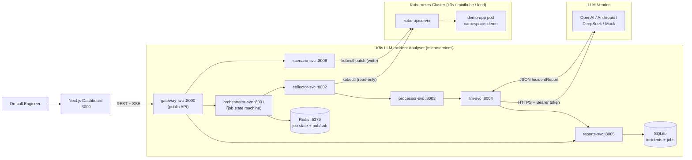

### The Three Communication Planes

| Plane | Technology | Carries |
|-------|-----------|---------|
| **Public** | HTTP/JSON + SSE, browser ↔ gateway :8000 | All `/api/*` endpoints, `/health`, the job event stream |
| **Internal sync** | HTTP/JSON between services (httpx) | Pipeline hops (`/collect`, `/process`, `/analyse`, `/reports`), proxy hops, `/health` checks |
| **Internal async** | Redis hashes + pub/sub | Job state (`job:{job_id}`), event fanout (`job:{job_id}:events`), future work queue (`job:queue`) |

There is no message broker and no gRPC in v1 of the platform — both are deliberate deferrals, documented with migration plans in [`contracts/events/README.md`](../contracts/events/README.md) and [`contracts/rpc/README.md`](../contracts/rpc/README.md).

### Deployment Topology (Docker Compose)

The reference topology is an 11-container Compose stack (7 platform services + Redis + frontend + the demo workload with its PostgreSQL). The SSOT lives in [`contracts/infra/docker-compose.yml`](../contracts/infra/docker-compose.yml); the repo-root `docker-compose.yml` mirrors it with repo-relative build contexts.

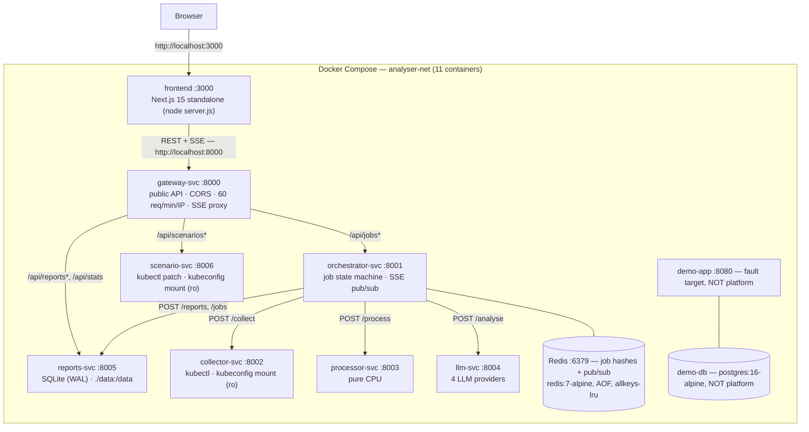

### Service Responsibility Matrix

| Service | Port | Responsibility | State | External calls |
|---------|------|----------------|-------|----------------|
| gateway | 8000 | Public API; proxies to internal services; CORS `*`; sliding-window rate limit; SSE passthrough with anti-buffering headers | — | orchestrator, reports, scenario (proxy); llm + collector (`/health` aggregation) |
| orchestrator | 8001 | Job lifecycle (7-state machine); coordinates collector→processor→llm→reports; publishes Redis events; archives terminal state | Redis | collector, processor, llm, reports |
| collector | 8002 | Wraps kubectl subprocess; pod name auto-resolution via label selector | — | kube-apiserver (read) |
| processor | 8003 | Noise/signal log filtering with context windows; secret/PII redaction (7 categories) | — | none (pure CPU) |
| llm | 8004 | Provider integrations + prompt building + output validation; holds all external API keys | — | OpenAI / Anthropic / DeepSeek APIs |
| reports | 8005 | Owns SQLite (single writer, WAL); reports + job snapshots; dashboard stats | SQLite | none |
| scenario | 8006 | Lists/applies/resets fault scenarios via kubectl strategic-merge patch; tracks active scenario (409 on conflict) | in-memory | kube-apiserver (write) |
| watcher | 8007 | Read-only namespace-scoped unhealthy-pod scanner; deduplicates and submits jobs | Redis cooldown keys | kube-apiserver (read) |
| remediation | 8008 | Typed server-side dry-run and explicit operator-approved Deployment changes | Redis proposals | kube-apiserver (write) |
| frontend | 3000 | Next.js 15 dashboard (App Router, Tailwind v4, shadcn/ui) | — | gateway only |

### Trust Boundaries and Security Model

1. **Only gateway-svc is public.** Internal services bind to the Compose network / cluster DNS; nothing external routes to them. In Kubernetes, only gateway (NodePort 30080) and frontend (NodePort 30030) are exposed.
2. **Secrets flow one way.** `OPENAI_API_KEY` / `ANTHROPIC_API_KEY` / `DEEPSEEK_API_KEY` exist only in llm-svc's environment. Evidence is redacted by processor-svc *before* llm-svc (and therefore any vendor) sees it.
3. **Cluster access is split by least privilege.** collector-svc runs with a read-only ClusterRole (pods, pods/log, events — get/list/watch). scenario-svc runs with a Role scoped to the `demo` namespace (patch on deployments/services/configmaps; no delete). No other service has any cluster credentials.
4. **Database ownership.** reports-svc is the single writer to the SQLite file; every other service goes through its HTTP API. Redis is owned by orchestrator-svc.
5. **Authentication is deployment-configured.** Development may leave
   `GATEWAY_API_TOKEN` empty, while external-cluster deployments require a
   Bearer token and restricted CORS origins. OIDC and TLS at an ingress remain
   recommended for production.

### Key Design Decisions and Their Trade-offs

| Decision | Rationale | Cost |
|----------|-----------|------|
| Asynchronous jobs (`202` + SSE) instead of synchronous analysis | LLM calls take 2–30 s; browsers and proxies time out; progress is UX-valuable | More moving parts: Redis, job state machine, SSE |
| Redis as primary job store, SQLite as durable snapshot | Sub-ms hash reads for polling; pub/sub gives free SSE fanout; list pre-seeds v2 worker scaling | Two stores to keep consistent (archival is best-effort) |
| Monorepo shared kernel (`k8s-llm-shared`) instead of per-service models | Zero schema drift; the contract is importable code | All services rebuild when shared changes |
| kubectl-as-subprocess instead of the Python client | Battle-tested auth (kubeconfig contexts, exec plugins, OIDC), no client-library version skew | Requires the kubectl binary in collector/scenario images |
| SQLite WAL instead of PostgreSQL | ~10 analyses/day at dissertation scale; zero-ops; single-writer is trivially safe | Does not scale horizontally (pinned 1 replica) |
| REST instead of gRPC; Redis pub/sub instead of Kafka | Call frequency is ~10/day; latency is dominated by the LLM call | Revisit when throughput grows (migration plans written) |

### Full-Stack Component Map

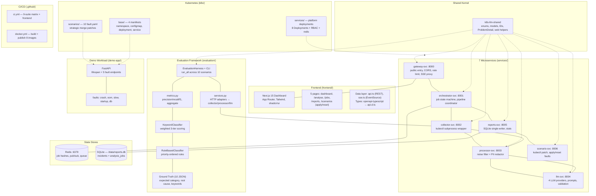

---

## 3. Technology Stack

### Complete Stack Matrix

| Layer | Technology | Version | Role |
|-------|-----------|---------|------|
| Language (services) | Python | 3.12 (`>=3.12`) | All 8 service packages |
| Web framework | FastAPI | 0.115.* | HTTP APIs in every service |
| ASGI server | uvicorn[standard] | 0.32.* | `uvicorn app.main:app --host 0.0.0.0 --port <port>` |
| Data validation | Pydantic | 2.10.* | All DTOs (via shared kernel) |
| HTTP client | httpx | 0.28.* | Inter-service calls, DeepSeek provider, proxying |
| Redis client | redis (asyncio) | >=5.2,<7 | Orchestrator job store |
| LLM SDKs | openai / anthropic | 1.59.* / 0.45.* | Structured-output providers |
| Database | SQLite (stdlib `sqlite3`) | 3.40+, WAL | Reports + job snapshots |
| Cache/queue/pub-sub | Redis | 7-alpine | Job state, SSE fanout |
| Cluster CLI | kubectl | v1.31.0 | collector + scenario images |
| IDs | uuid-utils | >=0.10 | UUIDv7 (time-sortable) |
| Logging | structlog | 24.* | Structured service logs |
| Frontend framework | Next.js | 15.3.4 | App Router, `output: "standalone"` |
| UI runtime | React | 19.1.0 | Server + client components |
| Styling | Tailwind CSS | 4.1.10 | Dark-only design system |
| Component kit | shadcn/ui (Radix) | new-york style | 14 primitives in `components/ui` |
| Charts | recharts | 2.15.3 | Dashboard category/latency charts |
| Type generation | openapi-typescript | 7.8.0 | `gateway.yaml` → `api.d.ts` |
| Frontend language | TypeScript | 5.8.3 (strict) | Entire frontend |
| Test runner (Python) | pytest + pytest-asyncio | 8.* / 0.24.* | `asyncio_mode = auto` everywhere |
| Test doubles | fakeredis | >=2.26 | In-memory Redis for tests |
| Test runner (TS) | Vitest + Testing Library | ^4.1.10 | jsdom component tests |
| Linter/formatter | ruff | 0.8.* | `select = E,F,I,N,W`, line-length 100 |
| Containers | Docker + Compose v2 | — | 11-container reference stack |
| CI | GitHub Actions | — | 9-suite pytest matrix + frontend build + Docker publish |
| Registry | GHCR | ghcr.io | 8 published images (`ghcr.io/<repo>/<name>-svc:latest`) |

### Why kubectl-as-subprocess (not the Python client)

The official `kubernetes` Python client lags the cluster API and re-implements authentication badly. Shelling out to `kubectl` inherits the user's kubeconfig — contexts, exec-based auth (aws-iam-authenticator, kubelogin), certificate paths — with zero code. Every call is wrapped with `subprocess.run(..., capture_output=True, text=True, timeout=self.timeout, check=False)`; failures degrade to empty strings instead of raising, so a missing log or event stream never kills a job. The trade-off (needing the kubectl binary inside two images) is accepted and handled in the Dockerfiles ([Section 6](#6-build--tooling)).

---

## 4. Project Structure

### Annotated Source Tree

```
k8s-llm-incident-analyser/
├── contracts/                        # ★ Single Source of Truth (SSOT) — changes BEFORE code
│   ├── README.md                     #    Philosophy, alignment rules, versioning, review checklist
│   ├── VERSION                       #    1.0.0 (semver; enum changes = major bump)
│   ├── api/                          #    OpenAPI 3.1 — 7 service boundaries
│   │   ├── gateway.yaml              #      Public API + ALL shared component schemas (the schema hub)
│   │   ├── orchestrator.yaml         #      Internal job API + raw_evidence/evidence_package schemas
│   │   ├── collector.yaml            #      POST /collect contract + kubectl behaviour notes
│   │   ├── processor.yaml            #      POST /process contract (filter + redact semantics)
│   │   ├── llm.yaml                  #      POST /analyse + GET /providers + provider_info schema
│   │   ├── reports.yaml              #      Persistence API + save_report/save_job request schemas
│   │   └── scenario.yaml             #      Scenario list/apply/reset + 409 conflict semantics
│   ├── database/
│   │   ├── schema.sql                #    SQLite DDL — 2 tables, 5 indexes, 2 triggers, CHECK enums
│   │   └── redis_schema.md           #    Redis keys, TTLs, pub/sub channels, job lifecycle
│   ├── events/README.md              #    Why AsyncAPI is deferred to v2 (+ migration plan)
│   ├── rpc/README.md                 #    Why proto3/gRPC is deferred to v2 (+ mapping rules)
│   └── infra/
│       ├── docker-compose.yml        #    Topology SSOT (10 services + ports + health checks)
│       ├── docker-compose.dev.yml    #    Dev override (bind mounts + --reload + HMR)
│       ├── .env.example              #    Every env var for every service (the env contract)
│       └── k8s/                      #    namespace.yaml + RBAC SSOT copies
├── services/
│   ├── shared/                       # ★ k8s-llm-shared — the contract as a Python package
│   │   ├── pyproject.toml            #    setuptools src-layout; pydantic + uuid-utils
│   │   ├── src/k8s_llm_shared/
│   │   │   ├── enums.py              #      5 Literal aliases (8/4/7/4/4 values, contract parity)
│   │   │   ├── models.py             #      19 Pydantic models (domain + jobs + SSE + scenarios + stats)
│   │   │   ├── errors.py             #      RFC 7807 ProblemDetail
│   │   │   ├── ids.py                #      new_id() (UUIDv7), utc_now_iso()
│   │   │   └── web.py                #      FastAPI error handlers + /health payload factory
│   │   └── tests/test_shared_models.py   # 603-line contract-parity suite
│   ├── gateway/                      # :8000 — public front door (proxy, CORS, rate limit)
│   │   ├── app/{main,proxy,rate_limit}.py
│   │   ├── tests/  Dockerfile  requirements.txt  pytest.ini
│   ├── orchestrator/                 # :8001 — job state machine + pipeline coordinator
│   │   ├── app/{main,pipeline,store}.py
│   │   └── ...
│   ├── collector/                    # :8002 — kubectl wrapper → RawEvidence
│   │   ├── app/{main,collector}.py   #    Dockerfile installs kubectl v1.31.0
│   │   └── ...
│   ├── processor/                    # :8003 — filter + redact → EvidencePackage (pure CPU)
│   │   ├── app/{main,preprocessor,redactor}.py
│   │   └── ...
│   ├── llm/                          # :8004 — providers + prompts + validation → IncidentReport
│   │   ├── app/{main,prompts,validator}.py
│   │   ├── app/llm/{__init__(registry+factory),base,mock_provider,openai_provider,
│   │   │            anthropic_provider,deepseek_provider}.py
│   │   └── ...
│   ├── reports/                      # :8005 — SQLite single writer (reports, jobs, stats)
│   │   ├── app/{main,db}.py          #    Dockerfile also bakes contracts/database/schema.sql
│   │   └── ...
│   └── scenario/                     # :8006 — fault injection via kubectl patch
│       ├── app/{main,scenarios}.py   #    Dockerfile bakes k8s/scenarios, k8s/base, ground_truth
│       └── ...
├── frontend/                         # :3000 — Next.js 15 dashboard
│   ├── src/app/                      #    Pages: /, /analyse, /jobs, /reports(+[id]), /scenarios
│   ├── src/components/               #    14 feature components + ui/ (14 shadcn primitives)
│   ├── src/lib/                      #    api.ts (REST client), sse.ts (EventSource), utils, logger
│   ├── src/types/                    #    api.d.ts (generated from gateway.yaml) + index.ts aliases
│   ├── src/__tests__/                #    20 Vitest files
│   └── Dockerfile                    #    Multi-stage: dev / deps / builder / runner (standalone)
├── demo-app/                         # Fault-injectable target workload (FastAPI) — NOT platform
├── evaluation/                       # Research instrumentation
│   ├── harness.py                    #    CLI + run_scenario + EvaluationHarness
│   ├── services.py                   #    HTTP adapters: harness → collector/processor/llm services
│   ├── metrics.py                    #    EvaluationResult, evaluate(), precision/recall/f1, aggregate()
│   ├── baselines/{keyword,rulebased}.py
│   └── ground_truth/*.json           #    10 scenario truth files
├── k8s/
│   ├── base/                         # demo-app namespace/configmap/deployment/service (ns: demo)
│   ├── scenarios/                    # 10 fault.yaml strategic-merge patches
│   └── services/                     # Platform manifests (ns: analyser) + RBAC + redis + frontend
├── tests/
│   ├── unit/                         # Root suite: metrics, harness, baselines, manifests, demo app
│   ├── integration/test_pipeline.py  # In-process 5-service composition (no Docker/cluster/Redis)
│   └── fixtures/scenario_evidence.py # 10 handcrafted EvidencePackage fixtures
├── scripts/
│   ├── run_scenario.sh               # CLI fault injector (apply/reset/all)
│   ├── e2e_smoke.sh                  # Full-stack smoke test through the gateway
│   └── run_all_tests.sh              # Runs all 9 suites, exit code = #failed suites
├── docs/                             # You are here
├── docker-compose.yml                # Mirrors contracts/infra (repo-relative contexts)
├── docker-compose.dev.yml            # Dev override
├── Makefile                          # install/dev/test/lint/up/e2e/eval/frontend-* targets
├── pyproject.toml                    # pytest + ruff config
├── requirements{,-dev}.txt           # Root tooling deps (per-service deps live in services/*/)
└── .env.example                      # Copy to .env — LLM provider + keys + frontend URL
```

### Module Dependency Graph

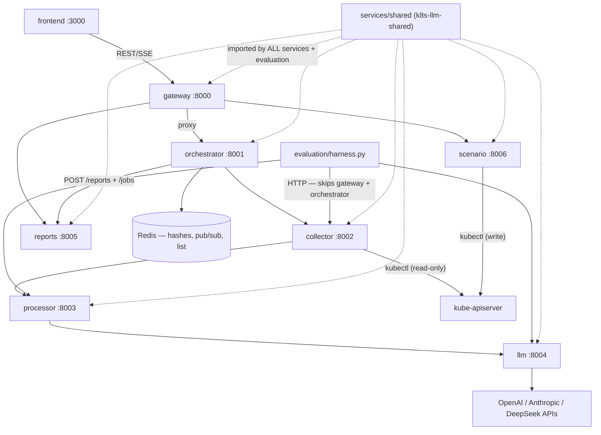

The evaluation harness deliberately bypasses the gateway and orchestrator: it drives collector/processor/llm directly so that evaluation measures the *pipeline*, not job bookkeeping.

---

## 5. Contracts & the Shared Kernel

### Contract-First Philosophy

`contracts/` is the undisputed Single Source of Truth. **No application code may be written until contracts are reviewed and approved.** The philosophy buys four guarantees: zero schema drift (one definition point per shape), independent buildability (a service can be implemented by reading only its contracts), testable boundaries (contract tests validate implementations), and frontend-backend alignment (TS types are generated from `gateway.yaml`).

The five pillars:

| Pillar | Location | Format | Status |
|--------|----------|--------|--------|
| Database | `contracts/database/` | SQL DDL + Redis schema doc | Active |
| API | `contracts/api/` | OpenAPI 3.1 YAML (7 files) | Active |
| Events | `contracts/events/` | AsyncAPI | **Deferred to v2** (rationale + plan written) |
| RPC | `contracts/rpc/` | Protobuf (proto3) | **Deferred to v2** (rationale + plan written) |
| Infrastructure | `contracts/infra/` | Compose + K8s YAML + env contract | Active |

### Alignment Rules (non-negotiable)

- **4.1 Naming** — snake_case everywhere: DB columns, OpenAPI JSON, SSE payloads, Redis hash fields, env var *values*. The single sanctioned exception is ALL_CAPS env var *names* (POSIX convention). The frontend may map to camelCase at its fetch boundary; the contract stays snake_case.
- **4.2 Type parity** — SQLite `TEXT` (UUIDv7) ↔ OpenAPI `string, format: uuid` ↔ TS `string`; `TEXT` (enum) ↔ `string, enum` ↔ TS union; `TEXT` (JSON) ↔ `object`; `REAL` ↔ `number` (confidence 0.0–1.0); `INTEGER` ↔ `integer, int32` (latency_ms); `TEXT` (timestamp) ↔ `string, format: date-time`.
- **4.3 Enum parity** — exactly 8 `failure_category`, 4 `severity`, 7 `job_status` values (below). Adding/removing a value requires a **major version bump** and coordinated PRs across all downstream services.
- **4.4 IDs** — UUIDv7 strings (time-sortable), generated via `uuid_utils.uuid7()`, stored TEXT, never auto-increment integers.
- **4.5 Timestamps** — ISO 8601 strings (`2026-07-21T10:05:33Z`), stored TEXT via `datetime('now')`, never Unix epochs.
- **4.6 Errors** — RFC 7807 Problem Details on all 4xx/5xx: `type` (`https://errors.k8s-llm.io/<slug>`), `title`, `status`, `detail`, optional `instance`.
- **4.7 Pagination** — envelope `{items, count, limit, offset}`; `?limit=20&offset=0`; default 20, max 100.
- **4.8 Health** — every service exposes `GET /health` → `{status: "ok", service: "<name>-svc", version}`; llm-svc adds `provider`/`model`, collector/scenario/gateway may add `cluster`.

Versioning is semver in `contracts/VERSION` (currently `1.0.0`): breaking → major, additive → minor, clarification → patch. Breaking changes require the version bump, downstream PRs, and coordinated deployment.

### The Five Enums (exact values, exact parity)

| Enum | Values | Appears in |
|------|--------|-----------|
| `FailureCategory` (8) | `crash`, `config`, `dependency`, `network`, `image`, `resource`, `probe`, `unknown` | SQL CHECK, OpenAPI, Pydantic, TS union |
| `Severity` (4) | `low`, `medium`, `high`, `critical` | SQL CHECK, OpenAPI, Pydantic, TS union |
| `JobStatus` (7) | `queued`, `collecting`, `processing`, `llm_call`, `persisting`, `done`, `failed` | SQL CHECK, Redis hash, OpenAPI, SSE, Pydantic, TS union |
| `EvidenceSource` (4) | `pod_log`, `previous_pod_log`, `kubernetes_event`, `pod_status` | OpenAPI, Pydantic, TS union |
| `ProviderId` (4) | `mock`, `openai`, `anthropic`, `deepseek` | OpenAPI (llm.yaml), Pydantic |

Parity is *tested*, not trusted: `services/shared/tests/test_shared_models.py::TestSchemaSqlParity` asserts every enum literal appears quoted inside `contracts/database/schema.sql`.

### `services/shared` — the Contract as a Python Package

Every service installs `k8s-llm-shared` (`pip install /shared` in Dockerfiles; `pip install -e ./services/shared` locally). It exports 28 public symbols:

- **Enums** (above) as `typing.Literal` aliases.
- **Domain models** — `EvidenceItem`, `IncidentReport`, `ReportSummary`.
- **Pipeline-internal models** (never in the public API) — `RawEvidence`, `EvidencePackage`.
- **Job models** — `AnalysisRequest`, `JobCreated`, `JobState`.
- **SSE payloads** — `SseStageEvent`, `SseDoneEvent`, `SseFailedEvent`.
- **Scenario models** — `ScenarioSummary`, `ScenarioApplyResponse`.
- **Stats models** — `LatencyPoint`, `StatsResponse`.
- **Reports-internal** — `SaveReportRequest`, `SaveReportResponse`, `SaveJobRequest`.
- **LLM** — `ProviderInfo`. **Health** — `HealthResponse`.
- **Errors** — `ProblemDetail` (+ `ProblemDetail.of(...)` building `https://errors.k8s-llm.io/<slug>` URLs).
- **Helpers** — `new_id()` (UUIDv7), `utc_now_iso()` (ISO 8601 `Z`), `add_error_handlers(app)` (RFC 7807 handlers), `health_payload(...)`.

The canonical output contract, `IncidentReport`:

| Field | Type | Constraint |
|-------|------|-----------|
| `incident_id` | str (UUIDv7) | default factory `new_id` |
| `incident_summary` | str | min_length 10 |
| `likely_root_cause` | str | min_length 10 |
| `affected_component` | str | — |
| `failure_category` | FailureCategory | 8-value enum |
| `severity` | Severity | 4-value enum |
| `confidence` | float | 0.0–1.0 |
| `supporting_evidence` | list[EvidenceItem] | **min_length 1** |
| `suggested_fix` | str | — |
| `recommended_commands` | list[str] | kubectl commands |
| `human_verification_steps` | list[str] | — |
| `created_at` | str (ISO 8601) | default factory `utc_now_iso` |

`model_config = {"extra": "ignore"}` — LLMs may add fields; they are dropped, never fatal.

### Class Diagram

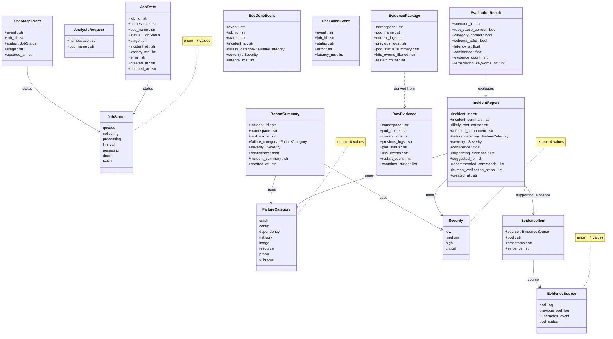

### `EvidenceItem` Source Taxonomy

| Source | When it's emitted | Example |
|--------|-------------------|---------|
| `pod_log` | Current container logs | `RuntimeError: Missing required configuration: DATABASE_URL` |
| `previous_pod_log` | Logs from before the last restart | `Traceback (most recent call last): File "app/main.py", line 42` |
| `kubernetes_event` | `kubectl get events` output | `Warning: BackOff started container demo-app` |
| `pod_status` | `kubectl describe pod` section | `Last State: Terminated, Reason: OOMKilled, Exit Code: 137` |

### JSON Schema Export

The full JSON Schema for `IncidentReport` is generated from Pydantic via `IncidentReport.model_json_schema()` and served at `docs/report_schema.json`. It is injected into each LLM prompt (see [Section 14](#14-prompt-engineering-llm-svc)) and used by `ReportValidator` to validate LLM output against the contract.

---

## 6. Build & Tooling

### `pyproject.toml` (repo root)

```toml
[project]            name = "k8s-llm-incident-analyser", version = "0.1.0", requires-python = ">=3.12"
[tool.pytest.ini_options]  testpaths = ["tests"], pythonpath = ["."], asyncio_mode = "auto"
[tool.ruff]          line-length = 100, target-version = "py312"
[tool.ruff.lint]     select = ["E", "F", "I", "N", "W"], ignore = ["E501"]
```

Root `requirements.txt` pins only `httpx==0.28.*` and `pydantic==2.10.*` (the evaluation harness's needs); `requirements-dev.txt` adds `pytest==8.*`, `pytest-asyncio==0.24.*`, `pytest-cov==6.*`, `ruff==0.8.*`, `fakeredis>=2.26`, `PyYAML==6.*`. Each service carries its own `requirements.txt`.

### Make Targets

| Target | Recipe |
|--------|--------|
| `make install` | `pip install -e ./services/shared` + runtime requirements |
| `make dev` | shared package + runtime + dev requirements |
| `make test` | `test-services` + `test-root` (all 9 suites) |
| `make test-services` | Loops `shared collector processor llm reports orchestrator gateway scenario`, running each service's pytest |
| `make test-root` | `pytest tests -v` (root unit + integration) |
| `make test-cov` | Coverage: `--cov=evaluation` at root, `--cov=app` per service |
| `make lint` / `make format` | `ruff check . --extend-ignore E501` / `ruff check --fix . && ruff format .` |
| `make up` / `make up-dev` / `make down` / `make logs` / `make build` | Compose lifecycle (dev = base + dev override, hot reload) |
| `make e2e` | `scripts/e2e_smoke.sh` against the live stack |
| `make eval ARGS="--classifier llm"` | `python -m evaluation.harness` |
| `make run-scenario SCENARIO=05-oom` | `scripts/run_scenario.sh` |
| `make frontend-install` / `frontend-build` / `frontend-types` | npm install / build / `openapi-typescript` generation |
| `make clean` | Removes caches, `data/`, `__pycache__` |

### Environment Variables

The authoritative, per-service list is [`contracts/infra/.env.example`](../contracts/infra/.env.example); compose `environment:` keys must match it exactly. The most important:

| Variable | Default | Service | Purpose |
|----------|---------|---------|---------|
| `LLM_PROVIDER` | `mock` | llm | `mock` \| `openai` \| `anthropic` \| `deepseek` |
| `OPENAI_API_KEY` / `ANTHROPIC_API_KEY` / `DEEPSEEK_API_KEY` | — | llm | Required only for the selected provider |
| `LLM_MODEL` | per-provider | llm | Override; defaults `gpt-4o-mini` / `claude-haiku-4-5-20251001` / `deepseek-chat` |
| `LLM_MAX_TOKENS` | `2000` | llm | Completion cap |
| `ORCHESTRATOR_URL` / `REPORTS_URL` / `SCENARIO_URL` / `LLM_URL` / `COLLECTOR_URL` | service DNS (:8001/:8005/:8006/:8004/:8002) | gateway | Upstream bases |
| `RATE_LIMIT_PER_MINUTE` | `60` | gateway | Per-IP sliding-window limit |
| `REDIS_URL` | `redis://redis:6379/0` | orchestrator | Job store |
| `COLLECTOR_URL` / `PROCESSOR_URL` / `LLM_URL` / `REPORTS_URL` | service DNS | orchestrator | Pipeline stage bases |
| `PIPELINE_TIMEOUT` | `120` (s) | orchestrator | Whole-job `asyncio.wait_for` cap |
| `KUBECTL_TIMEOUT` | `30` (s) | collector, scenario | Per-kubectl-call timeout |
| `MAX_LOG_LINES` / `CONTEXT_WINDOW` | `100` / `3` | processor | Filter caps |
| `DATABASE_PATH` / `SCHEMA_PATH` | `/data/reports.db` / `/app/schema.sql` (Docker) | reports | SQLite location + DDL source |
| `K8S_NAMESPACE` / `SCENARIOS_DIR` / `BASE_DIR` / `GROUND_TRUTH_DIR` | `demo`, `/k8s/scenarios`, `/k8s/base`, `/evaluation/ground_truth` | scenario | Fault injection config |
| `NEXT_PUBLIC_API_URL` | `http://localhost:8000` | frontend | Browser-visible gateway URL (**inlined at build time**) |
| `INTERNAL_API_URL` | `http://gateway:8000` | frontend | SSR-side gateway URL |
| `SERVICE_VERSION` / `LOG_LEVEL` | `0.1.0` / `INFO` | all | `/health` version; log verbosity |

> **Quirk:** compose sets `KUBECTL_LOG_TAIL=500` for collector-svc, but the code never reads it — the tail is a hardcoded method default (`tail=500`). Listed in [Section 27](#27-limitations--future-roadmap).

### Service Dockerfiles

All seven Python services share one pattern (build context **must be the repo root**):

```dockerfile
FROM python:3.12-slim
WORKDIR /app
COPY services/shared /shared && pip install --no-cache-dir /shared   # the contract, baked in
COPY services/<svc>/requirements.txt . && pip install --no-cache-dir -r requirements.txt
COPY services/<svc>/app ./app
ENV PYTHONUNBUFFERED=1
EXPOSE <port>
CMD ["uvicorn", "app.main:app", "--host", "0.0.0.0", "--port", "<port>"]
```

Service-specific extras:

- **collector + scenario** — install kubectl `v1.31.0` (linux/amd64 from `dl.k8s.io`, curl purged afterwards).
- **reports** — also `COPY contracts/database/schema.sql /app/schema.sql`, `SCHEMA_PATH=/app/schema.sql`, `DATABASE_PATH=/data/reports.db`.
- **scenario** — also bakes `k8s/scenarios → /k8s/scenarios`, `k8s/base → /k8s/base`, `evaluation/ground_truth → /evaluation/ground_truth` so it works in-cluster with no host mounts.
- **frontend** — 4-stage `node:22-alpine`: `dev` (compose dev target) → `deps` (`npm ci`) → `builder` (`ARG NEXT_PUBLIC_API_URL`, `npm run build`, standalone output) → `runner` (non-root `nextjs` user, `ENV INTERNAL_API_URL`, `CMD ["node", "server.js"]`).
- **demo-app** — plain `python:3.12-slim` uvicorn image.

### Docker Compose Stack

`docker-compose.yml` (mirrors `contracts/infra/docker-compose.yml`) defines 11 containers on one bridge network (`analyser-net`):

| Container | Image | Ports | Notable wiring |
|-----------|-------|-------|----------------|
| frontend | `k8s-llm-frontend:latest` (built) | 3000:3000 | depends_on gateway (healthy) |
| gateway | `k8s-llm-gateway-svc:latest` | 8000:8000 | upstream URLs + rate limit env |
| orchestrator | `k8s-llm-orchestrator-svc:latest` | 8001:8001 | depends_on redis/collector/processor/llm/reports (all healthy) |
| collector | `k8s-llm-collector-svc:latest` | 8002:8002 | mounts `~/.kube/config` + `~/.minikube` (ro) |
| processor | `k8s-llm-processor-svc:latest` | 8003:8003 | — |
| llm | `k8s-llm-llm-svc:latest` | 8004:8004 | provider + keys from `.env` interpolation |
| reports | `k8s-llm-reports-svc:latest` | 8005:8005 | bind mount `./data:/data` (SQLite persistence) |
| scenario | `k8s-llm-scenario-svc:latest` | 8006:8006 | kubeconfig + `./k8s:/k8s:ro` + `./evaluation:/evaluation:ro` |
| redis | `redis:7-alpine` | 6379:6379 | `--appendonly yes --maxmemory-policy allkeys-lru`, volume `analyser-redis-data` |
| demo-app | `k8s-demo-app:latest` | 8080:8000 | target workload, **not platform** |
| db | `postgres:16-alpine` | — | demo-app's database, **not platform** |

Every Python service has a uniform urllib-based `/health` healthcheck (interval 30s, timeout 5s, retries 3). `docker-compose.dev.yml` overlays read-only source bind mounts + `uvicorn --reload` + `LOG_LEVEL=DEBUG` for every Python service, and the frontend `dev` stage with HMR (`./frontend:/app` plus anonymous `/app/node_modules`, `/app/.next`).

---

## 7. Service Conventions & Bootstrap

Every service is a FastAPI application created in `app/main.py` with the same wiring, which the shared kernel makes uniform:

1. **`add_error_handlers(app)`** — three exception handlers:
   - `HTTPException` → `ProblemDetail` with a default title map (`400 Bad request`, `404 Not found`, `409 Conflict`, `429 Rate limit exceeded`, `500 Internal server error`, `502 Upstream service error`, `503 Service unavailable`),
   - `RequestValidationError` → 400 "Invalid request" with `"<loc>: <msg>"` detail,
   - catch-all `Exception` → 500 `https://errors.k8s-llm.io/internal`.
   Responses use media type `application/problem+json`.
2. **`GET /health`** — `health_payload("<name>-svc", ...)`, version from `SERVICE_VERSION` (default `0.1.0`); services with something extra to report add it (`llm` → provider+model; `collector`/`scenario` → `cluster: connected|unreachable`; gateway aggregates both).
3. **Lifespan-managed clients** — services that make outbound calls construct them in the FastAPI lifespan and hang them on `app.state` (`gateway`: `httpx.AsyncClient`; `orchestrator`: `redis.asyncio` client + `httpx.AsyncClient`). Stateless services (`collector`, `processor`, `llm`, `reports`) construct module-level singletons instead — the collector's `KubernetesCollector`, the processor's `LogPreprocessor`/`LogRedactor`, reports' `ReportsDB` (schema applied at startup), scenario's `lru_cache`d `ScenarioManager`.
4. **Structured logging** via structlog; level from `LOG_LEVEL`.
5. **uvicorn entrypoint** `app.main:app` on the contractual port (gateway 8000 … scenario 8006; ports are part of the contract and must match OpenAPI `servers:` URLs).

Bootstrap order matters only in Compose, where `depends_on: service_healthy` chains encode it: redis/db first → pipeline services → orchestrator → gateway → frontend.

---

## 8. Public API Surface (gateway-svc)

The gateway owns no domain logic — it reverse-proxies, byte-for-byte, to internal services. Bodies, query strings, status codes, and `application/problem+json` errors pass through unchanged; upstream timeouts/transport errors are translated to 502 "Upstream service error".

### Endpoint Reference

| Method | Path | Proxied to | Purpose |
|--------|------|-----------|---------|
| GET | `/health` | (aggregated) | Gateway health + `provider` (from llm-svc) + `cluster` (from collector-svc) |
| POST | `/api/jobs` | orchestrator `POST /jobs` | Create analysis job → **202** `JobCreated` |
| GET | `/api/jobs` | orchestrator `GET /jobs` | List jobs (`status`, `limit` 1–100/20, `offset`) |
| GET | `/api/jobs/{job_id}` | orchestrator `GET /jobs/{id}` | Single `JobState` (404 "Job not found") |
| GET | `/api/jobs/{job_id}/stream` | orchestrator `GET /jobs/{id}/stream` | **SSE event stream** (below) |
| GET | `/api/reports` | reports `GET /reports` | List `ReportSummary` (`namespace`, `pod_name`, `category`, `severity`, paging) |
| GET | `/api/reports/{incident_id}` | reports `GET /reports/{id}` | Full `IncidentReport` (404 "Report not found") |
| GET | `/api/stats` | reports `GET /stats` | Dashboard stats (`range` = `24h`/`7d`/`30d`, default `7d`) |
| GET | `/api/scenarios` | scenario `GET /scenarios` | Catalogue of 10 fault scenarios |
| POST | `/api/scenarios/{scenario_id}/apply` | scenario `POST …/apply` | Inject a fault (404 unknown / **409 one already active** / 503 cluster unreachable) |
| POST | `/api/scenarios/reset` | scenario `POST /scenarios/reset` | Restore the healthy baseline |

Cross-cutting middleware:

- **CORS** — `allow_origins=["*"], allow_methods=["*"], allow_headers=["*"]` (v1 is open; see limitations).
- **Rate limiting** — `RateLimitMiddleware`: per-IP deque over a 60-second sliding window (`time.monotonic()`), default 60 req/min (`RATE_LIMIT_PER_MINUTE`); `/health` and `OPTIONS` exempt; over-limit → 429 ProblemDetail "Rate limit exceeded".

### `POST /api/jobs` — start an analysis

```bash
curl -X POST http://localhost:8000/api/jobs \
  -H 'Content-Type: application/json' \
  -d '{"namespace": "demo", "pod_name": "demo-app"}'
# 202 Accepted
{"job_id": "01938a7b-…", "status": "queued"}
```

`namespace` defaults to `"demo"`. `pod_name` may be an exact pod name or a workload name — collector-svc falls back to the label selector `app={pod_name}`. The pipeline runs in the background; progress arrives over SSE.

### `GET /api/jobs/{job_id}/stream` — Server-Sent Events

Content type `text/event-stream`, with anti-buffering headers (`Cache-Control: no-cache`, `X-Accel-Buffering: no`, `Connection: keep-alive`). Three named events:

```
event: stage
data: {"event":"stage","job_id":"01938a7b-…","status":"collecting","stage":"Collecting evidence for demo/demo-app","updated_at":"2026-07-22T04:10:05Z"}

event: done
data: {"event":"done","job_id":"01938a7b-…","status":"done","incident_id":"01938a7c-…","failure_category":"config","severity":"critical","latency_ms":6312}

event: failed
data: {"event":"failed","job_id":"01938a7b-…","status":"failed","error":"llm-svc timed out after 60s","latency_ms":60120}
```

Late subscribers get the current state replayed first (see [Section 10](#10-orchestrator-job-state-machine--pipeline)). The stream closes after the terminal event.

### OpenAPI Schema

The machine-readable spec is [`contracts/api/gateway.yaml`](../contracts/api/gateway.yaml) (OpenAPI 3.1) — also the **schema hub** holding every shared component schema; the other six specs cross-reference it via relative `$ref`. The frontend's TypeScript types are generated from it ([Section 18](#18-frontend-nextjs-dashboard)).

---

## 9. Internal APIs

These services are reachable only inside the platform network. Full specs: `contracts/api/*.yaml`.

### orchestrator-svc (:8001)

| Method | Path | Request → Response | Notes |
|--------|------|--------------------|-------|
| GET | `/health` | → health | |
| POST | `/jobs` | `AnalysisRequest` → 202 `JobCreated` | Creates Redis state, archives snapshot (best-effort), launches background pipeline task |
| GET | `/jobs` | `status?, limit, offset` → `{items: JobState[], count, limit, offset}` | Backed by Redis SCAN (see §10) |
| GET | `/jobs/{job_id}` | → `JobState` / 404 | Redis hash read |
| GET | `/jobs/{job_id}/stream` | → SSE | Replay + Redis pub/sub fanout |

### collector-svc (:8002)

| Method | Path | Request → Response | Notes |
|--------|------|--------------------|-------|
| GET | `/health` | → health + `cluster` | Runs `kubectl version --client=false` (timeout 5) |
| POST | `/collect` | `AnalysisRequest` → `RawEvidence` | 500 if kubectl binary missing or collection raises |

### processor-svc (:8003)

| Method | Path | Request → Response | Notes |
|--------|------|--------------------|-------|
| GET | `/health` | → health | |
| POST | `/process` | `RawEvidence` → `EvidencePackage` | Filter then redact; 500 "Processing failed: …" on exception |

### llm-svc (:8004)

| Method | Path | Request → Response | Notes |
|--------|------|--------------------|-------|
| GET | `/health` | → health + `provider`, `model` | Provider from `LLM_PROVIDER` env |
| GET | `/providers` | → `{items: ProviderInfo[4]}` | Order `mock, deepseek, openai, anthropic`; `available` = API key configured |
| POST | `/analyse` | `EvidencePackage` → `IncidentReport` | 500 "Analysis failed: …" (API errors, truncation, content filter, validation) |

### reports-svc (:8005)

| Method | Path | Request → Response | Notes |
|--------|------|--------------------|-------|
| GET | `/health` | → health | |
| POST | `/reports` | `SaveReportRequest` → 201 `{incident_id}` | Single locked transaction; also links `analysis_jobs.incident_id` |
| GET | `/reports` | filters → `{items: ReportSummary[], count, …}` | `ORDER BY created_at DESC` |
| GET | `/reports/{incident_id}` | → full report JSON / 404 | Parsed from the `report_json` column |
| POST | `/jobs` | `SaveJobRequest` → 201 `{job_id}` | Upsert (durable job snapshot) |
| GET | `/jobs` | `status?, limit, offset` → `{items: JobState[], …}` | Archived jobs |
| GET | `/stats` | `range` (`24h`/`7d`/`30d`, regex-validated) → `StatsResponse` | 400 on bad range |

### scenario-svc (:8006)

| Method | Path | Response | Notes |
|--------|------|----------|-------|
| GET | `/health` | health + `cluster` | kubectl connectivity check |
| GET | `/scenarios` | `{items: ScenarioSummary[]}` | From filesystem (`k8s/scenarios/*/fault.yaml`) enriched by ground truth |
| POST | `/scenarios/{id}/apply` | `{applied, scenario_id, fault_description}` | 503 pre-check if cluster unreachable; 404 / **409** / 500 taxonomy |
| POST | `/scenarios/reset` | `{reset: true}` | delete → apply base → `rollout status` (120s) |

---

## 10. Orchestrator: Job State Machine & Pipeline

The orchestrator (`app/main.py`, `app/pipeline.py`, `app/store.py`) is the platform's brain.

### The 7-State Machine

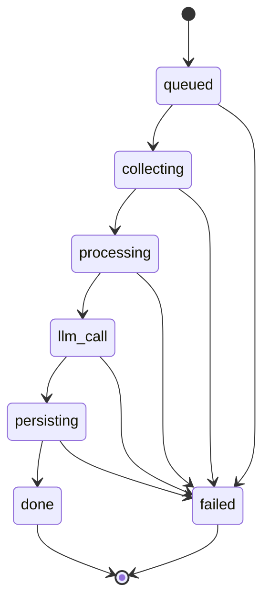

`TERMINAL_STATUSES = ("done", "failed")`. Every transition writes the Redis hash **and** publishes an event — SSE is therefore a pure function of the state machine.

### Job Creation (`POST /jobs`)

1. `job_id = new_id()` (UUIDv7).
2. `store.create(...)`: `HSET job:{job_id}` (status `queued`, namespace, pod_name, timestamps) with **TTL 86400 s (24 h)**; `LPUSH job:queue {job_id}`.
3. Best-effort archival: `POST {reports}/jobs` with `SaveJobRequest(status="queued")` (timeout 10 s; failure is logged, never fatal).
4. `202 {job_id, status: "queued"}` is returned **immediately**; the pipeline runs as `asyncio.create_task(_run_with_timeout())` wrapped in `asyncio.wait_for(..., PIPELINE_TIMEOUT=120)`.

### The Four Pipeline Hops (`Pipeline.run`)

| # | Transition (status, stage label) | Call (timeout) | Result |
|---|----------------------------------|----------------|--------|
| 1 | `collecting`, "Collecting evidence for {ns}/{pod}" | `POST {collector}/collect` (60 s) | `RawEvidence` |
| 2 | `processing`, "Filtering logs and redacting secrets" | `POST {processor}/process` (30 s) | `EvidencePackage` |
| 3 | `llm_call`, dynamic label | `POST {llm}/analyse` (60 s) | `IncidentReport` |
| 4 | `persisting`, "Saving report" | `POST {reports}/reports` (30 s) | `incident_id` |
| 5 | `done` | `store.complete(job_id, incident_id, latency_ms, report)` + archive | terminal |

The stage-3 label is dynamic: `_llm_stage_label()` fetches `GET {llm}/health` (timeout 5) and produces "Calling {provider} {model}" → e.g. *"Calling deepseek deepseek-chat"* — this is the text the dashboard's live timeline shows.

On success, `complete()` embeds the report's `failure_category` and `severity` into the `SseDoneEvent` and archives `SaveJobRequest(status="done", incident_id, latency_ms)`.

### Pipeline Stage Detail

Each of the four pipeline hops encapsulates significant internal work. This flowchart shows what the orchestrator triggers at each stage:

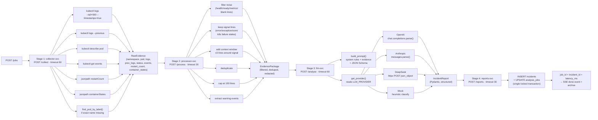

### Why Not One Big Prompt

A naive approach would shovel raw `kubectl logs` output into an LLM and ask for a diagnosis. The multi-stage pipeline exists for four reasons:

1. **Token economics** — Raw logs for a chatty pod can exceed 50,000 tokens. The preprocessor typically reduces this to under 2,000 tokens, a 25× reduction that directly cuts API spend.
2. **Secret hygiene** — Logs routinely contain database URLs with credentials, bearer tokens, and API keys. The redactor masks these *before* the evidence leaves the platform. This is a non-negotiable control for any production deployment.
3. **Determinism before nondeterminism** — Stages 1–2 (collect, process) are deterministic Python. Only Stage 3 is LLM-driven. This means regressions in collection or preprocessing are caught by unit tests, not by LLM non-determinism.
4. **Provider portability** — Stages 1, 2, and 4 are provider-agnostic. Switching from OpenAI to DeepSeek is a one-line env change. The prompt schema and evidence format are identical across all providers.

### Error Handling

- **Any stage exception** → `store.fail(job_id, error[:500], latency_ms)` + publish `SseFailedEvent` + archive `SaveJobRequest(status="failed", …)`. Archival is always best-effort: a reports-svc outage degrades durability, never the job outcome.
- **Downstream error taxonomy** (`_post`): timeout → `"{stage}-svc timed out after {t}s"`; transport → `"{stage}-svc unreachable: {e}"`; non-2xx → `"{stage}-svc returned {status}: {body[:300]}"`.
- **Whole-job timeout** — `asyncio.TimeoutError` → `fail(job_id, "Pipeline exceeded 120s", 0)`.

The pipeline is wrapped in `asyncio.wait_for` with a configurable cap. The orchestrator's `_run_with_timeout` and the pipeline's `_post` helper form the error boundary:

```python
# services/orchestrator/app/main.py — job creation spawns a background task
asyncio.create_task(_run_with_timeout(job_id, namespace, pod_name))

# services/orchestrator/app/pipeline.py — core execution with per-stage wrappers
async def run(self, job_id: str, namespace: str, pod_name: str, ...) -> None:
    store = self._store
    t0 = time.monotonic()
    try:
        # Stage 1 — collect (wrap with transition + err)
        raw = await self._post(self._collector_url, "/collect",
                               {"namespace": namespace, "pod_name": pod_name},
                               stage="collecting", timeout=60)

        # Stage 2 — process
        pkg = await self._post(self._processor_url, "/process",
                               raw.model_dump(), stage="processing", timeout=30)

        # Stage 3 — llm (dynamic label from /health)
        report = await self._post(self._llm_url, "/analyse",
                                   pkg.model_dump(), stage="llm_call", timeout=60)

        # Stage 4 — persist + complete
        resp = await self._post(self._reports_url, "/reports",
                                {"report": report.model_dump(), "namespace": namespace,
                                 "pod_name": pod_name, "job_id": job_id},
                                stage="persisting", timeout=30)
        incident_id = resp["incident_id"]
        latency_ms = int((time.monotonic() - t0) * 1000)
        await store.complete(job_id, incident_id, latency_ms, report)

    except Exception as e:
        latency_ms = int((time.monotonic() - t0) * 1000)
        await store.fail(job_id, str(e)[:500], latency_ms)

# _post wraps per-stage error taxonomy:
#   timeout   → "{stage}-svc timed out after {t}s"
#   transport → "{stage}-svc unreachable: {e}"
#   non-2xx   → "{stage}-svc returned {status}: {body[:300]}"
```

Report archival (best-effort `POST /jobs`) runs alongside the pipeline transitions but its failure is logged, never fatal — a down reports-svc degrades durability, not job outcomes.

### Redis Store (`app/store.py`)

| Key | Type | TTL | Contents |
|-----|------|-----|----------|
| `job:{job_id}` | Hash | 24 h | `job_id`, `namespace`, `pod_name`, `status`, `stage`, `incident_id`, `latency_ms`, `error`, `created_at`, `updated_at` (subset per transition; empty strings ↔ None) |
| `job:queue` | List | none | `LPUSH` on create. **Nothing consumes it in v1** — it exists so v2 worker scaling (BRPOP consumers) needs no contract change |
| `job:{job_id}:events` | Pub/Sub channel | ephemeral | Every transition publishes the JSON dump of `SseStageEvent` / `SseDoneEvent` / `SseFailedEvent` |

`GET /jobs` listing: `SCAN match="job:*"` filtered by regex `^job:[0-9a-fA-F-]{36}$` (excludes `job:queue` and `*:events`), `HGETALL` each, sorted by `created_at` desc, optional `status` filter, then `[offset:offset+limit]` with total count.

### SSE Streaming (`GET /jobs/{job_id}/stream`)

- Job already terminal → exactly one `done`/`failed` event, then close. (The replayed terminal event carries `incident_id`/`error` + `latency_ms`, but omits the `failure_category`/`severity` that the live `SseDoneEvent` has — the frontend treats them as optional.)
- Otherwise → a replay `stage` event from the current hash (`stage` may be `""` for a queued job), then `SUBSCRIBE job:{job_id}:events`; messages are polled with `pubsub.get_message(timeout=1.0)` interleaved with `request.is_disconnected()` checks; each payload is forwarded as `event: <type>\ndata: <json>\n\n` until a terminal event, then the stream closes.

Redis gives multi-client fanout for free: N SSE clients = N subscriptions to the same channel; the orchestrator publishes once.

---

## 11. Evidence Collection (collector-svc)

`app/collector.py` — `KubernetesCollector(kubectl_path="kubectl", timeout=30)`. Stateless; no database, no Redis.

### kubectl Commands Executed

| # | Purpose | Command |
|---|---------|---------|
| 1 | Connectivity | `kubectl version --client=false` (timeout 5) |
| 2 | Current logs | `kubectl logs -n {ns} {pod} --tail=500 --timestamps=true` |
| 3 | Previous logs | `kubectl logs -n {ns} {pod} --tail=500 --timestamps=true --previous` |
| 4 | Pod description | `kubectl describe pod -n {ns} {pod}` |
| 5 | Events | `kubectl get events -n {ns} --sort-by=.metadata.creationTimestamp` |
| 6 | Restart count | `kubectl get pod -n {ns} {pod} -o jsonpath={.status.containerStatuses[0].restartCount}` |
| 7 | Container states | `kubectl get pod -n {ns} {pod} -o jsonpath={.status.containerStatuses}` (JSON-parsed) |
| 8 | Pod exists? | `kubectl get pod -n {ns} {pod} -o jsonpath={.metadata.name} --ignore-not-found` |
| 9 | Label fallback | `kubectl get pods -n {ns} -l app={pod_name} -o jsonpath={.items[0].metadata.name}` |

Every call goes through `_run`: `subprocess.run(..., capture_output=True, text=True, timeout=self.timeout, check=False)` → `stdout.strip()`; `TimeoutExpired` → `""`; non-zero exit logs a warning (stderr truncated to 200 chars) and still returns stdout. **Failed probes degrade to empty strings, never exceptions** — the pipeline analyses whatever evidence exists.

### Pod Name Auto-Resolution

A critical real-world feature: users typically know a deployment name (`demo-app`) but not the full pod name (`demo-app-bd594d4bd-87nhj`). The collector handles this transparently:

```python
# services/collector/app/collector.py — collect() with auto-resolution
def collect(self, namespace: str, pod_name: str) -> RawEvidence:
    actual_pod = pod_name
    if not self._pod_exists(namespace, pod_name):
        resolved = self.find_pod_by_label(namespace, f"app={pod_name}")
        if resolved:
            actual_pod = resolved
    return RawEvidence(
        namespace=namespace,
        pod_name=actual_pod,
        current_logs=self._get_logs(namespace, actual_pod, previous=False),
        previous_logs=self._get_logs(namespace, actual_pod, previous=True),
        pod_status=self._get_pod_description(namespace, actual_pod),
        k8s_events=self._get_events(namespace),
        restart_count=self._get_restart_count(namespace, actual_pod),
        container_states=self._get_container_states(namespace, actual_pod),
    )
```

If the exact pod name is not found and label resolution also fails, the collector proceeds with the original name — subsequent kubectl calls return empty strings, which the preprocessor handles gracefully.

### `RawEvidence` Fields (never leaves the platform)

| Field | Source | Type | Typical Size |
|-------|--------|------|-------------|
| `namespace` | request input | `str` | 5–20 chars |
| `pod_name` | request input or resolved | `str` | 20–40 chars |
| `current_logs` | `kubectl logs --tail=500 --timestamps=true` | `str` | 1–10 KB |
| `previous_logs` | `kubectl logs --previous --tail=500 --timestamps=true` | `str` | 0–10 KB (empty if no previous container) |
| `pod_status` | `kubectl describe pod` | `str` | 3–8 KB |
| `k8s_events` | `kubectl get events --sort-by=...` | `str` | 0.5–3 KB |
| `restart_count` | `jsonpath={.status.containerStatuses[0].restartCount}` | `int` | integer |
| `container_states` | `jsonpath={.status.containerStatuses}` | `list[dict]` | parsed JSON |

---

## 12. Preprocessing & Noise Filtering (processor-svc)

`app/preprocessor.py` — `LogPreprocessor(max_log_lines=100, context_window=3)`. Pure CPU, sub-50 ms.

### Noise Patterns (discarded)

4 case-sensitive patterns: `\bGET /health\b`, `\bGET /ready\b`, `\bGET /metrics\b`, `^\s*$` (blank lines).

### Signal Patterns (kept, with context)

| Pattern | Flags | Catches |
|---------|-------|---------|
| `\b(error\|exception\|traceback\|fatal\|critical\|failed\|refused\|timeout)\b` | IGNORECASE | Generic application failures |
| `\b(OOMKilled\|CrashLoopBackOff\|ImagePullBackOff\|BackOff\|Unhealthy)\b` | case-sensitive | Kubernetes failure states |
| `\b(missing\|not found\|permission denied\|address already in use)\b` | IGNORECASE | Config/network failures |

### Filtering Algorithm

`_filter_with_context(text)`:
1. For every line index `i` where the line is **signal and not noise**, mark indices `[i-3, i+3]` (the context window) as kept.
2. Emit kept lines in order, skipping lines whose stripped form is empty **or already seen** (dedup by stripped text).
3. Truncate to the first `max_log_lines` (100) lines.

`_extract_events(text)`: keeps event lines containing the substring `"Warning"` **or** matching any signal pattern.

`process(RawEvidence) -> EvidencePackage`:

| EvidencePackage field | Value |
|-----------------------|-------|
| `current_logs` / `previous_logs` | filtered as above |
| `pod_status_summary` | `pod_status[:2000]` (hard truncation) |
| `k8s_events_filtered` | `_extract_events` output |
| `namespace`, `pod_name`, `restart_count` | passthrough |

`container_states` is dropped here — it informed collection but is not part of the LLM contract.

---

## 13. Secret Redaction (processor-svc)

`app/redactor.py` — `LogRedactor`, applied **in the same `/process` call, after filtering**. Nothing un-redacted ever reaches llm-svc or a vendor.

### Redaction Patterns (7, applied in order to all four text fields)

| # | Matches | Replacement |
|---|---------|-------------|
| 1 | `password`/`passwd`/`pwd` `=` or `:` value | `[PASSWORD=REDACTED]` |
| 2 | `api_key`/`apikey`/`token`/`secret` + 8+ char value | `[API_KEY=REDACTED]` |
| 3 | `sk-ant-…` (20+ chars) | `[ANTHROPIC_KEY=REDACTED]` |
| 4 | `sk-…` (20+ chars) | `[OPENAI_KEY=REDACTED]` |
| 5 | `postgres://` `mysql://` `mongodb://` `redis://` URLs | `[DB_URL=REDACTED]` |
| 6 | `Authorization:`/`Bearer` + 20+ char token | `[AUTH_HEADER=REDACTED]` |
| 7 | Email addresses | `[EMAIL=REDACTED]` |

Pattern ordering matters: the Anthropic pattern (3) runs before the generic OpenAI `sk-` pattern (4) so `sk-ant-…` keys get the more specific tag. Substitution is done via `model_copy(update=...)` on the `EvidencePackage` — the package stays a validated Pydantic object end to end.

### What is NOT Redacted

Pod names, namespaces, container names, file paths, exit codes, IP addresses, and non-secret error text — all required for diagnosis. Redaction targets *credentials*, not *context*; over-redaction would destroy the signal the LLM needs.

---

## 14. Prompt Engineering (llm-svc)

`app/prompts.py` — `build_prompt(package) -> (system, user)`.

### System Prompt Rules

The system prompt ("You are a Kubernetes incident analyst…") carries five hard rules:

1. Use **only** the provided evidence — no outside assumptions.
2. **Never invent log lines** or events not present in the evidence.
3. Lower `confidence` when evidence is ambiguous.
4. **Never recommend automated remediation** — only human-verifiable steps.
5. Respond **only** with valid JSON matching the provided schema.

### User Prompt Template

```
=== KUBERNETES DIAGNOSTIC EVIDENCE ===
Namespace: {namespace}
Target: {pod_name}
Collection Time: {current UTC ISO}

--- POD STATUS ---
{pod_status_summary | "(no pod status available)"}

--- APPLICATION LOGS (current) ---
{current_logs | "(no current logs)"}

--- APPLICATION LOGS (previous container, if available) ---
{previous_logs | "(no previous logs)"}

--- KUBERNETES EVENTS ---
{k8s_events_filtered | "(no kubernetes events)"}

--- RESTART COUNT ---
{restart_count}

=== REQUIRED OUTPUT SCHEMA ===
{json.dumps(IncidentReport.model_json_schema(), indent=2)}
```

### Schema Injection

The full Pydantic JSON schema is embedded in the prompt — the LLM sees the exact contract, including enum values and the `supporting_evidence` min-items constraint. For OpenAI/Anthropic this is belt-and-braces on top of native structured-output APIs; for DeepSeek (JSON-object mode) it is the *only* enforcement mechanism, augmented with a hardcoded example object ([Section 15](#15-llm-provider-layer-llm-svc)).

---

## 15. LLM Provider Layer (llm-svc)

### Provider Architecture

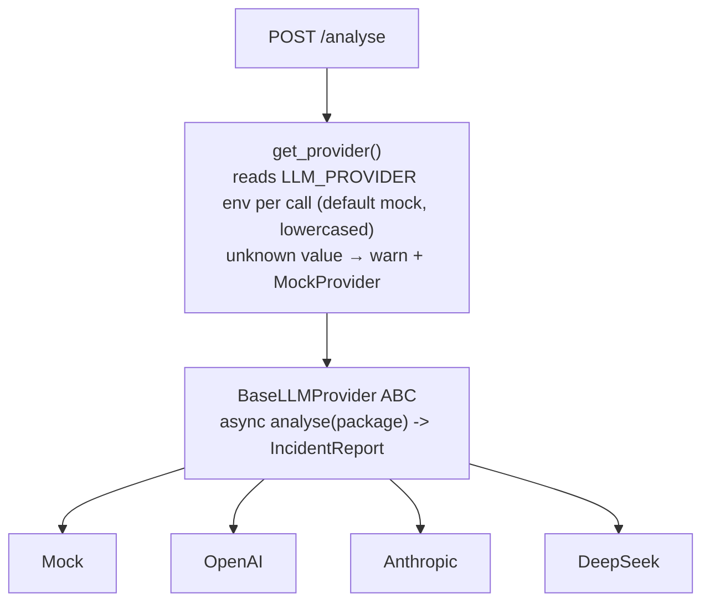

### Provider Implementation Details

#### MockProvider (`app/llm/mock_provider.py`)

Deterministic heuristic classifier — no external calls, < 50 ms, the default for local dev and CI. First match wins on lowercased evidence:

| Order | Condition | Category | Root cause |
|-------|-----------|----------|-----------|
| 1 | `database_url` in logs | config | Missing DATABASE_URL environment variable |
| 2 | `connection refused` anywhere | dependency | Dependent service is unreachable |
| 3 | `oomkilled`, or `memory` in logs + `killed` | resource | Container exceeded memory limit (OOMKilled) |
| 4 | `imagepullbackoff`, or `image`+`pull` in status | image | Kubernetes cannot pull the container image |
| 5 | `readiness probe failed` | probe | Readiness probe is failing |
| 6 | `liveness probe failed` | probe | Liveness probe is failing |
| 7 | `containercannotrun`, or crashloop + `executable file not found` | crash | Container cannot start (executable not found) |
| 8 | `runtimeerror` + (`startup` or crashloop status) | crash | Application raised a runtime error on startup |
| 9 | `crashloopbackoff` | crash | Container is in CrashLoopBackOff |
| 10 | else | unknown | Unable to determine root cause from evidence |

Always `severity="medium"`, `confidence=0.5`, summary prefixed `[MOCK]`, one `EvidenceItem` (first 200 chars of current logs), `kubectl describe pod` as the recommended command.

#### OpenAIProvider (`app/llm/openai_provider.py`)

`AsyncOpenAI(api_key=$OPENAI_API_KEY)`; model `LLM_MODEL` or `gpt-4o-mini`. Calls **`chat.completions.parse()`** with `response_format=IncidentReport` (native structured outputs — Pydantic is the wire format). Error mapping: `LengthFinishReasonError` → "Output truncated (increase LLM_MAX_TOKENS)"; `ContentFilterFinishReasonError` → "Content filtered by safety system"; `message.parsed is None` → `ValueError` with the refusal payload.

#### AnthropicProvider (`app/llm/anthropic_provider.py`)

`anthropic.AsyncAnthropic(api_key=$ANTHROPIC_API_KEY)`; default model `claude-haiku-4-5-20251001`. Calls **`messages.parse()`** with `output_format=IncidentReport`; reads `response.content[0].parsed_output` (None → `ValueError`).

#### DeepSeekProvider (`app/llm/deepseek_provider.py`)

No SDK — raw httpx POST to `https://api.deepseek.com/v1/chat/completions` (Bearer auth, timeout 60) with `response_format: {"type": "json_object"}`. The system prompt is augmented with `_JSON_INSTRUCTION_TEMPLATE`: the full schema JSON **plus a hardcoded valid example object**. Response `choices[0].message.content` is `json.loads`ed (`JSONDecodeError` → "non-JSON/truncated output") then `IncidentReport.model_validate`d.

### Provider Comparison Matrix

| | Mock | OpenAI | Anthropic | DeepSeek |
|---|---|---|---|---|
| Env key | — | `OPENAI_API_KEY` | `ANTHROPIC_API_KEY` | `DEEPSEEK_API_KEY` |
| Default model | (none) | `gpt-4o-mini` | `claude-haiku-4-5-20251001` | `deepseek-chat` |
| Mechanism | heuristic rules | `chat.completions.parse` | `messages.parse` | JSON mode + schema-in-prompt |
| Latency | < 50 ms | 2–8 s | 2–8 s | ~6 s (measured) |
| Cost | free | paid | paid | cheapest paid |
| Offline / CI-safe | ✓ | ✗ | ✗ | ✗ |
| Schema guarantee | code-constructed | API-enforced | API-enforced | prompt-enforced + Pydantic validation |

---

## 16. Persistence & Stats (reports-svc)

### `ReportValidator` (llm-svc, `app/validator.py`)

`validate_dict` → `IncidentReport.model_validate`; `validate_string` → `json.loads` + object check; `is_valid` bool wrapper; `get_schema[_json]`. In practice the providers validate implicitly (structured-output parse or explicit `model_validate`), so this class is the safety net and test surface.

### `ReportsDB` (`app/db.py`) — thread-safe SQLite layer

- **Startup**: mkdir parent → `sqlite3.connect(path, check_same_thread=False)` → `row_factory = sqlite3.Row` → a `threading.Lock` → `_init_schema()` executescript of `schema.sql` (idempotent `CREATE … IF NOT EXISTS`; no migration framework). Schema path: `SCHEMA_PATH` env (Docker: `/app/schema.sql`), else repo-relative `contracts/database/schema.sql`.
- **`save_report(report, ns, pod, job_id)`** — one locked transaction: `INSERT INTO incidents` (denormalised columns + `report_json = report.model_dump_json()`) then `UPDATE analysis_jobs SET incident_id = ? WHERE job_id = ?`.
- **`upsert_job(job)`** — `INSERT … ON CONFLICT(job_id) DO UPDATE SET status=excluded.status, stage=excluded.stage, incident_id=COALESCE(excluded.incident_id, analysis_jobs.incident_id), latency_ms=COALESCE(…), error=excluded.error`. The COALESCEs matter: a late "queued" snapshot must never erase a stored `incident_id`.
- **`list_reports`** — dynamic AND-ed WHERE from the four filters + COUNT + paged SELECT → `ReportSummary` rows.
- **`get_report(id)`** — `SELECT report_json` → `json.loads` (the nested arrays live only in the JSON column, deliberately not normalised).
- **`get_stats(range)`** — `_RANGE_MODIFIERS = {"24h": "-1 day", "7d": "-7 days", "30d": "-30 days"}`:
  - `total_reports` — all-time incident count;
  - `reports_24h` — `created_at >= datetime('now','-1 day')`;
  - `mean_latency_ms` — over `analysis_jobs` `status='done' AND latency_ms IS NOT NULL` in range, rounded to 2;
  - `mean_confidence` — over incidents in range, rounded to 4;
  - `category_counts` — grouped over **all** incidents;
  - `latency_series` — last 50 done jobs with latency, reversed to chronological `LatencyPoint`s.
- **`_to_iso8601`** — converts SQLite `"YYYY-MM-DD HH:MM:SS"` to `"…T…Z"`.

### Why SQLite (not PostgreSQL)

At dissertation scale (~10 analyses/day) PostgreSQL is pure operational cost. SQLite in WAL mode gives crash safety, concurrent reads with the single writer, and a backup story of "copy one file". The contract (`schema.sql` + ownership rule "only reports-svc writes") keeps a future swap to PostgreSQL confined to one service.

---

## 17. State Stores: Redis & SQLite

### Redis (owned by orchestrator-svc)

Covered structurally in [Section 10](#10-orchestrator-job-state-machine--pipeline); the contract is [`contracts/database/redis_schema.md`](../contracts/database/redis_schema.md):

| Key pattern | Type | TTL | Writer | Readers |
|-------------|------|-----|--------|---------|
| `job:{job_id}` | Hash | 24 h | orchestrator | orchestrator (API + SSE replay) |
| `job:queue` | List | — | orchestrator (LPUSH) | v2 workers (BRPOP) — unused in v1 |
| `job:{job_id}:events` | Pub/Sub | ephemeral | orchestrator (PUBLISH) | orchestrator SSE handler (SUBSCRIBE) per client |

Server config (compose + `k8s/services/redis.yaml`): `appendonly yes` (AOF — jobs survive restarts), `maxmemory-policy allkeys-lru`, keyspace notifications disabled (events are published explicitly).

**Division of labour**: Redis is the *primary* job-state store (sub-ms reads for polling, pub/sub for SSE); SQLite is the *durable snapshot* (queryable history feeding `/api/stats`). The 24 h hash TTL exists so recently-finished jobs stay pollable from Redis without hammering SQLite; history lives forever in `analysis_jobs`.

### SQLite (owned by reports-svc, WAL mode)

PRAGMAs: `journal_mode = WAL`, `foreign_keys = ON`, `encoding = "UTF-8"`.

**`incidents`** — one row per completed `IncidentReport`:

| Column | Type | Constraints |
|--------|------|-------------|
| `incident_id` | TEXT | PRIMARY KEY (UUIDv7) |
| `namespace`, `pod_name` | TEXT | NOT NULL |
| `failure_category` | TEXT | NOT NULL, `CHECK IN ('crash','config','dependency','network','image','resource','probe','unknown')` |
| `severity` | TEXT | NOT NULL, `CHECK IN ('low','medium','high','critical')` |
| `confidence` | REAL | NOT NULL, `CHECK (0.0 <= confidence <= 1.0)` |
| `incident_summary`, `likely_root_cause`, `affected_component`, `suggested_fix` | TEXT | NOT NULL (denormalised for filtering/display) |
| `report_json` | TEXT | NOT NULL — full nested report (evidence, commands, steps) |
| `created_at`, `updated_at` | TEXT | NOT NULL `DEFAULT (datetime('now'))` |

Indexes: `idx_incidents_ns_pod (namespace, pod_name)`, `idx_incidents_category (failure_category)`, `idx_incidents_created (created_at DESC)`.

**`analysis_jobs`** — durable snapshot of the Redis job state:

| Column | Type | Constraints |
|--------|------|-------------|
| `job_id` | TEXT | PRIMARY KEY (UUIDv7) |
| `namespace`, `pod_name` | TEXT | NOT NULL |
| `status` | TEXT | NOT NULL, `CHECK IN ('queued','collecting','processing','llm_call','persisting','done','failed')` |
| `stage` | TEXT | NULL (queued jobs have no stage) |
| `incident_id` | TEXT | NULL, `REFERENCES incidents(incident_id)` — set only when done |
| `latency_ms` | INTEGER | NULL until terminal |
| `error` | TEXT | NULL unless failed |
| `created_at`, `updated_at` | TEXT | NOT NULL `DEFAULT (datetime('now'))` |

Indexes: `idx_jobs_status`, `idx_jobs_created (created_at DESC)`.

**Triggers** — `trg_incidents_updated` / `trg_jobs_updated`: `AFTER UPDATE … WHEN NEW.updated_at = OLD.updated_at` → stamp `updated_at = datetime('now')` (only when the writer didn't set it explicitly).

No seed data: scenarios are filesystem-sourced, not DB rows.

---

## 18. Frontend (Next.js Dashboard)

Next.js 15.3 App Router, React 19, TypeScript strict, Tailwind v4, shadcn/ui (new-york, zinc), dark-only "ops console" aesthetic. `next.config.ts` sets `output: "standalone"` (Docker runner stage) and full-URL fetch logging.

### Pages (all under `frontend/src/app/`)

| Route | Type | Renders | Data |
|-------|------|---------|------|
| `/` | server | Dashboard: 4 StatCards (total, 24 h, mean latency, mean confidence), CategoryChart (bar), LatencyChart (line), recent ReportsTable (6) | `GET /api/stats?range=7d` + `GET /api/reports?limit=6` |
| `/analyse` | client | "New analysis" form (namespace/pod, defaults `demo`/`demo-app`) + live **PipelineTimeline**; success card with badges + report link; failure alert | `POST /api/jobs` then SSE `GET /api/jobs/{id}/stream` |
| `/jobs` | client | Paginated (15/page) job table with status filter (all 7 statuses), stage/error detail, latency, report link | `GET /api/jobs?…` |
| `/reports` | client | Filter form (namespace, pod, category, severity) + paginated ReportsTable | `GET /api/reports?…` |
| `/reports/[id]` | server | Full report: badges, ConfidenceMeter, root-cause/component/fix cards, Tabs (Evidence / Commands / Verification) | `GET /api/reports/{id}` |
| `/scenarios` | client | Scenario card grid + Apply/Reset confirm dialogs + sonner toasts (incl. 409 warning) | `GET /api/scenarios`, `POST …/apply`, `POST …/reset` |

Chrome: `AppSidebar`/`MobileNav` with 5 nav items and a `HealthPill` polling `GET /health` every 30 s (emerald ok / amber cluster unreachable / red gateway down). Timestamps render in UTC (`formatDateTime`) to avoid hydration mismatches.

### Data Layer (`src/lib/`)

- **`api.ts`** — ten typed functions (`getHealth`, `createJob`, `listJobs`, `getJob`, `listReports`, `getReport`, `getStats`, `listScenarios`, `applyScenario`, `resetScenarios`), all straight to the gateway (no Next API routes / rewrites), all reads `cache: "no-store"`. Base URL is environment-aware: server components use `INTERNAL_API_URL` (default `http://gateway:8000`), the browser uses `NEXT_PUBLIC_API_URL` (default `http://localhost:8000`). `ApiError` carries `status` + parsed RFC 7807 `problem`; network failure → `ApiError(0, …, "Could not reach the API gateway…")`.
- **`sse.ts`** — `streamJob(jobId, onEvent, onError)`: native `EventSource` with **named-event listeners** (`stage`, `done`, `failed`), JSON-parsed payloads, auto-`close()` on terminal events, returns an unsubscribe function for React cleanup. Transport loss is synthesised by the page into a `failed` event ("Lost connection to the event stream before the job finished.").
- **`utils.ts`** — `cn`, UTC-stable date/latency/percent formatters, `shortId`. **`logger.ts`** — tiny structured console logger. `middleware.ts` + `instrumentation.ts` — JSON-lines request logging and process-level error logging.

### Types

The type-safety chain: `contracts/api/gateway.yaml` → `openapi-typescript` (`npm run generate:types`) → checked-in `src/types/api.d.ts` (936 lines, do-not-edit) → thin aliases in `src/types/index.ts` (`IncidentReport`, `JobState`, `Paginated<T>`, the four enum unions, SSE payloads). Changing the contract and regenerating turns API drift into compile errors.

### Components Worth Knowing

`PipelineTimeline` (6-stage stepper with spinner/check/X states + live stage text), `ReportsTable`, `EvidenceCard` (source badge + scrollable `<pre>`), `ConfidenceMeter` (emerald ≥80 / amber ≥60 / red), `JobStatusBadge`/`SeverityBadge`/`CategoryBadge` (per-value colour maps), `CategoryChart`/`LatencyChart` (recharts), `StatCard`, `SpotlightCard` (mouse-tracking glow), `EmptyState`/`ErrorState`, `CopyButton`, plus 14 shadcn primitives in `components/ui/`.

### Docker

Multi-stage (dev / deps / builder / runner). Production = the standalone Node server on :3000 as a non-root user; `NEXT_PUBLIC_API_URL` is baked into the browser bundle at **build time** (must be browser-reachable), while SSR fetches use the runtime `INTERNAL_API_URL`.

---

## 19. Baseline Classifiers

The research comparison arms. Both consume an `EvidencePackage` and return a category (+ confidence + explainability data); the harness wraps them into full `IncidentReport`s.

### KeywordClassifier (`evaluation/baselines/keyword.py`)

A weighted 3-tier scoring system with disambiguation:

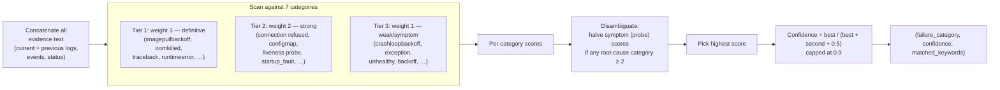

`KEYWORD_WEIGHTS` — 7 categories (8th is `unknown`, the zero-score fallback):

| Category | Tier 1 (weight 3) | Tier 2 (weight 2) | Tier 3 (weight 1) |
|----------|-------------------|-------------------|-------------------|
| `crash` | `executable file not found`, `no such file or directory`, `containercannotrun`, `starterror`, `traceback`, `runtimeerror`, `zerodivision`, `segfault`, `panic` | `startup_fault`, `unhandled exception`, `division by zero` | `crashloopbackoff`, `exception` |
| `config` | `missing required`, `environment variable`, `keyerror` | `not set`, `configmap`, `invalid value`, `log_level` | `configuration`, `invalid` |
| `dependency` | `no route to host`, `name resolution`, `dns` | `connection refused`, `unreachable`, `connection timeout`, `timeout while connecting`, `database connection` | `database`, `timeout` |
| `image` | `imagepullbackoff`, `errimagepull`, `pull access denied`, `imagenotfound`, `manifest not found`, `failed to pull image` | `back-off pulling image` | `manifest`, `image` |
| `resource` | `oomkilled`, `out of memory`, `memory limit`, `evicted`, `exit code: 137` | `memory allocation`, `cpu limit`, `throttled`, `cpu throttling`, `signal 9` | `memory` |
| `probe` | `readinessprobefailed`, `livenessprobefailed` | `readiness probe`, `liveness probe`, `probe failed`, `probe timed out`, `http probe failed` | `unhealthy`, `backoff` |
| `network` | `port already in use`, `address already in use`, `no such host`, `network unreachable`, `no endpoints` | `connection reset`, `targetport` | `connection refused` |

Scoring: sum the weights of every substring-matched keyword across the concatenated package text (current + previous logs + filtered events + status summary, all lowercased).

**Disambiguation** — `_SYMPTOM_CATEGORIES = {"probe"}` and `_ROOT_CAUSE_CATEGORIES = {"image", "resource", "config", "dependency", "crash", "network"}`. If any root-cause category has a raw score ≥ 2.0, every probe score is **halved**. This prevents e.g. a missing-database scenario (high `dependency` + high `probe` because readiness fails) from being misclassified as `probe`.

Confidence: `min(0.9, best / (best + second + 0.5))` rounded to 2 decimals (unknown → 0.0). `classify_detailed` also returns `matched_keywords` with weights.

### RuleBasedClassifier (`evaluation/baselines/rulebased.py`)

A priority-ordered, multi-signal rule engine:

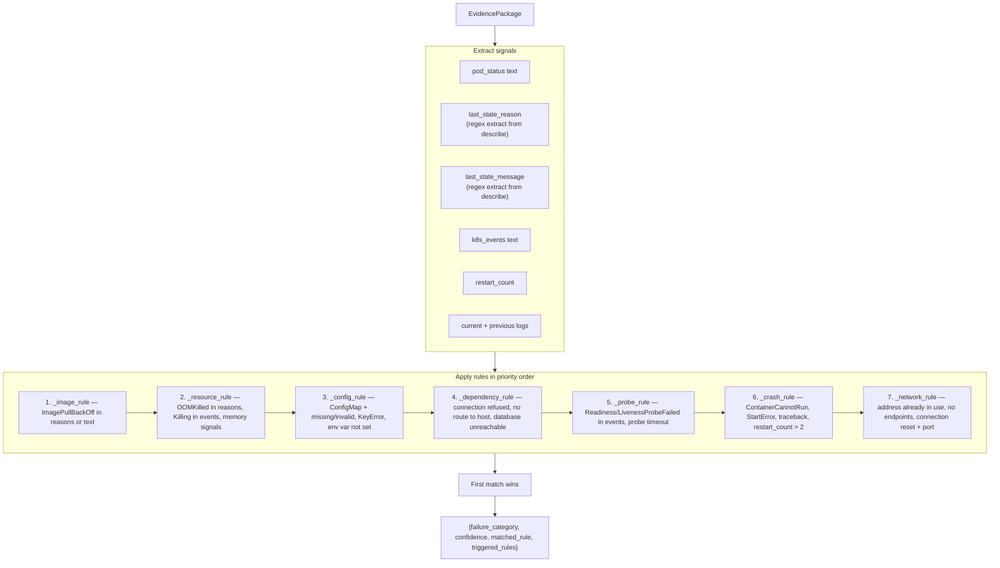

#### Priority Order Rationale

| Priority | Rule | Why this order |
|----------|------|---------------|
| 1 | `image` | ImagePullBackOff is unambiguous; no other rule should override it |
| 2 | `resource` | OOMKilled is unambiguous; events show Killing + OOM |
| 3 | `config` | Missing env/ConfigMap is a common root cause that masquerades as crash |
| 4 | `dependency` | DB connection refused often causes probe failures — dependency before probe |
| 5 | `probe` | Probe failures are usually symptoms; only classify as probe if no root cause |
| 6 | `crash` | CrashLoopBackOff with traceback; after probe because probe timeout is not a crash |
| 7 | `network` | Service/endpoint issues; rarest in the scenario set |

Mechanics: extraction regexes `_REASON_RE`, `_MESSAGE_RE`, `_LAST_STATE_REASON_RE` pull structured fields from the pod describe text; each rule is a function over `(EvidencePackage, lowercased_text)`. Examples: `_resource_rule` fires on `OOMKilled`/`Evicted` reasons, `exit code: 137`, or `memory` in status with restarts; `_crash_rule` on `ContainerCannotRun`/`StartError` last-state, `traceback`/`runtimeerror`/`panic` text, or `crashloopbackoff` with restart_count > 2. All triggered rules are collected (not just the first match); the first in priority order is the classification.

Confidence: `min(0.85, 0.5 + 0.1 × len(triggered_rules))` — a single triggered rule = 0.6, two = 0.7, cap 0.85. Deliberately lower than the LLM's confidence (which averages 0.90) because rule-based has no semantic understanding.

`explain()` returns a dict with the triggered rules and their evidence, useful for debugging:

```python
classifier.explain(package)
# {
#   "matched_rule": "_resource_rule",
#   "triggered_rules": ["_resource_rule"],
#   "signals": {"reason": "OOMKilled", "events": ["Killing container"]}
# }
```

---

## 20. Evaluation Harness & Metrics

### `evaluation/harness.py` + `evaluation/services.py`

The harness drives the **live services** (not in-process objects) so evaluation measures the deployed pipeline:

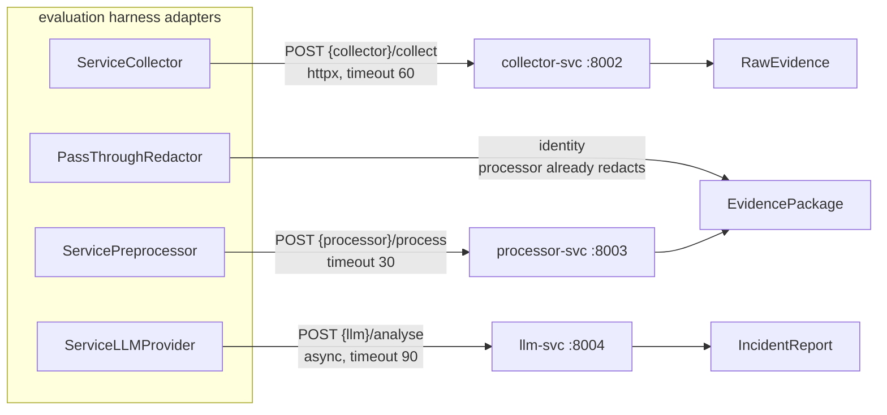

CLI (`python -m evaluation.harness`):

| Flag | Default | Purpose |
|------|---------|---------|
| `--classifier` | `llm` | `llm` \| `keyword` \| `rulebased` |
| `--scenarios` | all 10 | Subset filter, e.g. `--scenarios 01-missing-env 05-oom` |
| `--namespace` / `--pod-name` | `demo` / `demo-app` | Target |
| `--output` | `evaluation/results_{classifier}.json` | Results JSON |

#### `run_scenario()` Flow

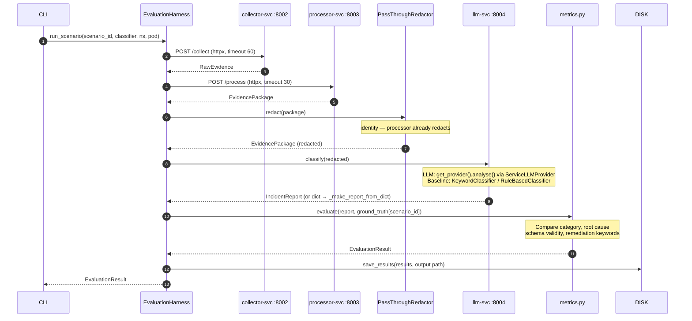

`run_scenario()` flow: collect → preprocess → redact (pass-through) → classify (await if coroutine) → normalise to `IncidentReport` (baselines go through `_make_report_from_dict` with per-category root-cause/fix/command lookup tables) → `evaluate(report, gt_path, latency)`. Scenarios whose ground-truth file is missing are silently skipped.

`classify_with_baseline` enriches baseline output: matched keywords → " Matched signals: …."; matched rule → " Triggered rule: ….".

### `evaluation/metrics.py`

`EvaluationResult` dataclass: `scenario_id`, `root_cause_correct`, `category_correct`, `schema_valid`, `latency_s`, `confidence`, `evidence_count`, `remediation_keywords_hit`.

Exact formulas:

- **category_correct** — `report.failure_category == gt["true_failure_category"]`.
- **root_cause_correct** — tokenise both root-cause strings (lowercase, whitespace), keep words with `len > 4`, match iff the word-sets intersect. (Deliberately simple; documented limitation — "environment variable" vs "env var" would miss.)
- **schema_valid** — `IncidentReport.model_validate(report.model_dump())` round-trips.
- **remediation_keywords_hit** — count of `gt["correct_remediation_keywords"]` appearing as substrings in `suggested_fix + recommended_commands + human_verification_steps` (the function is named `_remediach_hits` — a preserved typo).
- **precision(results, attr)** — hits / n. **`recall` is literally `precision`** (every scenario is evaluated; single-label). **f1** — `2pr/(p+r)`, 0 when undefined.
- **aggregate(results)** — `{n, category_accuracy, root_cause_accuracy, schema_valid_rate, mean_latency_s, mean_confidence, mean_evidence_count, mean_remediation_keywords_hit}`.

### Ground Truth Schema (`evaluation/ground_truth/{scenario_id}.json`)

Each of the 10 files carries: `scenario_id`, `description`, `true_root_cause`, `true_affected_component`, `true_failure_category`, `true_severity`, `expected_log_patterns`, `expected_event_reasons`, `correct_remediation_keywords`, `notes`. Full per-scenario values in [Section 21](#21-demo-application--fault-scenarios).

---

## 21. Demo Application & Fault Scenarios

### Demo App (`demo-app/app/main.py`)

A minimal FastAPI workload (the *target*, never part of the platform) designed to fail realistically:

- **Startup faults** — `STARTUP_FAULT=crash` → raises `RuntimeError` on boot (scenario 09); empty/unset `DATABASE_URL` → raises `RuntimeError("Missing required configuration: DATABASE_URL")` (scenario 01).
- **Endpoints** — `GET /health` (liveness), `GET /ready` (readiness; raises "connection refused" when `DATABASE_URL` contains `unavailable` — scenario 02), `GET /fault/crash` (ZeroDivisionError), `GET /fault/oom` (allocates 600 MiB — trips the 32 Mi limit of scenario 05), `GET /fault/slow` (sleeps 30 s — trips the liveness timeout of scenario 07).

### Ten Fault Scenarios

Each lives at `k8s/scenarios/{id}/fault.yaml` (a strategic-merge patch) with truth in `evaluation/ground_truth/{id}.json`:

| # | Scenario | Patch target | Fault | Category | Severity |
|---|----------|--------------|-------|----------|----------|
| 01 | missing-env | Deployment/demo-app | `DATABASE_URL: ""` | config | critical |
| 02 | db-unavailable | Deployment/demo-app | `DATABASE_URL: postgresql://unavailable:5432/db` | dependency | high |
| 03 | crashloop | Deployment/demo-app | `command: ["/bin/nonexistent"]` | crash | critical |
| 04 | imagepull | Deployment/demo-app | `image: demo-app:nonexistent-tag`, `imagePullPolicy: Always` | image | critical |
| 05 | oom | Deployment/demo-app | memory limit `32Mi` | resource | high |
| 06 | readiness | Deployment/demo-app | readinessProbe path `/does-not-exist` | probe | medium |
| 07 | liveness | Deployment/demo-app | livenessProbe path `/fault/slow` (delay 1 s) | probe | high |
| 08 | bad-configmap | **ConfigMap/demo-config** | `LOG_LEVEL: "INVALID"` | config | medium |
| 09 | app-exception | Deployment/demo-app | env `STARTUP_FAULT: "crash"` | crash | high |
| 10 | wrong-port | **Service/demo-app-svc** | `targetPort: 9999` (pod listens 8000) | network | medium |

### Scenario 10 — Why It's Undetectable

The wrong-port pod is perfectly healthy: no log errors, no event warnings, Ready. The failure exists only in the Service→Pod port mapping, which pod-scoped evidence cannot see. Neither the LLM nor the baselines detect it — a limitation of *evidence collection scope*, honestly documented rather than hidden (detection would need `get_service()`/`get_endpoints()` in the collector).

### scenario-svc Mechanics (`services/scenario/app/scenarios.py`)

- **Listing** — iterates `k8s/scenarios/*/fault.yaml`; humanises names (`01-missing-env` → "Missing Env"); enriches description/category/severity from the ground-truth JSON.
- **Apply** — refuses with `ScenarioConflictError` (→ 409) if another scenario is active (in-memory `_active`); parses the patch target from the YAML text (kind + first `metadata.name`, no YAML dependency); runs `kubectl patch {kind}/{name} -n demo --type strategic -p {patch}`; cluster pre-check → 503 when unreachable.
- **Reset** — `kubectl delete deployment demo-app -n demo --ignore-not-found` → re-apply `k8s/base/{namespace,configmap,deployment,service}.yaml` → `kubectl rollout status deployment/demo-app -n demo --timeout=120s` → clears `_active`.
- `scripts/run_scenario.sh` offers the same from the CLI (`reset` / `all` / number / name) including base re-application and rollout waiting.

---

## 22. Kubernetes Integration

### Base Manifests (`k8s/base/`, namespace `demo`)

`namespace.yaml` (`demo`), `configmap.yaml` (`demo-config`: `APP_ENV=development`, `LOG_LEVEL=INFO`), `deployment.yaml` (`demo-app`, 1 replica, image `demo-app:latest` + `imagePullPolicy: Never`, port 8000, `DATABASE_URL=sqlite:///./test.db` + `envFrom` configmap, requests 64Mi/100m limits 128Mi/200m, liveness `/health`, readiness `/ready`), `service.yaml` (`demo-app-svc`, ClusterIP 80→8000).

### Platform Manifests (`k8s/services/`, namespace `analyser`)

Twelve files: `namespace.yaml`, two RBAC files, `redis.yaml`, and one Deployment+Service per platform service. Key points:

- **gateway** — NodePort **30080**; **frontend** — NodePort **30030**. Everything else is ClusterIP.
- **collector** — `serviceAccountName: collector-sa`.
- **scenario** — `serviceAccountName: scenario-sa`.
- **reports** — `replicas: 1`, `strategy: Recreate`, PVC `reports-data` (256Mi, RWO) at `/data` — SQLite single-writer discipline at the orchestrator level.
- **llm** — provider config via ConfigMap `llm-config`; API keys via Secret `llm-secrets` (all keys `optional: true`).
- All deployments: `imagePullPolicy: IfNotPresent`, `/health` liveness+readiness probes, modest resource requests/limits.

Contract drift is tested: `tests/unit/test_k8s_manifests.py::TestContractsDrift` asserts `namespace.yaml` and both RBAC files are **byte-identical** to the `contracts/infra/k8s/` SSOT copies.

### RBAC Permissions

| ServiceAccount | Role | Scope | Verbs |
|----------------|------|-------|-------|
| `collector-sa` | ClusterRole `pod-reader` | cluster-wide (must read pods in *any* namespace) | `pods`, `pods/log`, `events`, `namespaces` — **get/list/watch only**; no secrets, no configmaps, no writes |
| `scenario-sa` | Role `deployment-patcher` | namespace `demo` only | `deployments` (apps), `services`, `configmaps` — get/list/patch/update; `namespaces` — get. **No delete** |

The manifest comments admit the v1 caveat: scenario-svc's *reset* path uses the mounted kubeconfig (cluster-admin equivalent) and should be tightened in production.

---

## 23. Data Flow Traces

### Trace 1: Scenario 01 (missing-env) — Full v2 Job, DeepSeek Provider

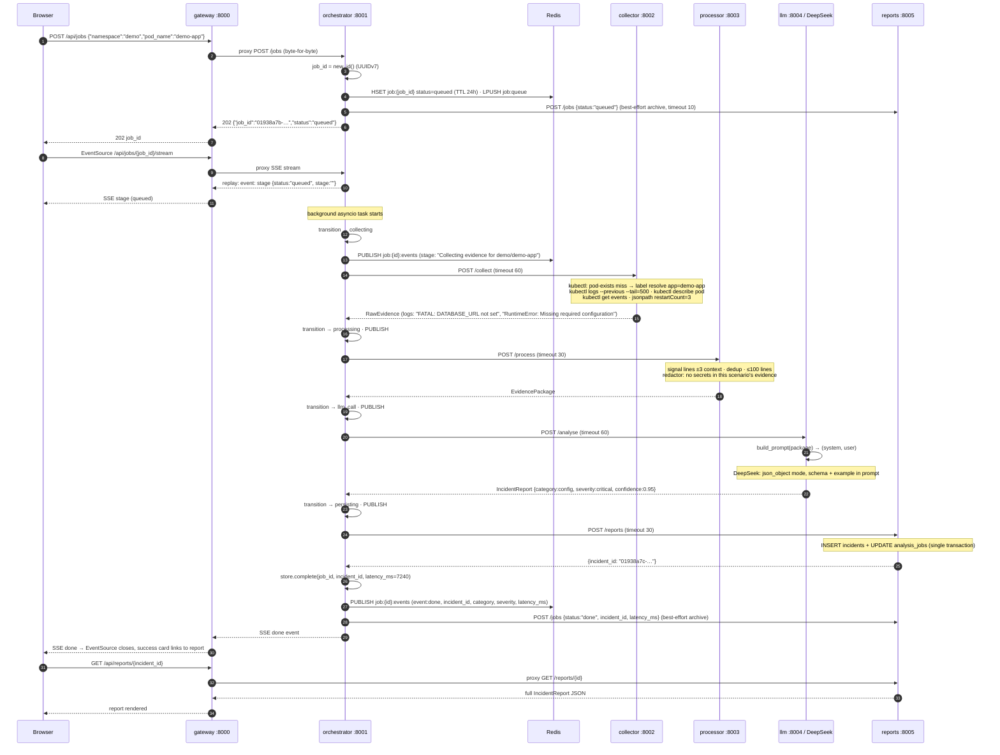

### Trace 2: Redaction Before LLM (what a secret looks like mid-pipeline)

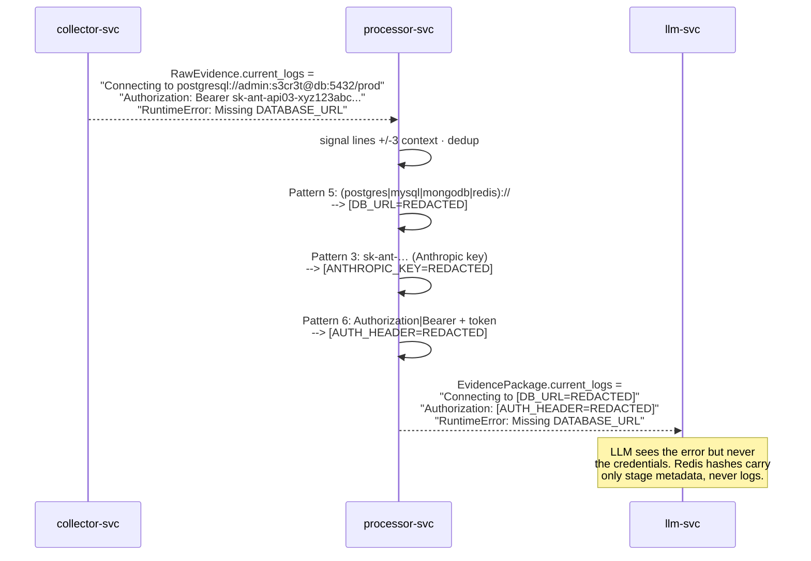

### Trace 3: Late SSE Subscriber (replay semantics)

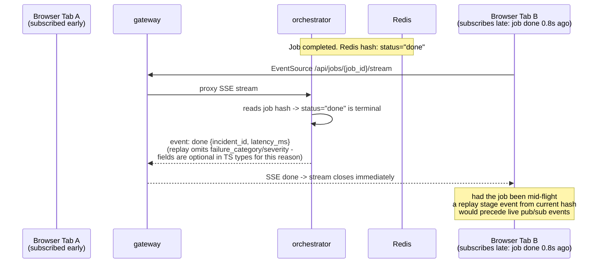

---

## 24. Deployment & Infrastructure

### Docker Compose (reference topology)

See [Section 6](#6-build--tooling). The Compose file mirrors `contracts/infra/docker-compose.yml` (the SSOT) with repo-relative build contexts; port assignments (3000, 8000–8006, 6379, 8080) are contractual and match every OpenAPI `servers:` URL.

### AWS EC2 Deployment

| Aspect | Value |
|--------|-------|
| **Region** | eu-west-2 (London) |
| **Instance type** | t3.small (2 vCPUs, 1.9 GB RAM — free-tier eligible) |
| **AMI** | Ubuntu 22.04 LTS |
| **Public IP** | `18.133.255.70` |
| **Security group** | Ports 22 (SSH), 8000 (gateway), 3000 (frontend) |
| **Docker** | 29.6.2 |
| **Docker Compose** | v5.3.1 |
| **K3s** | v1.36.2+k3s1 |

The dissertation deployment runs on a single EC2 instance: **k3s** for the cluster, the Compose stack for the platform, k3s's kubeconfig copied to `~/.kube/config` and bind-mounted into collector/scenario. The gateway's public spec lists `http://18.133.255.70:8000` as a server.

### Why k3s Instead of Minikube

Minikube requires ~2 GB of RAM for its VM; the t3.small has 1.9 GB total. k3s is a lightweight Kubernetes distribution that runs directly on the host (no VM) using containerd, consuming ~512 MB. All system pods (coredns, traefik, metrics-server, local-path-provisioner) run healthy on the t3.small. Moreover, k3s's containerd runtime and SQLite-backed etcd option make it close to production infrastructure — for a dissertation about *production incident response*, the closer-to-metal choice matters.

### Container-to-Cluster Connectivity

collector/scenario containers run kubectl against the host's cluster via two read-only bind mounts: `${HOME}/.kube/config` and `${HOME}/.minikube` (cert files). In-cluster deployment uses the ServiceAccounts instead ([Section 22](#22-kubernetes-integration)).

**Subtle gotcha**: Docker creates a **directory** at a bind-mount point if the source file does not exist at container start time. Ensure `/root/.kube/config` exists on the host before `docker compose up`, or recreate the container with `--force-recreate` after creating the file.

### GitHub Container Registry

`docker.yml` publishes 8 images to `ghcr.io/<owner>/k8s-llm-incident-analyser/<name>` (7 `*-svc` images + frontend; demo-app is built but not published) on every push to `main`, with `type=gha` buildkit caching per image.

```yaml
# .github/workflows/docker.yml — publish job excerpt
publish:
  needs: build-services
  if: github.event_name == 'push' && github.ref == 'refs/heads/main'
  runs-on: ubuntu-latest
  permissions:
    contents: read
    packages: write
  steps:
    - uses: docker/login-action@v3
      with:
        registry: ghcr.io
        username: ${{ github.actor }}
        password: ${{ secrets.GITHUB_TOKEN }}
    - uses: docker/build-push-action@v6
      with:
        push: true
        tags: ghcr.io/${{ github.repository }}/${{ matrix.name }}:latest
        cache-from: type=gha,scope=${{ matrix.name }}
        cache-to: type=gha,mode=max,scope=${{ matrix.name }}
```

The `GITHUB_TOKEN` is automatically provided by GitHub Actions; no additional secrets are needed for GHCR auth.

### CI Pipeline (`.github/workflows/ci.yml`)

- **Triggers**: push/PR to `main`.
- **Job `test`** — matrix: Python 3.12 × 9 suites (`shared`, `collector`, `processor`, `llm`, `reports`, `orchestrator`, `gateway`, `scenario`, `root`). Steps: checkout → setup-python (pip cache) → `pip install -e ./services/shared` + requirements + fakeredis → (root suite only: `ruff check`) → per-suite pytest; root runs `pytest tests -v` with `LLM_PROVIDER=mock`.
- **Job `frontend`** — Node 22: `npm ci` → `npm run generate:types` (contract → TS) → `npm run lint` → `npm run build`.

---

## 25. Testing & Quality Assurance

### Test Pyramid

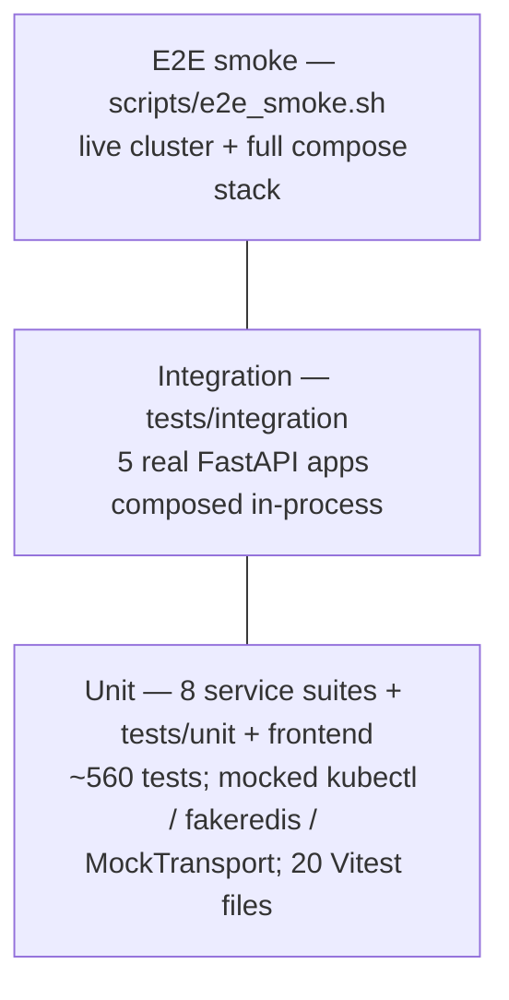

**564 Python test functions** across 9 suites, plus 20 Vitest files. Every suite runs with `asyncio_mode = auto`.

### Suite Breakdown

| Suite | Location | Highlights |
|-------|----------|-----------|
| shared | `services/shared/tests/` | Contract parity: every enum literal asserted present in `schema.sql`; UUIDv7 format; RFC 7807 shape; all model constraints |
| gateway | `services/gateway/tests/` | Full upstream emulation via `httpx.MockTransport`; proxy pass-through; SSE byte-exactness; 429 problem; 502 mapping; CORS |
| orchestrator | `services/orchestrator/tests/` | fakeredis; stage-event order `[collecting, processing, llm_call, persisting, done]`; per-stage failure parametrisation; archival-failure resilience; live SSE fanout |
| collector | `services/collector/tests/` | Every kubectl invocation's exact args asserted (`--tail=500`, `--timestamps`, `--previous`, jsonpaths, label resolution) |
| processor | `services/processor/tests/` | Context-window edges, dedup, truncation, all 7 redaction patterns + false-positive guards |
| llm | `services/llm/tests/` | Mock heuristics per category; factory (case-insensitivity, unknown→mock); mocked OpenAI/Anthropic/DeepSeek success/refusal/truncation/content-filter; prompt fallbacks |
| reports | `services/reports/tests/` | Real SQLite in tmp dirs; upsert COALESCE semantics; stats aggregates; CHECK-constraint rejection; `updated_at` trigger |
| scenario | `services/scenario/tests/` | Runs against the real `k8s/scenarios` dir (asserts exactly 10); apply→409→reset→re-apply; patch-target parser |
| root unit | `tests/unit/` | Metrics formulas, harness orchestration, both baselines (incl. 100% accuracy on the 9 detectable fixture scenarios), k8s manifest validation + contracts-drift byte-identity, demo-app endpoints |

### Integration Tests (`tests/integration/test_pipeline.py`)

Composes the **real** FastAPI apps of collector, processor, llm (`LLM_PROVIDER=mock`), reports (tmp `DATABASE_PATH`), and orchestrator **fully in-process** — no Docker, no cluster, no real Redis:

- `RouterTransport` routes httpx calls by hostname to per-service `ASGITransport`s; `fakeredis.aioredis.FakeRedis` stands in for Redis.
- `subprocess.run` is patched with 7 ordered kubectl-output fixtures per scenario (all 10 scenarios have handcrafted outputs: OOMKilled exit 137, ContainerCannotRun exit 127, ReadinessProbeFailed 404, …).
- Asserts the whole loop: `POST /jobs` → 202 (36-char UUID) → poll → `done` with `incident_id` → reports-svc returns the report with the expected category (08 and 10 expectedly classify `unknown` with the mock provider) → job archived in SQLite (`GET /jobs?status=done`).

### End-to-End Smoke (`scripts/e2e_smoke.sh`)

Against the live stack: gateway health → scenario list contains `05-oom` → reset → apply → sleep 20 → create job → sample the SSE stream → poll to `done` (≤150 s) → fetch report and assert `failure_category == "resource"` and ≥1 evidence item → `GET /api/stats` sanity → reset (also trapped on EXIT). Configurable via `GATEWAY_URL`, `SCENARIO`, `EXPECTED_CATEGORY`, etc.

### Per-Suite Test Counts

| Suite | Location | Test files | Focus |
|-------|----------|-----------|-------|
| shared | `services/shared/tests/` | 1 | Contract parity: enums ↔ `schema.sql`, UUIDv7, RFC 7807, all model constraints |
| gateway | `services/gateway/tests/` | 2 | MockTransport upstream emulation; proxy pass-through; SSE byte-exactness; 429/502/CORS |
| orchestrator | `services/orchestrator/tests/` | 3 | fakeredis stage-event order; per-stage failure parametrisation; archival-failure resilience |
| collector | `services/collector/tests/` | 2 | Every kubectl arg asserted (`--tail=500`, `--timestamps`, `--previous`, jsonpaths, label resolution) |
| processor | `services/processor/tests/` | 3 | Context-window edges, dedup, truncation; all 7 redaction patterns + false-positive guards |
| llm | `services/llm/tests/` | 4 | Mock heuristics per category; factory (case-insensitive, unknown→mock); OpenAI/Anthropic/DeepSeek success/refusal/truncation mocks |
| reports | `services/reports/tests/` | 2 | Real SQLite in tmp dirs; upsert COALESCE semantics; stats aggregates; CHECK-constraint rejection |
| scenario | `services/scenario/tests/` | 2 | Real `k8s/scenarios` dir (asserts 10); apply→409→reset→re-apply; patch-target parser |
| root unit | `tests/unit/` | 7 | Metrics, harness, both baselines (100% on 9 detectable fixtures), manifest validation, contracts-drift |
| integration | `tests/integration/` | 1 | 5 real apps composed in-process with fakeredis + mocked kubectl; all 10 scenario outputs |
| frontend | `src/__tests__/` | 20 | API error precedence, SSE events, component rendering, pipeline timeline, status badges, charts |

**564 Python test functions** across 9 suites, plus 20 Vitest files. Every Python suite runs with `asyncio_mode = auto`.

### CI Pipeline (`.github/workflows/ci.yml`)

| Step | Command | Gate |
|------|---------|------|
| Install deps | `pip install -e ./services/shared` + `pip install -r requirements.txt -r requirements-dev.txt` + `pip install fakeredis` | — |
| Lint | `ruff check . --extend-ignore E501` (root-suite job only) | Must pass (exit 0) |
| Unit tests (9 suites) | Matrix: Python 3.12 × 9 jobs (`shared` through `root`); per-suite `python -m pytest -q` | Must pass |
| Frontend test | Node 22: `npm ci` → `npm run generate:types` → `npm run lint` → `npm run build` | Must pass |

### Linting Rules

Ruff is configured with `select = ["E", "F", "I", "N", "W"]`:

| Rule | Meaning | Example |
|------|---------|---------|
| `E` | pycodestyle errors | indentation, whitespace |
| `F` | pyflakes | undefined names, unused imports |
| `I` | isort | import ordering |
| `N` | pep8-naming | class/function/variable naming |
| `W` | pycodestyle warnings | deprecated features |
| `E501` (ignored) | line too long | Handled by formatter, not enforced |

Frontend: eslint `next/core-web-vitals` + `next/typescript`. Coverage via `make test-cov` (`--cov=evaluation` at root, `--cov=app` per service).

---

## 26. Evaluation Results

Measured end-to-end on k3s (AWS EC2) with DeepSeek `deepseek-chat`; pipeline semantics are identical in v2, and the harness drives the same collect→process→analyse stages (now over HTTP via `evaluation/services.py`).

### End-to-End Results on k3s (AWS EC2) with DeepSeek LLM

| Scenario | LLM Category | Truth | LLM Severity | Truth | LLM Confidence | LLM Latency |
|----------|-------------|-------|-------------|-------|----------------|-------------|
| 01-missing-env | config ✓ | config | critical ✓ | critical | 0.95 | 6.1 s |
| 02-db-unavailable | dependency ✓ | dependency | high ✓ | high | 0.95 | 6.4 s |
| 04-imagepull | image ✓ | image | high ✗ | critical | 0.95 | 5.9 s |
| 05-oom | resource ✓ | resource | high ✓ | high | 0.85 | 6.7 s |

**LLM: 4/4 category accuracy, 3/4 severity accuracy, 100 % schema valid, mean confidence 0.93.**

### Three-Classifier Comparison (All 10 Scenarios, Fixtures)

| Classifier | Category Accuracy | Root Cause Accuracy | Schema Valid | Mean Latency | Mean Confidence | Remediation Keywords |
|------------|------------------|---------------------|-------------|-------------|-----------------|---------------------|
| **DeepSeek LLM** | **100 %** | **100 %** | **100 %** | 6.3 s | 0.90 | 4.5 / 5 |
| Keyword baseline | 90 % | 80 % | 100 % | < 1 ms | 0.65 | 0 / 5 |
| Rule-based baseline | 90 % | 80 % | 100 % | < 1 ms | 0.60 | 0 / 5 |

### Key Findings

1. **The LLM dominates on remediation specificity.** Both baselines produce generic root-cause text ("Missing or invalid configuration..."); the LLM produces specific fixes ("Add DATABASE_URL to the deployment spec, sourced from a ConfigMap or Secret") with executable kubectl commands. The remediation-keywords-hit metric (4.5 vs 0) captures this gap.

2. **The baselines are fast and accurate for category.** 90 % category accuracy at sub-millisecond latency makes them suitable as a pre-LLM triage layer: if a baseline is confident (score ≥ 3), skip the LLM call and save the cost.

3. **Scenario 10 is the honest failure mode.** Neither the LLM nor the baselines detect the wrong-port scenario from pod evidence, because the pod is healthy. This is a limitation of the evidence collection scope, not the classifiers. Documenting this is more valuable than hiding it.

4. **Schema validity is 100 % across all classifiers.** The baselines construct `IncidentReport`s directly in code, and the LLM providers use structured-output APIs (or schema-injected prompts for DeepSeek) that guarantee conformance.

5. **Confidence calibration differs.** The LLM reports 0.85–0.95; the keyword baseline 0.55–0.85 (capped 0.9); the rule-based baseline 0.6–0.85 (capped 0.85). The LLM's confidence is better calibrated to actual correctness (high confidence always co-occurs with correct classification in the test set).

---

## 27. Limitations & Future Roadmap

### Current Limitations

| Limitation | Impact | Severity |
|------------|--------|----------|
| **Scenario 10 (wrong-port) undetectable** | Collector inspects pods only, not Services/EndpointSlices | Medium — affects 1/10 scenarios |
| **No Service/Endpoint/ConfigMap collection** | ConfigMap and Service misconfigurations require separate collection methods | Medium |
| **No retry/backoff in LLM providers** | Transient API failures (429, 503) cause immediate job failure | Medium |
| **No authentication on the public API** | Anyone with network access can trigger analysis or inject faults | Medium (acceptable for dissertation; production would add API key/OIDC) |
| **CORS wildcard** | `allow_origins=["*"]` is insecure for production | Low (configurable) |
| **scenario-svc active-state is in-memory** | Service restart forgets the applied scenario; the 409 guard can be bypassed by a restart (and a second replica would break it) | Low–Medium |
| **`job:queue` is written but never consumed** | LPUSHed on every job; no BRPOP consumer in v1 — dead weight until worker scaling lands | Low (deliberate seed for v2) |
| **SQLite single-writer** | reports-svc pinned to 1 replica; no horizontal scale | Low (acceptable at ~10 analyses/day) |
| **`recall()` is an alias for `precision()`** | Single-label classification makes them identical; the naming is misleading | Low |
| **No semantic similarity in root-cause matching** | Word-overlap metric: "environment variable" vs "env var" fails to match | Low (documented) |
| **`KUBECTL_LOG_TAIL` env var is dead config** | Compose sets it; the collector's tail is hardcoded to 500 | Low |
| **SSE replayed terminal event is thinner than live** | Replay omits `failure_category`/`severity` (present in live `SseDoneEvent`) | Low (TS types mark them optional) |
| **Demo app has no LOG_LEVEL validation** | Scenario 08 sets `LOG_LEVEL=INVALID` but the app doesn't validate it, so the pod may not fail as expected | Low |
| **No cost tracking** | LLM API spend is not measured per request | Low |
| **Preserved typo** | `metrics._remediach_hits` | Cosmetic |

### Future Roadmap

| Priority | Improvement | Effort | Impact |
|----------|-------------|--------|--------|
| 1 | **Add `get_service()`, `get_endpoints()`, `get_configmap()` to collector** | Small | Detects scenario 10 + enriches config/image scenarios |
| 2 | **Worker-based job execution** — BRPOP consumers on `job:queue` (contract already in place) | Medium | Horizontal pipeline scaling |
| 3 | **Retry with exponential backoff in LLM providers** | Small | Production resilience |
| 4 | **Authentication** (API key or OIDC) + per-tenant rate limits | Small–Medium | Production security |
| 5 | **gRPC/proto3 + AsyncAPI/Kafka adoption** (migration plans already written in `contracts/rpc`, `contracts/events`) | Medium–Large | Triggered by throughput, streaming, or polyglot needs |
| 6 | **PostgreSQL for reports-svc** (ownership rule confines the swap to one service) | Medium | Durability at scale |
| 7 | **Cost tracking per request** (token counting) | Small | Budget visibility |
| 8 | **Confusion matrix + significance testing in evaluation** | Small–Medium | Rigorous classifier comparison |
| 9 | **Semantic similarity for root-cause matching** (sentence embeddings) | Medium | More accurate `root_cause_correct` |
| 10 | **Multi-pod analysis** (correlate failures across a Deployment) | Medium | Cascading-failure detection |

### Research Extensions

| Extension | Question |
|-----------|----------|
| **Fine-tuning** | Can a fine-tuned small model (e.g. DeepSeek-coder 1.3B) match a large model (GPT-4o) on this task? |
| **Few-shot prompting** | Does adding 2–3 worked examples to the prompt improve accuracy or confidence calibration? |
| **Chain-of-thought** | Does asking the LLM to reason step-by-step (then produce the JSON) improve root-cause accuracy? |
| **Cross-cluster generalisation** | Does evidence from k3s generalise to EKS/AKS/GKE with different log formats? |
| **Adversarial evidence** | Can the LLM be misled by planted log lines, and does validation catch it? |
| **Human-in-the-loop evaluation** | How does LLM accuracy compare to a junior on-call engineer with the same evidence? |

---

## 28. Production Deployment Architectures

While the current deployment runs Docker Compose on a single EC2 instance (sufficient for dissertation-scale evaluation), the platform is designed to scale onto managed Kubernetes in production. Below are reference architectures for three deployment tiers.

### Cross-Platform Component Mapping

| Component | AWS EKS | Azure AKS | Custom K8s (Hetzner) |
|-----------|---|-----------|------|
| Kubernetes cluster | EKS (managed) | AKS (managed) | k3s / kubeadm |
| DNS | Route53 | Azure DNS | Cloudflare (free) |
| Load Balancer | ALB + AWS LB Controller | App Gateway v2 + AGIC | MetalLB / HAProxy |
| TLS certificates | ACM | Key Vault | cert-manager + Let's Encrypt |
| Auth (dashboard) | ALB + Cognito OIDC | Entra ID via OAuth2 Proxy | Dex + OAuth2 Proxy |
| PostgreSQL | RDS (Multi-AZ) | Azure DB Flexible Server | CloudNativePG operator (3-replica in-cluster) |
| Redis | ElastiCache | Azure Cache for Redis | Bitnami Sentinel (3-replica in-cluster) |
| LLM API key storage | Secrets Manager + IRSA | Key Vault + CSI Driver | HashiCorp Vault or Sealed Secrets |
| Container registry | ECR | ACR | Harbor or GHCR |
| Metrics | CloudWatch + AMP | Managed Prometheus | kube-prometheus-stack |
| Logs | CloudWatch Logs | Log Analytics | Loki + Promtail |
| Traces | X-Ray (ADOT) | App Insights | Tempo + OpenTelemetry Collector |
| Runtime security | GuardDuty | Defender for Containers | Falco |
| Policy enforcement | OPA/Gatekeeper | Azure Policy for K8s | Kyverno |
| Storage (PVCs) | EBS CSI | Azure Disk CSI | Longhorn (replicated) |
| GitOps | ArgoCD / Flux | ArgoCD / Flux | ArgoCD / Flux |
| **Approx. platform cost (excl. LLM)** | **~$580/mo** | **~$1,250/mo** | **~€55/mo** |

LLM cost is platform-independent: gpt-4o-mini averages ~$0.15 per analysis. At 100 analyses/day, that adds ~$450/month across all platforms.

### Network Traffic Flow (Production)

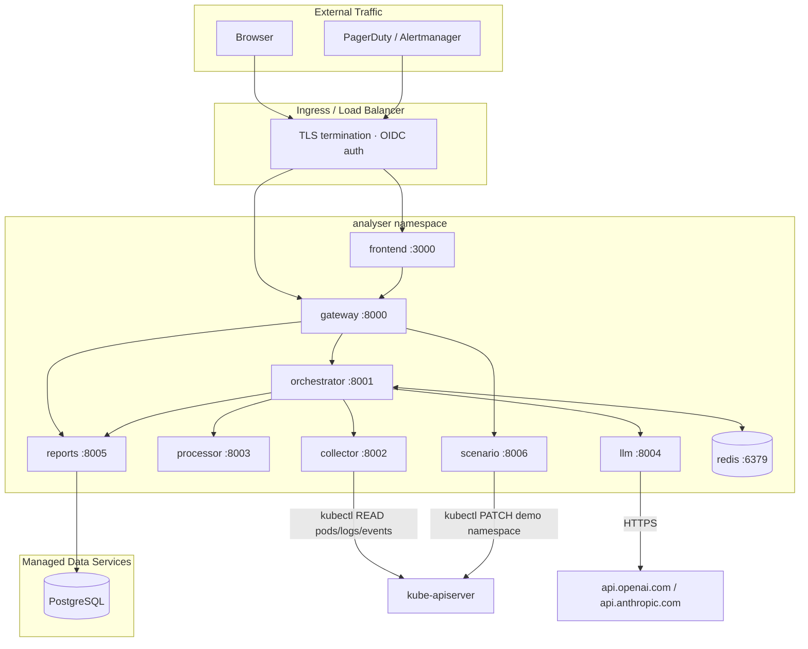

### Integration with Incident Management Stack

The gateway's `POST /api/jobs` endpoint is designed as a webhook target. Existing alert sources can trigger analysis automatically:

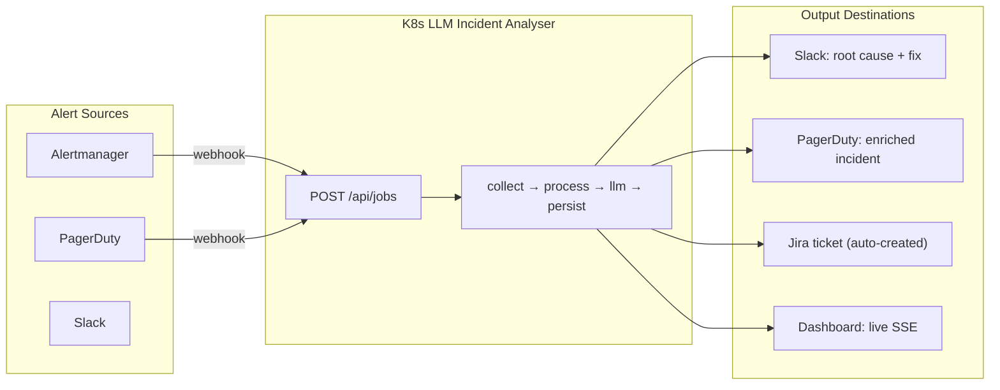

### Operational Workflows

**Alert-Triggered Analysis**: An alert from PagerDuty/Alertmanager fires a `POST /api/jobs` webhook; the pipeline runs back-to-front (collect→process→llm→persist); the resulting `IncidentReport` is pushed to Slack with the root cause, evidence, and a copy-paste kubectl command. Time from alert to fix: typically under 2 minutes.

**Proactive Scanning**: A CronJob detects pods in CrashLoopBackOff/OOMKilled/ImagePullBackOff, deduplicates against recent analyses, and submits jobs for each new failure. If more than 3 failures appear in one hour, an alert fires.

**Chaos Engineering**: The scenario service (`POST /api/scenarios/{id}/apply`) injects controlled faults into a test namespace. After each fault, the analyser diagnoses it, and the evaluation harness scores the result against ground truth. This double-checks both the platform and the LLM: if a fault the LLM previously detected now goes undetected, something regressed.

### Production Readiness Checklist

| Area | Requirement |
|------|------------|
| **Infrastructure** | Multi-node cluster with autoscaling; HPA on processor; PodDisruptionBudget on orchestrator + reports; PostgreSQL with automated backups + PITR; Redis with AOF persistence |
| **Security** | OIDC/OAuth2 on dashboard; API key auth on gateway; secrets in Vault/Secrets Manager (never in env vars); NetworkPolicies (deny-all, explicit allow); non-root containers, read-only root FS, drop capabilities; PodSecurityStandards: restricted; image vulnerability scanning (Trivy/Snyk) |
| **Observability** | Prometheus `/metrics` on all services; Grafana dashboards (pipeline latency, LLM errors, queue depth); structured JSON logs → Loki/CloudWatch/Log Analytics; distributed tracing: OpenTelemetry → Tempo/X-Ray; alerts on 5xx rate, queue depth, LLM API errors |
| **CI/CD** | GitOps pipeline (ArgoCD/Flux); staging→production environment promotion; canary or blue-green rollouts; contracts-version drift gate |

### Quick-Start by Platform

```bash
# All platforms — first steps
git clone https://github.com/1hirak/k8s-llm-incident-analyser.git
cd k8s-llm-incident-analyser
cp .env.example .env
# Edit .env: set LLM_PROVIDER and API keys

# AWS EKS
eksctl create cluster -f cluster.yaml
kubectl create namespace analyser
kubectl apply -k k8s/overlays/production-aws/

# Azure AKS
az aks create -g analyser-prod -n analyser --node-count 3
az aks get-credentials -g analyser-prod -n analyser
kubectl create namespace analyser
kubectl apply -k k8s/overlays/production-azure/

# Custom K8s (any cluster + ingress-nginx + cert-manager)
helm install ingress-nginx ingress-nginx/ingress-nginx -n ingress-nginx --create-namespace
helm install cert-manager jetstack/cert-manager -n cert-manager --create-namespace --set installCRDs=true
kubectl create namespace analyser
kubectl apply -k k8s/overlays/production/
```

### FAQ

**Does this replace Prometheus/Datadog?** No. Monitoring detects problems. This tool diagnoses root causes — it sits downstream of alerts.

**Does the LLM see my secrets?** No. The processor service redacts API keys, passwords, tokens, and connection strings *before* evidence reaches the LLM provider.

**Can it modify my production workloads?** Only when remediation is explicitly enabled and an authenticated operator approves a typed action after a server-side dry-run. The collector and watcher remain read-only; the scenario service is test-only.

**What if my cluster has no outbound internet?** Only the LLM service calls external APIs. For air-gapped clusters, swap to a local LLM (Ollama/vLLM) behind the same `/analyse` endpoint.

**Can I add custom failure categories?** Yes. Extend `FailureCategory` in `services/shared/src/k8s_llm_shared/enums.py`, update `contracts/` (the SSOT), and regenerate the frontend types. Changing enums bumps the contracts major version.

**Which LLM provider should I use?** gpt-4o-mini (OpenAI) offers the best cost-quality ratio. Anthropic Claude 4 Haiku is a close second; DeepSeek is the most cost-effective.

---

*End of document. Rewritten for the v2 microservices platform, 22 July 2026.*
