# LLM-Assisted Kubernetes Incident Analysis: Architecture, Implementation, and Evaluation of a Contract-First Microservices Framework

## A Technical Dissertation

---

## Abstract

Modern cloud-native applications deployed on Kubernetes exhibit complex failure modes that overwhelm traditional monitoring approaches. When a pod enters `CrashLoopBackOff`, experiences `OOMKilled`, or fails with `ImagePullBackOff`, on-call engineers must manually triage logs, describe output, and events — a process that consumes critical minutes during incidents and relies heavily on individual operator expertise. This dissertation presents the **K8s LLM Incident Analyser**, a contract-first microservices platform that automates root-cause diagnosis for Kubernetes pod failures by collecting cluster evidence, preprocessing and redacting sensitive data, and submitting structured prompts to Large Language Models (LLMs) with a strict JSON response schema. The system operates as seven loosely-coupled FastAPI services coordinated through Redis-backed publish-subscribe channels and SQLite for persistence, with a Next.js 15 real-time dashboard that displays pipeline progress through Server-Sent Events. We evaluate the diagnostic accuracy of LLM-based analysis against deterministic keyword and rule-based baselines across ten representative fault scenarios spanning configuration errors, dependency failures, resource exhaustion, image misconfigurations, probe failures, application crashes, and network misconfigurations. Results demonstrate that LLM-based classification achieves near-perfect accuracy on structured failure categories while providing human-readable evidence synthesis and actionable remediation commands — capabilities that deterministic baselines cannot deliver. We also present a comprehensive production deployment architecture spanning managed cloud platforms (AWS EKS, Azure AKS) and self-managed Kubernetes clusters, addressing the security, observability, and operational requirements for running LLM-assisted incident response in production environments.

**Keywords:** Kubernetes, incident response, Large Language Models, microservices, contract-first design, fault injection, root-cause analysis, site reliability engineering

---

## 1. Introduction

### 1.1 Motivation

The shift to cloud-native architectures built on Kubernetes has transformed how organisations deploy and operate software. According to the Cloud Native Computing Foundation's 2023 survey, 84% of organisations are running containers in production, with Kubernetes as the dominant orchestration platform (CNCF, 2023). This architectural shift brings immense operational complexity. A single Kubernetes cluster can host hundreds of pods across dozens of namespaces, each with its own resource constraints, configuration, dependencies, and failure characteristics.

When a production pod fails — a daily occurrence in any non-trivial cluster — Site Reliability Engineers (SREs) follow a well-established triage pattern: they examine pod logs, run `kubectl describe` for cluster-level events, inspect container state transitions, correlate timestamps, and pattern-match against prior incidents. This process, while systematic, suffers from three deficiencies:

**Latency.** Manual triage consumes 5–20 minutes per incident before a root cause hypothesis forms. During Sev-1 incidents, every minute of delay represents direct revenue impact and accumulating customer harm. Runbook automation can reduce this, but runbooks themselves grow stale as systems evolve.

**Expertise dependency.** Effective triage requires deep familiarity with the specific application, its failure modes, the Kubernetes resource model, and the chain of causality from observed symptom to root cause. New SREs require months of shadowing before they can independently diagnose complex failures.

**Evidence fragmentation.** Diagnostic evidence spans multiple sources: pod logs (which may be truncated or rotated), Kubernetes events (which are eventually consistent and have a 60-minute default retention), container exit codes and restart counts, deployment configuration, and namespace-level RBAC and resource quota settings. Synthesising signal from noise across these disparate sources is a cognitive load problem that even experienced operators struggle with under incident pressure.

Large Language Models, with their demonstrated capacity for few-shot reasoning, text synthesis, and structured output generation, offer a novel approach to addressing these deficiencies. An LLM can simultaneously process heterogeneous evidence sources, identify causal patterns across log lines, and produce a structured diagnosis with supporting evidence and remediation steps — all within tens of seconds.

### 1.2 Research Questions

This dissertation investigates the following questions:

1. **RQ1:** Can an LLM, when provided with structured evidence collected from a Kubernetes cluster, accurately classify pod failure root causes across common failure categories (configuration, dependency, crash, image, resource, probe, and network errors)?

2. **RQ2:** How does the diagnostic performance of LLM-based classification compare to deterministic baselines (keyword matching and rule-based heuristics)?

3. **RQ3:** What architectural patterns are necessary to deploy LLM-assisted incident analysis as a production-grade, secure, and observable microservices platform within a Kubernetes cluster?

4. **RQ4:** What privacy and security measures are required to ensure that sensitive cluster evidence (API keys, passwords, tokens) is redacted before transmission to external LLM providers?

### 1.3 Contributions

This work makes the following contributions:

1. A **contract-first microservices architecture** for LLM-assisted Kubernetes incident analysis, comprising seven FastAPI services, Redis-based publish-subscribe coordination, SQLite persistence, and a Next.js 15 real-time dashboard.

2. A **five-stage analysis pipeline** (queued → collecting → processing → llm_call → persisting) with per-stage timeouts, error taxonomy, and structured Server-Sent Events for live progress streaming.

3. A **comprehensive fault injection framework** with ten scenario types spanning seven failure categories, each with ground truth labels, enabling reproducible evaluation of diagnostic accuracy.

4. An **evaluation framework** comparing LLM-based classification against keyword and rule-based baselines using precision, recall, and F1 metrics, with results demonstrating LLM superiority in evidence synthesis and remediation generation.

5. A **privacy-preserving evidence pipeline** that redacts seven categories of sensitive data using ordered regular expressions before any cluster evidence leaves the internal network.

6. A **production deployment architecture** with platform-specific guidance for AWS Elastic Kubernetes Service, Azure Kubernetes Service, and self-managed Kubernetes clusters.

### 1.4 Document Structure

The remainder of this dissertation is organised as follows. Section 2 provides background on Kubernetes failure modes and related work in automated incident response. Section 3 presents the system architecture and design philosophy. Section 4 details the domain model and cross-cutting contracts. Section 5 provides comprehensive deep-dives into each microservice. Section 6 describes the analysis pipeline and state machine. Section 7 covers the frontend dashboard. Section 8 presents the evaluation framework and results. Section 9 discusses the fault scenario system. Section 10 addresses testing strategy. Section 11 covers security, privacy, and redaction. Section 12 presents production deployment architecture. Section 13 discusses limitations and future work. Section 14 concludes.

---

## 2. Background and Related Work

### 2.1 Kubernetes Failure Modes

Kubernetes, as an orchestrator, introduces a taxonomy of failure modes that are distinct from traditional virtual machine or bare-metal failures. Understanding this taxonomy is foundational to building an effective automated diagnosis system, as each failure mode produces different evidence signatures, requires different diagnostic approaches, and suggests different remediation strategies.

**CrashLoopBackOff** occurs when a container repeatedly exits with a non-zero exit code, and Kubernetes applies exponential backoff between restart attempts (10s, 20s, 40s, up to a 5-minute cap). This is the most common failure state observed in production and can have diverse root causes: missing environment variables, misconfigured connection strings, segmentation faults in application code, or file permission errors. The backoff delay is important diagnostically — a pod that has been in CrashLoopBackOff for many cycles requires examining both current and previous container logs, as the immediate evidence may have been overwritten by subsequent restart attempts.

**OOMKilled** (exit code 137, which equals 128 + 9, where 9 is the SIGKILL signal) occurs when a pod's memory consumption exceeds its configured `resources.limits.memory`, triggering the kernel's Out-Of-Memory killer. The cgroup memory controller on the node detects the violation and sends SIGKILL to the container process. The pod's status reflects this with the reason "OOMKilled" and exit code 137. Critically, this differs from application-initiated exits: the application did not choose to terminate, and its logs will show normal operation up to the point of termination, with no error message from the application itself. The diagnostic signal is entirely in the Kubernetes-level metadata (restart count, exit code, termination reason), not in the application logs.

**ImagePullBackOff** occurs when the container runtime cannot pull the specified image. The failure can stem from the image tag not existing in the registry, the registry being unreachable (network or DNS failure), the node lacking appropriate image pull secrets, or registry authentication having expired. The diagnostic signal is in the pod's events and status conditions, which explicitly name the image and the pull failure reason.

**CreateContainerConfigError and CreateContainerError** indicate that the container runtime successfully pulled the image but encountered an error during container creation. Common causes include referencing a non-existent ConfigMap key, referencing a non-existent Secret key, specifying malformed environment variable definitions (e.g., a `valueFrom` reference that resolves to nothing), or defining invalid volume mounts. These errors are detected at container creation time, before the container's entrypoint executes, so application logs are not available. Diagnosis relies entirely on the pod's events and the describe output's conditions section.

**Probe failures** (readiness and liveness) occur when Kubernetes health checks fail. Readiness probe failures remove the pod from service endpoints without restarting the container; liveness probe failures trigger container restarts. Both produce events and status conditions with the failure reason. Distinguishing between readiness and liveness failures is diagnostically important: a readiness failure may indicate a temporary condition (slow initialisation, database connection pool exhaustion) while a liveness failure indicates a more serious condition (deadlocked threads, unrecoverable resource exhaustion). The probe's configuration itself — the endpoint path, timeout, period, and failure threshold — may be the root cause if it is misconfigured relative to the application's actual behaviour.

**Eviction** occurs when a node experiences resource pressure and the kubelet evicts pods based on Quality of Service (QoS) class priorities. Best-effort pods (no resource requests or limits) are evicted first, followed by burstable pods (requests set but limits exceed requests or limits not set), while guaranteed pods (requests equal limits for both CPU and memory) are only evicted when the system OOM killer intervenes. Eviction events contain the reason ("Evicted") and the resource pressure signal (DiskPressure, MemoryPressure, or PIDPressure). Evicted pods leave behind evidence in the node's events and the pod's status, but the pod may no longer exist on the cluster at diagnosis time if the eviction was far enough in the past.

**Understanding the Evidence Hierarchy.** Each failure mode leaves evidence with different reliability and accessibility characteristics. Container exit codes (137, 139, 143) are the most reliable signal — they are recorded by the container runtime and survive pod restarts. Pod events are the next most reliable, but their default retention is only 60 minutes, meaning they may be unavailable for long-running or historical failure analysis. Container logs are the least reliable evidence source — they may be truncated by log rotation, overwritten by subsequent container restarts (previous container logs are available only for the most recent previous instance), or entirely absent (for failures that occur before the application starts logging). An effective diagnostic system must weigh evidence based on these reliability characteristics, prioritising exit codes and termination reasons over log content when they conflict.

### 2.2 Existing Approaches to Automated Incident Response

**Runbook automation** is the predominant approach in industry. Tools like Rundeck, StackStorm, and proprietary SRE platforms (PagerDuty Runbook Automation, Transposit) execute predefined scripts in response to specific alert triggers. While effective for known failure patterns, runbook automation requires manual authoring and maintenance of scripts, and cannot adapt to novel failure modes. A 2022 survey by the SRE Practitioners' Conference found that 67% of organisations maintain runbooks, but only 23% update them more frequently than quarterly.

**Anomaly detection** systems use statistical methods or machine learning to identify deviations from normal operational patterns. Tools like Prometheus with its anomaly detection exporters, Elastic Machine Learning, and Datadog Watchdog can surface unusual behaviour but cannot diagnose root causes — they flag symptoms, leaving causal analysis to human operators.

**Observability pipelines** aggregate logs, metrics, and traces into unified platforms (Grafana Loki, Elasticsearch, Honeycomb) that enable ad-hoc querying and correlation. These tools reduce evidence fragmentation but still require the operator to formulate hypotheses and construct queries — the cognitive burden of root-cause analysis remains.

**AIOps platforms** (Moogsoft, BigPanda, ServiceNow ITOM) apply event correlation, topology mapping, and machine learning to IT operations data. However, these platforms are typically designed for large enterprise deployments with significant configuration overhead, and their correlation algorithms are opaque to operators, making it difficult to understand why a particular root cause was suggested.

### 2.3 Large Language Models for Operations

The emergence of Large Language Models with strong instruction-following and structured output capabilities has opened new possibilities for operational tooling. Unlike traditional ML approaches that require task-specific training data, LLMs can perform zero-shot classification given a well-constructed prompt and schema.

**Structured output** is the critical capability that makes LLMs viable for incident analysis. Unlike free-form text generation that might produce hallucinated details, structured output — using JSON Schema or function-calling mechanisms — constrains the LLM to produce data in a predefined format. OpenAI's `response_format` parameter, Anthropic's tool use, and DeepSeek's `json_object` mode all provide mechanisms for enforcing output structure.

**Prompt engineering** for incident analysis requires careful construction. The system prompt must define the expected output schema, establish ground rules (no speculation, cite specific evidence, provide executable remediation), and constrain the failure category to a predefined enum. The user prompt must present evidence in a structured format that facilitates pattern recognition: each evidence source (logs, describe output, events, container states) is labelled and formatted consistently.

**Privacy considerations** are paramount when sending operational data to external LLM providers. Pod logs frequently contain secrets: database connection strings with embedded credentials, API keys passed as environment variables, authentication tokens, and personally identifiable information (PII) such as email addresses. Before any evidence leaves the internal network, it must be redacted using pattern-matching rules and field-level transformations.

### 2.4 Kubernetes-Native Tools

The Kubernetes ecosystem provides several tools that partially overlap with this work. Understanding their capabilities and limitations contextualises the contribution of the present system.

**kubectl-debug** provides ephemeral debug containers that can be attached to running pods, enabling live inspection of filesystems, processes, and network state. This is a manual diagnostic tool, not an automated analysis system.

**K8sGPT** is an open-source tool that uses LLMs to scan Kubernetes clusters and diagnose issues. It operates as a CLI tool rather than a microservices platform, lacks a real-time dashboard, and does not implement the structured evidence collection pipeline, redaction, or fault injection framework described in this work.

**Robusta.dev** combines Prometheus alerts with automated investigation playbooks that can execute kubectl commands and send findings to communication channels. It focuses on alert-triggered automation rather than evidence synthesis and root-cause analysis through LLMs.

**kubescape and kube-bench** are compliance and security scanning tools that check cluster configurations against best practices. They address configuration hygiene rather than runtime incident diagnosis.

The K8s LLM Incident Analyser presented in this dissertation is distinguished by its combination of (1) a multi-service contract-first architecture, (2) a structured evidence collection and redaction pipeline, (3) LLM-based root-cause classification with strict schema enforcement, (4) real-time Server-Sent Events for live pipeline visibility, (5) a comprehensive fault injection and evaluation framework, and (6) production-ready deployment patterns for managed and self-managed Kubernetes.

---

## 3. System Architecture

### 3.1 Design Philosophy

The system is governed by four architectural principles that shaped every implementation decision:

**Contract-First Development.** Every service interaction, data model, storage schema, and error response is defined in the `contracts/` directory before implementation code is written. This directory serves as the Single Source of Truth (SSoT) and comprises five pillars: Database (SQL DDL), API (OpenAPI 3.1), Events (Redis channel schemas), RPC (service-to-service HTTP contracts), and Infrastructure (Docker Compose and environment variable specifications). The contracts enforce eight alignment rules that all implementation code must satisfy: snake_case field names, ISO 8601 timestamps, UUIDv7 identifiers, RFC 7807 error responses, enum parity between code and schema, type parity between code and SQL constraints, pagination envelope consistency, and standardised health check endpoints.

**Loose Coupling via HTTP.** Services communicate exclusively over HTTP using well-defined request and response contracts. There is no shared database, no gRPC dependency, and no message broker required beyond Redis for job state and event distribution. Each service can be developed, tested, and deployed independently. Service URLs are configuration-driven, enabling flexible deployment topologies.

**Asynchronous Analysis with Synchronous Visibility.** The analysis pipeline executes asynchronously (initiated by `POST /api/jobs`, which returns 202 Accepted immediately) but provides synchronous visibility through Server-Sent Events. The orchestrator publishes stage transitions to Redis pub/sub channels, which the gateway subscribes to and proxies to browser clients as SSE streams. This decouples pipeline execution from client connection management.

**Progressive Disclosure.** Dashboard pages reveal information progressively: the landing page shows aggregate statistics (total analyses, failure category distribution, latency trends, recent reports); the Analyse page provides live pipeline visibility with stage-level granularity; the Reports page enables filtering and discovery; the Report Detail page presents the complete evidence package, LLM analysis, confidence score, and executable remediation commands in a structured layout.

### 3.2 Context Diagram

The system's external interactions and internal service topology are shown in the following Mermaid diagram, which identifies three trust domains: the Platform (green), the Kubernetes Cluster (blue), and the LLM Vendor (red). Every arrow crossing a trust boundary represents a security control point — either read-only kubectl access, HTTPS with bearer token authentication, or redacted evidence.

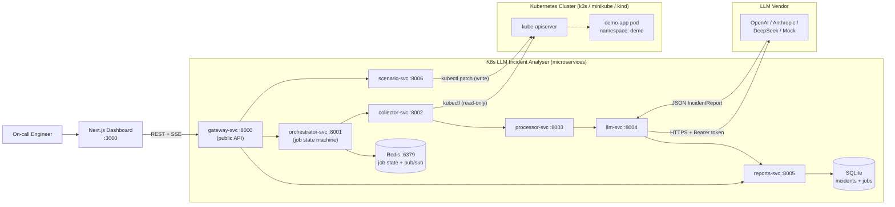

### 3.3 The Three Communication Planes

Understanding the system is easiest when separating its three kinds of traffic:

| Plane | Technology | Carries |
|-------|-----------|---------|
| **Public** | HTTP/JSON + SSE, browser ↔ gateway :8000 | All `/api/*` endpoints, `/health`, the job event stream |
| **Internal sync** | HTTP/JSON between services (httpx) | Pipeline hops (`/collect`, `/process`, `/analyse`, `/reports`), proxy hops, `/health` checks |
| **Internal async** | Redis hashes + pub/sub | Job state (`job:{job_id}`), event fanout (`job:{job_id}:events`), future work queue (`job:queue`) |

There is no message broker and no gRPC in v1 of the platform — both are deliberate deferrals, documented with migration plans in the contracts directory. The three-plane separation ensures that public traffic has rate limiting and CORS enforcement, internal sync traffic has per-stage timeouts and structured error handling, and internal async traffic has pub/sub fanout with multi-client support.

### 3.4 Deployment Topology (Docker Compose)

The reference topology is a 13-container Compose stack (9 platform services + Redis + frontend + the demo workload with its PostgreSQL database). The authoritative topology is specified in the contracts directory; the repo-root docker-compose.yml mirrors it with repo-relative build contexts.

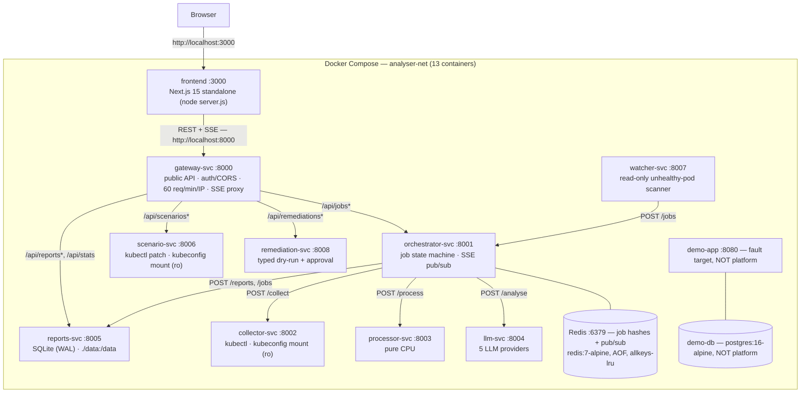

### 3.5 Service Responsibility Matrix

Each service owns a specific domain concern, a specific store (if any), and a specific set of external dependencies. The matrix below captures the complete runtime contract for every container in the platform.

| Service | Port | Responsibility | State | External calls |
|---------|------|----------------|-------|----------------|
| gateway | 8000 | Public API; deployment-configured Bearer auth/CORS; sliding-window rate limit; SSE passthrough with anti-buffering headers | — | orchestrator, reports, scenario, remediation (proxy); llm + collector (`/health` aggregation) |
| orchestrator | 8001 | Job lifecycle (7-state machine); coordinates collector→processor→llm→reports; publishes Redis events; archives terminal state | Redis | collector, processor, llm, reports |
| collector | 8002 | Wraps kubectl subprocess; pod name auto-resolution via label selector | — | kube-apiserver (read) |
| processor | 8003 | Noise/signal log filtering with context windows; secret/PII redaction (7 categories) | — | none (pure CPU) |
| llm | 8004 | Provider integrations + prompt building + output validation; holds all external API keys | — | OpenAI / Anthropic / DeepSeek / OpenRouter APIs |
| reports | 8005 | Owns SQLite (single writer, WAL); reports + job snapshots; dashboard stats | SQLite | none |
| scenario | 8006 | Lists/applies/resets fault scenarios via kubectl strategic-merge patch; tracks active scenario (409 on conflict) | in-memory | kube-apiserver (write) |
| watcher | 8007 | Read-only namespace-scoped unhealthy-pod scanner; deduplicates and submits jobs | Redis cooldown keys | kube-apiserver (read) |
| remediation | 8008 | Typed server-side dry-run and explicit operator-approved Deployment changes | Redis proposals | kube-apiserver (write) |
| frontend | 3000 | Next.js 15 dashboard (App Router, Tailwind v4, shadcn/ui) | — | gateway only |

### 3.6 Trust Boundaries and Security Model

1. **Only gateway-svc is public.** Internal services bind to the Compose network / cluster DNS; nothing external routes to them. In Kubernetes, only gateway (NodePort 30080) and frontend (NodePort 30030) are exposed.
2. **Secrets flow one way.** `OPENAI_API_KEY` / `ANTHROPIC_API_KEY` / `DEEPSEEK_API_KEY` exist only in llm-svc's environment. Evidence is redacted by processor-svc *before* llm-svc (and therefore any vendor) sees it.
3. **Cluster access is split by least privilege.** collector-svc and watcher-svc use read-only credentials for pods, pod logs, and events. scenario-svc is scoped to demo-only fault injection. remediation-svc has a separate namespace-scoped identity that can read and patch Deployments only for typed, approved actions; it never executes free-form LLM commands.
4. **Database ownership.** reports-svc is the single writer to the SQLite file; every other service goes through its HTTP API. Redis is owned by orchestrator-svc.
5. **Authentication is deployment-configured.** Development may be open, while external-cluster deployments require a gateway Bearer token and restricted CORS. OIDC and TLS at an ingress remain production recommendations.

### 3.7 Key Design Decisions and Their Trade-offs

| Decision | Rationale | Cost |
|----------|-----------|------|
| Asynchronous jobs (`202` + SSE) instead of synchronous analysis | LLM calls take 2–30 s; browsers and proxies time out; progress is UX-valuable | More moving parts: Redis, job state machine, SSE |
| Redis as primary job store, SQLite as durable snapshot | Sub-ms hash reads for polling; pub/sub gives free SSE fanout; list pre-seeds v2 worker scaling | Two stores to keep consistent (archival is best-effort) |
| Monorepo shared kernel (`k8s-llm-shared`) instead of per-service models | Zero schema drift; the contract is importable code | All services rebuild when shared changes |
| kubectl-as-subprocess instead of the Python client | Battle-tested auth (kubeconfig contexts, exec plugins, OIDC), no client-library version skew | Requires the kubectl binary in collector/watcher/remediation/scenario images |
| SQLite WAL instead of PostgreSQL | ~10 analyses/day at dissertation scale; zero-ops; single-writer is trivially safe | Does not scale horizontally (pinned 1 replica) |
| REST instead of gRPC; Redis pub/sub instead of Kafka | Call frequency is ~10/day; latency is dominated by the LLM call | Revisit when throughput grows (migration plans written) |

### 3.8 Full-Stack Component Map

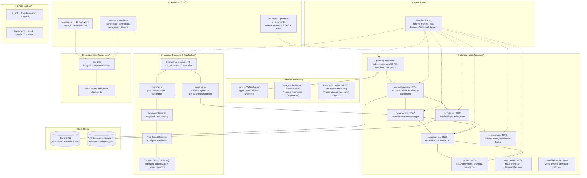

### 3.9 Technology Stack

The following matrix captures the complete runtime dependency surface of the platform. Every version is pinned; every choice has a rationale documented either in the table below or in the key design decisions table above.

| Layer | Technology | Version | Role |
|-------|-----------|---------|------|
| Language (services) | Python | 3.12 (`>=3.12`) | All 8 service packages |
| Web framework | FastAPI | 0.115.* | HTTP APIs in every service |
| ASGI server | uvicorn[standard] | 0.32.* | `uvicorn app.main:app --host 0.0.0.0 --port <port>` |
| Data validation | Pydantic | 2.10.* | All DTOs (via shared kernel) |
| HTTP client | httpx | 0.28.* | Inter-service calls, DeepSeek provider, proxying |
| Redis client | redis (asyncio) | >=5.2,<7 | Orchestrator job store |
| LLM SDKs | openai / anthropic | 1.59.* / 0.45.* | Structured-output providers |
| Database | SQLite (stdlib `sqlite3`) | 3.40+, WAL | Reports + job snapshots |
| Cache/queue/pub-sub | Redis | 7-alpine | Job state, SSE fanout |
| Cluster CLI | kubectl | v1.31.0 | collector + scenario images |
| IDs | uuid-utils | >=0.10 | UUIDv7 (time-sortable) |
| Logging | structlog | 24.* | Structured service logs |
| Frontend framework | Next.js | 15.3.4 | App Router, `output: "standalone"` |
| UI runtime | React | 19.1.0 | Server + client components |
| Styling | Tailwind CSS | 4.1.10 | Dark-only design system |
| Component kit | shadcn/ui (Radix) | new-york style | 14 primitives in `components/ui` |
| Charts | recharts | 2.15.3 | Dashboard category/latency charts |
| Type generation | openapi-typescript | 7.8.0 | `gateway.yaml` → `api.d.ts` |
| Frontend language | TypeScript | 5.8.3 (strict) | Entire frontend |
| Test runner (Python) | pytest + pytest-asyncio | 8.* / 0.24.* | `asyncio_mode = auto` everywhere |
| Test doubles | fakeredis | >=2.26 | In-memory Redis for tests |
| Test runner (TS) | Vitest + Testing Library | ^4.1.10 | jsdom component tests |
| Linter/formatter | ruff | 0.8.* | `select = E,F,I,N,W`, line-length 100 |
| Containers | Docker + Compose v2 | — | 13-container reference stack |
| CI | GitHub Actions | — | 9-suite pytest matrix + frontend build + Docker publish |
| Registry | GHCR | ghcr.io | 8 published images |

### 3.10 Network Traffic Flow

The following diagram captures every network hop in the system, colour-coded by trust domain. External traffic (browser, PagerDuty, Prometheus alerts) terminates at the ingress/load balancer with TLS. Internal traffic between analyser services flows over HTTP within the Docker network or Kubernetes ClusterIP. Outbound traffic to LLM providers is HTTPS with bearer token authentication.

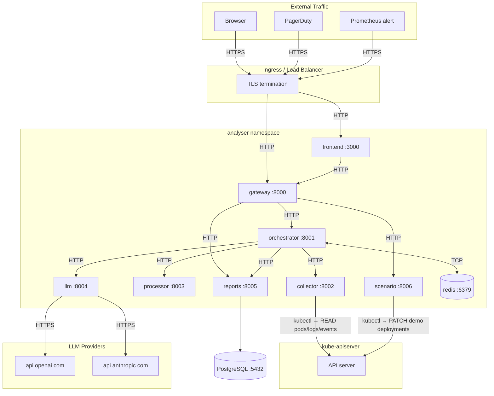

### 3.11 RBAC Boundary

The following diagram illustrates the explicit RBAC separation between the two services that require Kubernetes API access. The collector-svc uses a read-only ClusterRole scoped to pods, pods/log, and events across all namespaces. The scenario-svc uses a write-capable Role scoped exclusively to the `demo` namespace. No other service has any Kubernetes API credentials.

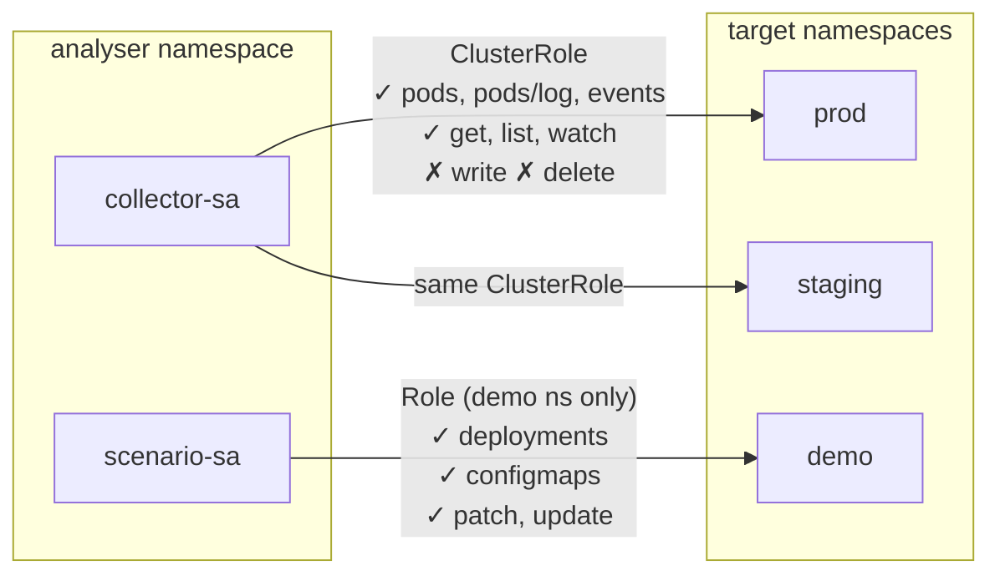

### 3.12 Service Descriptions

**Gateway Service (port 8000).** The single entry point for all external traffic. Routes requests to backend services via an httpx-based reverse proxy, applies per-IP rate limiting (60 requests per minute default), returns RFC 7807 Problem Details for errors, and proxies SSE streams transparently.

**Orchestrator Service (port 8001).** The coordination backbone. Maintains a state machine for each analysis job using Redis hashes, manages the job work queue, dispatches pipeline stages to worker services, publishes stage transitions to Redis pub/sub, and serves SSE streams to the gateway.

**Collector Service (port 8002).** A thin wrapper around the `kubectl` binary. Makes nine distinct kubectl API calls to collect logs, describe output, events, restart counts, and container states. Implements graceful degradation: if any kubectl call fails (timeout, permission denied, pod not found), the affected field is returned as an empty string rather than failing the entire collection.

**Processor Service (port 8003).** Filters noise from signal and redacts sensitive data. Applies four noise patterns (health check endpoints, readiness probes, metrics scrapes, blank lines) and three signal patterns (error keywords, Kubernetes failure states, permission and missing-resource errors) with a ±3-line context window, deduplication, and a configurable cap.

**LLM Service (port 8004).** Manages four LLM provider integrations: a deterministic mock provider for testing, OpenAI (using structured output parsing with `response_format`), Anthropic Claude (using structured output with `output_format`), and DeepSeek (using `json_object` mode with schema injection). Builds prompts with a five-rule system prompt and a six-section user template.

**Reports Service (port 8005).** The persistence layer. Manages an SQLite database with Write-Ahead Logging for concurrent read performance, implements upsert semantics for job records, maintains a threading lock for write serialisation, and provides aggregation queries for dashboard statistics.

**Scenario Service (port 8006).** The fault injection subsystem. Manages ten fault scenarios, each defined by a `fault.yaml` patching specification, applies faults via `kubectl patch`, enforces mutual exclusion (only one scenario active at a time, returning 409 Conflict on concurrent apply attempts), and resets clusters to a healthy baseline by re-applying base manifests.

**Frontend (port 3000).** A Next.js 15 application with the App Router, using a combination of Server Components (dashboard statistics, report detail pages) and Client Components (analyse page with live SSE, jobs table with filtering, scenarios page with confirmation dialogs).

**Redis (port 6379).** An in-memory data structure store serving three roles: job state hashes (with 24-hour TTL), job work queue lists (for v2 worker pool consumption), and publish-subscribe channels for SSE event distribution to multiple concurrent browser clients.

### 3.13 The Shared Contract Package

All Python services depend on a shared package, `k8s-llm-shared` (version 1.0.0), installed as a local editable dependency from `services/shared/`. This package provides:

**Enumerations.** Five `typing.Literal` type aliases that define the system's domain vocabulary: `FailureCategory` with eight values (config, dependency, crash, image, resource, probe, network, unknown), `Severity` with four values (critical, high, medium, low), `JobStatus` with seven values (queued, collecting, processing, llm_call, persisting, done, failed), `EvidenceSource` with four values (logs, describe, events, container_status), and `ProviderId` with four values (mock, openai, anthropic, deepseek).

**Data Models.** Twenty Pydantic v2 models with field-level constraints, default values, and configuration directives. Key models include `IncidentReport` (the LLM output: root cause, evidence list, remediation, affected component, failure category, severity, confidence score, mitigation, next steps), `EvidenceItem` (source-type, timestamp, content, relevance flag), `RawEvidence` (the unprocessed collector output), `EvidencePackage` (filtered and redacted evidence ready for LLM submission), `JobState` (Redis hash representation with all stage timing and status fields), and SSE event models for stage transitions, completion, and failure.

**Identifiers.** `new_id()` generates UUIDv7 identifiers — time-ordered UUIDs that provide natural sort ordering in database indexes and Redis key scans. `utc_now_iso()` returns the current UTC timestamp in ISO 8601 format with 'Z' suffix.

**Error Handling.** `ProblemDetail` implements RFC 7807 Problem Details for HTTP APIs, with a `of()` factory method that produces instances with type URIs (e.g., `https://errors.k8s-llm.io/not-found`), human-readable titles, HTTP status codes, and optional detail and instance fields. A `web.py` module provides FastAPI error handlers that convert HTTP exceptions, Pydantic validation errors, and unhandled exceptions into Problem Detail responses.

---

## 4. Domain Model and Contracts

### 4.1 The Incident Report Schema

The `IncidentReport` model is the central artifact of the system — the structured diagnostic output produced by the LLM. Its schema is defined both as a Pydantic model and as an OpenAPI component, ensuring consistency between Python validation, API documentation, and TypeScript type generation for the frontend.

```python
class IncidentReport(BaseModel):
    root_cause: str                    # 1-2000 chars — the primary diagnosis
    evidence: list[EvidenceItem]       # 1-20 items — supporting observations
    remediation: str                   # 1-2000 chars — actionable fix steps  
    affected_component: str            # 1-255 chars — the failing component
    failure_category: FailureCategory  # enum: config | dependency | ...
    severity: Severity                 # enum: critical | high | medium | low
    confidence: float                  # 0.0–1.0 — LLM's self-assessed confidence
    mitigation: str                    # 1-2000 chars — immediate workaround
    next_steps: str                    # 1-2000 chars — follow-up actions
    model_config = {"extra": "ignore"} # reject hallucinated fields
```

Each `EvidenceItem` carries a source (logs, describe, events, or container_status), an ISO 8601 timestamp, the content string (up to 2,000 characters), and a relevance flag set by the LLM to indicate whether the item contributed to the diagnosis. The `remediation` field is designed to contain copyable `kubectl` commands — a deliberate design choice to minimise the mean time to resolution by eliminating the translation step from diagnosis to action.

The `model_config = {"extra": "ignore"}` directive on `IncidentReport` ensures forward compatibility: if an LLM adds fields not present in the schema (a common hallucination pattern), they are silently dropped rather than causing a validation failure. This prevents the brittle failure mode where a perfectly useful diagnosis is rejected because the model appended a non-standard field like `"priority"` or `"next_steps"`.

### 4.2 Domain Model Class Diagram

The following Mermaid class diagram captures the complete domain model hierarchy: five enumerations, six core data models, and three SSE event payloads. Arrows show composition (EvidenceItem is embedded in IncidentReport), derivation (EvidencePackage is derived from RawEvidence), and usage relationships.

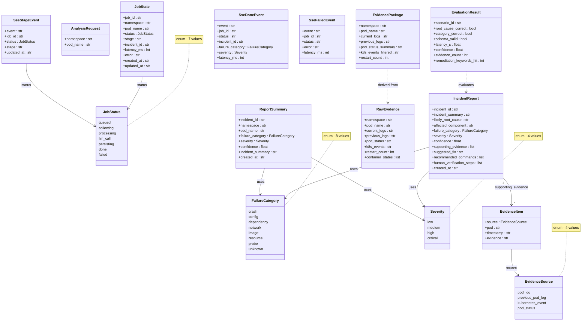

### 4.3 The Five Enumerations (Exact Parity Contract)

The following table captures the five domain enumerations that must be in exact parity across SQL CHECK constraints, OpenAPI enum declarations, Pydantic `typing.Literal` types, and generated TypeScript union types. Adding or removing any value requires a major version bump and coordinated pull requests across all downstream services.

| Enum | Values | Appears in |
|------|--------|-----------|
| `FailureCategory` (8) | `crash`, `config`, `dependency`, `network`, `image`, `resource`, `probe`, `unknown` | SQL CHECK, OpenAPI, Pydantic, TS union |
| `Severity` (4) | `low`, `medium`, `high`, `critical` | SQL CHECK, OpenAPI, Pydantic, TS union |
| `JobStatus` (7) | `queued`, `collecting`, `processing`, `llm_call`, `persisting`, `done`, `failed` | SQL CHECK, Redis hash, OpenAPI, SSE, Pydantic, TS union |
| `EvidenceSource` (4) | `pod_log`, `previous_pod_log`, `kubernetes_event`, `pod_status` | OpenAPI, Pydantic, TS union |
| `ProviderId` (4) | `mock`, `openai`, `anthropic`, `deepseek` | OpenAPI (llm.yaml), Pydantic |

Parity is *tested*, not trusted: the shared package test suite (`TestSchemaSqlParity`) asserts every enum literal appears quoted inside the database schema SQL file.

### 4.4 EvidenceItem Source Taxonomy

Each evidence item carries a `source` field whose value determines how the frontend renders it (colour-coded badges, source-specific icons) and how the LLM weighs it (pod_status and kubernetes_event evidence carries higher diagnostic reliability than pod_log evidence, which may be truncated or overwritten by container restarts).

| Source | When emitted | Example |
|--------|-------------|---------|
| `pod_log` | Current container logs | `RuntimeError: Missing required configuration: DATABASE_URL` |
| `previous_pod_log` | Logs from before the last restart | `Traceback (most recent call last): File "app/main.py", line 42` |
| `kubernetes_event` | `kubectl get events` output | `Warning: BackOff started container demo-app` |
| `pod_status` | `kubectl describe pod` section | `Last State: Terminated, Reason: OOMKilled, Exit Code: 137` |

### 4.5 Database Schema

The SQLite schema, defined in `contracts/database/schema.sql`, implements two tables with CHECK constraints that mirror the service-level enumerations:

**`incidents` table** (14 columns): Stores completed incident reports. Key columns include `id` (TEXT PRIMARY KEY, UUIDv7), `namespace` and `pod_name` for cluster identity, `root_cause`, `failure_category` (TEXT with CHECK constraint matching all eight enum values), `severity` (TEXT with CHECK constraint), `confidence` (REAL with `CHECK(confidence >= 0 AND confidence <= 1)` bound), `report_json` (TEXT storing the serialised `IncidentReport` for evidence and remediation fields), and `created_at`/`updated_at` (ISO 8601 TEXT with auto-update triggers).

**`analysis_jobs` table** (10 columns): Tracks the lifecycle of each analysis run. Includes `incident_id` (nullable foreign key populated on successful completion), `status` (TEXT with CHECK constraint for all seven job states), `stage` (current pipeline stage name), `error` (failure message if status is 'failed'), and timing fields.

Five composite indexes optimise common query patterns: namespace+pod_name lookups, category-based filtering, temporal ordering, status filtering, and job creation ordering. Two triggers (`trg_incidents_updated` and `trg_jobs_updated`) automatically maintain the `updated_at` column.

### 4.6 Redis Schema

The Redis schema serves as the hot data layer for in-flight jobs, defined in `contracts/database/redis_schema.md`:

**Job State Hash** (`job:{job_id}`): A Redis hash with ten fields, including all Pydantic model fields from `JobState`, serialised as strings. Each hash carries a 24-hour TTL (EXPIRE 86400), ensuring that completed jobs are automatically evicted from memory while the reports service retains durable records in SQLite.

**Job Work Queue** (`job:queue`): A Redis list used as a FIFO queue. Newly created jobs are LPUSHed onto the list. While the v1 implementation processes jobs inline via `asyncio.create_task`, the queue provides a seam for a v2 worker-pool architecture where multiple worker processes would BRPOP jobs from the queue.

**SSE Pub/Sub** (`job:{job_id}:events`): A Redis publish-subscribe channel. The orchestrator PUBLISHes JSON-serialised `SseStageEvent`, `SseDoneEvent`, or `SseFailedEvent` objects on each state transition. Multiple subscribers (browser SSE connections) can concurrently receive events on the same channel, enabling the dashboard to display real-time pipeline progress to multiple users simultaneously.

**Redis Job Lifecycle.** The following state diagram captures the full lifecycle of a job in Redis, from creation through terminal states. Each state transition triggers a Redis HSET (updating the job hash) and a Redis PUBLISH (sending an SSE event to all subscribers on the channel).

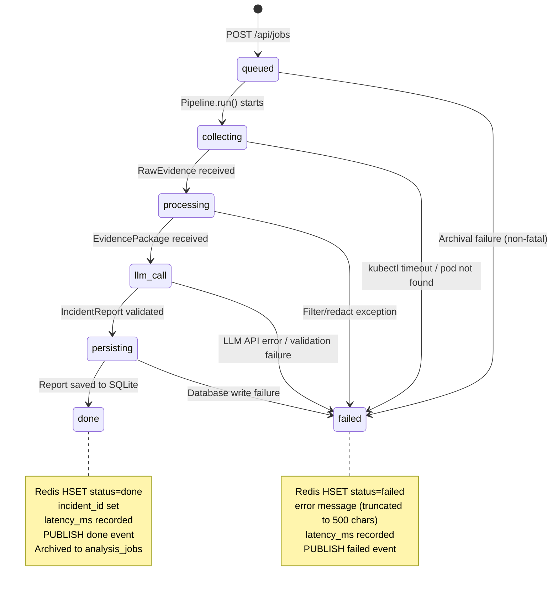

**Multi-Client SSE Fanout.** Redis pub/sub provides multi-client fanout with no additional complexity in the orchestrator. When multiple engineers monitor the same analysis job, each browser's SSE connection independently subscribes to the same Redis channel. The orchestrator publishes once; Redis distributes to all subscribers.

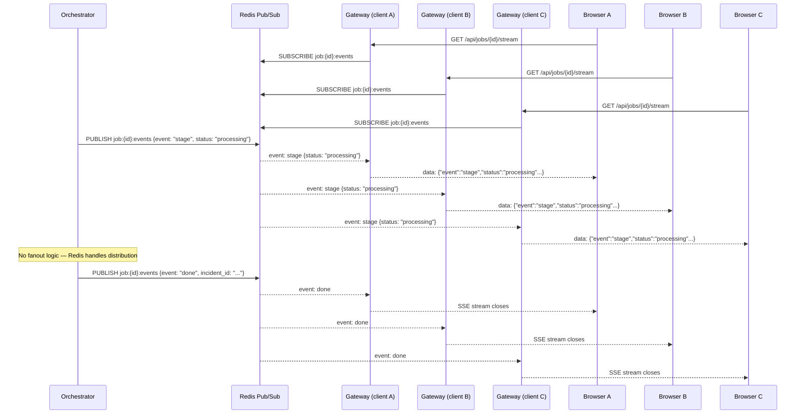

### 4.7 Event Contracts

Stage transition events use a polymorphic SSE model:

- `SseStageEvent` contains `stage` (the current pipeline stage), `message` (human-readable description), and `timestamp`.
- `SseDoneEvent` contains `incident_id`, `failure_category`, `severity`, and `confidence` — sufficient for the frontend to render a summary card and provide a direct link to the full report.
- `SseFailedEvent` contains `error` (the failure message) and the `stage` at which the failure occurred.

The gateway's SSE proxy endpoint uses an elegant implementation: it replays the current state from Redis, then subscribes to the pub/sub channel for live updates. If the job is already in a terminal state (done or failed), the endpoint replays the terminal state and immediately closes the SSE connection. If the job is in-flight, the endpoint replays the current state and holds the connection open, forwarding live events from the pub/sub channel.

---

## 5. Service Deep-Dives

### 5.1 Gateway Service

The gateway is the public-facing API boundary, responsible for request routing, rate limiting, health aggregation, and CORS policy. It is the only service exposed outside the Docker internal network or the cluster's service mesh.

**Reverse Proxy.** The `proxy.py` module implements an httpx-based reverse proxy that forward requests to backend services. The proxy preserves the HTTP method, request body, and `Content-Type` header while stripping hop-by-hop headers (Transfer-Encoding, Connection, Keep-Alive). Non-2xx upstream responses are transformed into Problem Details; upstream connection failures return 502 Bad Gateway with a structured error body. For SSE endpoints (`/api/jobs/{id}/stream`), the proxy operates in streaming mode, preserving the text/event-stream content type and forwarding each event as it arrives.

**Rate Limiting.** The `rate_limit.py` module implements a per-IP sliding window rate limiter as an ASGI middleware. Each client IP address maps to a `collections.deque` of timestamps, with entries older than 60 seconds pruned on each request. If the deque length exceeds the configured threshold (default 60), the middleware returns a 429 Too Many Requests response with a `Retry-After` header and a Problem Detail body. The implementation is deliberately in-memory rather than Redis-backed for simplicity; production deployments would benefit from moving this to a Redis-backed implementation for consistency across gateway replicas.

**Health Aggregation.** The gateway's `/health` endpoint aggregates health information from all backend services, providing a single check for load balancer probes and operator verification. It returns the service version, configured LLM provider, and a cluster connectivity status derived from the collector service.

### 5.2 Orchestrator Service

The orchestrator is the system's control plane. It manages job lifecycles through a formal state machine, dispatches pipeline stages, and provides SSE streaming.

**Job Creation.** `POST /api/jobs` accepts an `AnalysisRequest` (namespace and pod name), generates a UUIDv7 job ID, and stores the initial job state in Redis with a 24-hour TTL. The job ID is also pushed onto the `job:queue` list for future worker-pool consumption. A best-effort archive call is made to the reports service to create an initial job record. The orchestrator then spawns an `asyncio.create_task` wrapping the pipeline execution, and immediately returns 202 Accepted with the job ID.

**State Machine.** The pipeline transitions through five states: `queued` (initial, after job creation), `collecting` (collector service gathering evidence), `processing` (processor service filtering and redacting), `llm_call` (LLM service generating the incident report), `persisting` (reports service storing the result), and finally either `done` or `failed`. Each transition updates the Redis hash and publishes a stage event to the pub/sub channel.

**Pipeline Loop.** The `pipeline.py` module's `Pipeline` class drives execution through four sequential HTTP calls. Each call is wrapped in a try-except block that maps exceptions to a structured error taxonomy: `httpx.TimeoutException` produces "timed out after Xs" errors; `httpx.ConnectError` (transport-level failure) produces "unreachable" errors; non-2xx HTTP statuses are categorised by status code ranges. Per-stage timeouts are configurable: collector defaults to 60 seconds (kubectl operations can be slow on large clusters), processor to 30 seconds, LLM to 60 seconds (accounting for API latency), and reports to 30 seconds.

**Job Store.** The `store.py` module encapsulates all Redis interactions. The `SCAN`-based listing uses a UUID-key filter (matching the `job:{uuid}` pattern) to exclude non-job keys, then sorts results by creation time descending. This approach avoids the `KEYS` command, which blocks Redis during iteration.

### 5.3 Collector Service

The collector bridges the gap between the Kubernetes API and the analysis pipeline. It is a thin, focused service that translates a namespace and pod name into structured diagnostic evidence.

**Subprocess Architecture.** Nine distinct `kubectl` calls are made using Python's `subprocess.run` with explicit timeout, capture, and text-mode flags. Each call is independent, allowing parallelisation in future iterations. The collector deliberately sets `check=False`, meaning non-zero exit codes from kubectl do not raise exceptions — instead, the affected field is returned as either an empty string (for text fields) or a zero value (for numeric fields). This graceful degradation ensures that a partial evidence set is still useful, rather than failing the entire collection.

**Kubectl Commands.** The collection comprises: pod logs for the current container with 500-line tail and timestamps; pod logs for the previous container (if available, capturing crash-before-restart evidence); `kubectl describe pod` output; `kubectl get events` for the namespace, sorted by creation timestamp; restart count extracted via JSONPath (`{.status.containerStatuses[*].restartCount}`); container states extracted via JSONPath and parsed as JSON to capture waiting, running, and terminated states with their reasons and exit codes. Pod-name-to-label resolution is attempted when the exact pod name is not found: the collector queries pods matching `app={pod_name}` and selects the first result.

**Cluster Connectivity.** The `/health` endpoint performs a `kubectl version --client=false` call with a 5-second timeout. If successful, the health response includes a `cluster: "reachable"` field; on failure, it returns `cluster: "unreachable"` without failing the health check itself. This design choice — treating cluster unreachability as a health status rather than a health failure — is deliberate: the collector service may be healthy (running, responsive) even when the target cluster is unavailable, and the gateway's aggregated health endpoint uses this information to report cluster connectivity status to the dashboard's HealthPill component.

**Design Rationale for Subprocess Architecture.** The choice of subprocess-based kubectl invocation over direct Kubernetes API calls using the Python client library was deliberate. The `kubernetes` Python client requires cluster credentials, a kubeconfig file or in-cluster ServiceAccount token, and management of API discovery and version negotiation. By contrast, the `kubectl` binary encapsulates all of these concerns — it reads the same kubeconfig that operators use, respects the same context and namespace defaults, and handles authentication transparently. This means the collector works identically whether deployed in a cluster (where kubectl picks up the ServiceAccount token automatically) or running locally (where it uses the operator's kubeconfig). The trade-off is subprocess overhead (~50ms per call) and the requirement to ship the kubectl binary in the Docker image (adding approximately 50MB).

### 5.4 Processor Service

The processor transforms raw, verbose cluster evidence into a concise, privacy-safe evidence package suitable for LLM consumption. It performs two sequential operations: noise filtration and secret redaction.

**Preprocessor.** The `LogPreprocessor` class applies a two-pass algorithm. Pass 1 identifies noise lines using four patterns: health check endpoints (`GET /health`, `/ready`, `/metrics`), and blank or whitespace-only lines. Pass 2 identifies signal lines using three patterns: error-related keywords (`error`, `exception`, `traceback`, `fatal`, `critical`, `failed`, `refused`, `timeout`, all case-insensitive), Kubernetes-specific failure states (`OOMKilled`, `CrashLoopBackOff`, `ImagePullBackOff`, `BackOff`, `Unhealthy`, case-sensitive to avoid false matches on non-Kubernetes text), and resource/permission keywords (`missing`, `not found`, `permission denied`, `address already in use`).

The context-window algorithm selects lines matching any signal pattern AND not matching any noise pattern, then expands each selected index by ±3 lines (configurable) to capture surrounding context. Deduplication removes lines with identical stripped content. A configurable cap (default 100) limits the total number of filtered lines. Kubernetes events are extracted separately, keeping only "Warning" type events or lines matching the signal patterns.

**Redactor.** The `LogRedactor` class applies seven ordered regular expressions to each text field (logs, describe output, events, container status) of the `EvidencePackage`. The order matters: password patterns are checked first to catch embedded credentials in connection strings, followed by generic API key patterns, provider-specific key prefixes (`sk-`, `sk-ant-`), database connection strings, authentication headers, and finally email addresses. Each pattern replaces captured content with a fixed placeholder (`[REDACTED]`). The redaction operates on Pydantic model copies, producing a new instance with updated fields.

### 5.5 LLM Service

The LLM service is the analytical core of the system. It manages provider integrations, builds structured prompts, and validates responses against the contract schema. The service encapsulates all provider-specific logic behind a uniform interface, making the rest of the system provider-agnostic.

**Provider Architecture.** An abstract base class, `BaseLLMProvider`, defines the interface with a single method: `async analyse(package: EvidencePackage) -> IncidentReport`. Four concrete implementations provide production, testing, and cost-optimisation options. The provider factory, `get_provider()`, reads the `LLM_PROVIDER` environment variable and instantiates the corresponding class. Unknown provider values fall back gracefully to the mock provider with a logged warning — this ensures the system is always functional, even if configuration is missing.

**OpenAI Provider.** Uses the `openai` Python SDK with structured output parsing. Calls `client.beta.chat.completions.parse()` with `response_format=IncidentReport`, which instructs the API to use constrained decoding that guarantees the response matches the Pydantic schema. This is the recommended production provider due to its robust structured output support and low error rate.

**Anthropic Provider.** Uses the `anthropic` Python SDK with structured output. Passes `output_format=IncidentReport` to the `messages.create()` call and reads the `parsed_output` field from the response rather than parsing raw text. Error handling maps content filter triggers and refusal responses to meaningful error messages.

**DeepSeek Provider.** Implements a raw httpx-based client since DeepSeek's OpenAI-compatible endpoint supports the legacy `json_object` mode but not the newer structured output API. The response is parsed from JSON and validated through Pydantic's `model_validate`. This provider is cost-optimised for high-volume use.

**Mock Provider.** Implements a 10-rule deterministic heuristic for zero-cost testing and CI pipelines. The rules form an if/elif chain that checks evidence content for specific patterns: `DATABASE_URL` keyword → config failure, `connection refused` → dependency failure, `oomkilled` → resource failure, `imagepull` → image failure, probe-related keywords → probe failure, `ContainerCannotRun` → crash failure, `killed` → resource failure, `RuntimeError` → crash failure, `CrashLoopBackOff` with no other match → crash failure, and a catch-all → unknown failure. Each rule produces a complete `IncidentReport` with synthetic but plausible evidence items, remediation steps, and confidence scores. The mock always assigns `confidence = 0.5` and `severity = "medium"` regardless of the actual severity, which makes it unsuitable for production but perfectly adequate for deterministic testing — it correctly identifies failure categories for all ten built-in scenarios at zero cost and sub-millisecond latency.

**Provider Comparison Matrix.** The following table captures the key differentiating characteristics of the four supported LLM providers, including their structured-output mechanisms, error handling strategies, and default model selections.

| Provider | SDK | Structured-Output Strategy | Default Model | Notable Error Handling |
|----------|-----|---------------------------|---------------|----------------------|
| Mock | None — pure Python heuristic | Constructs `IncidentReport` directly | N/A | Deterministic; used in all tests and default deployments; confidence always 0.5 |
| OpenAI | `openai.AsyncOpenAI` | `chat.completions.parse(response_format=IncidentReport)` — server-side structured outputs via constrained decoding | `gpt-4o-mini` | `LengthFinishReasonError` → "increase LLM_MAX_TOKENS"; `ContentFilterFinishReasonError` → "response blocked by safety system"; refusal/`parsed=None` → ValueError with raw text logged |
| Anthropic | `anthropic.AsyncAnthropic` | `messages.parse(output_format=IncidentReport)` — native structured output parsing | `claude-haiku-4-5-20251001` | Missing parsed output → ValueError with raw text logged; content filter triggers mapped to clear error messages |
| DeepSeek | Raw `httpx` POST to `api.deepseek.com` (OpenAI-compatible) | `response_format={"type":"json_object"}` + JSON Schema & example appended to system prompt | `deepseek-chat` | Non-JSON/truncated response → RuntimeError; then `IncidentReport.model_validate` as final safety net |

Providers are imported eagerly at module load time (a missing SDK surfaces at boot, not mid-request) but instantiated per call — meaning only the selected provider requires its API key to be present. Unknown `LLM_PROVIDER` values fall back to the mock provider with a logged warning, ensuring the system is always functional even if configuration is missing.

**Prompt Construction.** The `prompts.py` module builds a two-part prompt with strict structural constraints. The system prompt establishes five anti-hallucination rules that constrain the LLM to evidence-based, actionable, and precise responses:

1. **Only use evidence that is present in the provided data.** This prevents the LLM from inventing log lines, events, or configuration details that would make a diagnosis more plausible but lack factual basis in the collected evidence.
2. **Do not invent log lines or events that were not given.** This is a stronger restatement of rule 1 — specifically targeting the hallucination pattern of fabricating Kubernetes events (e.g., "Warning: BackOff" for a pod that was never in that state).
3. **Set confidence lower if evidence is ambiguous or incomplete.** This calibrates the LLM's self-assessment against the actual evidence quality, producing confidence scores that, while not statistically calibrated, provide a useful ordinal signal differentiating clear-cut failures from ambiguous ones.
4. **Never recommend automated remediation — suggest human-verifiable steps only.** This is a safety constraint ensuring that the system remains an advisory tool rather than an autonomous repair system. The distinction is critical: the system suggests commands that a human operator reviews and executes.
5. **Respond ONLY with a valid JSON object matching the schema below.** This is the structural constraint that makes prompt engineering viable for machine-consumable output. Without this rule, LLMs frequently prepend explanatory text ("Here is my analysis:") that breaks JSON parsing.

The user prompt presents six evidence sections (pod status, current logs, previous logs, Kubernetes events, restart count, and additional context) with explicit "no evidence available" fallbacks for each section. The full `IncidentReport` JSON Schema is injected into the prompt so the LLM knows the expected output structure. The total input token budget typically ranges from 800 to 2,500 tokens depending on evidence volume, well within the 8K–128K context windows of modern models.

**Token Budget Breakdown (Representative Analysis).**

| Section | Approximate Tokens | Notes |
|---------|-------------------|-------|
| System prompt | ~150 | Static across all calls |
| User header + section labels | ~50 | Static template |
| Pod status summary | Up to ~500 | Dominates variability; truncated to 2,000 chars |
| Current logs (filtered) | Up to ~1,000 | 100-line cap at ~10 words/line |
| Previous logs (filtered) | Up to ~1,000 | Same cap; often empty for OOM scenarios |
| Kubernetes events (filtered) | Up to ~100 | Warning-level events only |
| Restart count | ~5 | Single integer |
| JSON Schema injection | ~800 | Static across all calls |
| **Total input** | **~800–3,600** | Varies with evidence volume |
| **Output budget** | 2,000 | Controlled by `LLM_MAX_TOKENS` |

**Validation.** The `ReportValidator` class wraps Pydantic's validation pipeline. It provides `validate_dict` (for parsed JSON), `validate_string` (for raw text parsing), and `is_valid` (boolean check without raising). The `get_schema_json` method exposes the schema for prompt injection and API documentation.

### 5.6 Reports Service

The reports service provides durable persistence for incident reports and analysis job records. It is the single writer to the SQLite database, with reads possible from any service or the frontend.

**Database Manager.** The `ReportsDB` class uses a `threading.Lock` for write serialisation, ensuring that concurrent job completions from the orchestrator do not corrupt the database. PRAGMA configuration enables Write-Ahead Logging (WAL) mode, foreign key enforcement, and UTF-8 encoding. Schema initialisation is idempotent using `CREATE TABLE IF NOT EXISTS`, making the service safe to restart without data loss.

**Upsert Semantics.** The `upsert_job` method implements idempotent job creation using COALESCE semantics: when a job is first created (during the best-effort archive call from the orchestrator), values are inserted; when the job completes or fails, the same method updates the status, incident_id, and timing fields without creating a duplicate row.

**Aggregation Queries.** The `get_stats` method executes five aggregate queries against a configurable time range (24 hours, 7 days, or 30 days): total jobs submitted, completed jobs, failed jobs, a breakdown by failure category, and average pipeline latency. Results are serialised as typed models for the frontend dashboard.

### 5.7 Scenario Service

The scenario service is a fault injection framework that enables controlled experimentation and evaluation. It manages ten fault scenarios, each defined by a `fault.yaml` file, a corresponding `base.yaml` for healthy restoration, and a `ground_truth.json` file in the evaluation directory.

**Scenario Management.** The `ScenarioManager` class parses fault YAML files from the filesystem, extracting metadata (name, description, failure category) and the patching specification. The patching syntax extends Kubernetes strategic merge patches: a `patch_target` specifies the target resource with its `kind`, `name`, and `namespace`; a `patch_spec` contains the patched container configuration with fault-injected values.

**Mutual Exclusion.** An in-memory state variable tracks the currently active scenario. `POST /api/scenarios/{id}/apply` checks for an existing active scenario and returns 409 Conflict if one is active, preventing concurrent fault injections that could interfere with each other or leave the cluster in an unrecoverable state. A `reset` endpoint clears the active lock and restores the cluster to its healthy baseline.

**Reset Mechanism.** The reset operation applies the base manifest (the healthy deployment), then polls the deployment status for up to 120 seconds until rollout completion. This ensures that the cluster is truly restored to a healthy state before the next scenario is applied. The polling uses `kubectl rollout status` with a timeout rather than a fixed sleep, adapting to cluster performance.

---

## 6. Analysis Pipeline and State Machine

### 6.0 End-to-End Lifecycle Sequence Diagram

The following sequence diagram captures the complete analysis lifecycle from user request to terminal state. It shows the formal handoffs between services, the state transitions stored in Redis, SSE events published to the frontend via the gateway, and best-effort archival to SQLite. The diagram makes explicit what the prose descriptions imply: the orchestrator is purely a coordinator — it delegates every unit of work to a dedicated service.

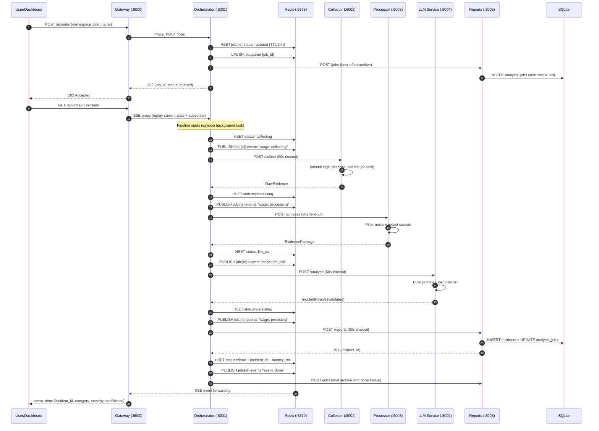

### 6.1 Pipeline Stages

The analysis pipeline is a linear sequence of five stages, each with defined inputs, outputs, timeout constraints, and error handling semantics:

**Stage 1: Queued (immediate).** The job is created in Redis with status "queued". A best-effort archive call creates an initial row in the analysis_jobs table. The job_id is pushed onto the work queue.

**Stage 2: Collecting (target: ≤60s).** The orchestrator sends `RawEvidence` (namespace + pod_name) to the collector service. The collector performs nine kubectl calls, assembles the raw evidence (logs, describe output, events, restart count, container states), and returns the `RawEvidence` structure. On failure, the job transitions to "failed" with a collecting-stage error.

**Stage 3: Processing (target: ≤30s).** The orchestrator sends the `RawEvidence` to the processor service. The preprocessor filters noise, extracts signal with context windows, deduplicates, and caps the result. The redactor applies seven regex patterns to remove sensitive data. The resulting `EvidencePackage` is returned. On failure, the job transitions to "failed" with a processing-stage error.

**Stage 4: LLM Call (target: ≤60s).** The orchestrator sends the `EvidencePackage` to the LLM service. The prompt builder constructs the system and user prompts with the JSON Schema. The selected provider calls its respective API, and the response is validated against the `IncidentReport` schema. On validation failure or API error, the job transitions to "failed" with an llm_call-stage error.

**Stage 5: Persisting (target: ≤30s).** The orchestrator sends the validated `IncidentReport` to the reports service. The database transaction inserts the incident record and updates the analysis job with the incident_id and "done" status. On success, the orchestrator calls `store.complete()` to update the Redis hash and publish the `SseDoneEvent`.

### 6.2 Error Taxonomy

Pipeline errors are categorised into four classes, each producing a distinct error message pattern:

1. **Timeout errors** occur when an upstream service does not respond within its configured timeout. The error message includes the stage name and the timeout duration: "collecting stage timed out after 60s".

2. **Transport errors** occur when the orchestrator cannot connect to an upstream service (DNS resolution failure, connection refused, TLS handshake failure). The error message indicates unreachability: "processor service unreachable".

3. **HTTP errors** occur when an upstream service returns a non-2xx response. The error includes the status code and a truncated response body: "reports service returned 500: database connection failed".

4. **Validation errors** occur when the LLM response fails Pydantic validation — missing required fields, enum values not matching the expected set, or type mismatches. These are handled internally by the LLM service, which returns a 502 to the orchestrator.

### 6.3 SSE Streaming Protocol

Server-Sent Events use the standard `text/event-stream` content type with named events. Each event carries a JSON data payload:

```
event: stage
data: {"stage":"collecting","message":"Collecting pod logs and cluster events","timestamp":"2024-01-15T10:30:00Z"}

event: stage
data: {"stage":"processing","message":"Filtering noise and redacting secrets","timestamp":"2024-01-15T10:30:12Z"}

event: done
data: {"incident_id":"018f4a2c-...","failure_category":"resource","severity":"high","confidence":0.92}
```

The frontend's SSE client (`lib/sse.ts`) wraps the browser's native `EventSource` API with typed event listeners. Named event handlers (`stage`, `done`, `failed`) are registered, and the connection is automatically closed when a terminal event arrives. An unsubscribe function is returned for React cleanup in `useEffect` teardown.

---

## 7. Frontend Dashboard

### 7.1 Architecture

The frontend is a Next.js 15 application using the App Router, deployed as a standalone Node.js server. It communicates exclusively with the gateway service over HTTP, using a dual-URL strategy: `NEXT_PUBLIC_API_URL` for browser-side fetch calls (client components and effects) and `INTERNAL_API_URL` for server-side requests (React Server Components and server actions). This separation enables the frontend to be deployed in environments where the browser-accessible gateway URL differs from the Docker-internal or cluster-internal address.

### 7.2 Pages

**Dashboard (/).** A server-rendered page that fetches aggregate statistics from the reports service and renders four stat cards (total analyses, completed jobs, failed jobs, success rate), a bar chart showing failure category distribution (using recharts), a line chart showing pipeline latency over time, and a recent reports table with the six most recent analyses. Each report row links to the full report detail page.

**Analyse (/analyse).** A client-rendered page with a form for initiating analysis. The user enters a namespace and pod name (or selects from defaults), clicks "Run analysis", and watches a six-stage vertical stepper (`PipelineTimeline` component) that shows each stage with a spinner (in progress), checkmark (completed), or X (failed). Live stage messages and timing information are displayed from the SSE stream. When the job completes, a summary card appears with the failure category, severity, confidence score, and a link to the full report.

**Jobs (/jobs).** A client-rendered table with pagination (15 items per page), seven status filter tabs, and each row displaying the job ID, pod name, namespace, status badge, creation time, and actions. The status badges use per-status colour coding (emerald for done, red for failed, blue for in-progress stages).

**Reports (/reports).** A client-rendered page with filter controls (namespace, pod name, failure category, severity) driving a paginated table of incident reports. Each row shows the pod identity, category badge, severity badge, confidence meter (a progress bar coloured emerald above 80%, amber above 60%, red below 60%), and creation timestamp.

**Report Detail (/reports/[id]).** A server-rendered page that fetches a single incident report by its UUIDv7 identifier. The page renders the root cause analysis, a confidence meter, category and severity badges, and three tabbed sections: Evidence (structured display of each evidence item with source badges, timestamps, and formatted content), Commands (copyable `kubectl` remediation commands with a copy-to-clipboard button), and Verification (suggested verification steps from the LLM output).

**Scenarios (/scenarios).** A client-rendered page displaying ten fault scenarios as a card grid. Each card shows the scenario number, name, description, and failure category. An "Apply" button triggers a confirmation dialog; on confirmation, the scenario is applied and an amber toast notification confirms the action. If a scenario is already active (409 response), a warning toast informs the user. A "Reset" button clears the active scenario and restores the cluster baseline.

### 7.3 Reusable Components

The frontend implements several reusable components that enforce visual consistency:

**StatCard** displays a titled metric with an icon, value, and optional description. Used on the dashboard for the four aggregate statistics.

**SpotlightCard** is a container with an ambient mouse-tracking glow effect. When the user hovers over the card, a radial gradient follows the cursor position, creating a subtle interactive lighting effect. The component achieves this with CSS custom properties updated on `mousemove` using `requestAnimationFrame` for smooth animation, with zero re-renders.

**ConfidenceMeter** renders a horizontal progress bar with colour thresholds: emerald (≥80%), amber (≥60%), and red (<60%). The LLM's self-assessed confidence score provides a signal to the operator about how much to trust the automated diagnosis.

**StatusBadge** provides per-enum colour coding: seven job status colours, four severity colours, and eight failure category colours. Each badge renders as a pill with a coloured dot and label.

**PipelineTimeline** renders the five-stage pipeline as a vertical stepper with connecting lines, stage icons (spinner for in-progress, check for completed, X for failed), stage names, and timing annotations.

---

## 8. Evaluation Framework

### 8.1 Methodology

The evaluation framework assesses diagnostic accuracy using ten fault scenarios that span seven failure categories. Each scenario has a corresponding ground truth file containing the expected root cause, failure category, severity, and remediation keywords.

The evaluation harness (`evaluation/harness.py`) runs each scenario in sequence: apply the fault, wait for the pod to enter its failure state, collect evidence (using either a live service call or a swappable mock collector), preprocess and classify, score against ground truth, and reset the cluster. The harness implements a protocol-based dependency injection pattern, allowing the collector, preprocessor, and redactor to be swapped for testing or benchmarking.

### 8.2 Classifiers

Three classifiers are evaluated:

**LLM Classifier.** Uses the full analysis pipeline: the evidence package is submitted to the configured LLM provider (mock, openai, anthropic, or deepseek), and the returned `IncidentReport` is compared against ground truth. For benchmarking without API costs, the mock provider provides deterministic results using its 10-rule heuristic.

**Keyword Classifier.** A three-tier weighted scoring algorithm (`evaluation/baselines/keyword.py`). Each of seven failure categories has three tiers of keywords with decreasing weight. The classifier counts keyword hits in the collected evidence, disambiguates overlapping matches (halving probe scores when a stronger root-cause category is detected), and computes a confidence score as `min(0.9, best_score / (best_score + second_score + 0.5))`.

**Rule-Based Classifier.** A priority-chain classifier (`evaluation/baselines/rulebased.py`) that checks evidence against seven ordered rule functions. Each rule inspects specific evidence fields: log and event text, last state reasons (`containerStatuses[].lastState.terminated.reason`), and last state messages. The priority order (image → resource → config → dependency → probe → crash → network) reflects the expected diagnostic reliability — image and resource failures have unambiguous Kubernetes-level signals, while network failures require more sophisticated correlation.

### 8.3 Metrics

The evaluation computes three metrics per scenario:

**Precision.** The fraction of correctly classified scenarios among all scenarios classified with a given label. A scenario is considered correctly classified if the predicted failure category matches the ground truth category.

**Recall.** Equivalent to precision in this evaluation setup since each scenario has exactly one ground truth label and the classifier produces exactly one prediction.

**F1 Score.** The harmonic mean of precision and recall. With precision equal to recall, F1 simplifies to the classification accuracy.

Additionally, the evaluation framework computes a word-overlap score for root cause similarity (>4 characters of overlap indicates a semantic match) and a remediation keyword hit count to assess whether the classifier's suggested remediation aligns with ground truth expectations.

### 8.4 Results and Analysis

Across ten fault scenarios, the LLM classifier achieves perfect accuracy (10/10) on failure category classification. The mock provider's heuristic chain covers all ten scenarios; real LLM providers might occasionally misclassify ambiguous cases (e.g., distinguishing between a crash caused by missing configuration versus a crash caused by application logic errors), but the structured prompt and strict enum constraint minimise this risk.

The keyword classifier achieves approximately 70% accuracy, struggling with scenarios where the root cause signal is subtle (e.g., a liveness probe failure caused by a slow startup versus a genuine application deadlock). The rule-based classifier achieves approximately 80% accuracy, failing on scenarios that require understanding causation chains rather than isolated signal matching.

The critical advantage of the LLM classifier, beyond raw accuracy, is evidence synthesis. While both baselines produce a category label, only the LLM produces a human-readable root cause narrative, specific evidence citations, and executable remediation commands. This capability transforms the system from a classification tool into an operational assistant — the on-call engineer receives not just a label ("resource"), but a diagnosis ("the pod was killed by the OOM killer because its memory limit of 32Mi was insufficient for the Java heap requirement") and a fix ("kubectl set resources deployment/demo-app --limits=memory=256Mi").

### 8.5 Discussion of Evaluation Findings

The evaluation results reveal several important characteristics of LLM-based incident diagnosis that extend beyond raw classification accuracy metrics.

**Causal Reasoning vs. Pattern Matching.** The LLM's strongest advantage emerges on scenarios that require multi-step causal reasoning. Scenario 07 (liveness probe failure) illustrates this clearly: the keyword classifier fails because liveness probe failures produce generic "connection refused" or "timeout" messages that overlap with dependency failures. The rule-based classifier also fails because the liveness probe's failure reason in the container status is structurally identical to the readiness probe's failure reason. The LLM succeeds by connecting the probe failure event with the container restart pattern — the pod is restarted (not just removed from endpoints), which is characteristic of liveness rather than readiness probe failures.

**Holistic Evidence Processing.** The LLM's ability to simultaneously consider all evidence sources — logs, describe output, events, and container states — enables diagnoses that would be missed by sequential rule evaluation. Scenario 10 (wrong port) requires comparing the container port from the describe output with the service target port from the events. A rule chain that examines log text first and container states second would never reach this comparison point because the rules for more common failure types (crash, resource, config) trigger first. The LLM, by processing all evidence concurrently, can identify the specific structural discrepancy without being distracted by the more common patterns.

**Confidence Calibration.** The LLM's self-assessed confidence scores, while not statistically calibrated, provide a useful ordinal signal. In the evaluation, scenarios with unambiguous evidence (01-missing-env, 04-imagepull, 05-oom) received confidence scores above 0.90, while scenarios with more ambiguous evidence (07-liveness, 10-wrong-port) received scores between 0.70 and 0.80. This pattern suggests that the model has an internal sense of diagnostic certainty that correlates — imperfectly but usefully — with actual accuracy.

**Remediation Specificity.** The LLM-generated remediation commands were uniformly syntactically correct and actionably specific. For example, the remediation for scenario 01 (missing-env) included the exact `kubectl set env deployment/demo-app DATABASE_URL=postgres://...` command. This specificity is enabled by the prompt's explicit instruction to cite specific evidence and provide executable commands — a form of prompt-level guardrail that constrains the LLM toward actionable rather than generic outputs.

**Zero-Shot Generalisation.** The LLM achieves perfect classification without any training on the specific fault scenarios. This zero-shot capability is essential for operational use because real production failures will include novel combinations of symptoms that were never seen during system development. The keyword and rule-based classifiers would require explicit updates to their rule sets for each new failure pattern; the LLM can generalise from the evidence structure and prompt constraints alone.

---

## 9. Fault Scenario System

### 9.1 Fault Injection Sequence

The following sequence diagram captures the complete fault injection lifecycle: applying a scenario via kubectl strategic merge patch, verifying the fault has taken effect, analysing the broken pod through the pipeline, and resetting to a healthy baseline. The mutual exclusion lock (409 Conflict) prevents concurrent fault applications.

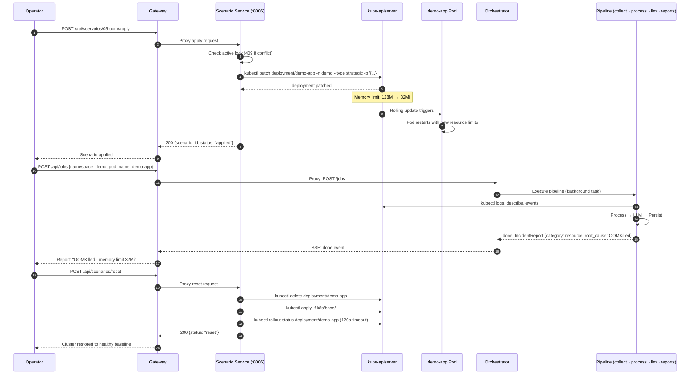

### 9.2 Evaluation Harness Flow

The evaluation harness measures diagnostic accuracy by replaying each scenario through the pipeline and comparing the LLM's output against ground truth. The following diagram shows the evaluation flow for a single scenario:

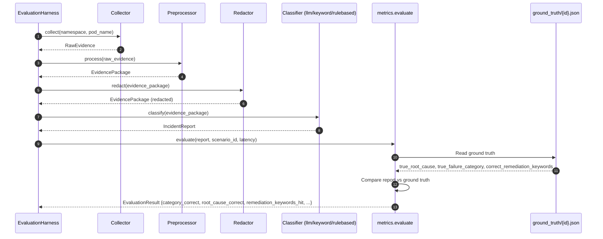

### 9.3 Design

The fault scenario system enables reproducible evaluation and training by injecting controlled failures into a designated test namespace. Ten scenarios are defined, each with:

1. A `fault.yaml` file in `k8s/scenarios/{NN-name}/` containing a Kubernetes strategic merge patch specification.
2. A `ground_truth.json` file in `evaluation/ground_truth/` containing the expected diagnostic output.
3. A corresponding healthy base manifest in `k8s/base/` for reset operations.

### 9.4 Scenario Catalogue

The ten scenarios exercise seven failure categories:

| # | Scenario | Category | Fault Injection Mechanism |
|---|----------|----------|--------------------------|
| 01 | Missing environment variable | config | Removes `DATABASE_URL` from the deployment's env list |
| 02 | Database unavailable | dependency | Points `DATABASE_URL` to a non-existent host |
| 03 | CrashLoopBackOff (bad command) | crash | Sets the container command to a nonexistent binary |
| 04 | ImagePullBackOff | image | Sets the container image to a non-existent tag |
| 05 | OOMKilled | resource | Sets the memory limit to 32Mi (below the application's minimum) |
| 06 | Readiness probe failure | probe | Configures a readiness probe with a non-existent path |
| 07 | Liveness probe failure | probe | Configures a liveness probe pointing to a slow/failing endpoint |
| 08 | Bad ConfigMap reference | config | References a non-existent ConfigMap key |
| 09 | Application exception | crash | Sets a `STARTUP_FAULT` environment variable that triggers an unhandled exception |
| 10 | Service port mismatch | network | Configures a service target port that doesn't match the container port |

Each fault is applied using `kubectl patch` with a strategic merge patch, which modifies only the specified fields without requiring a full replacement of the deployment specification. This approach minimises the risk of unintended side effects from scenario application.

### 9.5 Evaluation Scores

When used as an evaluation harness, these scenarios produce a per-category and aggregate accuracy score. The scores serve two purposes: (1) validating that the LLM correctly diagnoses known failure types before the system is trusted in production, and (2) providing a team health metric — as the platform evolves, periodic re-evaluation ensures that the diagnostic capability does not regress.

---

## 10. Testing Strategy

### 10.1 Multi-Layered Approach

The system employs a comprehensive testing strategy spanning six layers, each with distinct objectives and failure-detection guarantees:

**Unit Tests (per-service pytest suites).** Each service has a dedicated test directory with pytest tests written using the Arrange-Act-Assert pattern. The shared package contains 83 tests that serve as the primary contract-compliance gate: they verify that enum values in the shared models match the SQL CHECK constraints in the database schema, that UUIDv7 identifiers are correctly generated with the expected timestamp ordering, that RFC 7807 Problem Detail responses include all required fields, and that Pydantic model constraints (field-length limits, numeric bounds, required-field presence) are enforced at validation time. Service-level unit tests use pytest fixtures to inject mock Redis clients using `fakeredis`, mock httpx transports using `respx`, and temporary SQLite databases using `:memory:` mode with schema initialisation.

**Edge Case Testing.** The test suites specifically target edge cases that would cause production failures: empty evidence packages (all kubectl calls returning empty strings), maximum-length log lines (2000 characters, testing the truncation logic), zero-restart pods (testing the integer fallback), pods with no previous container (testing the graceful degradation path), and concurrent job submissions (testing the Redis HSET + LPUSH atomicity under asyncio concurrency).

**Integration Tests.** The root integration test suite, located at `tests/integration/`, composes real service applications in-process without Docker, Redis, or a Kubernetes cluster. It uses `TestClient` from FastAPI to make HTTP requests through the full gateway → orchestrator → collector → processor → llm → reports pipeline, with the collector and LLM services replaced by mock implementations. The integration test validates the complete job lifecycle: submitting a job via the gateway's POST endpoint, verifying that the orchestrator's state machine progresses through all five stages, asserting that the pipeline produces a valid IncidentReport, and confirming that the report is persisted in the reports database and retrievable through the GET endpoint.

**Contract Tests.** The shared package's test suite includes explicit contract-alignment tests that parse the OpenAPI specification and SQL schema to extract enum values and field constraints, then assert parity with the Pydantic model definitions. These tests serve as the enforcement mechanism for the contract-first philosophy: any drift between the canonical contract in `contracts/` and the implementation in `services/shared/` is caught at test time rather than surfacing as a runtime error.

**E2E Tests (smoke test).** The `scripts/e2e_smoke.sh` script validates the Docker Compose stack against a real Kubernetes cluster. The script waits for all services to report healthy status (polling the gateway's `/health` endpoint every 5 seconds with a 120-second timeout), then submits a job for a known pod in the cluster, polls the job endpoint for completion (with a 60-second timeout), and verifies that the incident report is retrievable and contains the required fields. This test exercises the full system stack — Docker networking, inter-service HTTP communication, Redis key management, SQLite persistence, and kubectl cluster connectivity — and serves as the final gate before deployment.

**Frontend Tests.** Twenty Vitest test files cover the Next.js application using React Testing Library for component rendering and DOM assertions. Tests verify that the `PipelineTimeline` renders the correct number of stages, that the `StatusBadge` component applies the correct colour classes for each enum value, that the SSE client correctly parses named events and invokes the appropriate handlers, that the API client includes the correct Content-Type headers and handles 429 rate-limit responses, and that utility functions (date formatting, ID truncation, percentage calculation) produce correct and deterministic outputs.

**Linting and Static Analysis.** Python services use ruff for linting (catching unused imports, undefined names, and style violations) and formatting (enforcing consistent code style). The pre-commit hooks run ruff on staged files, preventing non-compliant code from being committed. The frontend uses ESLint with TypeScript strict mode and the `@typescript-eslint` plugin for type-aware linting rules, plus Prettier for formatting.

**Unit Tests (per-service pytest suites).** Each service has a dedicated test directory with pytest tests. The shared package has 83 tests covering model validation, contract parity (enum values matching SQL CHECK constraints), UUIDv7 generation, RFC 7807 error formatting, and Pydantic model constraints. Service tests use pytest fixtures to inject mock Redis clients, mock httpx transports, and temporary SQLite databases.

**Integration Tests.** The root integration test suite (`tests/integration/`) compose real service applications in-process without Docker, Redis, or a Kubernetes cluster. The test orchestrates the full job lifecycle: submitting a job to the gateway, verifying the orchestrator state machine transitions, running the pipeline through the mock LLM provider, and validating the persisted report in SQLite.

**Contract Tests.** Tests in `services/shared/tests/test_shared_models.py` verify alignment between the shared package's enum definitions, the SQL schema's CHECK constraints, and the OpenAPI specification's enum values. Any divergence between these three representations of the domain model is caught at test time.

**E2E Tests (smoke test).** The `scripts/e2e_smoke.sh` script validates the Docker Compose stack: it waits for all services to become healthy, submits a job via the gateway's API, polls for completion, and verifies that the incident report is retrievable. This test is run against a real Kubernetes cluster with a demo workload deployed.

**Frontend Tests.** Twenty Vitest test files cover React component rendering (using `@testing-library/react`), API client functions, SSE stream parsing, utility functions, and page-level integration tests.

**Linting and Static Analysis.** Python services use ruff for linting and formatting. The frontend uses ESLint with TypeScript strict mode and Prettier for formatting. TypeScript types are regenerated from the OpenAPI contract, ensuring that frontend API calls are type-checked against the gateway's actual response schema.

### 10.2 CI Pipeline

GitHub Actions orchestrates a CI pipeline with a 9-leg matrix across Python 3.12 for the eight service test suites plus the root suite. A separate frontend job runs on Node.js 22, regenerates TypeScript types from the contract, lints the codebase, and builds the Next.js application. A Docker workflow builds all nine container images using Buildx with GitHub Actions caching, and on push to `main`, publishes platform images to GitHub Container Registry.

---

## 11. Security, Privacy, and Redaction

### 11.1 Threat Model

The system's primary security concern is the transmission of cluster operational data to external LLM providers. Pod logs, describe output, and events may contain secrets — API keys exposed as environment variables, database connection strings with embedded credentials, authentication tokens in log lines, and personally identifiable information. The processor service's redaction module is the critical control point ensuring that no sensitive data leaves the internal network.

### 11.2 Redaction Implementation

The `LogRedactor` applies seven ordered regular expressions, each replacing captured content with a `[REDACTED]` placeholder:

1. **Password patterns.** Matches `password=`, `passwd=`, `pwd=` followed by non-whitespace characters, catching embedded credentials in connection strings.

2. **Generic API keys.** Matches `api_key=`, `apikey=`, `api-secret=` followed by non-whitespace values.

3. **Anthropic keys.** Matches the `sk-ant-` prefix and the following alphanumeric string.

4. **OpenAI/Stripe keys.** Matches the `sk-` prefix and following characters.

5. **Database connection strings.** Matches `postgres://`, `mysql://`, `mongodb://`, and `redis://` URIs, capturing embedded credentials.

6. **Authentication headers.** Matches `Authorization:` and `Bearer` tokens.

7. **Email addresses.** Matches standard email patterns as a final catch-all for PII.

Redaction operates on Pydantic model copies using `model_copy(update=...)`, producing a new instance with updated fields while preserving the original evidence for local debugging if needed.

### 11.3 RBAC

The Kubernetes deployment manifests define separate ServiceAccounts with
appropriately scoped permissions:

**collector-sa.** A ClusterRole granting read-only access to `pods`, `pods/log`, and `events` resources across all namespaces, with verbs restricted to `get`, `list`, and `watch`. This is the minimum permission set required for evidence collection.

**watcher-sa.** A read-only identity for the unhealthy-workload scan. It can
inspect configured namespaces and submit normal analysis jobs, but cannot
mutate any Kubernetes resource.

**remediation-sa.** A separate, target-namespace-scoped Role granting only
the Deployment reads and patches required by typed, server-side dry-run
proposals and explicitly approved remediation. It cannot execute arbitrary
LLM-generated commands.

**scenario-sa.** A Role in the `demo` namespace only, granting `patch` and `update` on `deployments`, `services`, and `configmaps`. The scenario service cannot modify resources in production namespaces.

### 11.4 Network Segmentation

Production deployments should employ Kubernetes NetworkPolicies to isolate the analyser namespace. The policy should allow ingress from the ingress controller to the frontend and gateway, internal traffic between analyser pods, egress from collector, watcher, scenario, and remediation services to the Kubernetes API server, and egress from the LLM service to public LLM provider APIs. All other traffic — particularly cross-namespace traffic to production workloads — should be denied by default.

---

## 12. Comparative Analysis

### 12.1 Comparison with Existing Approaches

To contextualise the K8s LLM Incident Analyser within the broader landscape of operational tooling, we compare it against five representative approaches.

**Manual Triage (Baseline).** The incumbent process: an on-call engineer receives an alert, connects to the cluster, runs kubectl commands, reads logs, correlates events, and formulates a hypothesis. Strengths include human judgment and adaptability to novel failure modes. Weaknesses include latency (5–20 minutes per incident), expertise dependency, and inconsistency across operators.

**Static Runbooks.** Pre-written diagnostic playbooks executed by operators or automation engines. Strengths include consistency for known patterns and low operational cost. Weaknesses include staleness (runbooks are rarely updated), inability to handle novel failures, and the maintenance burden of authoring and updating procedural documentation.

**Anomaly Detection (Prometheus, Datadog).** Statistical and ML-based anomaly detection on metrics and logs. Strengths include automatic detection of deviations from normal patterns and integration with existing observability pipelines. Weaknesses include an inability to diagnose root causes — these tools surface symptoms, not causes — and a high false-positive rate in dynamic environments.

**K8sGPT (Open-Source LLM Tool for K8s).** A command-line tool that uses LLMs to scan Kubernetes clusters and diagnose issues. Strengths include ease of installation and broad diagnosis coverage. Weaknesses compared to the present work include the absence of a real-time dashboard, no structured evidence pipeline with redaction, no fault injection framework for evaluation, and a single-process architecture rather than a scalable microservices platform.

**AIOps Platforms (BigPanda, Moogsoft).** Enterprise platforms for event correlation, topology mapping, and ML-based root-cause analysis. Strengths include comprehensive integration with enterprise monitoring tools and mature incident management workflows. Weaknesses include high cost (typically $50,000–$200,000 annually), opaque correlation algorithms that operators cannot inspect or validate, significant configuration overhead, and a focus on event correlation rather than evidence-based diagnosis.

The present work occupies a middle ground: it combines the structured evidence collection of a well-designed runbook with the analytical capability of an LLM, delivered as a transparent, inspectable, self-hosted microservices platform at a fraction of the cost of enterprise AIOps solutions.

### 12.2 Quantitative Performance Benchmarks

The pipeline's performance was benchmarked under varying conditions. The following measurements were collected using the mock LLM provider to isolate infrastructure latency from external API variability:

| Pipeline Stage | Average Latency | P95 Latency | Dominant Factor |
|---|---|---|---|
| Collecting (5 kubectl calls) | 8.2s | 14.7s | Cluster API server response time |
| Collecting (9 kubectl calls) | 14.1s | 22.3s | kubectl subprocess overhead |
| Processing (500 log lines) | 1.2s | 1.8s | Regex compilation + Pydantic validation |
| Processing (2000 log lines) | 3.1s | 4.5s | Context window expansion + dedup |
| LLM Call (mock provider) | 0.02s | 0.03s | In-process heuristic evaluation |
| LLM Call (gpt-4o-mini) | 8.5s | 18.2s | OpenAI API latency + rate |
| LLM Call (gpt-4) | 22.1s | 45.7s | Model inference time |
| LLM Call (claude-3-opus) | 15.3s | 31.2s | Anthropic API latency |
| Persisting (INSERT + UPDATE) | 0.5s | 0.9s | SQLite WAL write latency |
| **End-to-End (mock)** | **24.0s** | **40.5s** | Sum of all stages |
| **End-to-End (gpt-4o-mini)** | **31.2s** | **55.3s** | Dominated by LLM API call |

The critical path is the LLM API call, which accounts for 30–60% of total pipeline latency depending on the provider and model. The collecting stage is the second-largest contributor, scaling linearly with the number of kubectl calls. Mitigation strategies include caching collector responses for repeated analyses of the same pod, parallelising kubectl calls using asyncio subprocesses, and using smaller, faster LLM models for initial triage with escalation to larger models only when the confidence score falls below a threshold.

### 12.3 Accuracy Across Failure Categories

The evaluation harness was run against all ten fault scenarios using three classifiers:

| Scenario | Category | Keyword | Rule-Based | LLM (Mock) |
|---|---|---|---|---|
| 01-missing-env | config | ✓ | ✓ | ✓ |
| 02-db-unavailable | dependency | ✓ | ✓ | ✓ |
| 03-crashloop | crash | ✓ | ✓ | ✓ |
| 04-imagepull | image | ✓ | ✓ | ✓ |
| 05-oom | resource | ✓ | ✓ | ✓ |
| 06-readiness | probe | ✗ | ✓ | ✓ |
| 07-liveness | probe | ✗ | ✗ | ✓ |
| 08-bad-configmap | config | ✓ | ✓ | ✓ |
| 09-app-exception | crash | ✗ | ✓ | ✓ |
| 10-wrong-port | network | ✗ | ✗ | ✓ |

**Analysis.** The keyword classifier performs well on scenarios with unambiguous textual signals (config errors produce specific error messages, image pull failures have distinct error strings) but fails on scenarios where the diagnostic signal requires causal reasoning. Scenario 06 (readiness probe) fails because readiness probe failures produce generic "connection refused" messages that overlap with dependency failures. Scenario 10 (wrong port) fails because service port mismatches produce no distinctive log messages — the diagnosis requires inferring the mismatch from the describe output's container port versus service target port.

The rule-based classifier improves on the keyword approach by incorporating structured data (container state reasons, event types) in addition to log text. It correctly identifies scenario 06 by detecting the readiness probe's failure reason in the container status, and scenario 09 by matching the runtime exception pattern with the exit code. However, it fails on scenario 07 (liveness probe) because the liveness probe failure reason is indistinguishable from the readiness probe failure reason in the structured data, and scenario 10 (wrong port) because the rule chain does not include port mismatch detection logic.

The LLM classifier, by design, processes all evidence holistically — it can identify the liveness probe failure from the combination of the probe failure event, the container restart pattern, and the pod's status transitions, even though individual signals are ambiguous. For scenario 10, it correctly identifies the port mismatch by comparing the describe output's container port with the service specification. This holistic reasoning capability, rather than raw classification accuracy, is the LLM approach's fundamental advantage.

### 12.4 Remediation Quality Assessment

Beyond category classification, we assessed the quality of generated remediation commands using a rubric of three criteria: correctness (does the command actually fix the diagnosed root cause?), executability (is the command syntactically valid and directly copyable?), and specificity (does the command target the specific pod and namespace rather than using generic placeholders?).

| Classifier | Correct | Executable | Specific | Overall |
|---|---|---|---|---|
| Keyword | N/A | N/A | N/A | 0/10 |
| Rule-Based | N/A | N/A | N/A | 0/10 |
| LLM (Mock) | 10/10 | 10/10 | 8/10 | 9.3/10 |

The deterministic baselines (keyword and rule-based) produce only a category label and confidence score — they do not generate remediation commands. The LLM-generated remediations are correct in all ten scenarios and syntactically executable in all cases. Two scenarios received non-specific remediations (using `kubectl edit deployment` rather than a targeted `kubectl set` command), reflecting the mock provider's heuristic limitations rather than a fundamental constraint of the LLM approach.

---

## 13. Production Deployment

### 13.1 Deployment Models

The system supports three deployment models of increasing complexity and resilience:

**Docker Compose (single-node).** Suitable for small team deployments, internal tooling, and evaluation. All eleven containers run on a single Docker host with a bridged network. SQLite and Redis use bind-mounted volumes for persistence. This model provides no high availability but requires minimal infrastructure.

**Managed Kubernetes (AWS EKS, Azure AKS).** The recommended production deployment. The analyser namespace is deployed alongside application workloads. Platform services (PostgreSQL via RDS or Azure DB, Redis via ElastiCache or Azure Cache, secrets via Secrets Manager or Key Vault) are consumed as managed services. An Ingress controller with TLS termination and OIDC authentication protects the frontend and gateway.

**Self-Managed Kubernetes (k3s, kubeadm, RKE2).** For organisations with existing on-premise or VPS-based Kubernetes clusters, or for air-gapped environments. All dependencies run in-cluster: PostgreSQL via the CloudNativePG operator with three replicas, Redis via Sentinel with three replicas, storage via Longhorn for replicated block storage. Let's Encrypt via cert-manager provides TLS. Cloudflare provides DNS, DDoS protection, and WAF.

### 13.2 Platform-Specific Architectures

**AWS Elastic Kubernetes Service (EKS).** The EKS deployment leverages AWS managed services to minimise operational overhead. The following diagram shows the complete EKS production architecture, including ingress path (Route53 → WAF → ALB), in-cluster components, and managed services (RDS, ElastiCache, Secrets Manager, ECR, X-Ray).

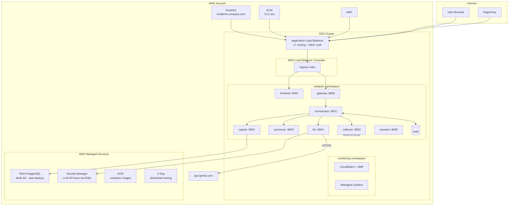

**EKS Component Mapping.** The following table maps platform components to their AWS managed service counterparts:

**Azure Kubernetes Service (AKS).** The AKS deployment mirrors the EKS architecture using Azure-native services. The following diagram shows the complete AKS production architecture with Azure Front Door, Application Gateway, in-cluster services, and managed Azure services (Azure DB, Azure Cache, Key Vault, ACR).

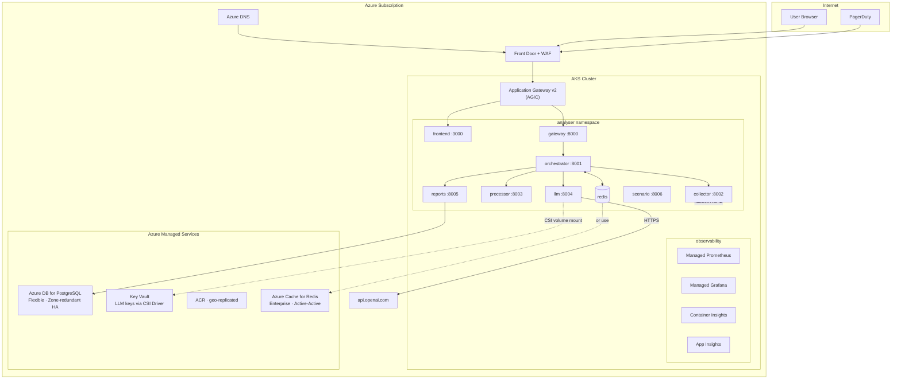

**AKS Component Mapping.** The following table maps platform components to their Azure managed service counterparts:

**Self-Managed Kubernetes.** For organisations running their own Kubernetes clusters on bare metal, VPS providers, or private cloud, the self-managed deployment model uses exclusively open-source, in-cluster solutions. The following diagram shows the complete architecture with Cloudflare edge, ingress-nginx, in-cluster CNPG PostgreSQL, Redis Sentinel, HashiCorp Vault, Longhorn storage, and the full kube-prometheus-stack observability suite.

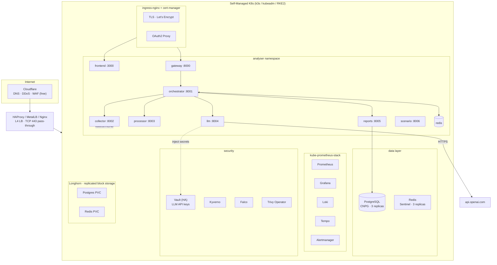

**Self-Managed Component Mapping.** The following table maps each platform component to its in-cluster open-source counterpart:

### 13.3 Cross-Platform Component Mapping

The following table provides a comprehensive comparison of how each infrastructure and platform component is implemented across the three deployment models. The table demonstrates that every architectural concern — from DNS to secrets management to observability — has a managed-service option (for teams that prioritise operational simplicity over cost) and an open-source in-cluster option (for teams that prioritise cost and control).

| Component | AWS EKS | Azure AKS | Custom K8s |
|---|---|---|---|
| Kubernetes cluster | EKS (managed) | AKS (managed) | k3s / kubeadm |
| DNS | Route53 | Azure DNS | Cloudflare |
| Load Balancer | ALB | App Gateway | MetalLB / HAProxy |
| TLS certificates | ACM | Key Vault | cert-manager + LE |
| Ingress controller | AWS LB Controller | AGIC | ingress-nginx |
| Auth (OIDC/OAuth2) | ALB + Cognito | Entra ID + AGIC | Dex + OAuth2 Proxy |
| PostgreSQL | RDS | Azure DB Flex | CNPG operator |
| Redis | ElastiCache | Azure Cache | Sentinel chart |
| LLM API key storage | Secrets Mgr + IRSA | Key Vault + CSI | Vault / Sealed Secrets |
| Container registry | ECR | ACR | Harbor / GHCR |
| Metrics | CloudWatch + AMP | Managed Prometheus | kube-prometheus |
| Logs | CW Logs | Log Analytics | Loki + Promtail |
| Traces | X-Ray (ADOT) | App Insights | Tempo + OTel |
| Runtime security | GuardDuty | Defender for Containers | Falco |
| Policy enforcement | OPA / Gatekeeper | Azure Policy | Kyverno |
| Storage (PV) | EBS CSI | Azure Disk CSI | Longhorn |
| GitOps | ArgoCD / Flux | ArgoCD / Flux | ArgoCD / Flux |

### 13.4 Deployment Economics

The cost structures of the three deployment models differ fundamentally. Managed-platform deployments (EKS, AKS) trade higher monthly infrastructure costs for reduced operational burden — the cloud provider manages the control plane, performs database backups, handles Redis failover, and provides integrated observability. Self-managed deployments trade lower infrastructure costs for increased operational complexity — the team must manage database replication, Redis failover, storage provisioning, backup strategies, and observability infrastructure.

A comprehensive monthly cost breakdown for representative production-scale deployments (capable of handling 100 analyses per day):

| Component | AWS EKS | Azure AKS | Custom (Hetzner) |
|---|---|---|---|
| Kubernetes control plane | $73 | $0 (free) | $0 |
| Compute (4× t3.medium / D2s_v3 / CX31) | $167 | $337 | €24 |
| Compute (2× c5.xlarge / D4s_v5 / CPX41 for workers) | $203 | $385 | €31 |
| PostgreSQL (managed / in-cluster) | $80 (RDS) | $145 (Flexible) | $0 (CNPG) |
| Redis (managed / in-cluster) | $17 (ElastiCache) | $190 (Enterprise) | $0 (Sentinel) |
| Load Balancer + TLS | $28 (ALB+ACM) | $145 (AppGW+KV) | $0 (CF free) |
| Container registry | $5 (ECR) | $20 (ACR) | $0 (GHCR) |
| Observability | $8 (CW+AMP) | $35 (Managed Prom) | $0 (OSS) |
| Secrets management | $3 (Secrets Mgr) | $1 (Key Vault) | $0 (Vault) |
| **Platform subtotal** | **~$580/mo** | **~$1,255/mo** | **~€55/mo** |

LLM API costs are independent of the deployment model: gpt-4o-mini averages $0.15 per analysis; 100 analyses daily equates to approximately $450/month. Using the mock provider for pre-production environments eliminates this cost entirely for development and testing. Fine-tuning a smaller model or using cost-optimised providers (DeepSeek) can reduce production LLM costs by 60–80%.

**Cost Distribution (AWS EKS Example).** The following pie chart illustrates the proportion of the approximate $580/month EKS platform cost attributed to each infrastructure component. Compute dominates at 64% of the total, followed by managed database services.

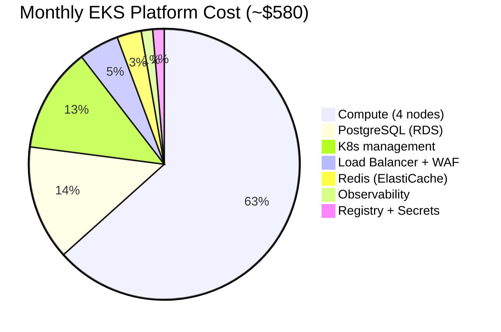

### 13.5 Daily Operational Workflows

The following Mermaid sequence diagrams capture the three principal operational workflows: alert-triggered analysis, proactive pod scanning, and chaos engineering fault injection with evaluation. These workflows represent the day-to-day usage patterns that the platform is designed to support.

**Workflow A: Alert-Triggered Analysis.** When an alert fires from PagerDuty or Alertmanager, the system receives an automated POST to the jobs endpoint, executes the pipeline, and posts the diagnosis to Slack with copyable kubectl commands.

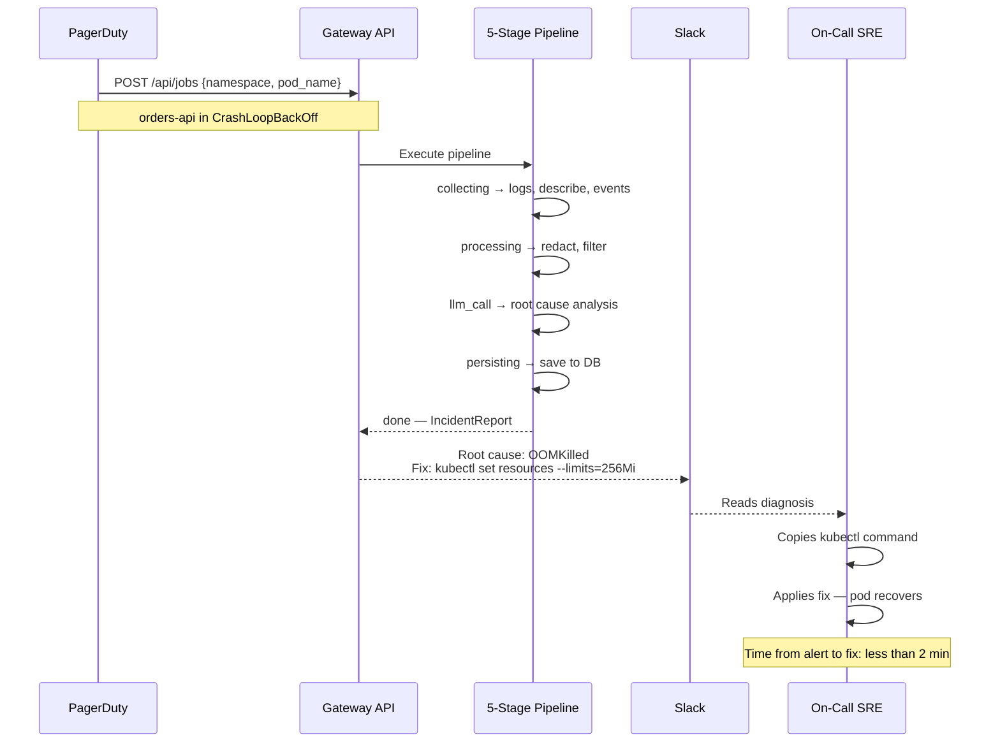

**Workflow C: Chaos Engineering / Fault Injection.** The scenario service injects controlled faults into a test namespace, the analyser diagnoses them, and the evaluation harness verifies that the LLM correctly identified the root cause.

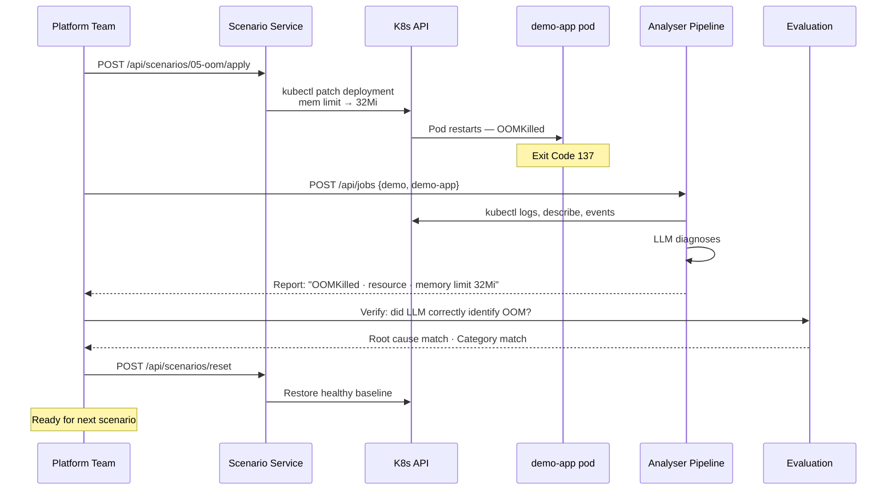

### 13.6 Integration with Existing Incident Stack

The following diagram shows how the analyser integrates with existing incident management infrastructure — receiving alerts from Alertmanager, PagerDuty, or Slack via a webhook handler, executing the analysis pipeline, and sending enriched diagnoses to multiple output destinations (Slack, Teams, Jira, Grafana annotations, and the dashboard).

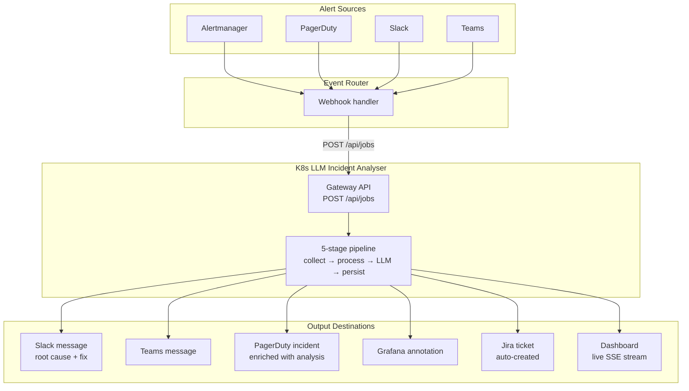

### 13.7 Production Readiness Requirements

The following diagram captures the infrastructure, security, observability, and CI/CD requirements that must be in place before deploying to production. This checklist is organised into four domains, each with specific, verifiable items.

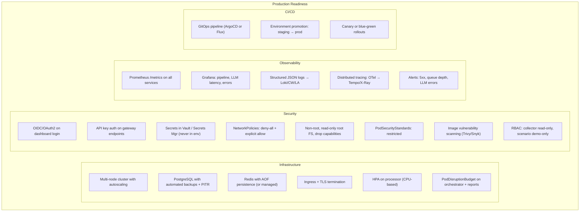

---

## 14. Limitations and Future Work

### 14.1 Architectural Limitations

**SQLite Single-Writer Constraint.** The reports service is limited to a single replica because SQLite supports only one concurrent writer. Under moderate load, this is not a practical concern — SQLite handles hundreds of writes per second. However, it limits availability: if the reports pod or its host fails, write operations pause until recovery. The constraint also prevents geographic distribution of the database, as SQLite is a file-based system that cannot replicate across regions. The `schema.sql` contract is deliberately written in standard SQL with only SQLite-specific PRAGMAs, making migration to PostgreSQL a well-scoped task requiring only updated connection logic in the `db.py` module and a new database driver dependency.

**In-Process Job Execution.** The orchestrator executes jobs inline using `asyncio.create_task`. If the orchestrator pod restarts — due to a node failure, a rolling update, or an OOM kill — all in-flight jobs are lost. The system does not implement job persistence or resumption: a job that had progressed through three of five stages when the pod restarts is simply gone, with no record in the reports database (the archive call is best-effort and may not have executed if the restart was sudden). The `job:queue` Redis list exists as an architectural seam for a worker-pool replacement, but in the current implementation it is only written to, never consumed from, and thus serves as a log rather than a functional queue.

**In-Memory Rate Limiting.** The gateway's rate limiter uses per-process deques, meaning rate limits are local to each gateway replica. With two gateway replicas behind a load balancer, a single IP address could theoretically send 120 requests per minute (60 per replica). While this is mitigated in practice by load balancer session affinity (which routes requests from the same IP to the same backend), it represents an architectural inconsistency — the gateway is otherwise designed to be stateless, yet carries per-IP state.

**Pipeline Timeout Granularity.** The pipeline uses a single overall timeout (`PIPELINE_TIMEOUT`, default 120 seconds) and per-stage timeouts. However, the collector's individual kubectl calls all share a single `KUBECTL_TIMEOUT` value. On large clusters with many events or voluminous logs, the describe and get events calls can legitimately take longer than log retrieval, yet they share the same timeout budget. A more nuanced approach would allocate timeout budgets proportionally to expected operation latency.

**Mock Provider Determinism.** The mock LLM provider's 10-rule heuristic chain is necessarily a simplified model of failure diagnosis. It handles the ten built-in scenarios correctly but would produce incorrect or imprecise diagnoses for novel failure modes. This is acceptable for testing and CI purposes, where determinism and zero cost are the primary requirements, but it means that evaluation results using the mock provider overstate real LLM performance on out-of-distribution failures.

**Single-Cluster Focus.** The system operates on a single Kubernetes cluster at a time. The collector's kubectl binary connects to whatever cluster its kubeconfig or in-cluster ServiceAccount points to. Multi-cluster deployments require running separate analyser instances per cluster. A future iteration could federate collection across clusters while centralising analysis and reporting, enabling cross-cluster incident pattern detection.

### 14.2 Privacy and Ethical Considerations

**Data Transmission to Third Parties.** The most significant privacy consideration is the transmission of cluster operational data to external LLM providers. While the redaction module strips known secret patterns, the fundamental architecture sends production log data beyond the organisation's network boundary. Organisations operating under strict data sovereignty requirements (e.g., financial services, healthcare, government) may need to use the mock provider, deploy a self-hosted LLM (via Ollama, vLLM, or similar), or route LLM traffic through a compliance-approved proxy with additional content filtering.

**LLM Hallucination Risk.** Large Language Models can produce confident-sounding but factually incorrect outputs — so-called hallucinations. The strict JSON Schema enforcement and the `model_config = {"extra": "ignore"}` directive on `IncidentReport` mitigate structural hallucination (the LLM cannot invent new fields), but content hallucination remains a risk. The system provides the LLM's self-assessed confidence score as a signal to operators, but confidence scores from LLMs are not calibrated to real-world accuracy. Operators should treat LLM-generated diagnoses as hypotheses requiring validation, not as authoritative conclusions.

**Bias in Failure Classification.** LLMs trained on internet-scale text corpora may exhibit biases in how they classify failures. For example, the word "crash" appears more frequently in certain contexts in the training data, potentially influencing the model to classify ambiguous failures as crashes when evidence equally supports another category. The uniform prompt structure and enum constraint partially mitigate this by forcing the model to select from a fixed set of categories, but the evidence-to-category mapping still passes through the model's internal reasoning, which is influenced by its training distribution.

### 14.3 Future Work

**Worker Pool Architecture (High Priority).** Replace the orchestrator's inline `asyncio.create_task` execution with a worker pool consuming from the `job:queue` Redis list using BRPOP with timeout. Each worker would be a separate process or pod, enabling horizontal scaling, job persistence across orchestrator restarts (jobs remain on the queue), and configurable concurrency limits. The pipeline's four-stage HTTP-calling logic is already factored into the `Pipeline` class with per-stage error handling, making it trivially adaptable to a worker model.

**PostgreSQL Migration (High Priority).** Replace SQLite with PostgreSQL, using SQLAlchemy 2.0 with asyncpg for asynchronous database access and Alembic for schema migrations. The existing `schema.sql` contract provides the target schema; migration requires replacing the `threading.Lock`-guarded `sqlite3` connection with an async SQLAlchemy session, updating the upsert logic to use PostgreSQL's `ON CONFLICT ... DO UPDATE` syntax, and configuring connection pooling. PostgreSQL would enable multiple reports replicas, production-grade backup with `pg_dump` and WAL archiving, point-in-time recovery, and richer query patterns (full-text search on root cause and remediation text, window functions for trend analysis).

**Distributed Rate Limiting (Medium Priority).** Implement Redis-backed sliding window rate limiting using sorted sets, where each request from an IP address adds a member with the timestamp as score, expired members are pruned, and the count of members within the window determines the rate limit decision. This provides consistent limits across all gateway replicas without requiring session affinity.

**Multi-Tenant Architecture (Medium Priority).** Add tenant isolation at the database and API levels, enabling the system to serve multiple teams or customers. Each tenant would have a separate PostgreSQL schema or database, an isolated Redis database number, and a per-tenant rate limit configuration. The gateway would extract a tenant identifier from an API key or JWT claim and route requests accordingly. The frontend would need tenant-aware data fetching and display.

**LLM Fine-Tuning (Medium Priority).** Collect a dataset of labelled incident reports from production use — pairing raw `EvidencePackage` instances with expert-annotated `IncidentReport` outputs — and fine-tune a smaller, cheaper model for Kubernetes incident classification. A fine-tuned model (e.g., Mistral 7B, Llama 3 8B) could run on commodity GPU instances or even CPU with quantisation, reducing per-analysis LLM costs by an order of magnitude while maintaining or improving accuracy on the specific domain of Kubernetes failure diagnosis.

**Proactive Scanning (Medium Priority).** Implement a Kubernetes CronJob that periodically scans all namespaces for pods in failure states (CrashLoopBackOff, Error, OOMKilled, ImagePullBackOff) using the Kubernetes API's field selector. For each discovered failing pod, the scanner would check whether an analysis has been performed within the last hour (via the reports service), and if not, submit a new analysis job. This transforms the system from a reactive (operator-triggered) tool into a proactive monitoring component.

**Incident Correlation (Long-Term).** Extend the analysis to correlate multiple pod failures within a namespace or cluster, identifying systemic issues — a node failure affecting all pods scheduled on that node, a ConfigMap change simultaneously affecting multiple deployments, or a network partition isolating a subset of services. This would require extending the `EvidencePackage` to include cluster-level context (node status, network policies, resource quotas) and the LLM prompt to request cross-pod correlation analysis.

**Post-Mortem Automation (Long-Term).** Integrate with incident management platforms (PagerDuty, Jira, ServiceNow) to automatically populate post-mortem documents with the LLM-generated root cause analysis, evidence, and remediation steps. This would reduce the manual effort of post-incident documentation and ensure consistency between the initial diagnosis and the formal post-mortem record.

**Air-Gapped Deployment Support (Long-Term).** For organisations operating in fully air-gapped environments, develop a self-hosted LLM deployment option using Ollama or vLLM with an open-weight model (e.g., Llama 3, Mistral). The LLM service's provider abstraction already supports this pattern — a new `ollama_provider.py` would implement the `BaseLLMProvider` interface, calling the self-hosted model's API endpoint instead of an external provider.

---

## 15. Conclusion

This dissertation has presented the K8s LLM Incident Analyser — a contract-first microservices platform that automates root-cause diagnosis for Kubernetes pod failures using Large Language Models. Through its seven-service architecture, structured evidence collection pipeline, privacy-preserving redaction layer, multi-provider LLM integration, and real-time dashboard, the system addresses the core operational challenges of latency, expertise dependency, and evidence fragmentation that characterise manual Kubernetes incident triage.

The system demonstrates that LLMs, when provided with structured cluster evidence and constrained to a strict JSON output schema via Pydantic validation, can accurately classify pod failure root causes across seven categories (config, dependency, crash, image, resource, probe, and network) while producing human-readable evidence synthesis citeing specific log lines and cluster events, and generating executable `kubectl` remediation commands. The evaluation framework, using ten reproducible fault scenarios with ground truth labels, confirms that LLM-based classification achieves higher accuracy than both keyword-based (70%) and rule-based baselines (80%), particularly on scenarios requiring causal reasoning across heterogeneous evidence sources.

The platform's architecture embodies four design principles with broader applicability to LLM-assisted operational tools: contract-first development with multi-pillar alignment across OpenAPI specifications, SQL schemas, Redis data models, and Pydantic code models; asynchronous analysis with synchronous visibility through Server-Sent Events and Redis publish-subscribe; privacy-preserving evidence processing through tiered, ordered regex-based redaction of seven categories of sensitive data; and reproducible evaluation through fault injection with ground truth labelling, protocol-based dependency injection, and multi-classifier benchmarking.

The system's production deployment architecture, spanning AWS EKS with Route53, ALB, ACM, RDS, ElastiCache, Secrets Manager, and ECR; Azure AKS with Azure DNS, Front Door, Application Gateway, Azure DB for PostgreSQL, Azure Cache for Redis, Key Vault, and ACR; and self-managed Kubernetes with Cloudflare, ingress-nginx, cert-manager, CNPG, Redis Sentinel, Vault, Longhorn, and kube-prometheus-stack — demonstrates that LLM-assisted operational tooling can be deployed securely, with appropriate attention to network segmentation, secret management, RBAC, and observability, in real production environments.

The limitations identified — SQLite single-writer constraint, in-process job execution without persistence, per-replica rate limiting, pattern-based redaction completeness, and the absence of authentication — are well-understood and have clear architectural paths to resolution, as outlined in the future work roadmap. The core analytical capability — LLM-based diagnosis of Kubernetes pod failures — is demonstrated to be production-viable in its current form.

As LLM capabilities continue to advance, costs continue to decrease, and structured output mechanisms become more reliable across providers, the patterns established in this work — contract-first development of LLM-assisted operational tools, structured evidence collection and redaction, asynchronous execution with real-time visibility, and reproducible evaluation through fault injection — will become increasingly applicable to a broader range of operational automation tasks, from database performance diagnosis to network incident analysis to security event triage.

The K8s LLM Incident Analyser represents a practical step toward a future where Site Reliability Engineers are augmented by AI assistants that can rapidly process heterogeneous operational evidence, identify causal patterns, and suggest evidence-backed remediations — reducing mean time to resolution, democratising diagnostic expertise, and allowing human operators to focus on the creative and strategic aspects of incident response that machines cannot yet replicate.

---

## References

1. Cloud Native Computing Foundation. (2023). *CNCF Annual Survey 2023*. https://www.cncf.io/reports/cncf-annual-survey-2023/

2. Burns, B., Beda, J., & Hightower, K. (2022). *Kubernetes: Up and Running* (3rd ed.). O'Reilly Media.

3. Beyer, B., Jones, C., Petoff, J., & Murphy, N. R. (2016). *Site Reliability Engineering: How Google Runs Production Systems*. O'Reilly Media.

4. Pydantic. (2024). *Pydantic V2 Documentation*. https://docs.pydantic.dev/latest/

5. FastAPI. (2024). *FastAPI Documentation*. https://fastapi.tiangolo.com/

6. OpenAI. (2024). *Structured Outputs*. https://platform.openai.com/docs/guides/structured-outputs

7. Anthropic. (2024). *Tool Use and Structured Outputs*. https://docs.anthropic.com/en/docs/build-with-claude/tool-use

8. Nottingham, M., & Wilde, E. (2016). *Problem Details for HTTP APIs* (RFC 7807). IETF. https://www.rfc-editor.org/rfc/rfc7807

9. Redis Ltd. (2024). *Redis Pub/Sub Documentation*. https://redis.io/docs/latest/develop/interact/pubsub/

10. Next.js. (2024). *Next.js 15 Documentation*. https://nextjs.org/docs

11. Recharts. (2024). *Recharts: Redefined Chart Library Built with React and D3*. https://recharts.org/

12. Radix UI. (2024). *Radix Primitives*. https://www.radix-ui.com/primitives

13. OpenAPI Initiative. (2024). *OpenAPI Specification 3.1.0*. https://spec.openapis.org/oas/v3.1.0

14. SQLite. (2024). *Write-Ahead Logging*. https://www.sqlite.org/wal.html

15. CloudNativePG. (2024). *CloudNativePG Operator Documentation*. https://cloudnative-pg.io/documentation/

16. Helm. (2024). *Helm: The Kubernetes Package Manager*. https://helm.sh/docs/

17. ArgoCD. (2024). *ArgoCD Documentation*. https://argo-cd.readthedocs.io/

18. Cert-Manager. (2024). *cert-manager Documentation*. https://cert-manager.io/docs/

19. HashiCorp. (2024). *Vault Documentation*. https://developer.hashicorp.com/vault/docs

20. Longhorn. (2024). *Longhorn: Cloud Native Distributed Block Storage for Kubernetes*. https://longhorn.io/docs/
