# Log Simulation Techniques & LLM Context-Window Strategies

> **Audience**: Platform developers, evaluators, and anyone extending the
> K8s LLM Incident Analyser beyond the dissertation-scale single-pod use
> case. This document is a toolbox — read the section relevant to your
> immediate need.
>
> **Companion to**: [`DEEP-DIVE.md`](./DEEP-DIVE.md) (how the system
> works today), [`FUTURE-SCOPE.md`](./FUTURE-SCOPE.md) (production
> deployment), and [`processor/app/preprocessor.py`](../services/processor/app/preprocessor.py)
> (the line-by-line noise/signal filter that is the heart of the
> current size-reduction strategy).

---

## Table of Contents

- [Part 1: 20 Ways to Simulate Logs](#part-1-20-ways-to-simulate-logs)
  - [1.1 Why Simulate?](#11-why-simulate)
  - [1.2 Category A: Programmatic Generation (Techniques 1–6)](#12-category-a-programmatic-generation-techniques-16)
  - [1.3 Category B: Fixture Mutation (Techniques 7–9)](#13-category-b-fixture-mutation-techniques-79)
  - [1.4 Category C: Container/Cluster-Based (Techniques 10–14)](#14-category-c-containercluster-based-techniques-1014)
  - [1.5 Category D: Dataset and Static (Techniques 15–17)](#15-category-d-dataset-and-static-techniques-1517)
  - [1.6 Category E: Deterministic and Reproducible (Techniques 18–20)](#16-category-e-deterministic-and-reproducible-techniques-1820)
  - [1.7 Implementation Roadmap](#17-implementation-roadmap)
- [Part 2: 20 Strategies When Log Size Exceeds LLM Context Window](#part-2-20-strategies-when-log-size-exceeds-llm-context-window)
  - [2.1 The Current Pipeline](#21-the-current-pipeline)
  - [2.2 When the Current Pipeline Breaks](#22-when-the-current-pipeline-breaks)
  - [2.3 Tier 1: Better Preprocessing (Techniques 1–5)](#23-tier-1-better-preprocessing-techniques-15)
  - [2.4 Tier 2: Chunking (Techniques 6–8)](#24-tier-2-chunking-techniques-68)
  - [2.5 Tier 3: RAG and Embeddings (Techniques 9–11)](#25-tier-3-rag-and-embeddings-techniques-911)
  - [2.6 Tier 4: Multi-Agent and Multi-Model (Techniques 12–14)](#26-tier-4-multi-agent-and-multi-model-techniques-1214)
  - [2.7 Tier 5: Incremental and Streaming (Techniques 15–17)](#27-tier-5-incremental-and-streaming-techniques-1517)
  - [2.8 Tier 6: Alternative Input Representations (Techniques 18–20)](#28-tier-6-alternative-input-representations-techniques-1820)
  - [2.9 Decision Framework](#29-decision-framework)

---

## Part 1: 20 Ways to Simulate Logs

### 1.1 Why Simulate?

Every stage of the K8s LLM Incident Analyser pipeline — collection,
preprocessing, redaction, prompt building, LLM inference, validation,
persistence, and frontend rendering — is exercised by **actual bytes**
travelling through it. Without logs, you have nothing to test.

Simulated logs serve five distinct purposes in this project:

| Purpose | Example |
|---------|---------|
| **Unit tests** | Does `LogPreprocessor._filter_with_context()` handle a 10,000-line input without OOM? |
| **Integration tests** | Does the full pipeline (collector → processor → llm → reports) return a valid `IncidentReport` for a known input? |
| **Evaluation** | Can the LLM beat the keyword baseline on 1,000 synthetic OOM scenarios with varying noise levels? |
| **Development** | Can you iterate on the prompt template without a running K8s cluster? |
| **Controlled experiments** | If you double the noise-to-signal ratio, does accuracy degrade linearly or exhibit a cliff? |

The current codebase has 10 handcrafted `EvidencePackage` fixtures in
[`tests/fixtures/scenario_evidence.py`](../tests/fixtures/scenario_evidence.py)
and 6 mock kubectl output arrays in
[`tests/integration/test_pipeline.py`](../tests/integration/test_pipeline.py).
What follows are 20 techniques to expand this capability from 10 presets
to a **programmable, scalable log simulation subsystem**.

---

### 1.2 Category A: Programmatic Generation (Techniques 1–6)

These techniques produce logs **entirely in code**, no external
infrastructure required.

---

#### Technique 1 — Template Library with Randomised Variables

**Complexity**: Simple
**Dependencies**: Python `random` module, optionally `Faker`

Pre-define string templates for each failure category, with
placeholder fields for timestamps, hostnames, IP addresses, PIDs, pod
names, and error codes. At generation time, randomly sample templates
and substitute placeholders.

```python
# simulation/templates/oom.py
OOM_TEMPLATES = [
    (
        "2026-07-{day:02d}T{hour:02d}:{min:02d}:{sec:02d}Z {pod_name} "
        "Memory cgroup out of memory: Killed process {pid} ({process_name}) "
        "total-vm:{total_vm}kB, anon-rss:{rss}kB, file-rss:0kB, "
        "shmem-rss:0kB"
    ),
    (
        "{timestamp} {pod_name} [ERROR] java.lang.OutOfMemoryError: "
        "Java heap space at {class_name}.{method}({file}:{line})"
    ),
]

class LogGenerator:
    def __init__(self, seed: int = 42, noise_ratio: float = 0.3):
        self.rng = random.Random(seed)
        self.noise_ratio = noise_ratio

    def generate(self, category: str, num_lines: int) -> str:
        templates = TEMPLATE_REGISTRY[category]
        lines = []
        for _ in range(num_lines):
            template = self.rng.choice(templates)
            lines.append(template.format(
                timestamp=self._random_timestamp(),
                pod_name=self._random_pod_name(),
                pid=self.rng.randint(1, 65535),
                # ... all substitutable fields
            ))
        return "\n".join(lines)
```

**Where it fits**: Create `simulation/templates/` directory with one
Python module per failure category (`oom.py`, `config.py`, `crash.py`,
etc.). Wire into `tests/fixtures/scenario_evidence.py` via a new
`generate_bulk_evidence(category, count)` function.

**Pros**: Zero infrastructure, fully deterministic with a seed, easy to
vary noise levels systematically.
**Cons**: Templates must be hand-authored; you might miss real-world
log patterns you haven't seen.

---

#### Technique 2 — Faker-Powered Synthetic Log Streams

**Complexity**: Simple
**Dependencies**: Python `Faker` library

Use the `Faker` library to generate realistic infrastructure identifiers
(hostnames, IPs, URIs, email addresses, database connection strings) and
embed them inside log templates.

```python
from faker import Faker

fake = Faker()
fake.seed_instance(42)

def generate_db_error_log():
    host = fake.hostname()
    uri = fake.uri()
    return (
        f"pg8000.exceptions.InterfaceError: Can't connect to "
        f"{host}:5432 — Connection timed out after 30s\n"
        f"At {fake.file_path(depth=4, extension='py')}:"
        f"{fake.random_int(10, 500)}\n"
        f"Backend URI: {uri}"
    )
```

**Where it fits**: Extend Technique 1's template engine to accept
Faker-generated fields instead of (or in addition to) `random`-based
placeholders.

**Pros**: Produces surprisingly realistic logs with minimal template
effort. Faker covers hostnames, IPs, user agents, URIs, paths, and more.
**Cons**: Logs will *look* real but won't exhibit real system behaviours
like cascading failure chains across log timestamps.

---

#### Technique 3 — State-Machine Log Emitter

**Complexity**: Moderate
**Dependencies**: None (pure Python)

Model the lifecycle of a Kubernetes pod as a finite-state machine.
Each state emits characteristic log lines; transitions are triggered by
probabilistic events or deterministic schedules.

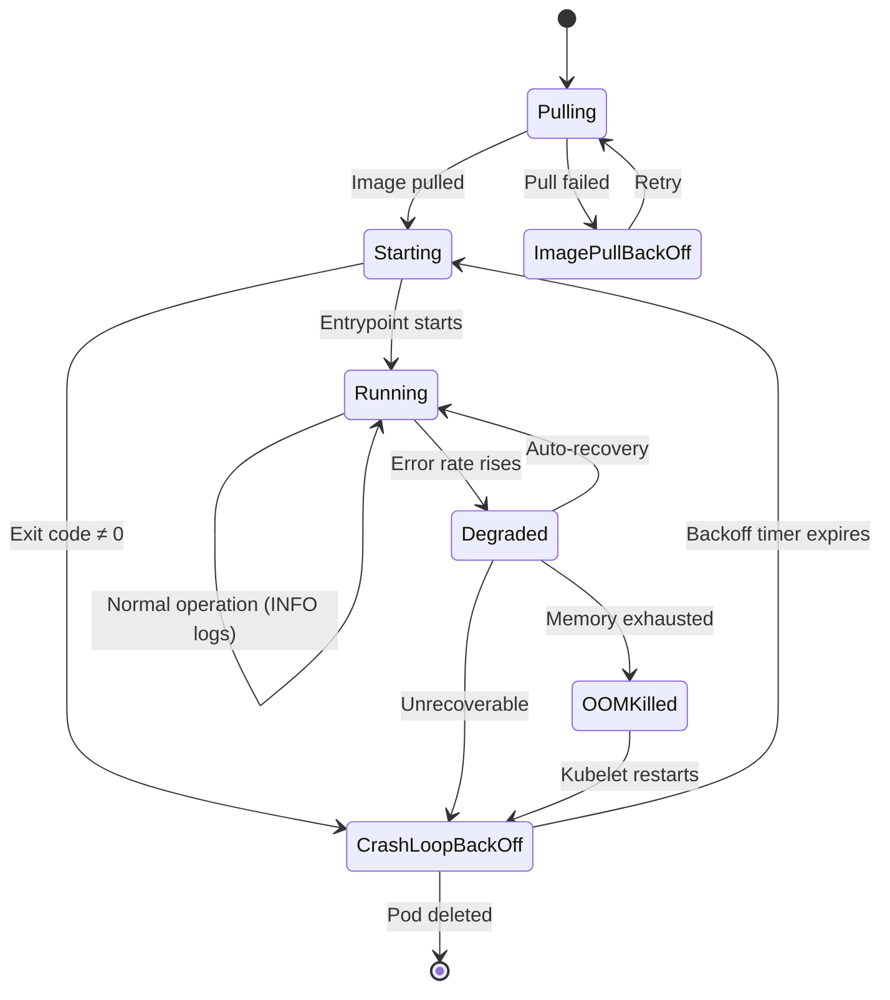

Each state has a set of log templates:

```python
STATE_LOG_MAP = {
    "Pulling": ['Pulling image "demo-app:{tag}"', 'Successfully pulled image "demo-app:{tag}"'],
    "Starting": ['Started container demo-app', 'INFO: Application starting on port {port}'],
    "Running": ['INFO: Request GET /api/items 200 12ms', 'INFO: Health check passed'],
    "Degraded": ['WARNING: Response time exceeded 5s threshold', 'ERROR: DB pool exhausted'],
    "OOMKilled": ['Memory cgroup out of memory: Killed process {pid}'],
    "CrashLoopBackOff": ['Back-off restarting failed container'],
    "ImagePullBackOff": ['Failed to pull image "demo-app:nonexistent": manifest not found'],
}
```

The generator walks the state machine, emitting 1–20 lines per state
before probabilistically transitioning.

**Where it fits**: Create `simulation/state_machine.py`. Wire it into
the evaluation harness so that each run produces a different-but-valid
pod lifecycle trace.

**Pros**: Generates structurally realistic log sequences with natural
event ordering. The state machine can be parameterised to model different
failure modes.
**Cons**: Designing state-transition probabilities that feel "realistic"
requires tuning.

---

#### Technique 4 — Markov-Chain Log Generator

**Complexity**: Moderate
**Dependencies**: None (can build from scratch, or use `markovify`)

A **second-order Markov chain** learns transition probabilities between
log-line triplets from a corpus of real K8s logs. Once trained, it
generates new sequences that preserve the statistical fingerprint of the
original corpus — including realistic error-burst clustering and
inter-arrival patterns.

```
Training:
  line_i_2, line_i_1  →  line_i    (store probability in nested dict)

Generation:
  Seed with two starter lines, then repeatedly:
    next_line = weighted_choice(transitions[(prev2, prev1)])
    emit(next_line)
    shift window
```

```python
class MarkovLogGenerator:
    def __init__(self, order: int = 2):
        self.order = order
        self.chain: dict[tuple[str, ...], dict[str, float]] = defaultdict(Counter)

    def train(self, log_lines: list[str]) -> None:
        for i in range(self.order, len(log_lines)):
            key = tuple(log_lines[i - self.order:i])
            self.chain[key][log_lines[i]] += 1
        # Normalise to probabilities
        for key in self.chain:
            total = sum(self.chain[key].values())
            self.chain[key] = {k: v / total for k, v in self.chain[key].items()}

    def generate(self, length: int, seed_pair: list[str]) -> list[str]:
        result = list(seed_pair)
        for _ in range(length):
            key = tuple(result[-self.order:])
            next_line = self.rng.choices(
                list(self.chain[key].keys()),
                weights=list(self.chain[key].values())
            )[0]
            result.append(next_line)
        return result
```

**Where it fits**: Train on a dump of real cluster logs (anonymised).
Use the trained chain in the evaluation harness to test whether the LLM
can distinguish real error patterns from statistically-similar noise.

**Pros**: No hand-authored templates. Captures subtle statistical
structure that humans rarely think to encode.
**Cons**: Requires a training corpus. A chain trained on 10,000 lines of
healthy-pod logs will never generate an OOMKilled message unless one
appears in the training data — you need a **mixed** corpus (healthy +
unhealthy) or you splice chains.

---

#### Technique 5 — Grammar-Based Synthesis (EBNF / Regex Reverse)

**Complexity**: Complex
**Dependencies**: A grammar engine (NLTK `CFG`, `hypothesis`, or hand-rolled)

Define a formal grammar of K8s log formats in Extended Backus-Naur Form
(EBNF) or as a hierarchy of regex patterns. A grammar walker randomly
selects production rules to synthesise syntactically valid log lines.

```
LogFile   →  LogLine+
LogLine   →  Timestamp WS Level WS Message NL
           |  StackFrame NL

Timestamp →  Digit{4} "-" Digit{2} "-" Digit{2} "T" Digit{2} ":" Digit{2} ":" Digit{2} "Z"
Level     →  "INFO" | "WARN" | "ERROR" | "FATAL" | "DEBUG"
Message   →  AppLog | K8sEvent | DBError
AppLog    →  "Request" WS Method WS Path WS Status WS Duration
K8sEvent  →  "Back-off restarting" WS "failed container" WS ContainerName
DBError   →  "Can't connect to" WS Host ":" Port WS "-" WS Reason
           |  "OutOfMemoryError:" WS "Java heap space"
```

A simpler alternative: use Python's `hypothesis` testing library with
custom `hypothesis.strategies` that generate log-like strings.

```python
from hypothesis import strategies as st

log_level = st.sampled_from(["INFO", "WARN", "ERROR", "FATAL", "DEBUG"])
pod_name = st.from_regex(r"demo-app-[a-z0-9]{5}")
timestamp = st.from_regex(r"2026-07-\d{2}T\d{2}:\d{2}:\d{2}Z")

log_line = st.builds(
    lambda ts, lvl, pn, msg: f"{ts} [{lvl}] {pn}: {msg}",
    timestamp, log_level, pod_name,
    st.text(min_size=10, max_size=200),
)
```

**Where it fits**: Use for **fuzz testing** — generate 100,000 log lines
with `hypothesis` and feed them to the preprocessor. Verify it never
raises, never produces empty output for signal-containing inputs, and
stays within memory bounds.

**Pros**: Exhaustive coverage of edge cases. Guaranteed syntactically
valid output.
**Cons**: Significant upfront effort to encode K8s log grammar
correctly. Without semantic constraints, you may generate nonsensical
log sequences (e.g., "OOMKilled" followed by "Image pulled successfully").

---

#### Technique 6 — LLM-as-Log-Generator

**Complexity**: Simple
**Dependencies**: Any LLM provider (you already have 4 pluggable
providers in `llm-svc`)

Prompt an LLM to generate realistic K8s container logs for a specific
failure category. This is meta: you use the tool's own LLM integration
to generate test fixtures for the tool.

```
Prompt:

Generate 500 lines of realistic Kubernetes container logs for a pod
named "orders-api-7d4f9b" in namespace "prod" experiencing OOMKilled.
Include:
- Timestamped entries in ISO 8601 format
- A gradual memory usage ramp (INFO-level memory stats every 10 lines)
- Standard startup output
- The OOM kill event from the kernel
- The kubelet restart event
- Subsequent CrashLoopBackOff entries
- Some noise: GET /health, GET /ready, metrics scrape every 30s
Output format: plain text, one log line per line.
```

Cache the output as a reproducible fixture. Vary the prompt to produce
different failure modes, noise levels, and K8s versions.

**Where it fits**: Add a script `scripts/generate_fixtures.py` that
calls the configured LLM provider (reusing `services/llm/app/llm/`),
loops over all 8 failure categories, and writes fixtures to
`tests/fixtures/generated/`.

**Pros**: Near-zero effort to produce diverse, realistic logs. Each
generation is a "conversation" — you can iterate the prompt.
**Cons**: Non-deterministic across runs unless you pin the seed/model.
Costs API credits. May hallucinate log content — review before committing
to version control.

---

### 1.3 Category B: Fixture Mutation (Techniques 7–9)

These techniques take your **existing** 10 scenario fixtures and
systematically vary them to produce derivatives — achieving breadth
without starting from scratch.

---

#### Technique 7 — Fixture Mutator Script

**Complexity**: Simple
**Dependencies**: None

Take a base `EvidencePackage` fixture and apply randomised transformations:

| Mutation | What changes | Purpose |
|----------|-------------|---------|
| `rename_pod` | `demo-app-abc123` → `orders-api-7f4d9b` | Test that analysis isn't pod-name-dependent |
| `swap_error_code` | `Exit Code: 1` → `Exit Code: 137` | Test edge-case error code handling |
| `inject_noise` | Insert healthcheck lines at random positions | Test preprocessor noise tolerance |
| `mutate_restart_count` | `restart_count=5` → `3` or `0` or `50` | Test restart-count-sensitive logic |
| `strip_signal` | Remove a key signal line | Test how much evidence loss degrades confidence |
| `duplicate_signal` | Repeat a signal line N times | Test deduplication and duplicate-aware analysis |
| `corrupt_timestamps` | Break timestamp formats | Test robustness to malformed input |
| `mix_categories` | Combine evidence from scenario 05-oom + 02-db-unavailable | Test disambiguation of compound failures |

```python
def mutate_evidence(base: EvidencePackage, mutations: list[str]) -> EvidencePackage:
    result = base.model_copy(deep=True)
    if "rename_pod" in mutations:
        result.pod_name = f"svc-{random.choices('abcdefghijklmnopqrstuvwxyz', k=5)}"
    if "inject_noise" in mutations:
        noise_lines = ["GET /health 200 1ms", "GET /ready 200 0ms", "GET /metrics 200 2ms"]
        result.current_logs = _inject_lines(result.current_logs, noise_lines)
    if "swap_error_code" in mutations:
        result.pod_status_summary = re.sub(
            r"Exit Code:\s+\d+",
            f"Exit Code:    {random.choice([1, 2, 126, 127, 137, 139, 143])}",
            result.pod_status_summary,
        )
    return result
```

**Where it fits**: Add `tests/fixtures/mutators.py`. The evaluation
harness calls `mutate_evidence(base, [m1, m2, ...])` to produce 100
variants per scenario. This gives you 1,000 test cases from 10 base
fixtures with ~50 lines of mutation logic.

---

#### Technique 8 — Cross-Scenario Splicing

**Complexity**: Moderate
**Dependencies**: None

Take two `EvidencePackage` fixtures from different categories and
**splice** their evidence fields together to simulate multi-causal or
ambiguous incidents.

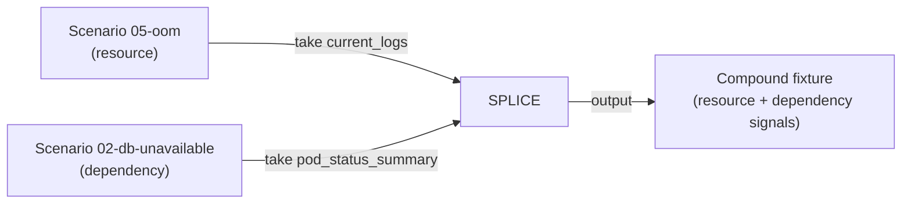

Operators:
- **Interleave**: Merge the log streams by timestamp (line 1 from A, line
  1 from B, line 2 from A, ...) to simulate two interleaved failures.
- **Overlay**: Keep all signals from A, inject signal lines from B at
  random positions. This simulates a primary failure (OOM) with
  coincidental secondary signals (DB errors from a separate issue).
- **Replace**: Take the `pod_status_summary` from one scenario and the
  `current_logs` from another. This tests whether the LLM weights pod
  status vs. logs correctly.

**Where it fits**: Add `tests/fixtures/splicer.py` with
`interleave(a, b)`, `overlay(a, b, mix_ratio)`, and
`replace_field(a, b, field)` functions. Useful in the evaluation harness
for measuring **disambiguation accuracy** — the compound fixture's
ground truth is a distribution over categories, not a single label.

---

#### Technique 9 — Noise Injection with Controllable Signal-to-Noise Ratio

**Complexity**: Simple
**Dependencies**: None

A specialised mutator that takes a clean signal fixture and injects
configurable amounts of noise. This enables **quantitative evaluation**
of the preprocessor and the LLM's resilience to noise.

```python
def inject_noise(evidence: EvidencePackage, ratio: float = 0.5) -> EvidencePackage:
    """Inject noise lines at `ratio` of the total line count."""
    signal_lines = evidence.current_logs.splitlines()
    noise_count = int(len(signal_lines) * ratio)
    noise_lines = [random.choice(NOISE_TEMPLATES) for _ in range(noise_count)]

    # Interleave noise lines at random positions
    all_lines = signal_lines[:]
    for nl in noise_lines:
        idx = random.randint(0, len(all_lines))
        all_lines.insert(idx, nl)

    return EvidencePackage(
        **{**evidence.model_dump(), "current_logs": "\n".join(all_lines)}
    )

NOISE_TEMPLATES = [
    "GET /health 200 1ms",
    "GET /ready 200 0ms",
    "GET /metrics 200 3ms",
    "INFO: Connection pool stats: active=3 idle=7",
    "DEBUG: Cache hit ratio: 0.94",
    "",  # blank line
]
```

Run the full pipeline at noise ratios of 0.1, 0.3, 0.5, 0.7, 0.9 and
plot **accuracy vs. noise ratio**. This produces a
publication-quality chart for the dissertation:

```
noise_ratio | 0.0  | 0.3  | 0.5  | 0.7  | 0.9
keyword_acc | 0.92 | 0.85 | 0.71 | 0.54 | 0.31
llm_acc     | 0.94 | 0.92 | 0.88 | 0.81 | 0.67
```

**Where it fits**: Add `tests/fixtures/noise_injector.py`. Add
evaluation metrics in `evaluation/metrics.py` for noise-resilience
scoring.

---

### 1.4 Category C: Container/Cluster-Based (Techniques 10–14)

These techniques involve running actual containers or using a real
K8s cluster to produce logs.

---

#### Technique 10 — Extend the Demo App Fault Endpoints

**Complexity**: Simple
**Dependencies**: The existing demo-app FastAPI service

The current demo app at `demo-app/app/main.py` exposes 5 fault
endpoints `/fault/{crash,oom,health,leak,timeout}`. Each endpoint
triggers a specific failure mode that produces real container logs.

Extend the demo app with additional endpoints to cover more failure
categories and edge cases:

| New endpoint | Behaviour | Log signature |
|-------------|-----------|---------------|
| `/fault/slow-db` | Sleeps 30s, then returns DB timeout error | `ERROR: Database query timed out after 30000ms` |
| `/fault/disk-full` | Writes to `/tmp/scratch` until disk is full | `OSError: [Errno 28] No space left on device` |
| `/fault/dns-failure` | Attempts to resolve a non-existent hostname | `socket.gaierror: [Errno -2] Name or service not known` |
| `/fault/tls-expired` | Attempts an HTTPS request with an expired cert | `SSLError: certificate has expired` |
| `/fault/race-condition` | Triggers a concurrent-access deadlock | `RuntimeError: Lock acquisition timed out` |
| `/fault/sigterm-hang` | Ignores SIGTERM, forcing kubelet to SIGKILL after 30s | `level=warning msg="Container termination timeout exceeded"` |
| `/fault/config-reload` | Watches a file, crashes when it changes mid-read | `ConfigParseError: Truncated YAML at line 47` |

**Where it fits**: Add endpoints to `demo-app/app/main.py`. Add
corresponding `k8s/scenarios/` YAML patches. Add expected log patterns
to `evaluation/ground_truth/`. Existing evaluation infrastructure
handles the rest.

---

#### Technique 11 — Sidecar Log Injector

**Complexity**: Moderate
**Dependencies**: A container image that writes known log patterns

Deploy a **sidecar container** alongside the main app pod. The sidecar
writes structured log lines to a shared `emptyDir` volume. The main
container (or the collector) reads from this volume.

```yaml
# k8s/scenarios/sidecar-log-injector.yaml
spec:
  containers:
  - name: main-app
    image: demo-app:latest
    volumeMounts:
    - name: shared-logs
      mountPath: /var/log/simulated
  - name: log-injector
    image: busybox:1.36
    command:
    - sh
    - -c
    - |
      while true; do
        echo "$(date -u +%FT%TZ) ERROR: Simulated database timeout at host $(hostname)" >> /var/log/simulated/app.log
        sleep $(awk 'BEGIN{srand(); print int(rand()*10)+1}')
      done
    volumeMounts:
    - name: shared-logs
      mountPath: /var/log/simulated
  volumes:
  - name: shared-logs
    emptyDir: {}
```

The sidecar can be controlled via a simple HTTP API or by touching a
file in the shared volume to change the log pattern (e.g., switch from
"healthy" to "degrading" mode).

**Where it fits**: Add `k8s/scenarios/11-log-injector-sidecar.yaml`.
The collector (which shells out to `kubectl logs`) will capture the
sidecar output naturally if you pass the container name.

---

#### Technique 12 — Minimal Failing Container Images

**Complexity**: Simple
**Dependencies**: Docker daemon (for building), a container registry

Build small, single-purpose Docker images that **deliberately fail**
in specific, predictable ways. No application code — just the runtime
behaviour.

```dockerfile
# Dockerfile.crash-127 — exits immediately with code 127
FROM scratch
COPY entrypoint /entrypoint   # /entrypoint is a 1-byte file (not a valid binary)
# K8s will log: "exec /entrypoint: exec format error" → Exit Code 127

# Dockerfile.oom-immediate — allocates 1GB on a pod with a 64MB limit
FROM python:3.12-alpine
COPY --from=0 <<EOF /app/oom.py
"a" * 1_000_000_000   # Triggers OOMKilled instantly
EOF
CMD ["python", "/app/oom.py"]

# Dockerfile.sigterm-ignore — traps SIGTERM and sleeps
FROM python:3.12-alpine
COPY --from=0 <<EOF /app/hang.py
import signal, time
signal.signal(signal.SIGTERM, lambda *_: None)
time.sleep(3600)
EOF
CMD ["python", "/app/hang.py"]
```

Each image costs <2 MB. Push them to a local registry or reference
them as `imagePullPolicy: Never` on a dev cluster.

**Where it fits**: Store Dockerfiles in `simulation/images/`. Add a
Makefile target `make build-sim-images` for one-command build-and-push.
Create K8s deployment manifests that run these images with appropriate
resource limits.

---

#### Technique 13 — Chaos Experiment Capture

**Complexity**: Moderate
**Dependencies**: A live K8s cluster (kind/minikube/k3s)

Run a **chaos experiment** (pod-kill, network-loss, CPU-stress,
disk-fill) against a real pod, capture all `kubectl` output, and
serialise it as a replay fixture.

Tools:
- **LitmusChaos**: Declarative YAML, well-suited for K8s-native chaos.
- **Chaos Mesh**: Kubernetes Operator, wide experiment library.
- **kube-monkey**: Simple pod-kill scheduler.

Workflow:

```
1. Deploy demo-app + database on kind cluster
2. Apply chaos experiment: kill demo-app pod every 60s for 5 minutes
3. While experiment runs:
   a. poll kubectl logs --tail=100 --timestamps demo-app > raw_logs.txt
   b. kubectl describe pod demo-app > pod_status.txt
   c. kubectl get events -n demo --sort-by=.metadata.creationTimestamp > events.txt
4. After experiment ends, bundle raw_logs.txt + pod_status.txt + events.txt
   → RawEvidence model → EvidencePackage (run preprocessor)
5. Serialise to JSON fixture
```

**Where it fits**: Add `simulation/chaos_capture.py` — a script that
orchestrates the chaos experiment and produces a
`tests/fixtures/captured/chaos_experiment_{timestamp}.json` fixture.

---

#### Technique 14 — Record-and-Replay Harvester

**Complexity**: Moderate
**Dependencies**: A real K8s cluster (any)

A one-shot script that:
1. Takes a pod name and namespace as input.
2. Runs all 7 `kubectl` commands that `collector-svc` would run.
3. Serialises the complete `RawEvidence` to a JSON file.
4. On replay, feeds this JSON into the collector's downstream pipeline,
   bypassing `kubectl` entirely.

```python
# simulation/harvester.py
import subprocess, json
from k8s_llm_shared import RawEvidence

def harvest(pod_name: str, namespace: str) -> RawEvidence:
    return RawEvidence(
        namespace=namespace,
        pod_name=pod_name,
        current_logs=_kubectl(f"logs -n {namespace} {pod_name} --tail=500 --timestamps"),
        previous_logs=_kubectl(f"logs -n {namespace} {pod_name} --previous --tail=500 --timestamps"),
        pod_status=_kubectl(f"describe pod -n {namespace} {pod_name}"),
        k8s_events=_kubectl(f"get events -n {namespace} --sort-by=.metadata.creationTimestamp"),
        restart_count=int(_kubectl(
            f"get pod -n {namespace} {pod_name} "
            "-o jsonpath={.status.containerStatuses[0].restartCount}"
        ) or 0),
        container_states=_kubectl(
            f"get pod -n {namespace} {pod_name} "
            "-o jsonpath={.status.containerStatuses}"
        ),
    )

def _kubectl(args: str) -> str:
    result = subprocess.run(f"kubectl {args}", shell=True, capture_output=True, text=True)
    return result.stdout if result.returncode == 0 else ""
```

**Where it fits**: Add `simulation/harvester.py`. Captured fixtures go
in `tests/fixtures/harvested/`. On replay, the collector is bypassed
entirely — the pipeline starts at the processor stage. This is already
how your integration tests work in `tests/integration/test_pipeline.py`
with mocked `subprocess.run`.

---

### 1.5 Category D: Dataset and Static (Techniques 15–17)

These techniques use pre-existing datasets or static data stores.

---

#### Technique 15 — Loghub Dataset Adapter

**Complexity**: Moderate
**Dependencies**: Loghub dataset (≈16 GB download)

[Loghub](https://github.com/logpai/loghub) is the largest public
collection of system logs, maintained by the Chinese University of
Hong Kong's log-analysis research group. It includes:

| Dataset | Description | Lines | Relevance |
|---------|-------------|-------|-----------|
| **HDFS** | Hadoop distributed file system logs | 11M | Labelled anomalies — useful for training classifiers |
| **Hadoop** | MapReduce job logs | 394K | Structured job lifecycle similar to K8s pod lifecycle |
| **Linux** | `/var/log/` from a production server | 25K | Real system-level failures |
| **Zookeeper** | Distributed coordination service | 74K | Network-partition and quorum-loss patterns |
| **Apache** | Web server access + error logs | 56K | HTTP error patterns translatable to K8s probe failures |
| **BGL** | BlueGene/L supercomputer | 4.7M | Labelled alert/non-alert — training data for anomaly detection |

Write an adapter that:
1. Loads a Loghub dataset (CSV/ZIP format).
2. Maps their structure to `RawEvidence` fields.
3. Runs the preprocessor to produce `EvidencePackage` fixtures.

**Where it fits**: Add `simulation/loghub_adapter.py`. Add
`tests/fixtures/loghub/` for generated fixtures. Note: Loghub data
should only be used for **development and evaluation**, not shipped in
the Git repo (licensing and size concerns).

---

#### Technique 16 — Pre-Baked YAML/JSON Corpus

**Complexity**: Simple
**Dependencies**: None

Generate a static corpus of 500–1,000 `EvidencePackage` fixtures,
serialised to a single YAML or JSON file. The corpus is tagged with
failure category, severity, and expected root cause. At evaluation time,
the harness randomly samples from the corpus.

```yaml
# simulation/corpus.yaml
corpus:
  - id: "corpus-001"
    category: "resource"
    severity: "high"
    expected_root_cause: "Memory limit of 32Mi exhausted during startup allocation"
    evidence:
      namespace: "prod"
      pod_name: "orders-api-7f4d9b"
      current_logs: |
        2026-07-22T03:14:01Z orders-api-7f4d9b INFO: Allocating primary buffer (128 MB)...
        2026-07-22T03:14:02Z orders-api-7f4d9b ERROR: java.lang.OutOfMemoryError: Java heap space
      previous_logs: |
        2026-07-22T03:13:45Z orders-api-7f4d9b FATAL: Previous run OOMKilled
      pod_status_summary: |
        ...
      k8s_events_filtered: |
        ...
      restart_count: 3
```

**Where it fits**: Generate via a combination of Techniques 1–6.
Deserialise in the evaluation harness. This gives you a **versioned,
reproducible benchmark** that doesn't require any external dependencies
at evaluation time.

**Pros**: Completely portable. Evaluation runs are deterministic if you
fix the sampling seed. Can be committed to Git.
**Cons**: Static — doesn't benefit from new log-generation techniques
unless you regen.

---

#### Technique 17 — Kubernetes Client Mock (Fake API Responses)

**Complexity**: Moderate
**Dependencies**: Python `kubernetes` client (optional)

Instead of shelling out to `kubectl`, use mocked K8s API responses.

Option A — **Pure mock**: Override `subprocess.run` (already done in
integration tests) to return canned strings that look like `kubectl`
output.

Option B — **K8s client mock**: Use Python's `unittest.mock` to return
fake `V1Pod`, `V1PodList`, `V1EventList` objects.

```python
from unittest.mock import MagicMock, patch
from kubernetes.client import V1Pod, V1PodStatus, V1ContainerStatus, V1ContainerState

fake_pod = V1Pod(
    metadata={"name": "demo-app-abc123", "namespace": "demo"},
    status=V1PodStatus(
        container_statuses=[
            V1ContainerStatus(
                name="demo-app",
                restart_count=5,
                state=V1ContainerState(
                    waiting={"reason": "CrashLoopBackOff", "message": "Back-off restarting failed container"}
                ),
                last_state=V1ContainerState(
                    terminated={"reason": "OOMKilled", "exit_code": 137, "message": "Killed"}
                ),
                ready=False,
            )
        ]
    ),
)

# Patch wherever the K8s client is used
with patch("kubernetes.client.CoreV1Api.read_namespaced_pod", return_value=fake_pod):
    # collector-svc will receive the fake pod
    ...
```

**Where it fits**: This is the preferred approach if you migrate from
`subprocess.run("kubectl ...")` to the Python K8s client. The current
architecture uses `check=False` subprocess calls — swapping to a client
library would make mocking cleaner. Document this as a potential v3
refactor in `FUTURE-SCOPE.md`.

---

### 1.6 Category E: Deterministic and Reproducible (Techniques 18–20)

These techniques ensure that generated logs produce **the same output
every time**, which is critical for regression testing, CI pipelines,
and scientific evaluation.

---

#### Technique 18 — Seeded Pseudo-Random Generation

**Complexity**: Simple
**Dependencies**: None

Every random number generator used in Techniques 1–7 must accept a
**seed parameter**. Fix the seed to a constant in test fixtures, and
vary it in evaluation runs to measure variance.

```python
# In test — deterministic
generator = LogGenerator(seed=42)

# In evaluation — sweep over seeds
results = []
for seed in range(10):
    generator = LogGenerator(seed=seed)
    fixture = generator.generate_bulk("resource", num_lines=500)
    report = analyse(fixture)
    results.append(report.confidence)

mean_conf = statistics.mean(results)
std_conf = statistics.stdev(results)
print(f"Confidence over 10 seeds: {mean_conf:.3f} ± {std_conf:.3f}")
```

**Principle**: **never** use `random.random()` or `datetime.now()` in
log generators. Always use an injected RNG instance with a known seed.

**Where it fits**: Add a `seed` parameter to every generator function.
In tests, `seed=42`. In the evaluation harness, accept `--seed` on the
CLI.

---

#### Technique 19 — Fake Kubernetes API Server Responses

**Complexity**: Complex
**Dependencies**: A tool to fake the K8s API (e.g., `k3s` with a fake
kubelet, or `envtest` from controller-runtime)

A step beyond Technique 17: run a **real but fake** K8s API server that
returns programmed responses. This is the gold standard for testing
K8s controllers and operators.

Tools:
- **`envtest`** (part of `controller-runtime`): Starts a real
  `etcd` + `kube-apiserver` binary and allows you to create arbitrary
  K8s objects. Used by the K8s controller testing community.
- **`kind` with canned state**: Create a kind cluster, pre-load it
  with pods in specific failure states, snapshot the etcd data, and
  restore the snapshot for each test run.
- **Wiremock / MockServer**: If the K8s API is accessed over HTTP
  (not via `kubectl` subprocess), you can intercept requests with a
  Wiremock instance returning canned JSON.

**Where it fits**: If the project moves from `subprocess` to the Python
K8s client, this becomes viable. Currently, the subprocess approach
makes full API mocking impractical — Technique 17 (mock `subprocess.run`)
is the closest equivalent.

---

#### Technique 20 — Browser/Console Log Simulator

**Complexity**: Moderate
**Dependencies**: A web server (or reuse the existing Next.js frontend)

Build a simple web page that streams simulated log lines to a console
view, with controls for:
- Failure category selector
- Noise ratio slider
- Speed (1×, 5×, 10× real-time)
- Pause / resume / rewind

The JavaScript engine generates log lines using a seeded PRNG and
displays them in a terminal-like UI. This is primarily a **demo** and
**teaching** tool, but it also serves as a quick visual validation —
does the log stream *look* realistic to a human?

**Where it fits**: Add a `/simulator` page to the Next.js frontend.
This could be a nice addition to the dissertation's live-demo section.

---

### 1.7 Implementation Roadmap

Recommended build order, minimising upfront effort while maximising
coverage for each of the five purposes (unit test, integration test,
evaluation, development, experiment):

| Priority | Technique | Effort | Files Changed | Primary Benefit |
|----------|-----------|--------|---------------|-----------------|
| **1** | #1 — Template Library | 2h | New `simulation/templates/` | Immediate 100× fixture expansion |
| **2** | #7 — Fixture Mutator | 1h | New `tests/fixtures/mutators.py` | 1,000 variants from 10 base fixtures |
| **3** | #9 — Noise Injection | 30min | New `tests/fixtures/noise_injector.py` | Quantitative noise-resilience evaluation |
| **4** | #10 — Extend Demo App | 2h | `demo-app/app/main.py`, `k8s/scenarios/` | Real logs from new failure modes |
| **5** | #18 — Seeded Generation | 30min | All generator files | Reproducible test runs, CI-safe |
| **6** | #6 — LLM-as-Generator | 1h | `scripts/generate_fixtures.py` | Diverse fixtures with zero template effort |
| **7** | #14 — Record-and-Replay | 1h | `simulation/harvester.py` | Capture real-cluster evidence once, replay forever |
| **8** | #3 — State Machine | 3h | `simulation/state_machine.py` | Structurally realistic sequences with event ordering |
| **9** | #16 — YAML Corpus | 1h | `simulation/corpus.yaml` | Version-controlled, portable benchmark |
| **10** | #8 — Cross-Scenario Splicing | 1h | `tests/fixtures/splicer.py` | Compound-failure disambiguation testing |

After Priority 1–5, you'll have >1,000 diverse, reproducible fixtures
covering all 8 failure categories with controllable noise levels.

---

## Part 2: 20 Strategies When Log Size Exceeds LLM Context Window

### 2.1 The Current Pipeline

The platform today uses a **single-constriction pipeline**:

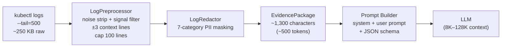

The `LogPreprocessor` (at
[`services/processor/app/preprocessor.py:44`](../services/processor/app/preprocessor.py))
is the critical size-reduction stage:

```python
# Current reduction chain (pseudocode)
raw_logs = kubectl("logs --tail=500")          # ~250 KB
filtered = drop_noise(raw_logs)                 # ~100 KB
signal_lines = keep_signal_only(filtered)        # ~20 KB
with_context = add_±3_context(signal_lines)      # ~30 KB
deduplicated = deduplicate(with_context)         # ~15 KB
capped = deduplicated[:100_lines]                # ~5 KB
```

This works for **single-pod, tail-500-line** analysis. The
dissertation-scale assumption is that one pod's 500 most recent log
lines, after filtering, fit comfortably in an 8K context window.

---

### 2.2 When the Current Pipeline Breaks

The single-constriction approach fails under these conditions:

| Condition | Symptom | Why it breaks |
|-----------|---------|---------------|
| **Verbose application** | 500 lines = 500 KB (Java stack traces, verbose debug logs) | Even after filtering, signal lines alone exceed 100-line cap |
| **Long-running pods** | 500 lines only covers the last 30 seconds of a 3-hour degradation | Critical startup errors are outside the 500-line window |
| **Multi-container pods** | Sidecar logs dominate the 500-line tail; main app logs are pushed out | The 500-line tail is per-pod, not per-container |
| **High-traffic pods** | 500 lines covers 5 seconds, an incident spans minutes | Relevant evidence spans thousands of lines |
| **Noise-heavy pods** | 480 of 500 lines are health checks; 20 signal lines produce 60 context lines, 40 get dropped by the 100-line cap | Signal dilution + cap clipping |
| **Production volumes** | Logs streamed to Loki/Elasticsearch at 10K lines/sec | 500-line tail is a statistical sample, not the incident |
| **Multi-pod analysis** | Incident requires cross-referencing 5 pods' logs | 5 × 500 = 2,500 lines before filtering |
| **Long prompt** | The `IncidentReport` JSON schema alone is ~1,200 tokens | Schema + evidence + system prompt exceeds 4K tokens |

What follows are 20 strategies, organised into 6 tiers by architectural
impact. Each strategy includes the files that would change and an
estimate of token savings.

---

### 2.3 Tier 1: Better Preprocessing (Techniques 1–5)

**Change surface**: `processor-svc` only. No API contract changes.
No new microservices.

---

#### Strategy 1 — Log-Level Pre-Filtering

Drop DEBUG, INFO, and TRACE log lines **before** signal matching.
Only keep WARNING, ERROR, CRITICAL, and FATAL.

```python
LEVEL_PATTERNS = [
    re.compile(r"\b(ERROR|FATAL|CRITICAL|SEVERE|EMERGENCY)\b"),
    re.compile(r"\bWARN(ING)?\b"),
]

def _is_relevant_level(self, line: str) -> bool:
    return any(p.search(line) for p in LEVEL_PATTERNS)
```

Modify `_filter_with_context()` in `preprocessor.py:44` to check
`_is_relevant_level()` before `_is_signal()`.

**Token savings**: 40–60% on verbose applications (debug-heavy Java/Go
logs).
**Files changed**: `services/processor/app/preprocessor.py`.

---

#### Strategy 2 — Time-Window Snipping

Instead of `--tail=500`, extract logs from **5 minutes before the first
error** to **1 minute after the last restart**. Use
`kubectl logs --since-time=<ISO8601>`.

The collector already calls `kubectl describe pod` (returns pod
start/restart timestamps) and `kubectl get events` (returns event
timestamps). These can be parsed to determine the relevant time window.

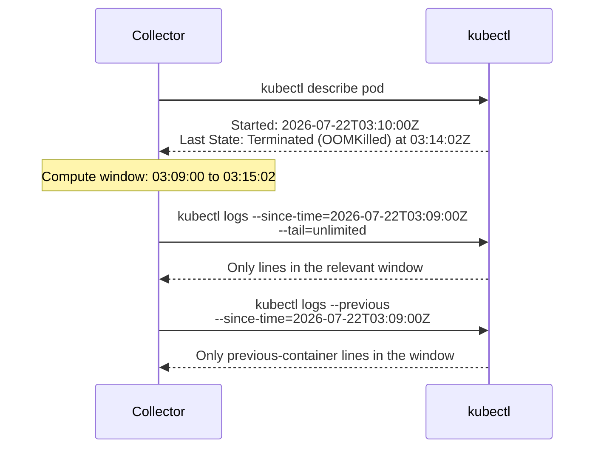

**Token savings**: 50–80% on long-running pods where the 500-line tail
is mostly post-incident noise.
**Files changed**: `services/collector/app/collector.py`.

---

#### Strategy 3 — Severity-Weighted Token Budgeting

Allocate a fixed token budget (e.g., 2,000 tokens for logs) and
distribute it by severity:

| Severity | Context window | Max lines | Rationale |
|----------|---------------|-----------|-----------|
| CRITICAL/FATAL | ±10 lines | 20 | Full context for root-cause lines |
| ERROR | ±3 lines | 50 | Standard context |
| WARNING | ±1 line | 100 | Minimal context |
| INFO | 0 (no context) | 0 (dropped) | Noise |

```python
BUDGET = 2000  # tokens
SEVERITY_BUDGETS = {"CRITICAL": 0.5, "ERROR": 0.35, "WARNING": 0.15}

def _budgeted_filter(self, raw_text: str) -> str:
    lines = raw_text.splitlines()
    categorised = {"CRITICAL": [], "ERROR": [], "WARNING": []}
    for i, line in enumerate(lines):
        sev = self._classify_severity(line)
        if sev in categorised:
            categorised[sev].append((i, line))

    result = []
    for sev, budget_share in SEVERITY_BUDGETS.items():
        budget = int(BUDGET * budget_share)
        context = 10 if sev == "CRITICAL" else 3 if sev == "ERROR" else 1
        for idx, line in categorised[sev][:budget // context]:
            start = max(0, idx - context)
            end = min(len(lines), idx + context + 1)
            result.extend(lines[start:end])
            if len(result) >= budget:
                break
    return "\n".join(result)
```

**Token savings**: 20–30% beyond basic signal filtering, by using
context-window budget discipline.
**Files changed**: `services/processor/app/preprocessor.py`.

---

#### Strategy 4 — Template Deduplication with Counts

Instead of silently dropping duplicate log lines, replace repeated
lines with a **compressed representation** that preserves the signal
of repetition without the token cost.

```python
# Before (current behaviour):
# Duplicate line "ERROR: Connection refused" appears 47 times → one copy kept

# After (proposed behaviour):
# "ERROR: Connection refused — [repeated 47×, first: 03:12:01Z, last: 03:14:05Z]"
```

```python
def _deduplicate_with_counts(self, lines: list[str]) -> list[str]:
    seen = {}
    result = []
    for line in lines:
        stripped = line.strip()
        if not stripped:
            continue
        if stripped not in seen:
            seen[stripped] = {"count": 1, "first": line, "lines": [line]}
            result.append((stripped, line))
        else:
            seen[stripped]["count"] += 1
            seen[stripped]["lines"].append(line)

    output = []
    for stripped, first_line in result:
        count = seen[stripped]["count"]
        if count == 1:
            output.append(first_line)
        else:
            output.append(f"{first_line}  [repeated {count}×]")
    return output
```

**Token savings**: Up to 80% on repeatedly-crashing pods (where the
same error line appears dozens of times per restart).
**Files changed**: `services/processor/app/preprocessor.py`.

---

#### Strategy 5 — Structured Pod-Status Extraction

Instead of `pod_status[:2000]` (a hard truncation of raw text), parse
the `kubectl describe pod` output and extract only the structured
fields that the LLM actually needs.

```python
POD_STATUS_SCHEMA = {
    "name": str,
    "namespace": str,
    "phase": str,                    # Running, Pending, Failed
    "containers": [{
        "name": str,
        "state": str,                # Running, Waiting, Terminated
        "reason": str,               # CrashLoopBackOff, OOMKilled, etc.
        "exit_code": int | None,
        "restart_count": int,
        "ready": bool,
        "started": str | None,       # ISO 8601
        "message": str | None,
    }],
    "conditions": [{
        "type": str,                  # PodScheduled, Initialized, ContainersReady, Ready
        "status": str,                # True, False
        "reason": str | None,
    }],
}
```

This reduces 2,000 raw characters of `kubectl describe pod` output to
~300 characters of structured JSON. It also makes the LLM's job easier:
structured data is easier to reason about than prose.

**Token savings**: 50–70% of pod-status tokens. More importantly,
**improves accuracy** by presenting structured fields rather than
forcing the LLM to parse unstructured prose.
**Files changed**: `services/processor/app/preprocessor.py` (new
`_parse_pod_status()` method), `services/shared/src/k8s_llm_shared/models.py`
(optional: add `PodStatusStructured` model).

---

### 2.4 Tier 2: Chunking (Techniques 6–8)

**Change surface**: `llm-svc` + `processor-svc`. The pipeline acquires
an inner loop (multiple LLM calls per analysis).

---

#### Strategy 6 — Map-Reduce over Log Chunks

Split logs into N chunks of 100 lines each. Send each chunk to the LLM
with a **classification-only prompt** (cheap, short response). Merge
the positive hits and send the merged evidence for final analysis.

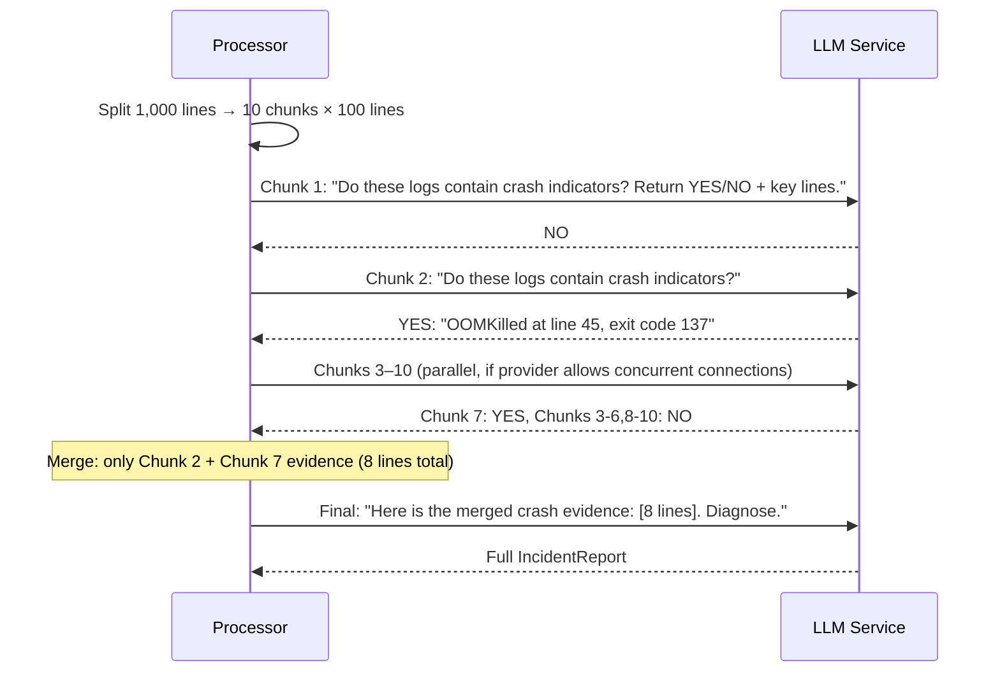

```python
async def map_reduce_analyse(self, package: EvidencePackage) -> IncidentReport:
    chunks = self._chunk_logs(package.current_logs, chunk_size=100)

    # Phase 1: Map — classify each chunk (parallel)
    tasks = [self._classify_chunk(chunk) for chunk in chunks]
    chunk_results = await asyncio.gather(*tasks)

    # Phase 2: Reduce — merge positive hits
    key_evidence = []
    for chunk_lines, result in chunk_results:
        if result["has_incident_signals"]:
            key_evidence.append(result["key_lines"])

    # Phase 3: Final analysis
    focused_package = package.model_copy(update={
        "current_logs": "\n\n---\n\n".join(key_evidence),
    })
    return await self._full_analyse(focused_package)
```

**Token savings**: 60–90% (only 10–20% of chunks pass the classification
gate).
**Files changed**: `services/llm/app/llm/base.py` (new methods),
`services/llm/app/prompts.py` (classification prompt template).

**Watch out**: This turns 1 LLM call into N+1 calls. Latency increases.
Anthropic concurrent-connection limits vary by tier — check rate limits
before implementing parallel chunk classification.

---

#### Strategy 7 — Sliding Window with Signal Density Tracking

Process logs with a 200-line window that slides by 50 lines. For each
window, compute a **signal density score** (number of signal lines /
window size). Only send the top-K highest-density windows to the LLM.

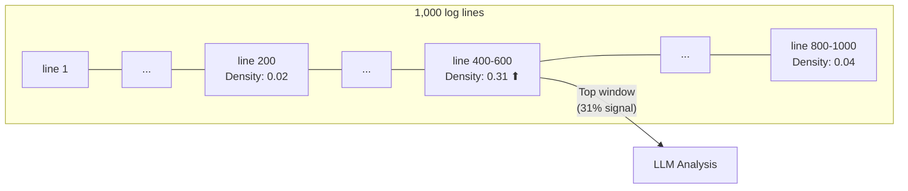

```python
def _sliding_window(self, lines: list[str], window_size=200, stride=50) -> list[tuple[int, float, list[str]]]:
    windows = []
    for start in range(0, len(lines) - window_size, stride):
        window = lines[start:start + window_size]
        signal_count = sum(1 for l in window if self._is_signal(l))
        density = signal_count / len(window)
        windows.append((start, density, window))
    windows.sort(key=lambda w: w[1], reverse=True)
    return windows[:3]  # Top 3 windows
```

**Token savings**: 60–80% (only the 3 densest windows sent, ~600 lines
total vs. potentially thousands).
**Files changed**: `services/processor/app/preprocessor.py`.

---

#### Strategy 8 — Two-Pass Triage-Then-Diagnose

Pass 1: send **only K8s events + pod status** to the LLM for a
preliminary category guess (cheap — ~200 tokens input).

Pass 2: based on the guessed category, run **category-specific grep**
patterns to extract only the most relevant log lines. Send those
extracted lines for full analysis.

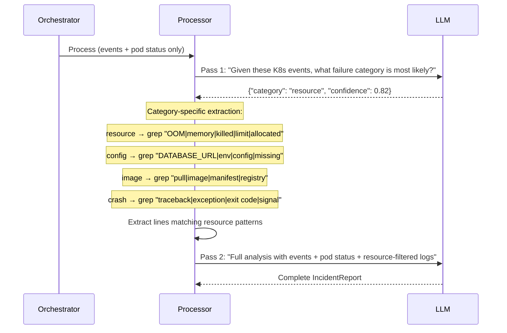

```python
CATEGORY_GREP_PATTERNS = {
    "resource": [r"OOM", r"memory", r"killed", r"limit", r"allocated", r"heap"],
    "config": [r"DATABASE_URL", r"env", r"config", r"missing", r"required"],
    "image": [r"pull", r"image", r"manifest", r"registry", r"not found"],
    "crash": [r"traceback", r"exception", r"exit code", r"signal", r"segfault"],
    "dependency": [r"connection refused", r"timeout", r"unreachable", r"DNS"],
    "probe": [r"probe failed", r"statuscode", r"health", r"readiness", r"liveness"],
    "network": [r"port", r"bind", r"socket", r"connection", r"address already in use"],
}

def extract_by_category(logs: str, category: str) -> str:
    patterns = CATEGORY_GREP_PATTERNS.get(category, [])
    return "\n".join(
        line for line in logs.splitlines()
        if any(re.search(p, line, re.IGNORECASE) for p in patterns)
    )
```

**Token savings**: 50–70% (the second-pass prompt contains only
category-relevant log lines).
**Files changed**: `services/processor/app/preprocessor.py` (new
`extract_by_category()` method), `services/llm/app/main.py` (two-call
endpoint), `services/llm/app/prompts.py` (triage prompt template).

---

### 2.5 Tier 3: RAG and Embeddings (Techniques 9–11)

**Change surface**: New infrastructure (vector DB or embedding model).
This tier requires a **new microservice** or a significant extension to
`processor-svc`.

---

#### Strategy 9 — Vector-Embedded Log Lines

Embed every log line (or log template) using a lightweight embedding
model. At analysis time, retrieve the top-K lines most semantically
similar to the K8s event descriptions and error keywords.

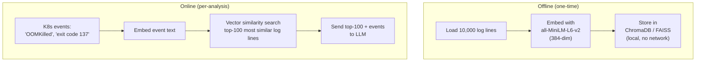

```python
import chromadb
from sentence_transformers import SentenceTransformer

class LogVectorStore:
    def __init__(self):
        self.model = SentenceTransformer("all-MiniLM-L6-v2")
        self.db = chromadb.PersistentClient(path="./data/log_vectors")
        self.collection = self.db.get_or_create_collection("log_lines")

    def index(self, log_lines: list[str]):
        embeddings = self.model.encode(log_lines, show_progress_bar=True)
        self.collection.add(
            embeddings=embeddings.tolist(),
            documents=log_lines,
            ids=[str(uuid7()) for _ in log_lines],
        )

    def query(self, description: str, top_k: int = 100) -> list[str]:
        query_embedding = self.model.encode([description])
        results = self.collection.query(query_embeddings=query_embedding.tolist(), n_results=top_k)
        return results["documents"][0]
```

**Where it fits**: A new `retrieval-svc` microservice (port 8007) that
takes `EvidencePackage`, embeds the query, retrieves top-K log lines,
and returns a trimmed `EvidencePackage`. Alternatively, embed this into
`processor-svc` if you want to keep the 7-service topology.

**Token savings**: 80–95% — the LLM sees only the 100 most relevant log
lines, regardless of total log volume.
**Infrastructure cost**: ~120 MB RAM for the embedding model + vector
index on disk.

---

#### Strategy 10 — Hybrid Keyword + Semantic Retrieval

Strategy 9 is purely semantic — it can miss exact error codes that
the embedding model doesn't "understand" as relevant. Hybrid retrieval
combines:

1. **Exact keyword match** (your existing `SIGNAL_PATTERNS`) — guaranteed
   to catch known error patterns.
2. **Semantic similarity search** (from Strategy 9) — catches "unknown
   unknowns" that don't match known patterns.

```python
def hybrid_retrieval(logs: list[str], events: str, top_k: int = 100) -> list[str]:
    # Phase 1: exact keyword match
    keyword_matches = [
        (idx, line) for idx, line in enumerate(logs)
        if _matches_signal_patterns(line)
    ]

    # Phase 2: semantic retrieval on remaining lines
    remaining = [
        line for idx, line in enumerate(logs)
        if idx not in {m[0] for m in keyword_matches}
    ]
    semantic_matches = vector_store.query(events, top_k=top_k // 2)

    # Phase 3: context expansion around keyword matches
    keyword_with_context = _expand_context(logs, [m[0] for m in keyword_matches], window=3)

    # Merge and deduplicate
    merged = list(dict.fromkeys(keyword_with_context + semantic_matches))
    return merged[:top_k]
```

**Token savings**: 85–95% (hybrid retrieval is more precise than either
method alone).
**Files changed**: `services/processor/app/preprocessor.py` (new
`hybrid_retrieval()` using an injected `LogVectorStore`).

---

#### Strategy 11 — Log Template Clustering with Drain3

[Drain3](https://github.com/IBM/Drain3) is an online log parser that
converts raw log lines into **templates** (fixed parts + variable
parameters). For example:

```
Raw: "Connection to 10.0.1.42:5432 timed out after 30s"
Raw: "Connection to 10.0.1.55:5432 timed out after 45s"
Template: "Connection to <*>:5432 timed out after <*>s"  [count: 2]
```

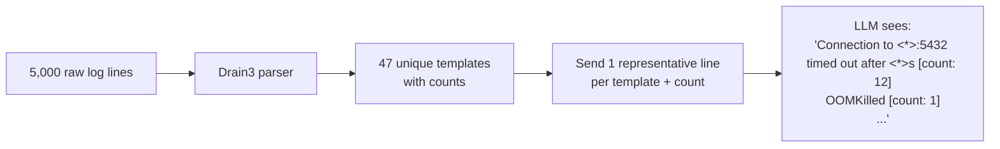

```python
from drain3 import TemplateMiner

miner = TemplateMiner()
for line in raw_logs:
    result = miner.add_log_message(line)
    # result["template_mined"] = "Connection to <*>:5432 timed out after <*>s"

clusters = miner.drain.clusters
summary = []
for cluster_id, cluster in clusters.items():
    template = cluster.get_template()
    count = cluster.size
    example = cluster.get_example_log_line()
    summary.append(f"{count}×  {template}")
```

**Token savings**: 90–99% (5,000 raw lines compressed to ~50 template
summaries).
**Files changed**: `services/processor/app/preprocessor.py` (integrate
Drain3), add `drain3` to `requirements.txt`.

---

### 2.6 Tier 4: Multi-Agent and Multi-Model (Techniques 12–14)

**Change surface**: `llm-svc` internal architecture. Multiple LLM calls
or multiple models work together.

---

#### Strategy 12 — Cascading Models (Local + Cloud)

Use a **local, fast, cheap** model for first-pass signal extraction.
Feed the extracted signals to a **cloud LLM** (GPT-4o/Claude) for
final structured analysis.

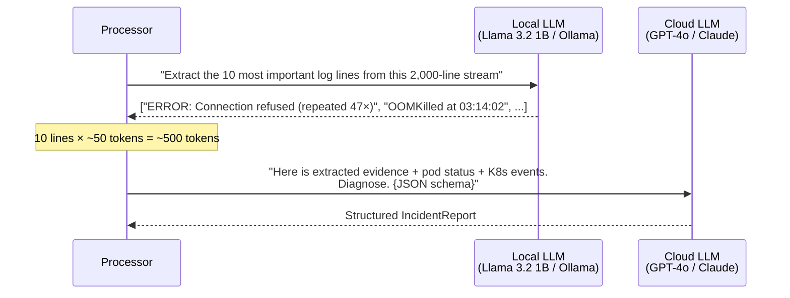

Benefits:
- The local model runs on the cluster (no API cost, no data leaving the
  cluster for extraction).
- The cloud model handles the high-value reasoning (schema-constrained
  structured output, root-cause analysis).
- Total API cost: 1 cloud call instead of 1 large cloud call — the
  extraction call is free (local GPU/CPU).

**Where it fits**: Add a new provider `LlamaProvider` that wraps an
Ollama endpoint (`http://ollama:11434`). The orchestrator configures
`LLM_EXTRACTION_PROVIDER=local` and `LLM_ANALYSIS_PROVIDER=openai`.

**Files changed**: `services/llm/app/llm/` (new `ollama_provider.py`),
`services/llm/app/main.py` (two-provider configuration),
`contracts/infra/` (Ollama container in Docker Compose).

---

#### Strategy 13 — Agent Decomposition

Decompose the analysis task across multiple specialised agents:

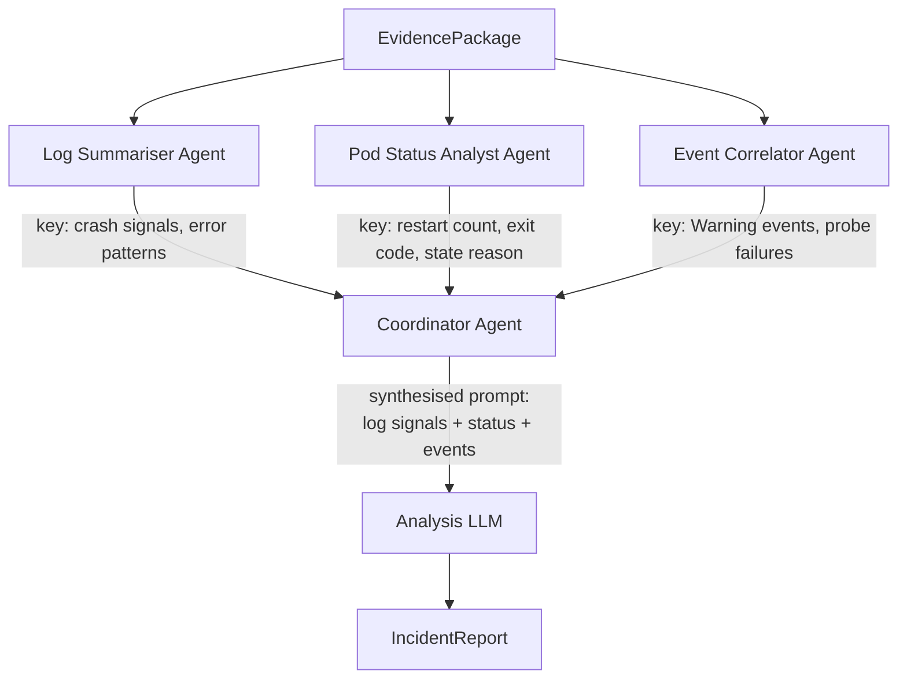

Each agent sees **only its own evidence slice**, reducing per-agent
token usage. A coordinator agent synthesises their outputs into a
single structured prompt for the analysis LLM.

| Agent | Input | Output | Tokens (in/out) |
|-------|-------|--------|-----------------|
| Log Summariser | `current_logs` + `previous_logs` | Bullet list of crash signals | 1,000 / 200 |
| Pod Status Analyst | `pod_status_summary` + `restart_count` | Structured state summary | 300 / 100 |
| Event Correlator | `k8s_events_filtered` | Timeline of key events | 200 / 100 |
| Coordinator | All agent outputs | Structured analysis prompt | 400 / 300 |
| Analysis LLM | Coordinator prompt + JSON schema | `IncidentReport` | 700 / 300 |

**Token savings**: 50–70% per-agent, but total tokens may increase due
to multiple calls. The win is **accuracy** (each agent is specialised)
and **latency** (agents can run in parallel).

**Files changed**: `services/llm/app/` — new agent submodule with
`log_summariser.py`, `pod_analyst.py`, `event_correlator.py`,
`coordinator.py`. Each agent calls the LLM with its own prompt template.

---

#### Strategy 14 — Iterative Refinement (LLM Chooses Its Own Context)

Instead of the pipeline deciding what evidence to show the LLM, let
the LLM **request** evidence iteratively.

```
Call 1: "Pod demo-app is in CrashLoopBackOff. Here are K8s events:
  [events]. What log lines would you like to see to diagnose this?"

LLM response: "Show me the previous container logs, exit code, and
  any lines mentioning 'connection' or 'database'."

Call 2: (system provides requested evidence filtered by keywords)
  "Previous logs: [filtered logs]. Exit code: 1. Connection lines: [3 lines].
  Diagnose."

LLM response: <full IncidentReport>
```

This is a **ReAct** (Reasoning + Acting) pattern: the LLM reasons about
what evidence it needs, requests it, and then diagnoses. It ensures the
LLM sees exactly the evidence it finds most useful — no more, no less.

**Where it fits**: Add a multi-turn conversation endpoint to
`services/llm/app/main.py` (`POST /analyse/multi-turn`). The
orchestrator adds a new pipeline stage: `llm_retrieval` between
`processing` and `llm_call`.

**Files changed**: `services/llm/app/main.py` (new endpoint),
`services/orchestrator/app/main.py` (new pipeline stage),
`services/orchestrator/app/job_state_machine.py` (new state).

---

### 2.7 Tier 5: Incremental and Streaming (Techniques 15–17)

**Change surface**: `orchestrator-svc` + `llm-svc`. Stateful analysis
across multiple invocations.

---

#### Strategy 15 — Streaming Diagnosis over SSE

Stream log lines **token by token** to the LLM, with the LLM
maintaining a running hypothesis that updates with each new line.
This requires the LLM provider to support streaming output (OpenAI
`stream=True`, Anthropic `stream=True`).

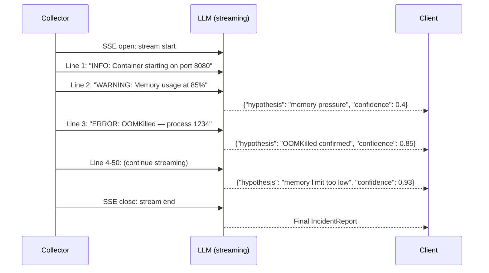

This is the most elegant solution — no preprocessing, no chunking, no
retrieval. The LLM sees everything, but incrementally.

**Caveats**:
- Requires LLM provider support for streaming input (not just streaming
  output). Currently, most providers accept a complete prompt and stream
  the response — streaming the *input* (adding lines as they arrive)
  is not a standard API feature. You'd need to simulate it via multiple
  API calls with conversation history.
- Latency is bounded by log-stream arrival rate, not by total log size.

**Files changed**: `services/llm/app/llm/base.py` (streaming interface),
`services/llm/app/main.py` (SSE endpoint),
`services/orchestrator/app/main.py` (streaming pipeline stage).

---

#### Strategy 16 — Cache and Diff (Incremental Analysis)

Cache the previous analysis for a pod (in Redis along with the job
state). On a new crash, only send **new log lines since the last
analysis** plus the prior diagnosis as context.

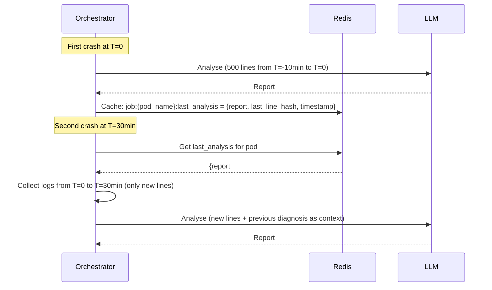

**Token savings**: 60–90% on subsequent analyses of the same pod
(crash-loop scenarios where the pod restarts every few minutes).

**Files changed**: `services/orchestrator/app/main.py` (cache logic),
`services/collector/app/collector.py` (time-bounded log collection),
Redis key: `job:{pod_name}:last_analysis` (new key pattern, TTL 24h).

---

#### Strategy 17 — Progressive Disclosure (Escalation Ladder)

Start with the **minimal viable prompt**. If confidence is below a
threshold, escalate: add more evidence and retry.

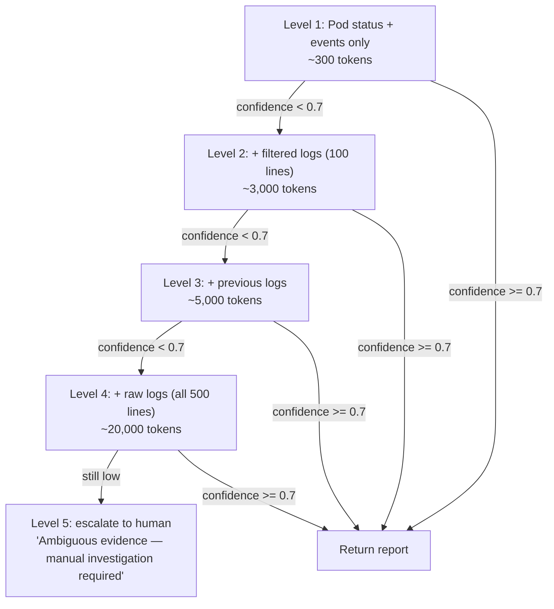

```python
async def progressive_analyse(self, package: EvidencePackage) -> IncidentReport:
    levels = [
        ("minimal", self._build_minimal_prompt(package)),
        ("filtered_logs", self._build_filtered_prompt(package)),
        ("previous_logs", self._build_with_previous_prompt(package)),
        ("full_raw", self._build_full_prompt(package)),
    ]

    for level_name, prompt in levels:
        report = await self._call_llm(prompt)
        if report.confidence >= 0.7:
            return report

    # All levels exhausted, low confidence
    return self._build_low_confidence_report(package)
```

**Token savings**: 70–90% for clear-cut incidents (which is the majority
of cases). Only ambiguous incidents pay the full token cost.

**Files changed**: `services/llm/app/prompts.py` (4 prompt variants),
`services/llm/app/main.py` (escalation loop),
`services/llm/app/validator.py` (confidence threshold config).

---

### 2.8 Tier 6: Alternative Input Representations (Techniques 18–20)

**Change surface**: Prompt building. No new infrastructure.

---

#### Strategy 18 — Compressed Stats Blob

Instead of sending filtered log lines, have the preprocessor output a
**compact statistical summary**:

```json
{
  "log_summary": {
    "total_lines": 500,
    "signal_lines": 23,
    "noise_lines": 477,
    "top_errors": [
      {"template": "Connection refused to <host>:<port>", "count": 47, "first_seen": "T1", "last_seen": "T47"},
      {"template": "OOMKilled: process <pid>", "count": 1, "first_seen": "T23"}
    ],
    "top_warnings": [
      {"template": "Memory usage at <pct>%", "count": 5, "first_seen": "T1"}
    ],
    "error_bursts": [
      {"start": "T40", "end": "T47", "lines": 47, "template": "Connection refused"}
    ],
    "timeline": {
      "first_error": "T1",
      "last_error": "T47",
      "oom_kill": "T23",
      "restart": "T24"
    }
  }
}
```

The LLM receives this structured blob instead of raw log lines. It
still sees the error patterns, their frequency, and their temporal
distribution — but in a compressed, structured format.

**Token savings**: 95–99%. A 500-line log stream becomes a ~200-token
JSON blob.
**Trade-off**: The LLM loses the ability to interpret subtle phrasing
in log messages. The preprocessor becomes a lossy compressor — if it
misclassifies a line as "connection refused" when it's actually
"connection pool exhausted: refused new connections", the LLM receives
an inaccurate summary.

**Files changed**: `services/processor/app/preprocessor.py` (new
`_build_stats_blob()` method), `services/shared/src/k8s_llm_shared/models.py`
(new `LogStatsBlob` model).

---

#### Strategy 19 — ASCII Art Timeline Charts

LLMs can reason over **visual representations** expressed as text.
Generate a timeline chart of key metrics (restart count, error rate,
memory usage) as an ASCII/Unicode art chart embedded in the prompt.

```
Time (seconds from first event):
0s    10s   20s   30s   40s   50s   60s
├──────┼──────┼──────┼──────┼──────┼──────┤
│                                              Memory (MB)
│  64 ┤                      ▄▄▄▄▄▄▄▄▄▄▄▄▄▄█████ OOM kill
│  32 ┤          ▄▄▄▄▄▄▄▄▄███
│   0 ┤▄▄▄▄▄▄▄▄▄▄▄▄▄▄▄▄▄▄▄▄
│
│                                              Error count
│  12 ┤                              █ (OOMKilled)
│   6 ┤                  █ (Memory 85%)
│   0 ┤█ (Starting)  █ (DB timeout)
│
│                                              Restart timeline
│      ├──────────────────────────────────────────┤
│      ↑                                          ↑
│    Pod start                              Pod killed
│    (T=0s)                                 (T=47s)
│      └────── CrashLoopBackOff ──────→ (BackOff at T=55s)
```

This works because LLMs are trained on a diverse text corpus that
includes ASCII art, tables, and structured diagrams. They can extract
trends, correlations, and temporal patterns from a visualisation.

**Where it fits**: Add `services/processor/app/timeline_chart.py` —
generates a timeline chart from the preprocessor's statistics (Drain3
clusters + timestamps). Append it to the prompt as a "visual evidence"
section.

**Token savings**: Replaces 500 lines of log text with ~200 tokens of
ASCII art. More importantly, it makes **temporal patterns** (like
"memory grew linearly for 40 seconds, then OOM at 47s") immediately
visible — the LLM doesn't need to reconstruct them from raw timestamps.

---

#### Strategy 20 — Massive Context Windows (the "Just Send Everything" Strategy)

Use LLMs with 1M+ token context windows. At the time of writing:

| Model | Context Window | Cost (per 1M input tokens) |
|-------|---------------|---------------------------|
| Gemini 2.5 Pro | 1,048,576 tokens | $1.25 |
| GPT-4o | 128,000 tokens | $2.50 |
| Claude 3.5 Sonnet | 200,000 tokens | $3.00 |
| Gemini 2.0 Flash | 1,048,576 tokens | $0.075 |
| DeepSeek-V3 | 128,000 tokens | $0.27 |

With a 1M token context window, you can literally send **every log line
the pod has ever produced** — no preprocessing, no filtering, no
chunking. The LLM handles the noise/signal separation internally.

Add an **auto-routing layer** that measures estimated token count and
selects a strategy:

```python
def route_analysis(self, package: EvidencePackage) -> tuple[str, callable]:
    estimated_tokens = self._estimate_tokens(package)
    provider_capacity = self._get_provider_capacity()

    if estimated_tokens < provider_capacity // 4:        # < 25% of capacity
        return "send_everything", self._full_analyse
    elif estimated_tokens < provider_capacity // 2:       # < 50% of capacity
        return "filtered", self._filtered_analyse
    elif estimated_tokens < provider_capacity:            # < 100% of capacity
        return "chunked", self._chunked_analyse
    else:                                                 # > 100% of capacity
        return "rag", self._rag_analyse
```

**Where it fits**: Add a `GeminiProvider` to
`services/llm/app/llm/`. Add a `capacity_router.py` to
`services/llm/app/`. This is the **simplest answer** from an
engineering perspective — delegate the problem to the model vendor's
context-window engineering team.

**Files changed**: `services/llm/app/llm/gemini_provider.py` (new),
`services/llm/app/capacity_router.py` (new),
`services/llm/app/main.py` (route by estimated token count).

---

### 2.9 Decision Framework

Which strategy should you implement, and when?

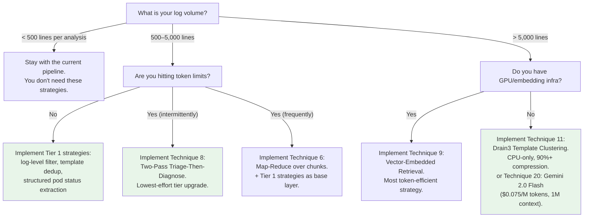

#### Quick-reference table

| Your situation | Best strategy | Effort | Token savings | Files changed |
|---------------|---------------|--------|---------------|---------------|
| Just want a quick win | #1 — Log-level pre-filtering | 30 min | 40–60% | 1 file |
| Repeated error lines | #4 — Template dedup with counts | 1h | 80% | 1 file |
| Pod status is the bottleneck | #5 — Structured pod-status extraction | 2h | 50–70% | 2 files |
| Need to handle 5,000+ lines | #8 — Two-pass triage | 3h | 50–70% | 3 files |
| Production-scale (>10K lines) | #9 — Vector embeddings | 1 day | 90%+ | New service |
| No GPU, need max compression | #11 — Drain3 | 2h | 95%+ | 1 file |
| Simplest possible fix | #20 — Massive context window | 2h | N/A | 2 files |

#### Recommended implementation order

For this project specifically, given the current architecture and
dissertation timeline:

1. **Strategies 1 + 4 + 5** (Tier 1, 3 hours total) — These give you
   a 3–5× improvement in the current pipeline with zero architectural
   changes. Implement them first and re-evaluate.

2. **Strategy 8** (Two-pass triage, 3 hours) — Adds the first "smart"
   evidence selection. The triage prompt is lightweight and the
   category-specific grep is pure CPU.

3. **Strategy 11** (Drain3, 2 hours) — The biggest compression win for
   CPU-only deployments. Useful for evaluation at scale.

4. **Strategy 18** (Compressed stats blob, 2 hours) — Pair with Drain3
   for a completely different prompt strategy. Evaluate whether the LLM
   performs better with raw lines or statistical summaries.

5. **Strategy 20** (Gemini provider, 2 hours) — Add the Gemini provider
   for the "just send everything" use case. Compare accuracy and cost
   against the filtered/chunked strategies.

After step 5, you'll have **empirical data** (cost, accuracy, latency)
for every strategy tier, which forms a chapter in the dissertation or
a production-deployment decision matrix.

---

## Appendix: File Reference Map

| File | Referenced in |
|------|--------------|
| [`services/processor/app/preprocessor.py`](../services/processor/app/preprocessor.py) | Current pipeline, Strategies 1–5, 7, 8, 11, 18 |
| [`services/collector/app/collector.py`](../services/collector/app/collector.py) | Strategy 2 (time-window snipping), Technique 14 (harvester) |
| [`services/llm/app/prompts.py`](../services/llm/app/prompts.py) | Strategies 6, 8, 17 (new prompt templates) |
| [`services/llm/app/llm/`](../services/llm/app/llm/) | Strategies 12, 20 (new providers) |
| [`services/llm/app/main.py`](../services/llm/app/main.py) | Strategies 6, 8, 12, 14, 17 (new endpoints) |
| [`services/llm/app/validator.py`](../services/llm/app/validator.py) | Strategy 17 (confidence threshold) |
| [`tests/fixtures/scenario_evidence.py`](../tests/fixtures/scenario_evidence.py) | Techniques 1, 7, 8, 9 |
| [`tests/integration/test_pipeline.py`](../tests/integration/test_pipeline.py) | Technique 17 (mock kubectl) |
| [`demo-app/app/main.py`](../demo-app/app/main.py) | Technique 10 |
| [`k8s/scenarios/`](../k8s/scenarios/) | Techniques 10, 11 |
| [`evaluation/`](../evaluation/) | Techniques 7, 8, 9 (noise-resilience metrics) |
| [`evaluation/ground_truth/`](../evaluation/ground_truth/) | Technique 10 (new ground truth files) |
